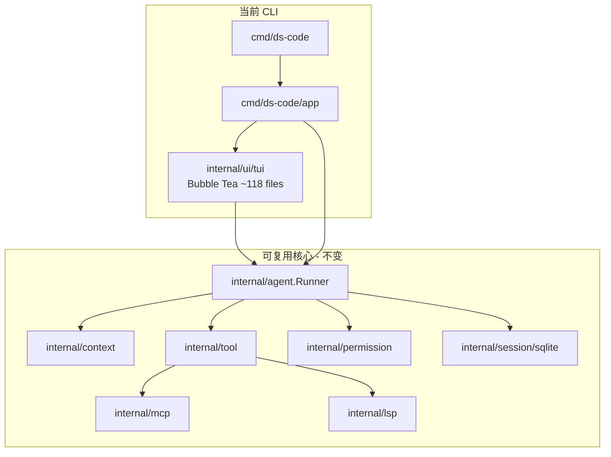
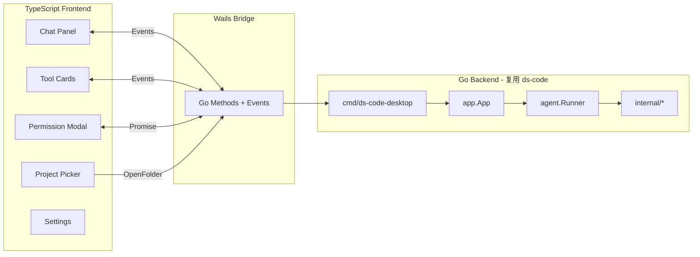
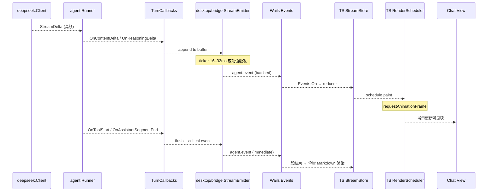
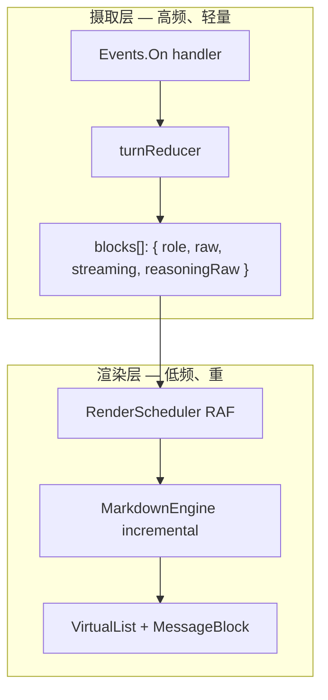
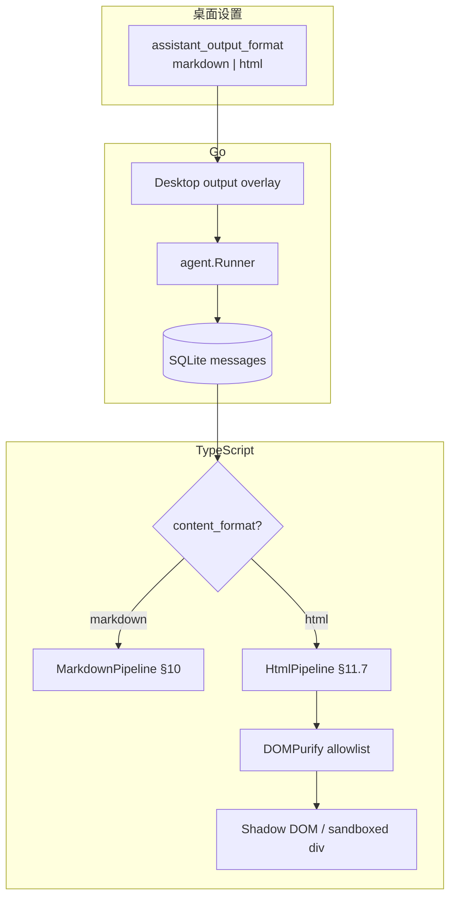

# ds-code 桌面版演进方向：Go + Wails + TypeScript 可行性研究

> 文档版本：v0.4  
> 更新日期：2026-06-22  
> 状态：演进方向 / 未立项
> 上游文档：[v0.1.0/DESIGN.md](v0.1.0/DESIGN.md)、[v0.1.0/PLAN.md](v0.1.0/PLAN.md)

---

## 1. 文档目的

本文记录将 CLI 风格的 **ds-code** 演进为桌面应用的**可行性结论、架构设想、风险与分阶段路线**。技术栈倾向：**Go（复用现有核心）+ Wails（桌面壳）+ TypeScript（前端 UI）**。

本文**非** v0.1.x 交付承诺；立项前需完成 PoC 与 Wails 版本选型。

---

## 2. 结论摘要

| 维度       | 评估                                                                                                           |
| ---------- | -------------------------------------------------------------------------------------------------------------- |
| 技术可行性 | **高** — 核心 Agent 已与 UI 解耦                                                                               |
| 代码复用率 | **高（后端 ~80%+）** — `internal/agent`、`context`、`session`、`tool`、`permission`、`mcp`、`lsp` 等可直接复用 |
| UI 工作量  | **大** — TUI 约 118 个 Go 文件，需用 TypeScript **重写**，而非迁移                                             |
| 技术栈匹配 | **很好** — Go 后端 + Wails 绑定 + TS 前端，与现有模块边界一致                                                  |
| 推荐决策   | **值得做 PoC**；正式产品需先定 Wails v2/v3 与 MVP 范围                                                         |
| 助手输出格式 | **默认 Markdown**；桌面可选 **HTML** 富文本模式（§11），需安全 PoC 后上线                                      |

---

## 3. 为什么现有架构对桌面版友好

ds-code 的分层设计已按「Presentation 可替换」组织：



[v0.1.0/DESIGN.md](v0.1.0/DESIGN.md) 中的硬约束同样支持桌面化：

- `internal/agent` **不依赖** `internal/ui`
- `TurnCallbacks` 已是面向 UI 的事件契约
- 权限通过 `Prompter` 接口注入（TUI 用 channel，桌面可换成 modal）
- Session、MCP、LSP、Shell 均为 Go 侧能力，不依赖终端

### 3.1 关键集成点（已存在）

**流式事件桥接**

`internal/agent/callbacks.go` 中 `TurnCallbacks` 定义了桌面 UI 所需的全部事件：内容/推理流、工具起止、子代理、用量更新等。TUI 通过 `tea.Msg` 消费；桌面版改为 Wails Events 单向推送。流式 token 的批处理、事件 schema 与前端渲染策略见 **§10**。

**应用组装层可复用**

`cmd/ds-code/app` 负责依赖注入（Store、MCP、LSP、Checkpoint、ShellJobs、`newRunner()`）。桌面入口可实现为 `RunDesktop()`，与 `RunTUI()` 并列。

**权限弹窗可替换**

`permission.TUIPrompter` 通过 channel 阻塞等待 TUI 响应。桌面版可实现 `DesktopPrompter`：Go 发事件 → 前端 modal → 回传 allow/deny。

---

## 4. 建议的桌面架构



### 4.1 目录结构建议

```
cmd/
  ds-code/           # 现有 CLI（保留）
  ds-code-desktop/   # 新 Wails 入口
desktop/
  frontend/          # React/Vue/Svelte + TypeScript
  bridge/            # TurnCallbacks → Wails events
  permission/        # DesktopPrompter
internal/            # 基本不动
```

### 4.2 前端技术选型

| 选项             | 优劣                                 |
| ---------------- | ------------------------------------ |
| **React + Vite** | 生态大，流式 Markdown/代码高亮组件多 |
| **Svelte**       | 包体小，适合 Wails 轻量定位          |
| **Vue**          | Wails 官方模板支持好                 |

对「聊天 + 工具卡片 + diff 预览」场景，**React + shadcn/ui**（或同类组件库）较合适。

---

## 5. 增量工作分解

### 5.1 必须新建（无法复用 TUI）

| 模块          | 说明                                         | 估工作量 |
| ------------- | -------------------------------------------- | -------- |
| 聊天主界面    | Markdown 流式渲染、代码块、thinking 折叠     | 中-大    |
| 工具调用卡片  | 对应 `internal/ui/tui/chattool` 的展示逻辑   | 中       |
| 子代理面板    | 多 tab / 侧边栏                              | 中       |
| 权限确认 UI   | modal + 详情展开                             | 小       |
| 项目/会话管理 | 打开文件夹、会话列表、resume                 | 中       |
| Slash 命令    | `/compact`、`/context` 等 → 命令面板或输入框 | 中       |
| 设置页        | API Key、权限模式、MCP 配置                  | 小-中    |

TUI 中的滚动、选区、ANSI 渲染、Bubble Tea 状态机等**不需要移植**；用 Web 原生能力重做通常更简单。

### 5.2 可直接复用

- Agent 循环、compact、context 构建
- SQLite session 存储（路径仍在 `~/.ds-code/projects/...`）
- MCP / LSP 子进程管理
- Shell 工具、`apply_patch`、checkpoint
- 配置加载（`~/.ds-code/config/` + 项目级 `.ds-code/`）
- Tokenizer（CGO 精确 / 纯 Go 字符估算降级）

### 5.3 桌面差异化能力（加分项）

- 原生文件/文件夹选择器（Wails dialogs）
- 系统通知（后台 agent 完成）
- Dock badge（macOS）
- 拖拽打开项目
- 多窗口（Wails v3）— 子代理独立窗口
- 内嵌 Monaco 做 diff / 文件预览
- 系统托盘常驻

---

## 6. 风险与挑战

### 6.1 Wails 版本选择

|        | Wails v2       | Wails v3                 |
| ------ | -------------- | ------------------------ |
| 成熟度 | 稳定，生产可用 | Alpha，核心 API 基本稳定 |
| 多窗口 | 弱             | 原生支持                 |
| 构建   | 成熟           | Taskfile，打包工具更全   |
| 风险   | 功能受限       | API 可能仍有微调         |

**建议**：PoC 可用 v2 快速验证；若明确需要多窗口/系统托盘等，可直接 v3 alpha，并接受一定迁移成本。

### 6.2 流式 IPC 性能

详见 **§10**。TUI 已有可复用的设计模式（`streamBuffer` 合并 delta、`sendAgentEvent` 区分 critical/非 critical、`chatSyncInterval` 33ms 节流渲染）；桌面版在 Go bridge 与 TS 渲染层各做一层 batch，**可控**。

### 6.3 子进程与环境

ds-code 依赖 shell 执行、MCP server 子进程、LSP（gopls 等）子进程。打包后需保证：

- 系统 `git`、`node`、`gopls` 等 PATH 可用
- macOS Gatekeeper / 公证不影响子进程 spawn
- 首次启动引导用户配置 MCP / LSP

与 CLI 问题类似，但桌面用户更少熟悉终端，**onboarding 需更明确**。

### 6.4 CGO Tokenizer

精确 tokenizer 依赖 CGO。跨平台打包需各平台 CGO 配置，或桌面版默认纯 Go 估算、设置页提供「精确计数」开关。

### 6.5 项目根目录 UX

CLI 默认 cwd 或向上找 git root（`config.ResolveProjectRoot`）。桌面版需「打开项目」、多项目切换、每项目独立 `ProjectID` / SQLite；逻辑可复用，主要是产品交互。

### 6.6 测试策略

现有 `tuitest`（Bubble Tea 集成测试）不适用于 Wails。需要：

- Go 侧：继续测 `agent`、`context`（已有）
- Bridge 层：单测 `TurnCallbacks` → event 映射
- 前端：Playwright / Vitest 组件测试
- E2E：可选，成本高

### 6.7 分发与体积

- 单二进制 + 内嵌 WebView assets，体积通常 **15–40MB**（远小于 Electron）
- macOS 公证、Windows 签名、Linux WebKit 依赖需纳入发布流程

---

## 7. 与替代方案对比

| 方案                            | 优点                                   | 缺点                               |
| ------------------------------- | -------------------------------------- | ---------------------------------- |
| **Go + Wails + TS（推荐方向）** | 最大复用 Go 代码；体积小；类型安全绑定 | UI 需重写；Wails 生态小于 Electron |
| Electron + 子进程调 `ds-code`   | 前端生态最强                           | 双进程；Go 能力需 IPC；体积大      |
| Tauri + Go sidecar              | UI 现代                                | Go 作为 sidecar，架构更碎          |
| 继续强化 TUI                    | 零 UI 重写                             | 难做图形化 diff、文件树、拖拽等    |

对**已有完整 Go Agent 栈**的项目，Wails 是最自然的桌面路径。

---

## 8. 分阶段实施路线

### Phase 0：技术验证（1–2 周）

- `wails init` 最小项目
- 复用 `app.newRunner()`，跑通一轮 `RunTurn`
- `TurnCallbacks` → 前端显示流式文本（按 **§10** 实现 `StreamEmitter` + Envelope v1）
- 验证 permission modal、取消（`context.Cancel`）
- 验证 MCP 子进程在打包后能否正常启动

**通过标准**：能打开项目、发一条消息、看到流式回复、批准一次 shell 写操作。

### Phase 1：MVP（4–6 周）

- 项目打开 / 会话列表 / resume
- 主聊天 + 工具卡片（read/grep/shell/apply_patch）；助手输出 **Markdown only**（HTML 见 §11，Phase 2+）
- 基础设置（API Key、权限模式）
- 核心 slash（`/compact`、`/clear` 等）
- macOS 优先打包

### Phase 2：功能对齐 CLI TUI（8–12 周）

- 子代理 UI、后台 agent
- Plan 模式
- 完整 slash 命令
- Token 用量 / billing 展示
- checkpoint / rewind
- （可选）助手 **HTML 输出模式**（§11），以安全 PoC 通过为前提

### Phase 3：桌面差异化

- 文件树 + Monaco diff
- 多窗口子代理
- 系统通知、托盘
- 自动更新

---

## 9. 关键设计决策（立项前需定）

| 决策                          | 建议                                                                       |
| ----------------------------- | -------------------------------------------------------------------------- |
| CLI 与 Desktop 是否同 repo？  | **同 repo**，`cmd/ds-code-desktop`，共享 `internal/*`                      |
| TUI 是否长期维护？            | **保留** — 开发者/CI 仍需要；桌面与 TUI 共享 `TurnCallbacks` 契约          |
| 是否抽象 `internal/ui/port`？ | PoC 可先复制 adapter；**流式稳定后**按 §10.9 抽取，与 TUI 共享 buffer 语义 |
| Wails v2 还是 v3？            | 要快要稳 → v2；要多窗口、长期桌面产品 → v3                                 |
| 助手输出格式                  | **Markdown 默认**；HTML 仅桌面可选（§11），MVP 不做                          |

---

## 10. 流式 Token：Go ↔ TypeScript 交互与渲染性能

本节为**已定结论**，指导桌面版 PoC 及后续实现。核心原则：**不在 Wails 边界逐 token 同步调用**；Go 侧合并、TS 侧节流；流式阶段轻渲染、段结束重渲染。

### 10.1 设计原则

| 原则           | 说明                                                                                     |
| -------------- | ---------------------------------------------------------------------------------------- |
| 单向事件流     | 流式数据用 Wails `Events.Emit` → 前端 `Events.On`；**不用** method binding 逐 token 回调 |
| 双层 batch     | Go bridge 合并 delta（~16–32ms）；TS 用 `requestAnimationFrame` 合并 DOM 更新（~16ms）   |
| 数据与渲染分离 | TS 维护 append-only 原始文本；渲染层异步、可丢帧，不阻塞事件接收                         |
| 边界 flush     | 工具起止、`AssistantSegmentEnd`、`TurnDone` 前强制 flush 缓冲区（对齐 TUI `buf.flush`）  |
| 可丢 vs 不可丢 | 内容/推理 delta 可在背压下丢弃中间帧；turn/tool/permission 事件不可丢                    |
| 协议可演进     | 统一 envelope + `v` 版本号 + `seq` 序号；新增 `kind` 不破坏旧前端                        |

### 10.2 总体数据流



对齐现有 TUI 实现：

- Go：`internal/ui/tui/model/turn/async.go` — `streamBuffer` + `sendAgentEvent(critical bool)`
- TUI 渲染节流：`internal/ui/tui/model/sync.go` — `chatSyncInterval = 33ms`
- 增量 Markdown：`internal/ui/tui/markdown/incremental.go` — `SegmentCache` 缓存稳定段

桌面版在 bridge 层复刻 TUI 的 **buffer + flush + critical** 语义，在 TS 层复刻 **原始累积 + 定时渲染 + 段末重绘**。

### 10.3 Go 侧：Bridge 层

#### 10.3.1 位置与职责

```
desktop/bridge/
  stream_emitter.go   # 缓冲、batch、Emit
  callbacks.go        # TurnCallbacks → StreamEmitter
  events.go           # 事件类型与 envelope
```

`callbacks.go` 结构与 TUI `turn.RunAsync` 一致：构造 `agent.TurnCallbacks`，在 `OnContentDelta` / `OnReasoningDelta` 中写入 buffer，在 `OnToolStart` 等边界调用 `flush()`。

#### 10.3.2 StreamEmitter 行为（结论）

```go
// 伪代码 — 实现约束，非最终 API
type StreamEmitter struct {
    turnID   string
    streamID string          // "main" | "subagent:<id>"
    seq      uint64
    buf      streamBuffer    // 同 TUI：content + reasoning 分轨
    flushHz  time.Duration   // 默认 16ms（PoC 可调 16–32ms）
    maxChunk int             // 单次 payload 上限，默认 8KB
}
```

| 触发条件                                | 动作                                                                       |
| --------------------------------------- | -------------------------------------------------------------------------- |
| `OnContentDelta` / `OnReasoningDelta`   | 追加 buffer；若距上次 emit ≥ `flushHz` 或 buffer ≥ `maxChunk`，非阻塞 emit |
| `OnToolStart` / `OnAssistantSegmentEnd` | `flush()` 后 emit critical 事件                                            |
| `OnToolEnd` / `OnTurnDone` / permission | 直接 critical emit（带重试，对齐 TUI `agentEventMaxRetries`）              |
| Wails emit 通道满（非 critical）        | 丢弃本帧，保留 buffer 剩余；debug 日志                                     |
| turn 结束                               | 最终 `flush()`，保证无残留 delta                                           |

**禁止**：每个 `OnContentDelta` 直接 `runtime.Events.Emit`（DeepSeek 流式可达每秒数十至上百次，跨 WebView 边界成本过高）。

#### 10.3.3 传输方式：Events，非 Binding

| 方式                        | 适用               | 流式 token                  |
| --------------------------- | ------------------ | --------------------------- |
| `Events.Emit` / `Events.On` | 单向、高频、可丢帧 | **选用**                    |
| Method binding              | 请求-响应、低频    | 发消息、取消 turn、权限回复 |
| `Call.ByName` 返回值        | 同步查询           | 会话列表、配置读取          |

权限、取消 turn 等仍走 binding（Promise）；流式内容只走 Events。

### 10.4 事件协议（Envelope）

所有 agent 事件共用一个 topic（如 `agent:event`），payload 为版本化 envelope：

```typescript
// desktop/frontend/src/protocol/agent-events.ts

type AgentEventKind =
  | 'turn.started'
  | 'content.delta'
  | 'reasoning.delta'
  | 'tool.start'
  | 'tool.end'
  | 'assistant.segment_end'
  | 'planning.start'
  | 'planning.end'
  | 'subagent.start'
  | 'subagent.end'
  | 'subagent.tool.start'
  | 'subagent.tool.end'
  | 'usage.update'
  | 'turn.done';

interface AgentEventEnvelope<V extends number = 1> {
  v: V;
  seq: number;           // 单 turn 内单调递增，便于前端检测丢包
  turnId: string;
  streamId: string;      // "main" | "subagent:<uuid>"
  kind: AgentEventKind;
  ts: number;            // Unix ms
  critical: boolean;
  payload: AgentEventPayloadMap[V][AgentEventKind];
}
```

**Delta payload 示例**：

```json
{
  "v": 1,
  "seq": 17,
  "turnId": "01J...",
  "streamId": "main",
  "kind": "content.delta",
  "ts": 1719043200042,
  "critical": false,
  "payload": { "delta": "func main() {\n" }
}
```

**约定**：

- `seq` 缺口：非 critical 流可忽略；critical 事件必须连续（前端可对 `turn.done` 前做一次 gap 检测并拉取 SQLite 最终消息兜底）
- `streamId`：主聊天与子代理面板分轨；为多窗口（Wails v3）预留
- Go 用 `wails generate` 或手写同名 struct，保证 TS 类型与 Go 一致

### 10.5 TypeScript 侧：接收与状态

#### 10.5.1 两层状态



- **摄取层**：`Events.On` 回调仅做 reducer（追加字符串、更新 tool 状态），不调用 Markdown 解析
- **渲染层**：由 `RenderScheduler` 在 `requestAnimationFrame` 内读取脏块并绘制

#### 10.5.2 RenderScheduler（结论）

```typescript
// 伪代码
class RenderScheduler {
  private dirtyBlockIds = new Set<string>();
  private rafId: number | null = null;

  markDirty(blockId: string) {
    this.dirtyBlockIds.add(blockId);
    if (this.rafId === null) {
      this.rafId = requestAnimationFrame(() => this.flush());
    }
  }

  private flush() {
    this.rafId = null;
    for (const id of this.dirtyBlockIds) {
      renderBlock(id); // 仅重绘脏块
    }
    this.dirtyBlockIds.clear();
  }
}
```

与 TUI `scheduleSyncChatView`（33ms tick）等价；桌面默认跟显示器刷新率（~16ms），用户滚动时可暂停跟底（对齐 TUI `scrollDeferSync`）。

#### 10.5.3 流式 vs 段末渲染策略

| 阶段                         | 渲染方式                                                                  | 原因                                    |
| ---------------------------- | ------------------------------------------------------------------------- | --------------------------------------- |
| `streaming === true`         | 纯文本 `white-space: pre-wrap`；仅对**已闭合**的 fenced code block 做高亮 | 避免每个 token 全量 Markdown AST        |
| 收到 `assistant.segment_end` | 对该块做**全量** Markdown 渲染；结果写入 cache                            | 对齐 TUI `SegmentCache` + 段末 finalize |
| 历史消息（非 streaming）     | 全量渲染 + 虚拟列表按可见区挂载                                           | 长会话 DOM 节点可控                     |

推理（reasoning）流：独立折叠区，同样 pre-wrap 流式追加；`planning.end` 或首条 content delta 后折叠/展开状态与 TUI 行为一致。

#### 10.5.4 虚拟列表

聊天历史用虚拟列表（如 `@tanstack/react-virtual`）：

- 仅可见消息块挂载 DOM
- 当前 streaming 块始终挂载且 sticky-follow（用户未手动上滚时）
- 工具卡片与 assistant 块同级，按 `Chat` 数组顺序排列

### 10.6 背压与丢帧策略

对齐 TUI `sendAgentEvent(..., critical false)` 的 drop 语义：

| 事件类型                                | 背压行为                                     | 前端补偿                                                |
| --------------------------------------- | -------------------------------------------- | ------------------------------------------------------- |
| `content.delta` / `reasoning.delta`     | Go 可丢非 critical emit；buffer 保留未发部分 | 下一帧收到更大 delta；段末 `segment_end` 后全量渲染纠错 |
| `tool.*` / `turn.done` / `turn.started` | Go 侧重试直至发出                            | reducer 必须处理                                        |
| 前端 reducer 慢                         | 摄取仍追加 raw；RAF 合并丢中间帧             | 用户看到的是「跳帧」而非卡顿                            |

**turn 结束兜底**：`turn.done` 后前端可选择从 Go binding 拉取该条 assistant 消息的 `content` 最终值（SQLite 已持久化），与流式累积校验一致。PoC 可不做，Phase 1 建议加上。

### 10.7 多流与子代理扩展

| 场景               | `streamId`      | UI 归属                            |
| ------------------ | --------------- | ---------------------------------- |
| 主聊天             | `main`          | 主 Chat 面板                       |
| 同步子代理         | `subagent:<id>` | 主面板内嵌卡片或侧栏 tab           |
| 后台子代理         | `subagent:<id>` | 通知 + 独立 tab；完成时 merge 摘要 |
| 多窗口（Wails v3） | 同上            | 每窗口订阅单一 `streamId` filter   |

前端订阅：

```typescript
Events.On('agent:event', (e: AgentEventEnvelope) => {
  if (currentWindowFilter && e.streamId !== currentWindowFilter) return;
  dispatch(e);
});
```

同一 `TurnCallbacks` 实现可同时服务主 runner 与子代理 spawn；子代理回调填入对应 `streamId` 即可，**无需改 agent 核心**。

### 10.8 后期扩展路径

| 阶段          | 扩展                                                  | 说明                                                    |
| ------------- | ----------------------------------------------------- | ------------------------------------------------------- |
| v1（PoC/MVP） | Envelope v1 + Events                                  | 满足主聊天 + 工具卡片                                   |
| v1.1          | `seq` gap 检测 + SQLite 兜底                          | 长时间流式稳定性                                        |
| v2            | Envelope v2 增字段（如 `modelId`、`tokenCount` 估算） | 状态栏实时 token；旧前端忽略未知字段                    |
| v2            | 子代理多 panel                                        | 仅增 `streamId` 路由，协议不变                          |
| v3（可选）    | 大数据工具结果分片 `tool.result.chunk`                | 避免单次 emit 超大 JSON                                 |
| 远期          | Headless server 模式（Wails v3 `-tags server`）       | 同一 bridge 协议走 WebSocket，前端可迁 Web 而不改 agent |

**不建议** MVP 阶段引入 SharedArrayBuffer / 自定义二进制帧；Wails Events + JSON batch 在 16ms 节流下足够支撑 DeepSeek 流式带宽。实测瓶颈若在 Markdown 全量解析，应优化段末渲染而非 IPC。

### 10.9 共享抽象（与 TUI 对齐）

立项后建议抽取（PoC 可后移）：

```
internal/ui/port/
  stream.go      # StreamBuffer 接口 + FlushPolicy
  events.go      # 与 AgentEventEnvelope 同构的 Go 类型（TUI msg 与 desktop envelope 的源）
```

- TUI adapter：`tea.Msg` 发送
- Desktop adapter：`StreamEmitter` → Wails Events

`agent.TurnCallbacks` **保持不变**；两种 UI 各写薄 adapter。这样 TUI 集成测试与 desktop bridge 单测共享同一套 event golden 文件。

### 10.10 测试与观测

| 层级       | 手段                                                                       |
| ---------- | -------------------------------------------------------------------------- |
| Go bridge  | 单测：给定 delta 序列，断言 emit 次数、batch 大小、`flush` 边界            |
| 协议       | golden JSON：一次完整 turn 的 envelope 序列                                |
| TS reducer | Vitest：事件序列 → `blocks[]` 快照                                         |
| TS 渲染    | 段末前后 DOM 快照；长文本虚拟列表 FPS                                      |
| 集成       | PoC 指标：流式阶段 UI 线程 ≥ 55fps（60Hz 屏）；单 turn 跨边界调用 < 200 次 |

日志：Go 侧统计 `emit_dropped_total`、`emit_batch_chars_p99`；前端 `raf_skipped_frames`。

### 10.11 默认参数（PoC 起点）

| 参数             | 默认值                       | 备注                                |
| ---------------- | ---------------------------- | ----------------------------------- |
| Go `flushHz`     | 16ms                         | 与 60fps 对齐；低配可改 32ms        |
| Go `maxChunk`    | 8192 字符                    | 防止单帧过大阻塞 WebView            |
| Go critical 重试 | 200 × 5ms                    | 对齐 TUI `agentEventMaxRetries`     |
| TS RAF           | 1 帧                         | 不额外 throttle                     |
| 段末 Markdown    | `assistant.segment_end` 触发 | 与 TUI `FinalizeLastAssistant` 对齐 |

---

---

## 11. 助手输出格式：HTML 与 Markdown 双模式（桌面端可选项）

本节评估：**仅桌面端**支持用户切换助手回复格式——**Markdown**（默认，与 CLI/TUI 一致）或 **HTML**（由大模型直接输出 HTML 片段，经消毒后注入 WebView 渲染）。

### 11.1 结论摘要

| 维度 | 评估 |
|------|------|
| 技术可行性 | **中高** — WebView 原生支持 DOM；流式与安全是主要难点 |
| 产品价值 | **中** — 表格、布局、内联样式、嵌入组件等富展示；非所有对话场景需要 |
| 默认策略 | **Markdown 保持默认**；HTML 为高级可选项，默认关闭 |
| 范围 | **仅桌面端** — CLI/TUI 不实现 HTML 渲染，不修改 TUI 的 glamour 管线 |
| 安全 | **关键路径** — 未消毒的 LLM HTML 等同不可信 XSS 输入；**必须** DOMPurify + 标签白名单 |
| 推荐决策 | **可作为 Phase 2+ 可选项**；MVP 仅 Markdown；HTML 需独立安全 PoC 通过后再开放 |

### 11.2 动机与适用场景

| 格式 | 优势 | 典型场景 |
|------|------|----------|
| **Markdown**（默认） | 模型遵从度高；token 省；CLI/TUI/桌面一致；§10 流式渲染成熟 | 日常编码、工具输出解读、diff 说明 |
| **HTML**（可选） | 复杂表格、多栏布局、内联高亮、`<details>` 折叠、自定义 CSS class | 架构图说明页、审计报告、多步骤可视化总结 |

桌面端运行在 WebView 内，**具备 Markdown 所没有的富排版能力**；TUI 只能将 HTML 当作纯文本显示，故该选项**不应**下沉到 CLI。

### 11.3 现状与约束

**当前管线**

- 系统提示（`internal/prompt/prompt.md`）要求：「支持 Markdown」
- SQLite `messages.content` 存**纯文本**，无 `content_format` 字段
- TUI 用 glamour 将 Markdown 转为终端 ANSI（`internal/ui/tui/markdown`）
- §10 桌面流式策略：流式阶段 `pre-wrap`，段末全量 Markdown 解析

**桌面双模式不破坏 CLI 的约束**

| 层级 | Markdown 模式 | HTML 模式 |
|------|---------------|-----------|
| Agent 核心 | 不变 | 不变（仍存 `content` 字符串） |
| 系统提示 | 默认 `prompt.md` | 桌面追加 **output overlay**（见 §11.5） |
| 持久化 | `content` + `content_format=markdown` | `content` + `content_format=html` |
| TUI `/resume` 桌面 HTML 会话 | 将标签当纯文本显示（可接受降级） | 同左 |
| CLI `-p` | 始终 Markdown 提示 | 不受桌面 HTML 设置影响 |

### 11.4 架构



### 11.5 提示词策略（仅桌面 HTML 模式）

不在 `prompt.md` 主模板写 HTML 分支，避免污染 CLI。桌面在 `BuildAPIContext` 之后、请求发出前注入 **output overlay**（类似 Plan 模式工具裁剪）：

```markdown
## 输出格式（桌面 HTML 模式）
- 你的回复正文必须是**合法、精简的 HTML 片段**（非完整 `<html>` 文档）。
- 仅使用以下标签：p, br, h1-h4, ul, ol, li, table, thead, tbody, tr, th, td,
  pre, code, blockquote, strong, em, a, details, summary, span, div。
- 禁止使用：script, style, iframe, object, embed, form, input, svg 内联事件。
- 链接仅使用 https: 协议；勿使用 javascript: 或 data:（图片除外需经白名单）。
- 代码块使用 <pre><code>，勿用 Markdown 围栏。
```

Markdown 模式：**不注入** overlay，行为与 CLI 完全一致。

**风险**：模型可能仍输出 Markdown 或混合内容 → 前端做 **格式检测兜底**（见 §11.8）。

### 11.6 持久化：`content_format` 字段

在 `messages` 表为 assistant 消息增加可空列（或 JSON metadata）：

```sql
content_format TEXT NOT NULL DEFAULT 'markdown'  -- 'markdown' | 'html'
```

- 仅 assistant 消息有意义；user/tool 始终 `markdown`
- 旧会话默认 `markdown`，迁移零成本
- API 上下文构建**原样**将 `content` 送入 LLM（HTML 历史在 HTML 模式下可继续多轮）
- compact 摘要：compact 输入仍走 `sanitizeCompactInput`；HTML 标签可能被 redact 规则误伤 → **HTML 模式下 compact 前 strip_tags 保留纯文本**（PoC 验证）

### 11.7 渲染管线对比

| 阶段 | Markdown（§10） | HTML |
|------|-----------------|------|
| 流式中 | `pre-wrap` 追加纯文本 | `pre-wrap` 显示原始 HTML 源码（或「渲染预览」开关） |
| `assistant.segment_end` | 全量 Markdown AST → HTML（marked/shiki 等） | **DOMPurify** 消毒 → `innerHTML` 注入 |
| 历史消息 | 段末 Markdown 渲染 + cache | 消毒后静态 HTML + cache |
| 代码高亮 | Shiki / highlight.js 对 fence 解析 | `<pre><code class="language-go">` + Shiki |
| 复制 | 纯文本 / Markdown 源码 | 提供「复制纯文本」「复制 HTML」 |

**流式 HTML 的特殊性**：不完整 HTML 在流式中 DOM 解析会触发浏览器纠错（自动补标签），导致布局跳动。结论：

1. **默认**：流式阶段显示源码（`pre-wrap`），段末一次性渲染消毒后的 DOM（与 §10「段末重渲染」一致）
2. **可选**（Phase 3）：流式 live preview，仅对**已闭合**的简单标签做增量渲染（复杂度高，非 MVP）

### 11.8 安全：LLM HTML 视为不可信输入

HTML 模式引入 **新型威胁**（桌面独有，[v0.1.0/SECURITY.md](v0.1.0/SECURITY.md) 未覆盖）：

| 威胁 | 示例 | 缓解 |
|------|------|------|
| 存储型 XSS | `<script>alert(1)</script>` | DOMPurify 严格白名单 |
| 事件处理器 | `` | 剥离所有 `on*` 属性 |
| 危险 URL | `<a href="javascript:...">` | 协议白名单 `https:`、`mailto:` |
| CSS 注入 | `<style>body{display:none}` | 禁止 `style` 标签；`style` 属性剥离或限制 |
| 网络外联 | `` | 默认禁止 `img` 或仅 `data:` + 本地 asset；PoC 定策 |
| 钓鱼 UI | 伪造按钮、表单 | 禁止 `form`/`input`/`button`；Shadow DOM 隔离 |

**必选措施**

```typescript
// 伪代码 — desktop/frontend/src/render/sanitize-html.ts
import DOMPurify from 'dompurify';

const ALLOWED_TAGS = [
  'p','br','h1','h2','h3','h4','ul','ol','li',
  'table','thead','tbody','tr','th','td',
  'pre','code','blockquote','strong','em','a',
  'details','summary','span','div',
];

export function sanitizeAssistantHtml(dirty: string): string {
  return DOMPurify.sanitize(dirty, {
    ALLOWED_TAGS,
    ALLOWED_ATTR: ['href', 'class', 'id', 'title'],
    ALLOW_DATA_ATTR: false,
    ADD_ATTR: ['target'],  // 外链 target=_blank rel=noopener
  });
}
```

- 渲染容器使用 **Shadow DOM**，阻断页面全局 CSS 泄漏
- WebView 配置 **CSP**：`default-src 'none'; style-src 'unsafe-inline'` 仅作用于聊天沙箱 iframe（若采用 iframe 隔离）
- **禁止** `dangerouslySetInnerHTML` 不经消毒
- Go 侧**不做** HTML 解析（避免重复实现）；安全边界在 TS 渲染层

**与 prompt 注入的关系**：工具结果中的 HTML 不受影响（工具卡片独立渲染）；仅 **assistant `content`** 走 HTML 管线。用户消息仍按 Markdown/纯文本显示。

### 11.9 格式检测与降级

模型在 HTML 模式下仍可能输出 Markdown。前端段末检测：

```
若 content_format=html 且 不含 '<' 或 像 Markdown（# 开头、``` 围栏）
  → 降级走 MarkdownPipeline，并在 UI 提示「已按 Markdown 渲染」
```

反之，Markdown 模式下若检测到完整 HTML 文档片段，仍按 Markdown 渲染（显示源码），不自动切换。

### 11.10 与 §10 流式事件的关系

`content.delta` / `reasoning.delta` payload **不变**（仍为 UTF-8 文本 delta）。`content_format` 在 `turn.started` 或会话级 settings 中下发：

```typescript
interface TurnStartedPayload {
  turnId: string;
  contentFormat: 'markdown' | 'html';
}
```

Reducer 按 `contentFormat` 选择 pipeline；§10 的 batch、背压、段末 flush 语义**两者共用**。

### 11.11 配置与 UX

| 项 | 说明 |
|----|------|
| 设置路径 | 桌面设置 → 外观 → 助手输出格式 |
| 作用域 | 会话级或全局默认（建议：**新会话默认 markdown**，会话内可切换且切换仅影响**后续** assistant 回复） |
| 切换提示 | 首次开启 HTML：安全说明 +「富文本可能更易产生误导性排版」 |
| 会话列表 | 可选角标 `HTML` 标识含 HTML 消息的会话 |
| CLI 同步 | **不同步** — `~/.ds-code/config/` 可增加 `desktop.assistant_output_format`，CLI 忽略 |

### 11.12 利弊对比

| | Markdown | HTML |
|--|----------|------|
| 模型遵从度 | 高 | 中（易输出混合/残缺标签） |
| Token 效率 | 高 | 低（标签开销） |
| 流式体验 | 好（§10 已设计） | 中（段末渲染为主） |
| 安全面 | 小（纯文本） | **大（必须消毒）** |
| 跨端一致 | CLI/TUI/桌面 | 仅桌面 |
| 可测试性 | 成熟 | 需 XSS 回归套件 |

### 11.13 实施阶段建议

| 阶段 | 内容 |
|------|------|
| MVP | **仅 Markdown**；`content_format` 列可预埋，恒为 `markdown` |
| Phase 2 | HTML 模式 + DOMPurify + 段末渲染 + output overlay |
| Phase 2 PoC 门禁 | OWASP XSS cheat sheet 全通过；流式 10k token 无 UI 卡顿 |
| Phase 3 | 流式 HTML live preview、主题化 CSS class、导出 HTML 报告 |

**PoC 通过标准（HTML）**

1. 10 条恶意 LLM 输出样本消毒后不可执行 JS
2. 含 `<table>`、`<details>` 的合法回复正确渲染
3. 同一会话 markdown→html 切换不破坏历史展示
4. TUI resume 含 HTML 会话不 crash（纯文本降级）

### 11.14 不建议的做法

| 做法 | 原因 |
|------|------|
| CLI/TUI 解析 HTML | 终端无意义；扩大范围 |
| 服务端（Go）拼 HTML | 模型输出已是 HTML，重复转换无必要 |
| 流式直接 `innerHTML` 增量更新 | 不完整 DOM + XSS 风险 |
| 允许 `script`/`iframe` 白名单 | 攻击面过大 |
| 将 HTML 设为全局默认 | 模型遵从与安全成本更高 |

---

## 12. 与 v0.1.0 非目标的关系

[v0.1.0/PLAN.md](v0.1.0/PLAN.md) 将「IDE 插件、云端 session 同步」等列为首期非目标。**独立桌面应用**不在该非目标列表中，属于产品形态扩展，不改变 CLI 作为主力入口的定位。

---

## 13. 总结

**Go + Wails + TypeScript 是合理且推荐的演进方向**：

1. ds-code Agent 核心已与 UI 分离，`TurnCallbacks` + `app.App` 几乎为「第二种 UI」预留了接口。
2. 最大成本在 **TypeScript 前端重写**，不在后端重写。
3. MCP、LSP、Shell、SQLite 等桌面与 CLI 需求一致，无需分叉。
4. 流式 token 采用 **Events 单向 + Go/TS 双层 batch + 段末重渲染**（§10），与 TUI 既有模式一致，性能风险可控。
5. 助手输出 **默认 Markdown**；桌面可选 **HTML 富文本**（§11）需 DOMPurify 与独立安全 PoC，建议 Phase 2+ 上线。
6. 主要风险在 **Wails 版本、子进程 PATH、分发、HTML XSS**；前四项与 HTML 均可通过 PoC 量化验证。

**下一步（若立项）**：按 §10 实现 `StreamEmitter` PoC、Envelope v1、主聊天 Markdown 管线；HTML 模式单列安全 PoC（§11.13）。
