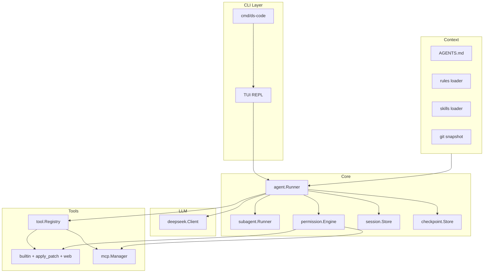
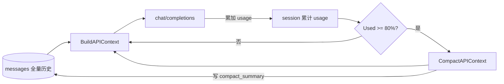
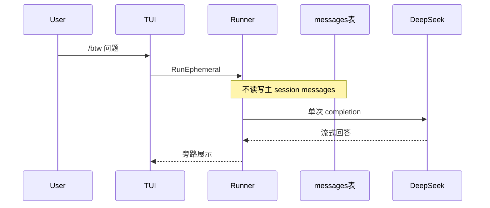

# ds-code 从零建设与安全审计基线

> 文档版本：v0.11  
> 更新日期：2026-05-16  
> 状态：草案，待讨论确认后进入实现

## 概述

在空仓库 `/Users/hejunqiu/Documents/projects/ds-code` 上，按 Claude Code / Codex 的 Agent 范式搭建 Go 原生 CLI **ds-code**：

- DeepSeek 单 Provider（首期）
- Agent / **Plan** 双模式、子代理并行探索
- Codex 式 **`apply_patch`** 编辑 + strict Tool Schema
- 项目上下文（`AGENTS.md`、Rules、Skills）与 Prompt 防注入
- 权限沙箱（内置工具与 MCP 统一）
- 会话持久化、`/compact`、checkpoint 回滚
- TUI 流式 + 思考链折叠；状态栏 Token / 费用估算
- MCP 扩展；安全审计基线

模型调用细节见 **[llm-deepseek.md](llm-deepseek.md)**；模块/流程/Schema 见 **[DESIGN.md](DESIGN.md)**。

---

## 现状

仓库已有 **tokenizer**（`internal/tokenizer/deepseek`、`cmd/count-tokens`）与 `go.mod`；**Agent / TUI / session 等待实现**。架构见 **[DESIGN.md](DESIGN.md)**。

---

## 对标能力矩阵

| 维度 | Claude Code | Codex | ds-code 目标 |
|------|-------------|-------|--------------|
| Agent 循环 | gather → act → verify | ReAct + `apply_patch` | `Runner` + 子代理摘要回注 |
| 编辑 | Edit / patch | **`apply_patch`** | **`apply_patch`（对齐 Codex）** |
| 上下文 | rules、`@` 引用 | `AGENTS.md` | `AGENTS.md` + Rules + Skills + `@` |
| 模式 | Agent / Plan | 沙箱档位 | **Agent + Plan**（Plan 禁写） |
| 权限 | ask / auto | 审批 | 三档；**MCP 写操作同路径** |
| 会话 | compact、resume | resume | SQLite + **`/compact`** + checkpoint |
| 探索 | Task 子代理 | — | **只读子 Runner 并行** |
| 智能 | LSP 诊断 | git 上下文 | **LSP + git status/diff 注入** |
| 网络 | WebFetch/Search | 受限 | **Web 工具（默认关/需审批）** |
| UI | 流式、thinking | TUI | 流式 + reasoning 折叠；**`/` 补全**；**`/context` 累计 + 六分项** |
| LLM | Anthropic | 多 Provider | DeepSeek V4；**1,048,576 上下文 / 393,216 输出** + strict schema |

---

## 目标架构



### Agent 主循环（核心）

1. 解析 **`@path` 引用**；将 user 消息**追加到历史层**（`messages` 表，只增）
2. 进入 **Turn 循环**（直至无 `tool_calls` 或 `MaxTurns` / 取消）：
   - **`PrepareRequest`**：若 [会话累计用量](#会话-token-用量与-compact-触发) ≥ 80% 窗口 → `CompactAPIContext`（不改历史层）；`view := BuildAPIContext(session)`
   - 调用 DeepSeek（`stream` + `tools` + 思考模式；`max_tokens` 取自配置，见 [llm-deepseek.md](llm-deepseek.md)）
   - `tool_calls` → **permission.Engine** → 执行 → `role=tool` 回注；保留 `reasoning_content`；**assistant/tool 回写历史层**
3. 每次响应后累加 API `usage` 到 session（**含 compact 摘要调用**）；可选 **checkpoint**

> **关键**：**不在发送前**用本地 tokenizer 估算 prompt token；compact 仅依据 **session 已累计的 API usage** 判断，模型无关、实现简单。

System / AGENTS / Rules / Skills / Git 的拼装规则见 [BuildAPIContext 规范](#buildapicontext-规范)（[llm-deepseek.md](llm-deepseek.md)）。

```go
type Runner struct {
    LLM        llm.Client
    Tools      *tool.Registry
    Perm       *permission.Engine
    Sessions   session.Store
    Checkpoints checkpoint.Store
    Mode       RunMode // Agent | Plan
    MaxTurns   int
}
```

### 运行模式：Agent / Plan

| 模式 | 工具 | 用途 |
|------|------|------|
| **Agent**（默认） | 全套（写/shell 需权限） | 日常编码 |
| **Plan** | 仅 read/grep/glob/list_dir/LSP；`web_fetch` 仅只读且走**与 Agent 相同**的 ask/关策略；**禁止** write/shell/apply_patch/MCP 写 | 产出计划，**仅 TUI/stdout 展示，不自动写盘** |

切换：`ds-code --plan` 或 TUI `/plan`；Plan 模式下 Runner 注册工具子集。

### LLM 集成

见 **[llm-deepseek.md](llm-deepseek.md)**。Phase 2 启用 **strict Tool Schema**：配置 `llm.strict_tools: true` 时，**全部** `chat/completions` 使用 `https://api.deepseek.com/beta`（不仅单工具请求）。

### 上下文预算与工具设计

DeepSeek V4（`deepseek-v4-pro` / `deepseek-v4-flash`）：**上下文 1,048,576 tokens**（1Mi，2²⁰），**单次最大输出 393,216 tokens**（384Ki）；见 [llm-deepseek.md · 模型选型](llm-deepseek.md#模型选型v4)、[对话补全 API](https://api-docs.deepseek.com/zh-cn/api/create-chat-completion)。

- **会话用量驱动 compact**：见 [会话 Token 用量与 compact 触发](#会话-token-用量与-compact-触发)；[llm-deepseek.md · 用量](llm-deepseek.md#token-用量usage)。
- **`internal/context`**：`BuildAPIContext`、`CompactAPIContext`、`PrepareRequest`（**无**发送前计数）；**`CountBreakdown(view)`** 仅供 `/context` 按需展示。
- **`internal/llm/deepseek/limits.go`**：`ContextWindowTokens = 1_048_576`，`MaxOutputTokens = 393_216`。
- **工具返回值**：按配置 **字符/字节上限**截断（默认）；可选接入 `tokenizer/deepseek` 做精确截断，**不**参与 compact 决策。
- **`internal/tokenizer/deepseek`**：供 **`/context` 六分项**（按需）与可选工具截断；`cmd/count-tokens` 调试；**不参与** compact 触发。
- **状态栏**：`SessionUsedTokens / 1,048,576`；点击或 `/context` 查看累计、阈值与六分项。

### BuildAPIContext 规范

发往 API 的拼装（`BuildAPIContext` 与实际上屏请求体一致）：

| 部分 | 进入 API 的位置 | 不计入 `Messages` |
|------|-----------------|-------------------|
| 固定 system 基座 + `AGENTS.md` + Rules + Skills + Git 快照 | **合并为一条** `role=system` 消息 | 是（独立字段拼装后合并） |
| `tools` JSON schema | 请求体 `tools` 字段 | — |
| compact 摘要 | `Messages` 首条 `role=assistant`（带 `compact` 元数据） | 否 |
| 近端对话 + `@` 注入内容 | `Messages` 中 `user` / `assistant` / `tool` | 否 |
| 子代理 `task` 结果 | `Messages` 中 `role=tool`（`tool` 名 `task`） | 否 |

- **`Messages` 中禁止出现第二条 `system`**。
- **`@` 引用**：并入对应 `user` 消息正文；受 `at_reference_max_chars` 限制。

### 工具系统

| 工具 | 职责 | 权限 | 上下文相关约束 |
|------|------|------|----------------|
| `read_file` | 读文件（offset/limit） | 低 | 默认最多 **500 行**/次；超限截断 |
| `apply_patch` | Codex 式 unified diff；失败原子回滚 | 高 | 单 patch 变更行数上限（可配置） |
| `write_file` | 新建或整文件覆盖 | 高 | — |
| `grep` | 正则搜索 | 低 | 默认 **head_limit 200**；尊重 `.gitignore` |
| `glob` / `list_dir` | 浏览 | 低 | 结果条数上限 |
| `task` | 派发只读子代理，返回摘要写入 `role=tool` | 低 | 摘要 ≤ 4K tokens 量级 |
| `shell` | 命令（超时）；**MVP 仅同步**，后台 Phase 4+ | 最高 | stdout/stderr 截断至 `tool_result_max_tokens` |
| `web_fetch` / `web_search` | 网络 | 中 | 响应体截断 + allowlist |
| `diagnostics` | LSP 诊断 | 低 | 仅返回相关文件/行摘要 |

- **`edit_file` 不单独实现**：统一为 `apply_patch`。
- **strict schema**：Phase 2 启用（[规范](https://api-docs.deepseek.com/zh-cn/guides/tool_calls)）。

**MCP（Phase 5）**：工具名归一化（`mcp__{server}__{tool}`）；**所有 MCP 写/执行类操作经同一 `permission.Engine`**，与内置工具相同策略。

### 项目上下文：AGENTS.md、Rules、Skills

| 机制 | 路径 / 触发 | 行为 |
|------|-------------|------|
| **AGENTS.md** | 项目根（向上查找到 git 根） | 启动与每 session 注入 system 附录 |
| **Rules** | `.ds-code/rules/*.md` 或 `rules.yaml` | 按 glob/语言匹配，追加 system 片段 |
| **Skills** | `.ds-code/skills/**/SKILL.md` 或 `~/.config/ds-code/skills/` | 用户 `/skill <name>` 或模型请求时加载专项指令 |
| **`@` 引用** | 用户输入 `@src/foo.go`、`@dir/` | 预读注入；总预算 ≤ `at_reference_max_tokens`（见 [llm-deepseek.md](llm-deepseek.md)） |
| **Git 感知** | 每 Turn 可选 / `/git` | 注入 `git status -sb`、`git diff --stat`（只读，不执行写） |
| **LSP** | `diagnostics` 工具 + 启动时可选预热 | 对接 `gopls`/`typescript-language-server` 等 |

### Prompt 安全

- **System 不可覆盖**：用户消息、工具结果、MCP 返回均不得替换或清空 system；拼接顺序固定。
- **工具输出边界**：tool 结果包装为明确分隔块，例如：
  ```
  <tool_result name="grep" id="call_xxx">
  ...内容...
  </tool_result>
  ```
- **AGENTS.md 与 Rules** 仅作 system 附录，标记为「项目指令」，与用户输入区分。
- 审计项 **S5** 实现后必测。

### 子代理 / 并行探索（P1）

- `internal/agent/subagent`：只读 Runner，**无 write/shell**。
- 主 Runner 仅通过内置 **`task` 工具** 派发（不另开隐式调度）；并行上限默认 3。
- **Canonical 回注**：摘要作为 `role=tool`、`tool` 名 `task` 写入 API `Messages` 与历史层。
- 对标 Claude Code `Task` / explore subagent。

### 权限沙箱

- `readonly` / `ask`（默认）/ `auto`（`--dangerously-auto` 或 CI）
- **MCP 写操作**（文件写入、shell 类 MCP）与内置 **同一** `Perm.Check(tool, args)` 路径
- 路径逃逸、敏感文件 denylist、shell 高危拦截、网络 allowlist（见 v0.5）

### 会话、压缩与 Checkpoint

#### 双层消息模型（持久化 vs API 上下文）

| 层 | 存储 | 用途 |
|----|------|------|
| **历史记录层** | SQLite `messages` 表，**只增不改**（**永不因 compact/clear 删除**） | 按 `session_id` 归档；TUI、resume、审计；compact 仅写摘要元数据 |
| **API 上下文层** | 内存构建 `BuildAPIContext(session)` | 发往 DeepSeek 的 `messages[]`；可被 compact **替换为摘要 + 近端全文** |



> `compact_summary` 存于 `sessions`（或 `session_compactions`），**不**用摘要行替换 `messages` 表中的原始行。

#### 会话 Token 用量与 compact 触发

**累计字段**（每次 `chat/completions` 响应后自 API `usage` 累加，见 [llm-deepseek.md](llm-deepseek.md)）：

```go
func SessionUsedTokens(s session.Session) int {
    return s.PromptTokensTotal + s.CompletionTokensTotal
}
```

| 项 | 说明 |
|----|------|
| 阈值 | `SessionUsedTokens >= compact_threshold_ratio × ContextWindowTokens`（默认 **838,861**） |
| 检查时机 | **每次**向模型发起新的 `chat/completions` **之前**（`PrepareRequest`；含 tool 子轮次） |
| 不做什么 | **不**在发送前本地估算 prompt token；**不**要求 per-model tokenizer |
| compact 后 | 累计 usage **不清零**（反映真实计费）；压缩的是 **API 上下文层**，下一轮 prompt 实际变小 |

#### 自动 compact（`PrepareRequest` 内）

1. 若 `SessionUsedTokens(session) >= 0.80 × 1_048_576`：
   - **CompactAPIContext**：对「除合并 system + 最近 `keep_recent_turns` 轮外」的 API 层消息调 LLM 生成摘要
   - 写入 `sessions.compact_summary`、`compact_up_to_message_id`；**不修改** `messages` 历史行
   - compact 调用的 usage **继续累加**到 session
   - 失败降级：按时间截断旧 API 轮次 + TUI 警告
2. `view := BuildAPIContext(session)` → 发送请求

**手动 `/compact`**：用户主动触发同一 `CompactAPIContext`；仍仅影响 API 层。

**超限**：若 API 返回上下文过长错误，Runner 自动触发 compact 并重试一次（仍不依赖本地 Count）。

#### `/clear`：新会话，历史仍保留

**语义**：清空**当前界面上的对话上下文**，并**开始新会话**（分配新的 `session_id`）。**不删除**数据库中任何历史 `messages` 行。

| 项 | 行为 |
|----|------|
| 当前 TUI | 对话区清空，Token 累计归零（新 session） |
| `session_id` | 生成新 ID；旧 session 完整保留在 SQLite |
| 历史查看 | `ds-code sessions` / `/resume <id>` 可回到旧会话 |
| API 上下文 | 新 session 无历史；`compact_summary` 为空 |
| 与 `/compact` 区别 | `/compact` 同 session 内压缩 API 层；`/clear` **换 session**，历史分卷存储 |

#### `/btw`：快速提问（不进入主对话）

**语义**：`btw` = by the way。一次性向模型提问，**不写入**当前 session 的 `messages` 历史层，**不触发**主对话的 compact / Agent 工具循环。

| 项 | 行为 |
|----|------|
| 用法 | `/btw 这个问题是什么含义？` 或 `/btw` 后输入单行 |
| 上下文 | 可选轻量 system（+ 当前 `AGENTS.md` 摘要）；**默认不带**主对话历史（配置 `btw.include_recent_turns: 0` 可调） |
| 工具 | **默认关闭** `tools`（纯问答）；不执行 shell/write |
| 持久化 | **不**追加 `messages`；**不**改变 `compact_summary` / 水位线 |
| Token 统计 | 默认 **不计入** session 累计；单独显示「btw 本次」 |
| `user_id` | 使用 `btw-{uuid}`，**不与**主 session 的 `user_id` 共用（避免 KV cache 串扰） |
| TUI | 流式显示在**旁路面板**或折叠块（样式与主对话区分，如 `[btw]` 前缀）；关闭后面板消失，主对话滚动区不变 |
| 实现 | `Runner.RunEphemeral(ctx, prompt, EphemeralOpts)`，独立 `messages[]`，单次 `chat/completions` |



- **API 调用**：`max_tokens` 默认 16Ki，硬顶 **393,216**；`stream_options.include_usage: true`
- **Checkpoint（P2）**：写操作前记录 patch/文件哈希；`/rewind [n]` 回滚工作区；历史层**追加**一条 `role=system` 事件消息（「已回滚检查点 n」），不删改既有 messages
- **Resume**：`ds-code resume <id>`、`/resume`、会话列表 `ds-code sessions`

### TUI / CLI

- **布局**：对话区 | 工具日志 | **底部状态栏**
- **状态栏**：左侧 `模型 · 思考强度`；右侧 `输入 · 输出 · 缓存`；**费用估算（P2）**
- **思考链 UI**：`reasoning_content` 默认折叠，快捷键展开/收起

#### Slash 命令：识别规则

**仅当整行输入（去掉行首空白后）以 `/` 开头时**解析为命令；否则整行作为**普通用户消息**交给 Agent（行内 `/path`、`https://` 等**不**触发命令）。

```
/^\/([a-z][a-z0-9_-]*)(?:\s+(.*))?$/   // 命令名 + 可选参数（余下全文）
```

| 输入示例 | 解析 |
|----------|------|
| `/mode deepseek-v4-flash` | `cmd=mode`，`args="deepseek-v4-flash"` |
| `/btw 这段代码什么意思` | `cmd=btw`，`args="这段代码什么意思"` |
| `/help` | `cmd=help`，`args=""` |
| `请执行 /compact` | **非命令** → 发给 Agent 的 user 消息 |
| `  /clear` | 允许行首空白后 trim，再识别为 `clear` |

解析实现：`internal/ui/slash.Parse(line) (cmd, args, ok)`；未知命令 → TUI 提示，**不**写入 `messages`、**不**调 Agent。

#### Slash 命令：输入补全与列表

| 交互 | 行为 |
|------|------|
| 输入 `/` | 弹出**全部可用命令**列表（名称 + 一行说明） |
| 输入 `/` + 字母 | **前缀过滤**（如 `/m` → `mode`；`/c` → `clear`、`compact`、`checkpoint`） |
| ↑↓ / Tab | 在过滤结果中选择；Enter 补全命令名或执行 |
| `/help` | 同列表，输出到对话区或专用帮助面板 |

命令注册表（单一数据源，供补全、`/help`、解析共用）：`internal/ui/slash/registry.go`。

| 命令 | 参数 | 说明 |
|------|------|------|
| `help` | — | 显示所有命令 |
| `context` | — | **可视化当前 API 上下文** token 构成与占比（见下） |
| `mode` | `[deepseek-v4-pro\|flash]` | 查看/切换模型 |
| `effort` | `[high\|max]` | 查看/切换思考强度 |
| `thinking` | `[on\|off]` | 思考模式开关 |
| `clear` | — | 新 session_id，历史仍保留 |
| `btw` | `<问题…>` | 旁路提问，不进主对话 |
| `compact` | — | 手动压缩 API 上下文 |
| `resume` | `[session_id]` | 恢复会话 |
| `plan` | — | 进入 Plan 模式 |
| `agent` | — | 回到 Agent 模式 |
| `permissions` | — | 查看/切换权限模式 |
| `checkpoint` | `[list\|rewind n]` | 检查点 |
| `git` | — | 注入 git 快照到下一轮 API system 附录 |
| `skill` | `<name>` | 激活 Skill（Phase 6） |
| `task` | `<任务描述…>` | 手动派发只读子代理（Phase 6）；结果以 `role=tool` 回注 |

- **`/mode`**、**`/effort`** 等语义见前文；模型/强度 **per-session** 持久化。

#### `/context`：上下文使用可视化

**语义**：两层信息——(1) **会话累计**（与 compact 触发一致）；(2) **下一次请求的 API 上下文六分项**（用户细览占用）。**不发起 LLM**、**不写入** `messages`；六分项在用户执行 `/context` 时**按需**计算，**不在**每次发请求前计算。

##### 第一层：会话累计（compact 依据）

```
Session usage  712,400 / 1,048,576  (68.0%)   [auto-compact @ 838,861]
  输入累计  prompt_tokens_total      580,200
  输出累计  completion_tokens_total  132,200
  缓存命中  prompt_cache_hit_total    41,000
```

来源：`sessions` 表 API `usage` 累加字段。

##### 第二层：六分项（下一次 API 请求快照）

基于 `view := BuildAPIContext(session)` + `CountBreakdown(view)`（[llm-deepseek.md · CountBreakdown](llm-deepseek.md#countbreakdownview-apicontextview-contextbreakdown-error)）：

| 组件 | 说明 |
|------|------|
| **System prompt** | 固定 system + `AGENTS.md` + Rules + Skills + Git（merge 后单条 system） |
| **Tools** | 将发送的 `tools` JSON schema |
| **Rules** | 已加载 rules（**展示用**；已并入 System 时标注「已含于 System」） |
| **Skills** | 当前激活 skill（同上） |
| **Subagents** | `Messages` 中来自 `task` 的 `role=tool` |
| **Conversation** | 其余 `Messages`（含 compact 摘要 + 近端轮次） |

**展示示例**：

```
── 下一次请求预估（本地 Count，仅供参考）────────────────────────
组件              Tokens   占窗口   占本次预估Total
System prompt*     8,240    0.8%      5.8%   ███
Tools             52,100    5.0%     36.5%   ██████████████████
Rules              1,200    0.1%      —      （已含于 System）
Skills                 0    0.0%      —
Subagents          6,400    0.6%      4.5%   ██
Conversation      74,640    7.1%     52.4%   █████████████████████
预估合计         142,580              100%
```
\* System prompt 含 Git 快照（若有）。

- **Total 求和**：`System + Tools + Subagents + Conversation`（Rules/Skills 不重复计入，见 llm-deepseek）。
- **计数器**：首期 DeepSeek V4 用 `tokenizer/deepseek`；未来多模型可插拔 `Counter` 接口，无法精确时标注「估算」。
- 实现：`session.UsageSnapshot()` + `context.CountBreakdown(BuildAPIContext(...))` → `internal/ui/context_panel.go`。
- `/context --json`：导出累计字段 + 六分项 + 阈值。
- **不**计入 btw；反映**下一次**主对话 API 调用前快照（默认不含输入框未提交草稿）。
- **CLI**：`ds-code`（交互）、`ds-code -p "..."`（**非交互**）、`ds-code -p "..." --json`（CI/脚本）、`ds-code --plan`
- **取消**：Ctrl+C → cancel context → 停 LLM 流 + shell 子进程

### 推荐目录结构

```
ds-code/
├── cmd/ds-code/main.go
├── internal/
│   ├── agent/          # Runner, RunEphemeral(/btw), subagent, RunMode
│   ├── context/        # AGENTS.md, rules, skills, BuildAPIContext, PrepareRequest, compact
│   ├── tokenizer/deepseek/  # 可选：调试与工具截断（非 compact 决策）
│   ├── llm/deepseek/
│   ├── tool/           # apply_patch, web, diagnostics, builtin
│   ├── permission/
│   ├── session/
│   ├── checkpoint/
│   ├── mcp/
│   ├── config/
│   └── ui/
│       ├── slash/      # registry, Parse, 补全过滤
│       ├── context_panel.go  # /context 可视化
│       ├── statusbar/
│       └── ...         # TUI, reasoning panel
├── docs/
│   ├── PLAN.md
│   ├── DESIGN.md
│   └── llm-deepseek.md
├── cmd/count-tokens/   # tokenizer 调试
├── configs/example.yaml
├── internal/assets/deepseek-v4/  # tokenizer.json（embed）
├── scripts/fetch-tokenizers-lib.sh
├── AGENTS.md           # 示例（仓库内）
└── go.mod
```

---

## 分阶段实施路线

### Phase 0 — 脚手架（0.5 天）

- [ ] `go mod init`、`cobra`、`configs/example.yaml`（含 `llm`/`context`/`btw` 全量键）、CI/lint
- [ ] 文档化 **可选 CGO**（tokenizer 调试/精确截断）；`scripts/fetch-tokenizers-lib.sh` 进 README

### Phase 1 — MVP Agent（2–3 天）

- [ ] [llm-deepseek.md](llm-deepseek.md) client + `limits.go` + `Runner`（`stream_options.include_usage`）
- [ ] `internal/context`：`PrepareRequest`（session usage ≥80% → compact）、`BuildAPIContext` 骨架（`CountBreakdown` 见 Phase 4）
- [ ] `read_file` / `grep` / `shell`；**尊重 `.gitignore`**；工具结果截断
- [ ] **AGENTS.md** 加载 + **Prompt 边界**（system 固定、tool_result 包装）
- [ ] **取消传播**（context → LLM + shell）
- [ ] **`-p` / `--json`** 非交互
- [ ] 简单 stdin REPL；mock 测试

**验收**：`ds-code -p "找 main 并解释"` 闭环。

### Phase 1.5 — P0 交互（1–2 天）

- [ ] **`@` 文件/目录引用** 预加载
- [ ] **Slash**：`registry` + `Parse`（**仅行首 `/`**）；`/help` 列出全部命令
- [ ] **Git 感知**（启动 + `/git` 注入 status/diff stat）

### Phase 2 — 写操作、权限、strict（2 天）

- [ ] **`apply_patch`**（Codex 语义；失败原子回滚）
- [ ] `write_file`、`PermissionMode` + TUI 确认
- [ ] 路径/敏感文件策略
- [ ] **[strict Tool Schema](llm-deepseek.md)**（beta base_url）

### Phase 3 — 会话与压缩（1–2 天）

- [ ] SQLite：`messages` 全量历史 + `compact_summary` / 水位线
- [ ] `BuildAPIContext` / `CompactAPIContext`（compact **不删不改**历史 `messages`）
- [ ] **`PrepareRequest`**：`SessionUsedTokens` ≥ 80% → 自动 compact → 再调 LLM
- [ ] `CountBreakdown` + `APIContextView` 拼装与 llm-deepseek 一致（供 Phase 4 `/context`）
- [ ] resume、sessions 列表；**`/clear`**（新 session_id，历史不删）；Token 累计；**`/compact`** 手动

### Phase 4 — TUI（2–3 天）

- [ ] Bubble Tea 多面板
- [ ] **reasoning 折叠/展开**
- [ ] 状态栏 Token；**费用估算**
- [ ] 输入框 **`/` 补全**：显示全部命令、`/foo` 前缀过滤、↑↓/Tab 选择
- [ ] **`/context`**：session 累计 + `CountBreakdown` 六分项面板（或 `--json`）
- [ ] 完整 Slash 实现；状态栏；流式、滚动、取消

### Phase 5 — MCP（2–3 天）

- [ ] MCP manager；工具归一化
- [ ] **MCP 写操作走 `permission.Engine`**
- [ ] 配置示例与文档

### Phase 6 — P1 增强（3–5 天）

- [ ] **子代理** 只读并行探索
- [ ] **Rules**（`.ds-code/rules`）
- [ ] **Skills**（`SKILL.md` + `/skill`）
- [ ] **`web_fetch` / `web_search`**（默认关或 ask + allowlist）
- [ ] **Plan 模式**（`--plan`、工具子集）
- [ ] **LSP `diagnostics` 工具**

### Phase 7 — P2 与加固（2–3 天）

- [ ] **Checkpoint / `/rewind`**
- [ ] 安全审计清单 S1–S10、集成测试、威胁模型 README

---

## 安全审计清单

| # | 审计项 | 通过标准 |
|---|--------|----------|
| S1 | API Key | env/配置；日志无 key |
| S2 | 路径逃逸 | `..`、symlink 拦截 |
| S3 | 敏感文件 | `.env`/`.ssh` 等 deny |
| S4 | Shell | 高危确认；取消杀子进程 |
| S5 | Prompt 注入 | tool 边界标记；**user 不能覆盖 system** |
| S6 | MCP | 用户配置；**写操作走 Perm**；崩溃隔离 |
| S7 | 会话 | 隔离；SQLite 权限 |
| S8 | 依赖 | `go mod verify` / `govulncheck` |
| S9 | 取消 | context 贯穿 LLM/工具/子进程/子代理 |
| S10 | 审计日志 | `--audit-log` 记 tool 名+参数哈希 |
| S11 | 超大注入 | `@`/tool 结果超 `*_max_tokens` 必须截断 |
| S12 | compact 摘要 | 摘要 prompt 不含密钥明文（可配置脱敏） |
| S13 | `/btw` | 禁止挂载 tools；禁止写历史层 |

---

## 关键依赖

```go
github.com/spf13/cobra
github.com/spf13/viper
github.com/sashabaranov/go-openai
github.com/charmbracelet/bubbletea
github.com/charmbracelet/lipgloss
modernc.org/sqlite
github.com/mark3labs/mcp-go
// LSP: 子进程调用 gopls 等（无强依赖 SDK）
```

---

## 差异化要点

1. **Codex 式 `apply_patch` + DeepSeek strict schema**
2. **权限统一**：内置 + MCP 同一引擎
3. **AGENTS.md + Rules + Skills + @ 引用** 一层上下文体系
4. **Agent / Plan 双模式** + 只读子代理
5. **Go 单二进制**；DeepSeek 缓存 Token 与费用栏透明

---

## 风险与决策

| 决策 | 风险 |
|------|------|
| `apply_patch` 对齐 Codex | 需完善 diff 解析与失败回滚测试 |
| strict schema Phase 2 | beta API；schema 需满足 additionalProperties:false 等 |
| 子代理并行 | Token/成本上升；需并发上限 |
| Web 工具 | SSRF；必须 allowlist + 默认关 |
| Checkpoint | 大仓库快照成本；可先仅记录 patch 不快照全量 |
| CGO + tokenizer | compact 不依赖；无 CGO 时 `/context` 六分项降级为字符估算 |
| 累计用量滞后 | compact 后 usage 不清零，可能仍 >80% 直至后续请求实际降 prompt；可手动 `/compact` |

---

## 非目标（首期不做）

- IDE 插件、云端 session 同步、Hooks 插件系统、git worktree 隔离、多 Provider 切换。

---

## 非交互模式（`-p` / `--json`）

- 走同一 `PrepareRequest`（session usage 触发 compact）、AGENTS.md、工具权限（默认 `ask` 在非 TTY 下可配置为 `auto` 并文档警示）。
- 不启动 TUI；不写 Slash；输出 JSON 后退出。
- 使用独立 `session_id` 或一次性 session（配置 `non_interactive.ephemeral_session: true`）。

---

## MVP 验收

```bash
export DEEPSEEK_API_KEY=sk-...
ds-code -p "在项目根目录找出 main 函数并解释其作用"
ds-code --json -p "..."   # CI 输出
```

---

## 讨论记录

| 日期 | 变更摘要 |
|------|----------|
| 2026-05-16 | 初版绿场计划 |
| 2026-05-16 | DeepSeek V4；llm-deepseek 抽离；Token 状态栏 |
| 2026-05-16 | **v0.6**：纳入 P0 全量；P1 子代理/Skills/Rules/Web/Plan/compact/LSP/git；P2 费用/checkpoint；apply_patch、Prompt 安全、reasoning UI、MCP 权限统一、strict schema |
| 2026-05-16 | **v0.7**：`/mode`、`/effort`；per-session 持久化 |
| 2026-05-16 | **v0.8**：V4 上下文/输出上限、工具截断、预算校验 |
| 2026-05-16 | 上下文长度更正为 **1,048,576**（1Mi），非 1,000,000 |
| 2026-05-16 | 预算预计算绑定 `internal/tokenizer/deepseek/tokenizer.go` |
| 2026-05-16 | 自动 compact：新消息前 ≥80% 触发；**仅压缩 API 上下文，历史 messages 不变** |
| 2026-05-16 | **`/clear`** = 新 session_id + 清空当前 UI；历史记录仍保留在库中 |
| 2026-05-16 | **`/btw`**：旁路快速提问，不写入主对话 messages |
| 2026-05-16 | Slash **仅行首识别**；`/` 列表 + 前缀过滤；余下文本为 args |
| 2026-05-16 | **`/context`**：System/Tools/Rules/Skills/Subagents/Conversation 分项 token 与占比 |
| 2026-05-16 | **v0.9**：审计修订—BuildAPIContext 规范、task/skill、compact/btw/checkpoint、strict |
| 2026-05-16 | **v0.10**：compact 改由 **session API usage 累计** ≥80% 触发；取消发送前 `CountPrompt` |
| 2026-05-16 | **v0.11**：`/context` 保留 **六分项**（按需 `CountBreakdown`），与会话累计分层展示 |
| 2026-05-16 | 新增 **[DESIGN.md](DESIGN.md)** 详细设计（模块、Schema、流程、接口） |

---

确认后可在 **Agent 模式** 从 Phase 0 实施；每 Phase 结束对照安全审计清单复审。
