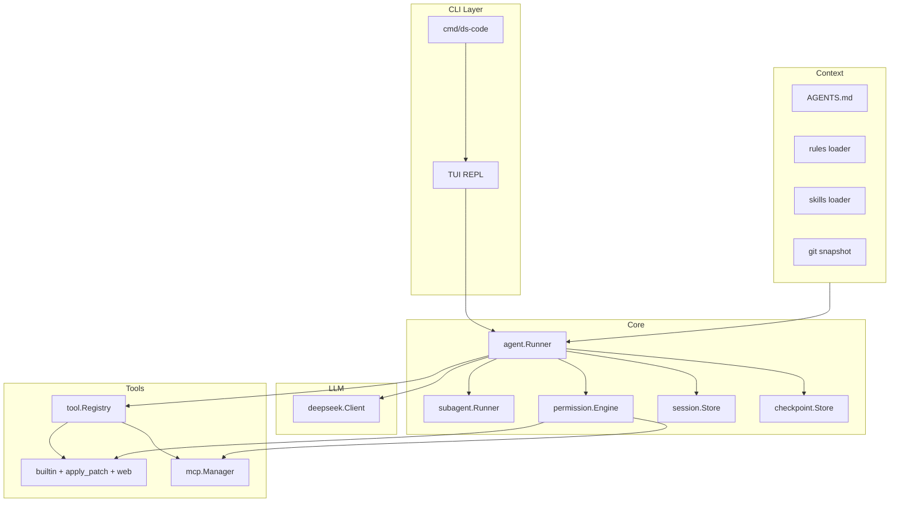
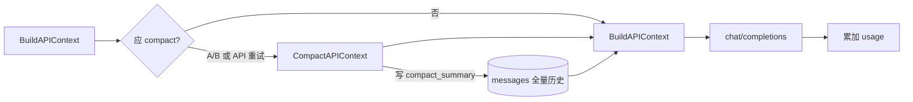
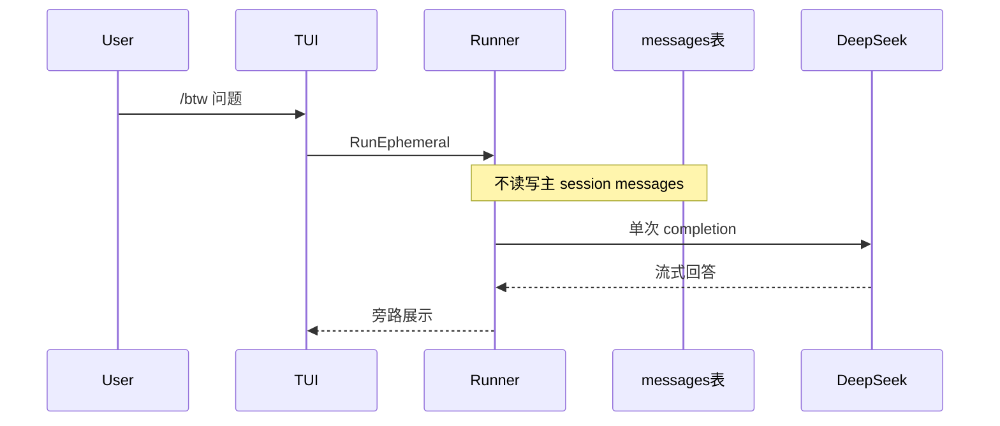

# ds-code 从零建设与安全审计基线

> 文档版本：v0.14  
> 更新日期：2026-06-12  
> 状态：v0.1.0 首版已发布，持续迭代

## 概述

在空仓库 `/Users/hejunqiu/Documents/projects/ds-code` 上，按 Claude Code / Codex 的 Agent 范式搭建 Go 原生 CLI **ds-code**：

- DeepSeek 单 Provider（首期）
- Agent / **Plan** 双模式、子代理并行探索
- Codex 式 **`apply_patch`** 编辑 + strict Tool Schema
- 项目上下文（`AGENTS.md`、Rules、Skills）与 Prompt 防注入
- 权限沙箱（内置工具与 MCP 统一）
- 会话持久化、`/compact`、checkpoint 回滚
- TUI 流式 + 思考链折叠；状态栏 **累计计费** + **下次请求预估**；费用估算（Phase 4）
- MCP 扩展；安全审计基线

模型调用细节见 **[llm-deepseek.md](llm-deepseek.md)**；模块/流程/Schema 见 **[DESIGN.md](DESIGN.md)**；**配置 / CLI / 环境变量**见 **[CONFIG.md](CONFIG.md)**。

---

## 现状

v0.1.0 已实现 Agent / Plan 双模式、Bubble Tea TUI、DeepSeek V4 客户端、Codex 式 `apply_patch`、SQLite 会话与 compact、checkpoint、MCP、LSP diagnostics、子代理、Rules/Skills、权限沙箱与费用估算。模块与流程见 **[DESIGN.md](DESIGN.md)**；配置见 **[CONFIG.md](CONFIG.md)**。

---

## 对标能力矩阵

| 维度 | Claude Code | Codex | ds-code 目标 |
|------|-------------|-------|--------------|
| Agent 循环 | gather → act → verify | ReAct + `apply_patch` | `Runner` + 子代理摘要回注 |
| 编辑 | Edit / patch | **`apply_patch`** | **`apply_patch`（对齐 Codex）** |
| 上下文 | rules、`@` 引用 | `AGENTS.md` | `AGENTS.md` + Rules + Skills + `@` |
| 模式 | Agent / Plan | 沙箱档位 | **Agent + Plan**（Plan 禁写） |
| 权限 | ask / auto | 审批 | 三档；**MCP 写操作同路径** |
| 会话 | compact、resume | resume | SQLite + **`/compact`** + checkpoint |
| 探索 | Task 子代理 | — | **只读子 Runner 并行** |
| 智能 | LSP 诊断 | git 上下文 | **LSP + git status/diff 注入** |
| 网络 | WebFetch/Search | 受限 | **Web 工具（默认关/需审批）** |
| UI | 流式、thinking | TUI | 流式 + reasoning 折叠；**`/` 补全**；**`/context` 累计 + 六分项** |
| LLM | Anthropic | 多 Provider | DeepSeek V4；**1,048,576 上下文 / 393,216 输出** + strict schema |

---

## 目标架构



### 术语：用户轮、子轮次、Turn

| 术语 | 含义 |
|------|------|
| **用户轮（user turn）** | 用户提交一条消息（含 `@` 展开）至下一条用户消息之前的全部 `assistant` / `tool` 消息；`keep_recent_turns` 计 **用户轮** |
| **子轮次（sub-round）** | 单次用户轮内：一次 `chat/completions` → 若有 `tool_calls` 则执行工具 → 再请求，直至无 `tool_calls` |
| **`MaxTurns`** | 限制**子轮次**上限（默认见 [CONFIG.md · agent](CONFIG.md#510-agent--runner)），防死循环；**不是**用户轮数 |

### Agent 主循环（核心）

1. 解析 **`@path` 引用**；将 user 消息**追加到历史层**（`messages` 表，只增；Phase 1–2 见 [会话存储分期](#会话存储分期)）
2. 进入**子轮次循环**（直至无 `tool_calls` 或达到 `MaxTurns` / 取消）：
   - **`PrepareRequest`**：按 [compact 触发](#会话-token计费累计-vs-compact-触发) 决定是否 `CompactAPIContext`（**同一 `PrepareRequest` 最多 compact 一次**）；`view := BuildAPIContext(session)`
   - 调用 DeepSeek（`stream` + `tools` + 思考模式；`max_tokens` 取自配置；主会话 `user_id` = `cache_scope`，见 [llm-deepseek.md](llm-deepseek.md)）
   - `tool_calls` → **permission.Engine** → [并行/顺序执行工具](#同一-assistant-多条-tool_calls) → `role=tool` 回注；保留 `reasoning_content`；**assistant/tool 回写历史层**
3. 每次响应后累加 API `usage` 到 session（**含 compact 摘要调用**）；可选 **checkpoint**（Phase 7）

> **关键**：compact **不**用「累计 prompt+completion / 窗口」单一指标；见下文 **A/B/C 触发条件**。`CountBreakdown` 用于 compact 条件 A 与 `/context`，在用户轮首个子轮次计算后**缓存至该用户轮结束**。

System / AGENTS / Rules / Skills / Git 的拼装规则见 [BuildAPIContext 规范](#buildapicontext-规范)（[llm-deepseek.md](llm-deepseek.md)）。

```go
type Runner struct {
    LLM        llm.Client
    Tools      *tool.Registry
    Perm       *permission.Engine
    Sessions   session.Store
    Checkpoints checkpoint.Store
    Mode       RunMode // Agent | Plan
    MaxTurns   int
}
```

### 运行模式：Agent / Plan

| 模式 | 工具 | 用途 |
|------|------|------|
| **Agent**（默认） | 全套（写/shell 需权限）；`MaxTurns` 默认见 `agent.max_turns` | 日常编码 |
| **Plan** | 仅 read/grep/glob/list_dir/LSP；`web_fetch` 仅只读且走**与 Agent 相同**的 ask/关策略；**禁止** write/shell/apply_patch/MCP 写 | 产出计划，**仅 TUI/stdout 展示**；首期**无**「一键采纳写盘」，须切回 Agent 或手动执行 |

切换：`ds-code --plan` 或 TUI `/plan`；Plan 模式下 Runner 注册工具子集。

### LLM 集成

见 **[llm-deepseek.md](llm-deepseek.md)**。Phase 2 启用 **strict Tool Schema**：配置 `llm.strict_tools: true` 时，**全部** `chat/completions`（含 **compact 摘要**、主对话、tool 子轮次；`/btw` 默认无 tools）使用 `https://api.deepseek.com/beta`。

### 上下文预算与工具设计

DeepSeek V4（`deepseek-v4-pro` / `deepseek-v4-flash`）：**上下文 1,048,576 tokens**（1Mi，2²⁰），**单次最大输出 393,216 tokens**（384Ki）；见 [llm-deepseek.md · 模型选型](llm-deepseek.md#模型选型v4)、[对话补全 API](https://api-docs.deepseek.com/zh-cn/api/create-chat-completion)。

- **compact 触发**：见 [计费累计 vs compact](#会话-token计费累计-vs-compact-触发)；[llm-deepseek.md · 用量](llm-deepseek.md#token-用量usage)。
- **`internal/context`**：`BuildAPIContext`、`CompactAPIContext`、`PrepareRequest`；**`CountBreakdown`** 用于 compact 条件 A（缓存于用户轮内）与 `/context`。
- **`internal/llm/deepseek/limits.go`**：`ContextWindowTokens = 1_048_576`，`MaxOutputTokens = 393_216`（上线前对照[官方文档](https://api-docs.deepseek.com/zh-cn/)校验）。
- **工具返回值**：按 `tool_result_max_chars` 或 `truncate_by: tokenizer` 截断；**不**单独作为 compact 依据。
- **`internal/tokenizer/deepseek`**：`CountBreakdown`、可选工具截断、`cmd/count-tokens` 调试。
- **状态栏**：**累计计费** `SessionBilledTokens`；**下次预估**（用户轮内缓存的 `CountBreakdown.Total`）；详情见 `/context`。

### BuildAPIContext 规范

发往 API 的拼装（`BuildAPIContext` 与实际上屏请求体一致）：

| 部分 | 进入 API 的位置 | 不计入 `Messages` |
|------|-----------------|-------------------|
| 固定 system 基座 + `AGENTS.md` + Rules + Skills + Git 快照 | **合并为一条** `role=system` 消息 | 是（独立字段拼装后合并） |
| `tools` JSON schema | 请求体 `tools` 字段 | — |
| compact 摘要 | `Messages` 首条 `role=assistant`（带 `compact` 元数据） | 否 |
| 近端对话 + `@` 注入内容 | `Messages` 中 `user` / `assistant` / `tool` | 否 |
| 子代理 `task` 结果 | `Messages` 中 `role=tool`（`tool` 名 `task`） | 否 |

- **`Messages` 中禁止出现第二条 `system`**。
- **`@` 引用**：并入对应 `user` 消息正文；受 `at_reference_max_chars` 限制。

### 工具系统

| 工具 | 职责 | 权限 | 上下文相关约束 |
|------|------|------|----------------|
| `read_file` | 读文件（`start`/`end` 行范围） | 低 | 默认最多 **2000 行**/次；`max_bytes` 超限拒绝 |
| `apply_patch` | Codex 式 unified diff；失败原子回滚 | 高 | 单 patch 变更行数上限（可配置） |
| `write_file` | 新建或**整文件**覆盖（无对应 diff 时） | 高 | 优先 `apply_patch` 编辑已有文件 |
| `grep` | 正则搜索 | 低 | 默认 **head_limit 200**；尊重 `.gitignore` |
| `glob` / `list_dir` | 浏览 | 低 | 结果条数上限 |
| `task` | 派发只读子代理，返回摘要写入 `role=tool` | 低 | 摘要 ≤ 4K tokens 量级 |
| `shell` | 命令（`shell.timeout`）；**MVP 仅同步**，后台 Phase 8+ | 最高 | stdout/stderr 截断至 `tool_result_max_chars` |
| `web_fetch` / `web_search` | 网络 | 中 | 响应体截断 + allowlist |
| `diagnostics` | 多语言 LSP 诊断（见 [LSP / diagnostics](#lsp-与-diagnostics-工具phase-6)） | 低 | `paths` 文件/目录；摘要输出，受 `lsp.*` 限额 |

- **`edit_file` 不单独实现**：统一为 `apply_patch`。
- **`write_file` vs `apply_patch`**：修改已有文件**必须**用 `apply_patch`；`write_file` 仅新建或用户明确要求整文件重写。
- **strict schema**：Phase 2 启用（[规范](https://api-docs.deepseek.com/zh-cn/guides/tool_calls)）。
- **工具默认与上限**：见 [CONFIG.md §5.11](CONFIG.md#511-tools--内置工具约束)（行数、head_limit、patch 行数、子代理并发等）。

**MCP（Phase 5）**：工具名归一化（`mcp__{server}__{tool}`）；**所有 MCP 写/执行类操作经同一 `permission.Engine`**，与内置工具相同策略。

### 配置

用户级 / 项目级 YAML、CLI flags、环境变量及逐项优先级见 **[CONFIG.md](CONFIG.md)**。本机根 **固定为 `~/.ds-code/`**（不可自定义；含 `config/config.yaml`、`skills/`）；**每个项目**的运行时数据在 **`~/.ds-code/projects/<sha256(项目根绝对路径)>/`**。项目内 **`.ds-code/config.yaml`** 仅覆盖仓库相关项。

### 项目上下文：AGENTS.md、Rules、Skills

| 机制 | 路径 / 触发 | 行为 |
|------|-------------|------|
| **AGENTS.md** | 项目根（向上查找到 git 根） | 启动与每 session 注入 system 附录 |
| **Rules** | `.ds-code/rules/*.md` 或 `rules.yaml` | 按 glob/语言匹配，追加 system 片段 |
| **Skills** | `.ds-code/skills/**/SKILL.md` 或 `~/.ds-code/skills/` | 用户 `/skill <name>` 或模型请求时加载专项指令 |
| **`@` 引用** | `@file`、`@dir/` | 预读注入；总预算 ≤ `at_reference_max_chars`；目录规则见 [`@` 引用](#-引用) |
| **Git 感知** | 每用户轮可选 / `/git` | 注入 `git status -sb`、`git diff --stat`；总长 ≤ `git_snapshot_max_chars` |
| **LSP** | `diagnostics` 工具（Phase 6） | stdio 子进程 + 扩展名注册表；Go/TS/C++/Java 等，见 [DESIGN §9.5](DESIGN.md#95-lsp-子系统internallspphase-6) |

### Prompt 安全

- **System 不可覆盖**：用户消息、工具结果、MCP 返回均不得替换或清空 system；拼接顺序固定。
- **工具输出边界**：tool 结果包装为明确分隔块，例如：
  ```
  <tool_result name="grep" id="call_xxx">
  ...内容...
  </tool_result>
  ```
- **AGENTS.md 与 Rules** 仅作 system 附录，标记为「项目指令」，与用户输入区分。
- **工具失败**：permission 拒绝、执行错误、patch 失败均以 `<tool_result>` 回注，`content` 含 `error:` 前缀与人类可读说明，**不**抛 panic 中断 Runner（`ctx` 取消除外）。
- 审计项 **S5** 实现后必测。

### LSP 与 `diagnostics` 工具（Phase 6）

**不内嵌**编译器/分析器；通过 `internal/lsp` 调度用户本机 **Language Server**（stdio JSON-RPC），工作区 = `project_root`。权威设计见 **[DESIGN.md §9.5](DESIGN.md#95-lsp-子系统internallspphase-6)**；配置见 **[CONFIG.md §5.12](CONFIG.md#512-lsp--language-serverphase-6)**。

| 子阶段 | 语言 / Server | 说明 |
|--------|---------------|------|
| **6a** | Go (`gopls`)、JS/TS (`typescript-language-server`) | 框架 + `diagnostics` 工具首版 |
| **6b** | C/C++ (`clangd`) | 依赖 `compile_commands.json` 时最佳 |
| **6c** | Java (`jdtls`) | **仅用户配置** `command`，不捆绑运行时 |

**工具参数**：`paths`（文件或目录）、可选 `severity`。输出 `path:line:col [level] message` 文本，遵守 `lsp.max_issues_per_file` 与 `tool_result_max_chars`。

**默认不实现**：补全、定义跳转、重构；Runner **不**每轮自动全库诊断（按需 tool 调用）。取消时 `shutdown` 并结束子进程（S9）。

### 子代理 / 并行探索（Phase 6）

- `internal/agent/spawn`：子代理 Runner，按类型配置工具集；受 S3 同一敏感路径 denylist。
- 主 Runner 仅通过内置 **`agent` 工具** 或 TUI `/agent` 派发；并发上限 `tools.agent.max_parallel`（默认 3）。
- **Canonical 回注**：摘要作为 `role=tool`、`tool` 名 `agent` 写入 API `Messages` 与历史层；摘要 ≤ `tools.agent.summary_max_chars`。
- **持久化**：完整 subagent transcript 在 `subagent_runs` / `subagent_messages`（schema v3）；主 `BuildAPIContext` 不读子表；用量按需 `usageagg` 聚合。
- 对标 Claude Code `Task` / explore subagent。

### 同一 assistant 多条 `tool_calls`

- **默认顺序执行**（便于审计与取消）；配置 `tools.parallel_tool_calls: true` 时可并行，共享同一 `context.Context`（取消时全部停止）。
- 单条失败：结果以 `<tool_result>` 包裹 `error: ...` 回注，**不**中断同批其余 call（除非 `ctx` 已取消）。
- `tool_call_id` 与结果**严格一一对应**。

### `@` 引用

| 项 | 规则 |
|----|------|
| 单文件 | 读取全文或按 `read_file` 行限制截断后并入 user 消息 |
| `@dir/` | 尊重 `.gitignore`；**最多 50 个文件**、**深度 ≤ 4**、单文件 ≤ `at_reference_max_chars/10`；超出则列表 + 提示用 `grep`/`glob` |
| 总预算 | 单次用户消息所有 `@` 合计 ≤ `at_reference_max_chars` |
| 路径 | 须在 [工作区](#工作区与路径解析) 内；敏感文件走 S3 denylist |

### 权限沙箱与工作区

- `readonly` / `ask`（默认）/ `auto`（`--dangerously-auto` 或 CI）
- **`auto` 与 S3**：`auto` 仅省略写/shell 的 TUI 确认，**不**放宽敏感路径；可读工作区内普通文件，但 **S3 denylist 始终生效**（读工具、`@dir`、`shell` 均不可访问 `.env`、`.envrc`、`.aws` 等，见 [SECURITY.md](SECURITY.md)）
- **工作区（workspace）** = 启动时解析的 **`project_root`**（[CONFIG.md §2.1](CONFIG.md#21-项目运行时目录projectsproject_id)）：所有读写在解析后须落在该目录下（`filepath.Clean` + `..` 拦截 + symlink 解析，S2）
- **MCP 写操作**与内置 **同一** `Perm.Check(tool, args)` 路径
- 路径逃逸、敏感文件 denylist（`.env`、`.envrc`、`.aws`、`.ssh` 等）、`shell` 敏感路径扫描 + 高危模式拦截、网络 allowlist
- **非 TTY + `ask`**：无法弹窗时 **拒绝**写/shell/网络写类操作并返回明确错误；须显式 `--permission-mode auto` 或 `--dangerously-auto`（见 [非交互模式](#非交互模式-p---json)）

### 会话、压缩与 Checkpoint

#### 双层消息模型（持久化 vs API 上下文）

| 层 | 存储 | 用途 |
|----|------|------|
| **历史记录层** | 本地 SQLite 文件（见下表）中的 `messages` 表，**只增不改**（**永不因 compact/clear 删除**） | 按 `session_id` 归档；TUI、resume、审计；compact 仅写摘要元数据 |
| **API 上下文层** | 内存构建 `BuildAPIContext(session)` | 发往 DeepSeek 的 `messages[]`；可被 compact **替换为摘要 + 近端全文** |

**本地数据库文件**（会话与消息历史；**按项目分库**，不在仓库工作区内）：

| 项 | 说明 |
|----|------|
| 项目目录 | `~/.ds-code/projects/<project_id>/`，`project_id = hex(sha256(项目根绝对路径))`（[CONFIG.md §2.1](CONFIG.md#21-项目运行时目录projectsproject_id)） |
| 默认 DB | `~/.ds-code/projects/<project_id>/sessions.db` |
| 路径规则 | 项目目录内文件均固定（[CONFIG.md §2.1](CONFIG.md#项目目录内文件固定路径均不可配置)） |
| 主要表 | `sessions`（元数据、`compact_summary`、usage 累计）、`messages`（全量对话行） |
| 隔离 | 不同仓库 / 不同绝对路径 → 不同 DB；同一项目内 `/clear` 换 `session_id` 仍共用一库 |



> `compact_summary` 存于 `sessions`（或 `session_compactions`），**不**用摘要行替换 `messages` 表中的原始行。

#### 会话存储分期

| 阶段 | 存储 | compact |
|------|------|---------|
| **Phase 1–2** | 内存 `session.Store`（或 Phase 1.5 起最小 SQLite 可选）；`-p` 默认 `ephemeral_session` | `CompactAPIContext` **no-op**；`PrepareRequest` 仅 `BuildAPIContext` |
| **Phase 3+** | `~/.ds-code/projects/<id>/sessions.db` | 完整 compact / resume / `/clear` |

#### 会话 Token：计费累计 vs compact 触发

**计费累计**（状态栏「累计」，**不单独**作为 compact 唯一依据）：

```go
func SessionBilledTokens(s session.Session) int {
    return int(s.PromptTokensTotal + s.CompletionTokensTotal)
}
```

**阈值**：`compact_threshold = compact_threshold_ratio × ContextWindowTokens`（默认 **838,861**）。

**compact 触发**（满足 **任一**；在 `PrepareRequest` 内评估，**同一 `PrepareRequest` 最多执行一次** `CompactAPIContext`）：

| 条件 | 说明 |
|------|------|
| **A. 下一次请求预估** | 本用户轮**首个**子轮次：`CountBreakdown(BuildAPIContext(session)).Total() >= compact_threshold`；结果**缓存至该用户轮结束**，后续子轮次复用（不重复 Count） |
| **B. 累计 prompt** | `prompt_tokens_total >= compact_threshold`（**不含** `completion_tokens_total`） |
| **C. API 过长** | 响应为上下文过长 → compact → **重试一次** `chat/completions` |

| 项 | 说明 |
|----|------|
| 检查时机 | 每次 `PrepareRequest`（含 tool 子轮次）；条件 A 的 Count 仅在用户轮首个子轮次计算 |
| compact 后 | 计费累计 **不清零**；压缩 **API 上下文层**；若仍满足 B 但 A 已低于阈值，**本 Prepare 不再二次 compact**（依赖后续请求实际 prompt 下降） |
| `cache_scope` | 主会话：`hex(session_id)` → API `user_id`（与 `/btw` 的 `btw-{uuid}` 隔离） |

#### 自动 compact（`PrepareRequest` 内）

1. 若满足 [触发条件 A/B/C](#会话-token计费累计-vs-compact-触发) 且本会话 `PrepareRequest` 尚未 compact 过：
   - **CompactAPIContext**：对「除合并 system + 最近 `keep_recent_turns` **用户轮**外」的 API 层消息调 LLM 生成摘要（S12 脱敏）
   - 写入 `sessions.compact_summary`、`compact_up_to_message_id`；**不修改** `messages` 历史行
   - compact 调用的 usage **继续累加**到 session
   - 失败降级：按时间截断旧 API 轮次 + TUI 警告
2. `view := BuildAPIContext(session)` → 发送请求

**手动 `/compact`**：用户主动触发同一 `CompactAPIContext`；仍仅影响 API 层。

**`finish_reason: length`**：达到 `max_tokens` 时 TUI/`-p` 提示缩小任务、`/compact` 或提高 `llm.max_tokens`（硬顶 393,216）；**不**自动续写（首期）。

#### `/clear`：新会话，历史仍保留

**语义**：清空**当前界面上的对话上下文**，并**开始新会话**（分配新的 `session_id`）。**不删除**数据库中任何历史 `messages` 行。

| 项 | 行为 |
|----|------|
| 当前 TUI | 对话区清空，Token 累计归零（新 session） |
| `session_id` | 生成新 ID；旧 session 完整保留在 SQLite |
| 历史查看 | `ds-code sessions` / `/resume <id>` 可回到旧会话 |
| API 上下文 | 新 session 无历史；`compact_summary` 为空 |
| 与 `/compact` 区别 | `/compact` 同 session 内压缩 API 层；`/clear` **换 session**，历史分卷存储 |

#### `/btw`：快速提问（不进入主对话）

**语义**：`btw` = by the way。一次性向模型提问，**不写入**当前 session 的 `messages` 历史层，**不触发**主对话的 compact / Agent 工具循环。

| 项 | 行为 |
|----|------|
| 用法 | `/btw 这个问题是什么含义？` 或 `/btw` 后输入单行 |
| 上下文 | 可选轻量 system（+ 当前 `AGENTS.md` 摘要）；**默认不带**主对话历史（配置 `btw.include_recent_turns: 0` 可调） |
| 工具 | **默认关闭** `tools`（纯问答）；不执行 shell/write |
| 持久化 | **不**追加 `messages`；**不**改变 `compact_summary` / 水位线 |
| Token 统计 | 默认 **不计入** session 累计；单独显示「btw 本次」 |
| `cache_scope` | 每次请求生成 `btw-{uuid}`，映射到 API `user_id`；**不与**主 session 的 `cache_scope` 共用（避免 KV cache 串扰） |
| TUI | 流式显示在**旁路面板**或折叠块（样式与主对话区分，如 `[btw]` 前缀）；关闭后面板消失，主对话滚动区不变 |
| 实现 | `Runner.RunEphemeral(ctx, prompt, EphemeralOpts)`，独立 `messages[]`，单次 `chat/completions` |



- **API 调用**：`max_tokens` 默认 16Ki，硬顶 **393,216**；`stream_options.include_usage: true`
- **Checkpoint（Phase 7）**：写操作前记录 patch/文件哈希；`/rewind [n]` 回滚工作区；历史层**追加**一条 `role=system` 事件消息（「已回滚检查点 n」），不删改既有 messages
- **Resume**：`ds-code resume <id>`、`/resume`、会话列表 `ds-code sessions`

### TUI / CLI

- **布局**：对话区 | 工具日志 | **底部状态栏**
- **状态栏**：左侧 `模型 · 思考强度`；右侧 `累计计费 in·out·cache` + `下次预估`（可选缩写）；**费用估算（Phase 4）**
- **思考链 UI**：`reasoning_content` 默认折叠，快捷键展开/收起

#### Slash 命令：识别规则

**仅当整行输入（去掉行首空白后）以 `/` 开头时**解析为命令；否则整行作为**普通用户消息**交给 Agent（行内 `/path`、`https://` 等**不**触发命令）。

```
/^\/([a-z][a-z0-9_-]*)(?:\s+(.*))?$/   // 命令名 + 可选参数（余下全文）
```

| 输入示例 | 解析 |
|----------|------|
| `/mode deepseek-v4-flash` | `cmd=mode`，`args="deepseek-v4-flash"` |
| `/btw 这段代码什么意思` | `cmd=btw`，`args="这段代码什么意思"` |
| `/help` | `cmd=help`，`args=""` |
| `请执行 /compact` | **非命令** → 发给 Agent 的 user 消息 |
| `  /clear` | 允许行首空白后 trim，再识别为 `clear` |

解析实现：`internal/ui/slash.Parse(line) (cmd, args, ok)`；未知命令 → TUI 提示，**不**写入 `messages`、**不**调 Agent。

#### Slash 命令：输入补全与列表

| 交互 | 行为 |
|------|------|
| 输入 `/` | 弹出**全部可用命令**列表（名称 + 一行说明） |
| 输入 `/` + 字母 | **前缀过滤**（如 `/m` → `mode`；`/c` → `clear`、`compact`、`checkpoint`） |
| ↑↓ / Tab | 在过滤结果中选择；Enter 补全命令名或执行 |
| `/help` | 同列表，输出到对话区或专用帮助面板 |

命令注册表（单一数据源，供补全、`/help`、解析共用）：`internal/ui/slash/registry.go`。

| 命令 | 参数 | 说明 |
|------|------|------|
| `help` | — | 显示所有命令 |
| `context` | — | **可视化当前 API 上下文** token 构成与占比（见下） |
| `mode` | `[deepseek-v4-pro\|flash]` | 查看/切换模型 |
| `effort` | `[high\|max]` | 查看/切换思考强度 |
| `thinking` | `[on\|off]` | 思考模式开关 |
| `clear` | — | 新 session_id，历史仍保留 |
| `btw` | `<问题…>` | 旁路提问，不进主对话 |
| `compact` | — | 手动压缩 API 上下文 |
| `resume` | `[session_id]` | 恢复会话 |
| `plan` | — | 进入 Plan 模式 |
| `agent` | — | 回到 Agent 模式 |
| `permissions` | — | 查看/切换权限模式 |
| `checkpoint` | `[list\|rewind n]` | 检查点 |
| `git` | — | 注入 git 快照到下一轮 API system 附录 |
| `skill` | `<name>` | 激活 Skill（Phase 6） |
| `task` | `<任务描述…>` | 手动派发只读子代理（Phase 6）；结果以 `role=tool` 回注 |

- **`/mode`**、**`/effort`** 等语义见前文；模型/强度 **per-session** 持久化。

#### `/context`：上下文使用可视化

**语义**：两层信息——(1) **计费累计**（状态栏）；(2) **下一次请求六分项**（与 compact 条件 A 同源）。**不发起 LLM**、**不写入** `messages`。

##### 第一层：计费累计

```
Billed (cumulative)  712,400 tokens   [计费参考，非 compact 唯一依据]
  输入累计  prompt_tokens_total      580,200
  输出累计  completion_tokens_total  132,200
  缓存命中  prompt_cache_hit_total    41,000
Compact hint: prompt_total >= 838,861 → 可能触发 B；下次预估 >= 838,861 → 可能触发 A
```

来源：`sessions` 表 API `usage` 累加字段。

##### 第二层：六分项（下一次 API 请求快照）

基于 `view := BuildAPIContext(session)` + `CountBreakdown(view)`（[llm-deepseek.md · CountBreakdown](llm-deepseek.md#countbreakdownview-apicontextview-contextbreakdown-error)）：

| 组件 | 说明 |
|------|------|
| **System prompt** | 固定 system + `AGENTS.md` + Rules + Skills + Git（merge 后单条 system） |
| **Tools** | 将发送的 `tools` JSON schema |
| **Rules** | 已加载 rules（**展示用**；已并入 System 时标注「已含于 System」） |
| **Skills** | 当前激活 skill（同上） |
| **Subagents** | `Messages` 中来自 `task` 的 `role=tool` |
| **Conversation** | 其余 `Messages`（含 compact 摘要 + 近端轮次） |

**展示示例**：

```
── 下一次请求预估（本地 Count，仅供参考）────────────────────────
组件              Tokens   占窗口   占本次预估Total
System prompt*     8,240    0.8%      5.8%   ███
Tools             52,100    5.0%     36.5%   ██████████████████
Rules              1,200    0.1%      —      （已含于 System）
Skills                 0    0.0%      —
Subagents          6,400    0.6%      4.5%   ██
Conversation      74,640    7.1%     52.4%   █████████████████████
预估合计         142,580              100%
```
\* System prompt 含 Git 快照（若有）。

- **Total 求和**：`System + Tools + Subagents + Conversation`（Rules/Skills 不重复计入，见 llm-deepseek）。
- **计数器**：首期 DeepSeek V4 用 `tokenizer/deepseek`；未来多模型可插拔 `Counter` 接口，无法精确时标注「估算」。
- 实现：`session.UsageSnapshot()` + `context.CountBreakdown(BuildAPIContext(...))` → `internal/ui/context_panel.go`。
- `/context --json`：导出累计字段 + 六分项 + 阈值。
- **不**计入 btw；反映**下一次**主对话 API 调用前快照（默认不含输入框未提交草稿）。
- **CLI**：`ds-code`（交互）、`ds-code -p "..."`（**非交互**）、`ds-code -p "..." --json`（CI/脚本）、`ds-code --plan`
- **取消**：TUI 运行中 **Esc** → cancel context → 停 LLM 流 + shell 子进程；Ctrl+C / Ctrl+D 运行中仅提示 Esc、不取消 turn；空闲时双击退出；中断标记写入会话历史

### 推荐目录结构

```
ds-code/
├── cmd/ds-code/main.go
├── internal/
│   ├── agent/          # Runner, RunEphemeral(/btw), subagent, RunMode
│   ├── context/        # AGENTS.md, rules, skills, BuildAPIContext, PrepareRequest, compact
│   ├── tokenizer/deepseek/  # 可选：调试与工具截断（非 compact 决策）
│   ├── llm/deepseek/
│   ├── tool/           # apply_patch, web, diagnostics, builtin
│   ├── lsp/            # stdio LSP 客户端、Manager、扩展名注册表
│   ├── permission/
│   ├── session/
│   ├── checkpoint/
│   ├── mcp/
│   ├── config/
│   └── ui/
│       ├── slash/      # registry, Parse, 补全过滤
│       ├── context_panel.go  # /context 可视化
│       ├── statusbar/
│       └── ...         # TUI, reasoning panel
├── docs/
│   ├── PLAN.md
│   ├── DESIGN.md
│   ├── CONFIG.md
│   └── llm-deepseek.md
├── cmd/count-tokens/   # tokenizer 调试
├── configs/example.yaml
├── internal/assets/deepseek-v4/  # tokenizer.json（embed）
├── scripts/fetch-tokenizers-lib.sh
├── AGENTS.md           # 示例（仓库内）
├── .ds-code/           # 项目级（可选，随仓库）
│   ├── config.yaml     # 覆盖用户级配置项
│   ├── rules/
│   └── skills/
└── go.mod
```

---

## 分阶段实施路线

### Phase 0 — 脚手架（0.5 天）

- [ ] `go mod init`、`cobra`、`internal/config`（用户级 + 项目级 + CLI 合并）、`configs/example.yaml`（含 `llm`/`context`/`lsp`/`btw` 全量键）、CI/lint
- [ ] 文档化 **可选 CGO**（tokenizer 调试/精确截断）；`scripts/fetch-tokenizers-lib.sh` 进 README

### Phase 1 — MVP Agent（2–3 天）

- [ ] [llm-deepseek.md](llm-deepseek.md) client + `limits.go` + `Runner`（`stream_options.include_usage`）
- [ ] **内存** `session.Store`；`PrepareRequest` = `BuildAPIContext` only（**compact no-op**）
- [ ] `read_file` / `grep` / `shell`；**尊重 `.gitignore`**；`tool_result_max_chars` 截断
- [ ] **AGENTS.md** 加载 + **Prompt 边界**（system 固定、tool_result 包装）
- [ ] **取消传播**（context → LLM + shell）；**顺序**执行 `tool_calls`
- [ ] **`-p` / `--json`** 非交互（非 TTY `ask` → 拒绝写操作）
- [ ] 简单 stdin REPL；**mock `llm.Client` 多轮 tool** 单测

**验收**：`ds-code -p "找 main 并解释"` 闭环。

### Phase 1.5 — P0 交互（1–2 天）

- [ ] **`@` 文件/目录引用** 预加载
- [ ] **Slash**：`registry` + `Parse`（**仅行首 `/`**）；`/help` 列出全部命令
- [ ] **Git 感知**（启动 + `/git` 注入 status/diff stat）

### Phase 2 — 写操作、权限、strict（2 天）

- [ ] **`apply_patch`**（Codex 语义；失败原子回滚）
- [ ] `write_file`、`PermissionMode` + TUI 确认
- [ ] 路径/敏感文件策略；**workspace = project_root**
- [ ] **[strict Tool Schema](llm-deepseek.md)**（beta base_url，含 compact 调用）
- [ ] 可选 **`audit.enabled`** / `--audit-log`（S10）

### Phase 3 — 会话与压缩（1–2 天）

- [ ] SQLite：`messages` 全量历史 + `compact_summary` / 水位线；schema 版本迁移
- [ ] `BuildAPIContext` / `CompactAPIContext`（compact **不删不改**历史 `messages`）
- [ ] **`PrepareRequest`**：compact 触发 **A/B/C**；单次 Prepare 最多 compact 一次
- [ ] `CountBreakdown` + `APIContextView` 与 llm-deepseek 一致（供 `/context` 与条件 A）
- [ ] resume、sessions 列表（`title` 取自首条 user 消息前缀）；**`/clear`**；**`/compact`** 手动

### Phase 4 — TUI（2–3 天）

- [ ] Bubble Tea 多面板
- [ ] **reasoning 折叠/展开**
- [ ] 状态栏 Token；**费用估算**
- [ ] 输入框 **`/` 补全**：显示全部命令、`/foo` 前缀过滤、↑↓/Tab 选择
- [ ] **`/context`**：session 累计 + `CountBreakdown` 六分项面板（或 `--json`）
- [ ] 完整 Slash 实现；状态栏；流式、滚动、取消

### Phase 5 — MCP（2–3 天）

- [ ] MCP manager；工具归一化
- [ ] **MCP 写操作走 `permission.Engine`**
- [ ] 配置示例与文档

### Phase 6 — P1 增强（3–5 天）

- [ ] **子代理** 只读并行探索
- [ ] **Rules**（`.ds-code/rules`）
- [ ] **Skills**（`SKILL.md` + `/skill`）
- [ ] **`web_fetch` / `web_search`**（默认关或 ask + allowlist）
- [ ] **Plan 模式**（`--plan`、工具子集）
- [ ] **LSP / `diagnostics`（6a）**：`internal/lsp`（transport、Client、Manager）+ 注册表；**gopls** + **typescript-language-server**；`lsp.*` 配置
- [ ] **LSP（6b）**：**clangd** 默认注册 + compile db 提示
- [ ] **LSP（6c）**：**java** / jdtls 配置模板与用户文档（不打包 jdtls）

### Phase 7 — Checkpoint 与加固（2–3 天）

- [ ] **Checkpoint / `/rewind`**
- [ ] 安全审计清单 **S1–S14**、集成测试、威胁模型 README
- [ ] `shell` 后台任务（可选，原「Phase 4+」）

---

## 安全审计清单

| # | 审计项 | 通过标准 |
|---|--------|----------|
| S1 | API Key | 仅 `DS_CODE_DEEPSEEK_API_KEY` / `DEEPSEEK_API_KEY`；禁止 YAML/CLI；日志无 key |
| S2 | 路径逃逸 | `..`、symlink 拦截 |
| S3 | 敏感文件 | 段级 denylist（`.env`/`.envrc`/`.aws`/`.ssh` 等）；**与 permission_mode 无关**；`auto` 仍禁止 |
| S4 | Shell | S3 路径扫描 + 高危模式；`ask` 写操作确认；取消杀子进程 |
| S5 | Prompt 注入 | tool 边界标记；**user 不能覆盖 system** |
| S6 | MCP | 用户配置；**写操作走 Perm**；崩溃隔离 |
| S7 | 会话 | 按 `project_id` 分库；SQLite 权限 0600 |
| S8 | 依赖 | `go mod verify` / `govulncheck` |
| S9 | 取消 | context 贯穿 LLM/工具/子进程/子代理 |
| S10 | 审计日志 | `--audit-log` 启用；固定写入 `projects/<id>/audit.jsonl` |
| S11 | 超大注入 | `@`/tool 结果超 `*_max_chars`（或 tokenizer 等价）必须截断 |
| S12 | compact 摘要 | 摘要 prompt 不含密钥/`.env` 明文（可配置脱敏） |
| S13 | `/btw` | 禁止挂载 tools；禁止写历史层 |
| S14 | 子代理只读 | `task` 子 Runner 不得 write/shell；受 S3 denylist |

---

## 关键依赖

```go
github.com/spf13/cobra
github.com/spf13/viper
github.com/sashabaranov/go-openai
github.com/charmbracelet/bubbletea
github.com/charmbracelet/lipgloss
modernc.org/sqlite
github.com/mark3labs/mcp-go
// LSP: internal/lsp 子进程 stdio（gopls、clangd、typescript-language-server 等；无语言 SDK）
```

---

## 差异化要点

1. **Codex 式 `apply_patch` + DeepSeek strict schema**
2. **权限统一**：内置 + MCP 同一引擎
3. **AGENTS.md + Rules + Skills + @ 引用** 一层上下文体系
4. **Agent / Plan 双模式** + 只读子代理
5. **Go 单二进制**；DeepSeek 缓存 Token 与费用栏透明

---

## 风险与决策

| 决策 | 结论 / 风险 |
|------|-------------|
| compact 触发 | **A**（CountBreakdown）+ **B**（仅累计 prompt）+ **C**（API 过长）；计费累计 `prompt+completion` **仅展示** |
| 单次 Prepare 最多 compact 一次 | 避免 tool 子轮次连环 compact；仍满足 B 时依赖下一轮 A 下降 |
| `/mode` 作用域 | **per-session**（`sessions.model`） |
| `apply_patch` 对齐 Codex | 需完善 diff 解析与失败回滚测试 |
| strict schema Phase 2 | beta API；**全部** completions 走 beta；schema 须 `additionalProperties: false` |
| 子代理并行 | Token/成本上升；`tools.agent.max_parallel` 默认 3 |
| Web 工具 | Phase 6；SSRF → allowlist + 默认关 |
| Checkpoint | Phase 7；可先仅记录 patch 不快照全量 |
| CGO + tokenizer | 条件 A 无 CGO 时用 `CharCounter` 并标注「估算」 |
| 非 TTY + ask | **拒绝**需确认的操作，不阻塞挂起 |
| Plan 模式 | 首期**不**提供「一键采纳写盘」；用户自行复制或切 Agent |
| SQLite 膨胀 | 首期不自动清理；`ds-code sessions` 列表，后续可加归档 |

---

## 非目标（首期不做）

- IDE 插件、云端 session 同步、Hooks 插件系统、git worktree 隔离、多 Provider 切换。

---

## 非交互模式（`-p` / `--json`）

- Phase 3+ 走同一 `PrepareRequest`（compact **A/B/C**）；Phase 1–2 无 compact。
- 不启动 TUI；不写 Slash；输出 JSON 后退出。
- 默认 `non_interactive.ephemeral_session: true`（每次新 `session_id`）。
- **权限**：非 TTY 且 `permission.mode=ask` 时，写/shell/网络写类 tool **直接失败**（错误信息提示使用 `--permission-mode readonly` 或 `--dangerously-auto`）；**不**阻塞等待 stdin。

---

## MVP 验收

```bash
export DS_CODE_DEEPSEEK_API_KEY=sk-...   # 或 DEEPSEEK_API_KEY
ds-code -p "在项目根目录找出 main 函数并解释其作用"
ds-code --json -p "..."   # CI 输出
```

---

## 讨论记录

| 日期 | 变更摘要 |
|------|----------|
| 2026-05-16 | 初版绿场计划 |
| 2026-05-16 | DeepSeek V4；llm-deepseek 抽离；Token 状态栏 |
| 2026-05-16 | **v0.6**：纳入 P0 全量；P1 子代理/Skills/Rules/Web/Plan/compact/LSP/git；P2 费用/checkpoint；apply_patch、Prompt 安全、reasoning UI、MCP 权限统一、strict schema |
| 2026-05-16 | **v0.7**：`/mode`、`/effort`；per-session 持久化 |
| 2026-05-16 | **v0.8**：V4 上下文/输出上限、工具截断、预算校验 |
| 2026-05-16 | 上下文长度更正为 **1,048,576**（1Mi），非 1,000,000 |
| 2026-05-16 | 预算预计算绑定 `internal/tokenizer/deepseek/tokenizer.go` |
| 2026-05-16 | 自动 compact：新消息前 ≥80% 触发；**仅压缩 API 上下文，历史 messages 不变** |
| 2026-05-16 | **`/clear`** = 新 session_id + 清空当前 UI；历史记录仍保留在库中 |
| 2026-05-16 | **`/btw`**：旁路快速提问，不写入主对话 messages |
| 2026-05-16 | Slash **仅行首识别**；`/` 列表 + 前缀过滤；余下文本为 args |
| 2026-05-16 | **`/context`**：System/Tools/Rules/Skills/Subagents/Conversation 分项 token 与占比 |
| 2026-05-16 | **v0.9**：审计修订—BuildAPIContext 规范、task/skill、compact/btw/checkpoint、strict |
| 2026-05-16 | **v0.10**：compact 改由 **session API usage 累计** ≥80% 触发；取消发送前 `CountPrompt` |
| 2026-05-16 | **v0.11**：`/context` 保留 **六分项**（按需 `CountBreakdown`），与会话累计分层展示 |
| 2026-05-16 | 新增 **[DESIGN.md](DESIGN.md)** 详细设计（模块、Schema、流程、接口） |
| 2026-05-16 | 新增 **[CONFIG.md](CONFIG.md)**：配置项 / CLI / 环境变量；`configs/example.yaml` |
| 2026-05-16 | 运行时数据按项目：`~/.ds-code/projects/<sha256(project_root)>/` |
| 2026-05-16 | **v0.12**：compact 触发 A/B/C；计费累计分离；turn 定义；Phase 1–2 内存会话；workspace/并行 tool/@dir；S14；术语与阶段对齐 |
| 2026-05-16 | **v0.13**：LSP §9.5 — 多语言 `diagnostics`（gopls/TS/clangd/jdtls）、`lsp.*` 配置、Phase 6a–c |

---

确认后可在 **Agent 模式** 从 Phase 0 实施；每 Phase 结束对照安全审计清单 **S1–S14** 复审。
