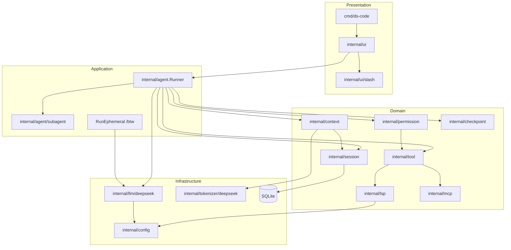
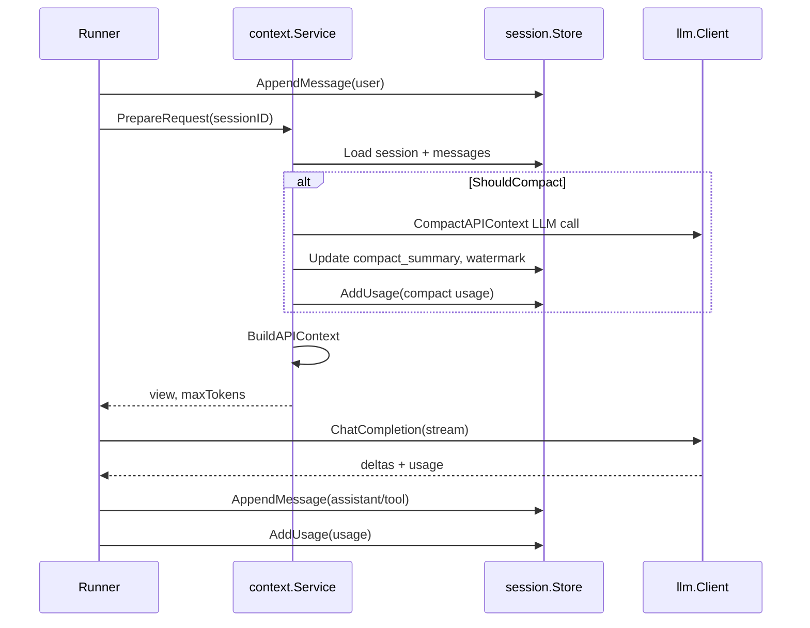
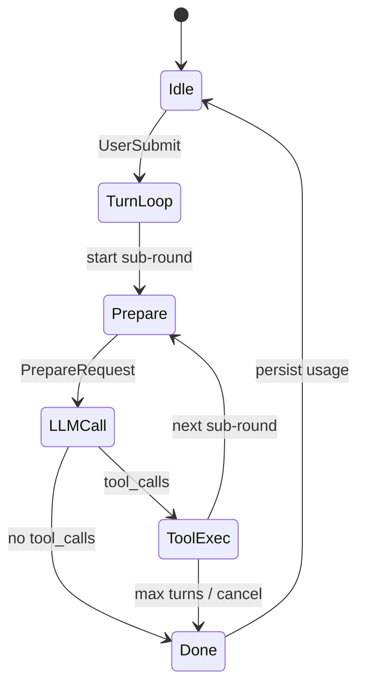

# ds-code 详细设计文档

> 文档版本：v1.2  
> 更新日期：2026-05-16  
> 状态：实现基线  
> 上游文档：[PLAN.md](PLAN.md) v0.13+（路线图与验收）、[llm-deepseek.md](llm-deepseek.md)（模型/API 契约）、[CONFIG.md](CONFIG.md)（配置 / CLI / 环境变量）

---

## 1. 文档目的与读者

本文在 [PLAN.md](PLAN.md) 之上展开**可实现的模块边界、数据结构、核心流程与接口**，供 Phase 0–7 编码与 Code Review 使用。模型字段、usage 累计、思考模式等**以 [llm-deepseek.md](llm-deepseek.md) 为权威**；本文引用但不重复全部 API 表格。

| 读者 | 关注章节 |
|------|----------|
| 核心开发 | §3–§8、§10 |
| TUI/交互 | §9 |
| 安全/审计 | §11 |
| 运维/发布 | [CONFIG.md](CONFIG.md)、§13 |

---

## 2. 产品目标与约束

### 2.1 目标

构建 Go 原生 CLI **ds-code**：终端 AI 编程代理，首期单 Provider **DeepSeek V4**，对标 Claude Code / Codex 的 Agent 范式。

### 2.2 硬约束

| 约束 | 说明 |
|------|------|
| 上下文窗口 | **1,048,576** tokens（1Mi，2²⁰） |
| 单次最大输出 | **393,216** tokens（384Ki） |
| 历史不可删 | `messages` 表只增；compact/clear **不删除**历史行 |
| compact 触发 | **A** CountBreakdown / **B** 累计 prompt / **C** API 过长；计费 `prompt+completion` 仅展示 |
| `/context` 六分项 | 用户执行 `/context` 时**按需** `CountBreakdown`；与 compact **解耦** |
| 单二进制 | `go build` 产出 `ds-code`；MCP/LSP 子进程外置 |

### 2.3 非目标（首期）

IDE 插件、云端 session 同步、Hooks 插件、git worktree 隔离、多 Provider。见 PLAN §非目标。

### 2.4 仓库现状

| 已有 | 待建 |
|------|------|
| `go.mod`、`internal/tokenizer/deepseek`、`cmd/count-tokens`、embed 词表 | `cmd/ds-code`、`internal/agent`、`session`、`ui` 等主体 |

---

## 3. 系统架构

### 3.1 分层图



### 3.2 依赖规则

1. **`internal/agent`** 可依赖 context、session、tool、permission、llm；**不**依赖 ui。
2. **`internal/ui`** 依赖 agent、session、context（只读 Build/CountBreakdown）。
3. **`internal/llm`** 不依赖 agent/ui；通过接口 `llm.Client` 注入。
4. **`internal/tool`** 可依赖 **`internal/lsp`**（仅 `diagnostics`）；**`internal/lsp`** 不依赖 agent/ui。
4. **循环依赖禁止**：context ↔ session 通过接口 `session.Reader` / `session.Writer` 解耦。

### 3.3 核心类型（包级）

```go
// internal/agent/runner.go
type Runner struct {
    LLM         llm.Client
    Tools       *tool.Registry
    Perm        *permission.Engine
    Sessions    session.Store
    Checkpoints checkpoint.Store
    Context     context.Service   // BuildAPIContext, PrepareRequest, Compact
    Mode        RunMode           // Agent | Plan
    MaxTurns    int
    Config      *config.Config
}

type RunMode int
const (
    RunModeAgent RunMode = iota
    RunModePlan
)
```

---

## 4. 领域模型

### 4.1 Session

```go
// internal/session/session.go
type Session struct {
    ID                        string
    Model                     string    // deepseek-v4-pro | flash
    ReasoningEffort           string    // high | max
    ThinkingType              string    // enabled | disabled
    CompactSummary            string
    CompactUpToMessageID      int64
    PromptTokensTotal         int64
    CompletionTokensTotal     int64
    PromptCacheHitTokensTotal int64
    CreatedAt                 time.Time
    UpdatedAt                 time.Time
}

func SessionBilledTokens(s Session) int {
    return int(s.PromptTokensTotal + s.CompletionTokensTotal)
}
```

`ShouldCompact(sess, view, cfg)` 见 [PLAN.md · compact 触发](PLAN.md#会话-token计费累计-vs-compact-触发)；`PrepareRequest` 内最多 compact 一次。

### 4.2 Message（历史层）

```go
type Message struct {
    ID                   int64
    SessionID            string
    Role                 string // user | assistant | tool | system(事件)
    Content              string
    ReasoningContent     string
    ToolCallsJSON        string
    ToolCallID           string
    PromptTokens         int64  // 可选，当次
    CompletionTokens     int64
    PromptCacheHitTokens int64
    CreatedAt            time.Time
}
```

- **只增**：`Store.AppendMessage`；无 `Update`/`Delete`（审计与 resume）。
- **system 事件**：如 checkpoint rewind，`role=system`，不进 API 的 mergeSystem。

### 4.3 APIContextView（API 层快照）

```go
// internal/context/view.go
type APIContextView struct {
    SystemPrompt string
    AgentsMD     string
    Rules        string
    Skills       string
    GitSnapshot  string
    ToolsJSON    string
    Messages     []llm.Message
}
```

与 [llm-deepseek.md · APIContextView](llm-deepseek.md#输入apicontextview) 一致。

### 4.4 ContextBreakdown（展示层）

```go
type ContextBreakdown struct {
    SystemPrompt int
    Tools        int
    Rules        int // 展示行，不参与 Total
    Skills       int
    Subagents    int
    Conversation int
    Window       int // 1_048_576
}

func (b ContextBreakdown) Total() int {
    return b.SystemPrompt + b.Tools + b.Subagents + b.Conversation
}
```

---

## 5. 持久化设计

### 5.1 存储选型

- **SQLite**（`modernc.org/sqlite`），路径固定见 §5.1.1（**按项目**分库，**不可配置**）。
- 单写连接 + WAL；`session_id` 索引；DB 文件权限 **0600**。
- **项目隔离**：不同 `project_root` → 不同 `project_id` → 不同 `sessions.db`；同一项目下多 session 共用一库。

#### 5.1.1 用户数据目录与项目运行时目录

本机**全局**目录（配置、用户 Skills）与**按项目**运行时数据分离；用户数据根 **固定** `~/.ds-code/`（不可配置），详见 **[CONFIG.md §2](CONFIG.md#2-用户数据目录ds-code固定路径)**。

```text
~/.ds-code/
├── config/config.yaml          # 用户级配置（全项目共享）
├── skills/                     # 用户级 Skills
└── projects/
    └── <project_id>/           # hex(SHA256(project_root_abs))
        ├── project.meta.json
        ├── sessions.db         # 默认 DB
        ├── audit.jsonl
        └── checkpoints/        # Phase 7
```

| 概念 | 说明 |
|------|------|
| `project_root` | git 根（自 cwd 向上）；无 git 时用 cwd 绝对路径 |
| `project_id` | `hex(sha256(project_root))`，作 `projects/` 子目录名 |
| `sessions.db` | 位于 `projects/<project_id>/`，**不**放在仓库工作区内 |

启动时：解析 `project_root` → 计算 `project_id` → `MkdirAll` 项目目录 → 打开 SQLite。

### 5.2 表结构

#### `sessions`

| 列 | 类型 | 说明 |
|----|------|------|
| `id` | TEXT PK | UUID |
| `model` | TEXT | 默认 `deepseek-v4-pro` |
| `reasoning_effort` | TEXT | 默认 `max` |
| `thinking_type` | TEXT | `enabled` / `disabled` |
| `compact_summary` | TEXT | API 层摘要 |
| `compact_up_to_message_id` | INTEGER | 水位线 |
| `prompt_tokens_total` | INTEGER | 累计 |
| `completion_tokens_total` | INTEGER | 累计 |
| `prompt_cache_hit_tokens_total` | INTEGER | 累计 |
| `permission_mode` | TEXT | readonly/ask/auto |
| `run_mode` | TEXT | agent/plan |
| `created_at` | DATETIME | |
| `updated_at` | DATETIME | |

#### `messages`

| 列 | 类型 | 说明 |
|----|------|------|
| `id` | INTEGER PK AUTOINCREMENT | |
| `session_id` | TEXT FK | |
| `role` | TEXT | |
| `content` | TEXT | |
| `reasoning_content` | TEXT | |
| `tool_calls_json` | TEXT | |
| `tool_call_id` | TEXT | |
| `prompt_tokens` | INTEGER | 可选 |
| `completion_tokens` | INTEGER | 可选 |
| `prompt_cache_hit_tokens` | INTEGER | 可选 |
| `created_at` | DATETIME | |

索引：`(session_id, id)`、`(session_id, created_at)`。

### 5.3 双层消息模型

| 层 | 实现 | 生命周期 |
|----|------|----------|
| **历史记录层** | `messages` 全量 | 永久保留（clear 仅换 session_id） |
| **API 上下文层** | `BuildAPIContext` 内存构建 | compact 替换为「摘要 + 近 N 轮」 |



---

## 6. 上下文服务（internal/context）

### 6.1 接口

```go
type Service interface {
    PrepareRequest(ctx context.Context, sessionID string) (view *APIContextView, maxTokens int, err error)
    BuildAPIContext(ctx context.Context, sessionID string) (*APIContextView, error)
    CompactAPIContext(ctx context.Context, sessionID string) error
    CountBreakdown(ctx context.Context, view *APIContextView) (ContextBreakdown, error)
}
```

### 6.2 PrepareRequest

```
1. sess := store.Get(sessionID)
2. if !prepareCompactDone && ShouldCompact(sess, cachedView, cfg):  // A 或 B
       CompactAPIContext(sessionID); prepareCompactDone = true
3. view := BuildAPIContext(sessionID)
4. maxTokens := min(cfg.LLM.MaxTokens, MaxOutputTokens)
5. return view, maxTokens
```

- **条件 A**：用户轮首个子轮次 `CountBreakdown(BuildAPIContext)`，缓存至用户轮结束。
- **条件 B**：`prompt_tokens_total >= ratio × window`（不含 completion）。
- **条件 C**：API 上下文过长 → compact → 重试（不计入 `prepareCompactDone` 的「已 compact」可另议，建议仍占一次配额）。
- Phase 1–2：`ShouldCompact` 恒 false。

### 6.3 BuildAPIContext

**输入**：`session` + `messages`（`id > compact_up_to_message_id` 或全量近端策略）+ 项目上下文加载器。

**输出**：`APIContextView`。

**拼装顺序**（固定，防 Prompt 注入）：

1. `mergeSystem(SystemPrompt, RuntimeEnv, AgentsMD, Rules, Skills, GitSnapshot)` → 单条 `role=system`（`RuntimeEnv` 含 project_root、cwd、OS/架构/Shell、本地日期时间）
2. `tools` ← `tool.Registry.SchemasForMode(runMode)` → JSON
3. `Messages`：
   - 若有 `compact_summary`：首条 assistant（元数据 `compact=true`）
   - 近端 `keep_recent_turns` **用户轮**全文（含 `reasoning_content`、`tool_calls`）
   - `@` 引用已并入对应 user 内容

**禁止**：`Messages` 内第二条 `system`。

### 6.4 CompactAPIContext

1. 选取待摘要消息：API 层中「除 mergeSystem 等价部分 + 最近 N 轮」之外的轮次。
2. 构造 compact 专用 prompt（**脱敏**可选，S12）。
3. `llm.ChatCompletion`（非流式或流式均可；usage 必须解析）。
4. `UPDATE sessions SET compact_summary=?, compact_up_to_message_id=?`。
5. **不** UPDATE/DELETE `messages` 行。

**失败降级**：按 `created_at` 丢弃最老 API 轮次（仅影响 Build 选取范围），TUI 警告。

### 6.5 CountBreakdown（仅 /context）

- 调用时机：**仅** `slash` 处理 `context` 命令时。
- 计数器：`tokenizer.Counter` 接口；默认实现 `deepseek.Default()`。
- 无 CGO：降级 `CharCounter`（`len/4` 或 UTF-8 启发），UI 标注「估算」。

### 6.6 项目上下文加载

| 加载器 | 路径 | 缓存 |
|--------|------|------|
| `AgentsMDLoader` | 自 cwd 向上至 git 根 `AGENTS.md` | per-session 失效：cwd 变更 |
| `RulesLoader` | `.ds-code/rules/**` | glob 匹配结果缓存 |
| `SkillsLoader` | `.ds-code/skills/**/SKILL.md` + `~/.ds-code/skills/**/SKILL.md` | 按 name 懒加载 |
| `GitSnapshot` | 当前分支、默认分支、Git user、`git status`（≤2k）、最近 5 条提交 | 会话启动或 `/git` 刷新；整段 ≤ `git_snapshot_max_chars` |

---

## 7. Agent 运行时（internal/agent）

### 7.1 主循环



**伪代码**：

```go
func (r *Runner) RunTurn(ctx context.Context, sessionID, userText string) error {
    userText = r.expandAtReferences(userText)
    r.Sessions.AppendMessage(sessionID, userMsg(userText))

    for turn := 0; turn < r.MaxTurns; turn++ {
        if ctx.Err() != nil { return ctx.Err() }

        view, maxTokens, err := r.Context.PrepareRequest(ctx, sessionID)
        if err != nil { return err }

        resp, err := r.LLM.Chat(ctx, llm.Request{View: view, MaxTokens: maxTokens, Stream: true})
        if isContextTooLong(err) {
            _ = r.Context.CompactAPIContext(ctx, sessionID)
            view, maxTokens, _ = r.Context.PrepareRequest(ctx, sessionID)
            resp, err = r.LLM.Chat(ctx, ...)
        }
        if err != nil { return err }

        r.Sessions.AddUsage(sessionID, resp.Usage)
        r.Sessions.AppendMessage(sessionID, assistantMsg(resp))

        if len(resp.ToolCalls) == 0 { break }

        for _, tc := range resp.ToolCalls { // 或 parallel 见 cfg.Tools.ParallelToolCalls
            if err := r.Perm.Check(tc.Name, tc.Args); err != nil {
                result = formatToolError(tc, err)
            } else {
                result, err = r.Tools.Execute(ctx, tc)
                if err != nil { result = formatToolError(tc, err) }
            }
            result = context.TruncateToolResult(result, r.Config)
            r.Sessions.AppendMessage(sessionID, toolMsg(tc.ID, result))
        }
    }
    return nil
}
```

### 7.2 reasoning_content 回传规则

| 场景 | 回注 API |
|------|----------|
| 该 Turn 曾出现 `tool_calls` | assistant 必须含 `content` + `reasoning_content` + `tool_calls` |
| 纯对话无 tools | 可省略历史 `reasoning_content`（API 忽略） |

持久化层**始终存储** `reasoning_content`；`BuildAPIContext` 按规则裁剪上屏。

### 7.3 RunEphemeral（/btw）

```go
func (r *Runner) RunEphemeral(ctx context.Context, prompt string, opts EphemeralOpts) (*EphemeralResult, error)
```

| 项 | 值 |
|----|-----|
| messages | 独立切片，不写 DB |
| tools | 默认 nil |
| user_id | `datadir.Identifier()`（→ API `user_id`；安装级，见 [llm-deepseek.md](llm-deepseek.md)） |
| usage | 默认不计入 session（`btw.count_toward_session`） |
| compact | **不**触发 |

### 7.4 Plan 模式

- `RunModePlan`：`tool.Registry` 仅注册 read/grep/glob/list_dir/diagnostics；可选 `web_fetch`（只读策略）。
- Runner **拒绝** write/shell/apply_patch/MCP 写。
- 输出仅 stdout/TUI，**不**自动 `write_file`。

### 7.5 子代理（Phase 6）

```go
// internal/agent/subagent/runner.go
type SubRunner struct {
    LLM   llm.Client
    Tools *tool.Registry // 只读子集
    Perm  *permission.Engine
}
```

- 主 Runner `task` 工具：并发池默认 3；返回摘要字符串。
- 回注：`role=tool`, `name=task`, `tool_call_id` 关联。

---

## 8. LLM 客户端（internal/llm）

### 8.1 抽象接口

```go
package llm

type Client interface {
    Chat(ctx context.Context, req Request) (*Response, error)
}

type Request struct {
    Model            string
    Messages         []Message
    Tools            []ToolDef
    MaxTokens        int
    Stream           bool
    ThinkingType     string
    ReasoningEffort  string
    UserID           string
    StrictTools      bool
}

type Response struct {
    Content           string
    ReasoningContent  string
    ToolCalls         []ToolCall
    FinishReason      string
    Usage             Usage
}

type Usage struct {
    PromptTokens          int
    CompletionTokens      int
    PromptCacheHitTokens  int
}
```

### 8.2 DeepSeek 实现要点

见 [llm-deepseek.md](llm-deepseek.md)：

- `stream_options.include_usage: true`
- `strict_tools` → `base_url` beta
- 流式末 chunk 解析 `usage`
- 429/5xx 指数退避

### 8.3 序列化共享

`internal/llm/deepseek/serialize.go`：

- `MergeSystem(...)` 
- `SerializeMessages([]Message)`
- `BuildToolsJSON([]ToolDef)`

`CountBreakdown` **必须**调用同一套序列化，保证与上屏一致。

---

## 9. 工具系统（internal/tool）

### 9.1 Registry

```go
type Registry struct {
    tools map[string]Tool
}

type Tool interface {
    Name() string
    Schema() ToolDef          // JSON Schema for API
    Execute(ctx context.Context, args json.RawMessage) (string, error)
    PermissionLevel() permission.Level
}
```

MCP 工具以 **裸名**（MCP server 原始 `tool.name`）注册，与 AGENTS.md / Cursor 一致。

### 9.2 内置工具清单

| 工具 | Phase | Permission | 截断 |
|------|-------|------------|------|
| `read_file` | 1 | Low | 2000 行 + max_chars |
| `grep` | 1 | Low | head_limit 200 |
| `shell` | 1 | Highest | max_chars |
| `glob` / `list_dir` | 1.5 | Low | 条数上限 |
| `apply_patch` | 2 | High | 变更行数上限 |
| `write_file` | 2 | High | — |
| `task` | 6 | Low | 摘要 4K 量级 |
| `web_fetch` / `web_search` | 6 | Medium | allowlist |
| `diagnostics` | 6 | Low | LSP 摘要 |

**不实现** `edit_file`；编辑统一 `apply_patch`（Codex 语义）。

### 9.3 apply_patch（Phase 2）

- 输入：unified diff 文本。
- 事务：解析 → 校验路径 → 备份/写入；失败**原子回滚**。
- 与 `permission.Engine` 校验路径与敏感文件。

### 9.4 工具结果包装（Prompt 安全）

```
<tool_result name="grep" id="call_abc123">
...body...
</tool_result>
```

### 9.5 LSP 子系统（internal/lsp，Phase 6）

**目标**：通过内置 `diagnostics` 工具，把各语言的 **Language Server** 诊断（错误/警告）以摘要形式提供给 Agent；**不**内嵌编译器/分析器，**不**实现补全、跳转、重构等 LSP 能力。

#### 9.5.1 架构

```text
tool/diagnostics.Execute
    → lsp.Manager（按 project_root + serverID 缓存 Client）
    → lsp.Client（单 Language Server 子进程，stdio JSON-RPC）
    → 用户 PATH 中的 gopls | clangd | typescript-language-server | jdtls …
```

| 原则 | 说明 |
|------|------|
| 工作区 | `InitializeParams.rootUri` = `file://` + `project_root`（与 CONFIG 一致） |
| 只读 | 仅 `textDocument/didOpen` + 接收 `textDocument/publishDiagnostics`；不向工作区写入 |
| 懒启动 | 按**语言 server** 首次需要时再 `exec`；空闲 `idle_shutdown` 后 `shutdown`/`exit` |
| 路径 | 打开的文件须在 workspace 内；与 `permission.resolvePath` 一致（S2/S3） |
| 取消 | `ctx.Done()` → `shutdown` + 杀子进程（S9） |

**不在 `go.mod` 绑定语言 SDK**；传输层为 LSP 标准 stdio（`Content-Length` + JSON-RPC），Go 侧实现最小协议子集或使用轻量 JSON-RPC 库。

#### 9.5.2 目录与类型

```text
internal/lsp/
  transport/       # stdio 读写、请求/通知分发
  protocol/        # Initialize、DidOpen、PublishDiagnostics 等最小类型
  registry.go      # 扩展名 → ServerConfig；合并内置默认与用户 YAML
  client.go        # 单 server：启动、initialize、didOpen、收集诊断
  manager.go       # map[serverID]*Client；idle 计时与关闭
internal/tool/diagnostics.go
```

```go
// registry.go
type ServerConfig struct {
    ID          string   // go | typescript | cpp | java | …
    Command     string   // PATH 可执行文件
    Args        []string
    Extensions  []string // .go, .ts, …
    Env         []string // 可选，追加 os.Environ()
    WorkspaceFS bool     // 默认 true：rootUri = project_root
}

type Manager struct {
    root    string
    cfg     config.LSP
    clients map[string]*Client
    mu      sync.Mutex
}
```

#### 9.5.3 内置语言服务器注册表（默认）

用户可通过 [CONFIG.md §5.12](CONFIG.md#512-lsp--language-serverphase-6) 覆盖 `command`/`args` 或禁用某 ID。

| ID | 语言 | 默认命令 | 扩展名 | 备注 |
|----|------|----------|--------|------|
| `go` | Go | `gopls serve` | `.go` | Phase **6a** 首个落地 |
| `typescript` | JS/TS | `typescript-language-server --stdio` | `.ts`, `.tsx`, `.js`, `.jsx` | 需项目内 `package.json` / `tsconfig` 时诊断更准 |
| `cpp` | C/C++ | `clangd` | `.c`, `.h`, `.cpp`, `.hpp`, `.cc`, `.cxx` | Phase **6b**；依赖 `compile_commands.json` 时语义诊断才完整 |
| `java` | Java | **无默认 command** | `.java` | Phase **6c**；仅配置模板，**不**打包 jdtls；用户自填 `java -jar …/launcher.jar` |
| `rust` | Rust | `rust-analyzer` | `.rs` | 可选；默认注册表可含，Phase 6 不强制测 |
| `python` | Python | `pyright-langserver --stdio` | `.py` | 可选；同上 |

找不到 server 或 `exec.LookPath` 失败：工具返回 `error: lsp server "java" not found…`，不崩溃。

#### 9.5.4 `diagnostics` 工具契约

**Schema（strict 时 `additionalProperties: false`）**：

```json
{
  "paths": ["src/foo.go", "pkg/bar/"],
  "severity": ["error", "warning"]
}
```

| 参数 | 类型 | 默认 | 说明 |
|------|------|------|------|
| `paths` | `[]string` | 必填 | 相对 `project_root` 的文件或目录 |
| `severity` | `[]string` | `["error","warning"]` | 过滤 `publishDiagnostics` 严重级别 |

**执行流程**：

1. 解析 `paths` → workspace 内绝对路径；目录则有限 glob（扩展名过滤 + `lsp.max_files_per_call` + 尊重 `.gitignore`）。
2. 按扩展名分组到 `ServerConfig`；未映射扩展名跳过并附注。
3. 对每个 server：`Manager.EnsureClient` → 对每个文件读盘 → `textDocument/didOpen`（版本 1，uri + 全文）。
4. 等待 `textDocument/publishDiagnostics` 通知，直至 `diagnostics_timeout` 或 `ctx` 取消。
5. 格式化为文本（见下），应用 `max_issues_per_file` / `tool_result_max_chars` 截断。
6. 可选 `textDocument/didClose`；空闲超过 `idle_shutdown` 关闭子进程。

**输出格式**（示例）：

```text
src/foo.go:12:3 [error] undefined: Bar
src/foo.go:45:1 [warning] unused parameter x
--- truncated: 3 more issue(s) in src/foo.go
--- hint: C++ project missing compile_commands.json; clangd may show syntax-only diagnostics
```

**首期不实现**：`textDocument/completion`、`definition`、`references`、`codeAction`、`workspace/executeCommand`；pull diagnostics（LSP 3.17）后续可选。

#### 9.5.5 协议最小子集

| 方向 | 方法 / 通知 | 用途 |
|------|-------------|------|
| → server | `initialize` / `initialized` | 绑定 rootUri、clientInfo |
| → server | `textDocument/didOpen` | 提交文件内容与 URI |
| ← server | `textDocument/publishDiagnostics` | 收集诊断（主路径） |
| → server | `textDocument/didClose` | 释放文档（可选） |
| → server | `shutdown` / `exit` | 正常退出 |

`Initialize` 能力声明保持保守（不要求 dynamic registration）；各 server 差异通过集成测覆盖。

#### 9.5.6 与 Runner / Plan 模式

- **按需调用**：Runner **不**每用户轮自动跑全仓库诊断；由模型调用 `diagnostics` 或 patch 失败后自行决定。
- **预热**（可选）：`lsp.warmup_on_start: ["go"]` 仅 `initialize`，不 `didOpen` 全库。
- **Plan 模式**：`diagnostics` 在只读工具子集中允许。

#### 9.5.7 各语言环境前置（写入工具 hint）

| 语言 | 前置条件 | 诊断偏弱时提示 |
|------|----------|----------------|
| Go | `go.mod` 在 `project_root` 子树 | 检查 `gopls` 是否在 PATH |
| JS/TS | 建议有 `tsconfig.json` | 提示安装/配置 tsserver |
| C/C++ | `compile_commands.json` 或 `compile_flags.txt` | 提示生成 compile db |
| Java | JDK + jdtls 启动脚本 | 提示配置 `lsp.servers.java` |

#### 9.5.8 测试

| 层级 | 内容 |
|------|------|
| 单元 | mock `transport` 注入 `publishDiagnostics`；格式化、截断、severity 过滤 |
| 集成 | 有 `gopls` 时对样例 Go 模块跑 `diagnostics`（CI nightly） |
| 手工 | clangd + CMake 项目、jdtls + Maven 项目（文档 checklist） |

#### 9.5.9 Phase 6 交付切分

| 子阶段 | 内容 |
|--------|------|
| **6a** | `internal/lsp` 框架 + `diagnostics` 工具 + **go** + **typescript** |
| **6b** | 默认注册 **cpp**（clangd）+ CONFIG 文档 |
| **6c** | **java** 仅配置驱动 + 用户文档（不捆绑 jdtls） |

---

## 10. 权限引擎（internal/permission）

### 10.1 模式

| 模式 | 行为 |
|------|------|
| `readonly` | 拒绝一切写/shell |
| `ask`（默认） | 写/shell/网络 弹 TUI 确认 |
| `auto` | `--dangerously-auto`；CI 可配置；**无确认**执行写/shell，但 **S3 denylist 始终生效**（含 shell 读敏感路径） |

### 10.2 Check 流程

```go
func (e *Engine) Check(tool string, args map[string]any) error {
    if e.mode == readonly && isWriteTool(tool) { return ErrDenied }
    if e.checkPath / CheckReadablePath(args) { return ErrDenied }  // S3, all modes
    if tool == shell && e.checkSensitiveShell(cmd) { return ErrDenied }  // S3+S4
    if e.mode == ask && isWriteTool(tool) { return e.prompt(...) }
    ...
}
```

- **S3 denylist** 与 `permission_mode` 无关：`readonly` / `ask` / `auto` 均禁止读/写/ shell 访问敏感路径；`auto` 仅省略写操作确认，**不**放宽密钥路径。
- **MCP 写操作**与内置工具**同一** `Check` 入口（S6）。
- **Workspace** = 当前工具工作目录（主会话为 `project_root`；worktree 子代理为 detached checkout）；路径经 `filepath.Clean` + join、`EvalSymlinks`、`ensureUnder`（S2），**不再**对相对路径做 `..` 子串预拦截（v0.1.2）。
- 非 TTY + `ask`：返回 `ErrPermissionNeedTTY`，不阻塞。

### 10.3 Engine 路径 API 一览（v0.1.2）

`permission.Engine` 为路径策略**唯一对外入口**（读、写、枚举跳过）。`internal/tool/*` 不直接 import `workspace` 做权限校验。

#### 10.3.1 组装字段

| 字段 | 来源 | 用途 |
|------|------|------|
| `Workspace string` | 当前 checkout（主会话 `project_root`；worktree 子代理为 worktree 路径） | S2 边界解析根 |
| `ProjectRoot string` | `cfg.ProjectRoot`（**非** `perm.Workspace`） | spill `project_id`、`resolveMCPSpillRead` |
| `SpillSessionID string` | `RunTurn` 入口设置 `sessionID` | spill **仅当前 session** 可读 |

`spawn/execute.go` 凡**新建** `*permission.Engine` 的分支均须 `perm.ProjectRoot = cfg.ProjectRoot`；复用父 `perm` 时已在主 Runner 设置。

#### 10.3.2 路径 API

| API | 语义 | 调用方 |
|-----|------|--------|
| `ResolvePath(rel)` | 仅 S2（`@file`/`@dir/` 展开） | `context/atref.go` |
| `ResolveAccessPath(rel, intent)` | S2 + S3（`PathRead`/`PathWrite`） | 内部；shell 路径 token |
| `CheckReadablePath(rel)` | S2 + S3；**另**放行本 session `mcp-result/<id>/*.txt` 绝对路径 | `read_file`、`grep` 等读工具 |
| `CheckWritablePath(rel)` | `ResolveAccessPath(rel, PathWrite)` | `apply_patch`、`write_file` |
| `CheckAbsPath(abs, intent)` | 绝对路径 S2（+ S3 当 `PathRead`/`PathWrite`） | `filecandidate.ValidateGlobMatches`（`PathBoundary` 仅 S2） |
| `SkipSensitiveAbs(abs)` | S3 敏感目录/文件 skip（非 error） | `grep`/`glob`/`list_dir` Walk、`MakeFileCandidate` |

#### 10.3.3 glob / filecandidate 语义

- `ValidateGlobMatches`：`CheckAbsPath(abs, PathBoundary)` — 越界 **error**，敏感路径不在这里报错。
- `MakeFileCandidate` / WalkDir：`SkipSensitiveAbs` — 敏感条目 **skip**，不中断整次枚举。

#### 10.3.4 MCP spill 只读例外

`read_file` 经 `CheckReadablePath` → `resolveMCPSpillRead` 允许读本 project **当前 session** 下 `~/.ds-code/projects/<id>/mcp-result/<session_id>/*.txt`（须绝对路径）。`shell` 访问 spill 绝对路径仍拒绝；`agents/*.output` 子代理摘要 **不**扩展放行。

---

## 11. 用户界面（internal/ui）

### 11.1 模式

| 模式 | 入口 |
|------|------|
| 交互 TUI | `ds-code`（Bubble Tea） |
| 非交互 | `ds-code -p "..."` / `--json` |
| Plan | `--plan` / `/plan` |

### 11.2 TUI 布局

```
┌─────────────────────────────────────┐
│ 对话区（流式 content + 折叠 reasoning）│
├─────────────────────────────────────┤
│ 工具日志（可选折叠）                    │
├─────────────────────────────────────┤
│ 输入框  [/ 补全]                       │
├─────────────────────────────────────┤
│ 状态栏  model·effort │ in·out·cache  │
└─────────────────────────────────────┘
```

### 11.3 Slash 命令

- **解析**：`internal/ui/slash.Parse` — 仅行首 `/`；正则见 PLAN。
- **注册表**：`registry.go` 单一数据源（help、补全、执行分发）。
- **未知命令**：TUI 提示；**不**写 messages、**不调** Agent。

### 11.4 /context 面板

**数据组装**：

```go
snap := session.UsageSnapshot(sess)
view, _ := context.BuildAPIContext(ctx, sessionID)
bd, _ := context.CountBreakdown(ctx, view)
panel.Render(snap, bd)
```

两层 UI：会话累计 + 六分项预估（见 PLAN §/context）。

### 11.5 取消

- `context.Context` 贯穿：LLM HTTP、tool Execute、shell 子进程、子代理。
- TUI 运行中 **Esc** → cancel → 停止流式读取 + `Process.Kill`，对话区显示中断标记。
- Ctrl+C / Ctrl+D 行为一致：turn 运行中不取消（提示用 Esc）；空闲时双击退出。
- 取消记录以 `system` 消息持久化，`/resume` 可恢复中断标记。

---

## 12. 配置（internal/config）

配置加载、合并优先级、YAML 全表、CLI flags、环境变量见 **[CONFIG.md](CONFIG.md)**。

实现要点：

- `internal/config.Load()`：`SetDefault` → 用户级 `~/.ds-code/config/config.yaml` → 项目级 `.ds-code/config.yaml` → `cobra` flags。
- 示例键全集：[`configs/example.yaml`](../../configs/example.yaml)（非运行时加载）。
- API Key 仅环境变量：`DS_CODE_DEEPSEEK_API_KEY` → `DEEPSEEK_API_KEY`；见 [CONFIG.md §3.1](CONFIG.md#31-deepseek-api-keyllmapi_key)。

---

## 13. MCP（internal/mcp，Phase 5）

```go
type Manager struct {
    servers []ServerConfig
}

func (m *Manager) ListTools(ctx context.Context) ([]tool.Tool, error)
func (m *Manager) Call(ctx context.Context, name string, args json.RawMessage) (string, error)
```

- 崩溃隔离：单 server panic 不影响主进程。
- 工具以 MCP server 提供的**裸名**（原始 `tool.name`）注册进 `tool.Registry`；与内建工具或同名校验冲突时跳过并提示（见 [v0.1.1 DESIGN](../v0.1.1/DESIGN.md)）。

---

## 14. Checkpoint（internal/checkpoint，Phase 7）

- 写操作前：记录 affected files 的 hash 或 patch 集。
- 存储目录固定：`~/.ds-code/projects/<project_id>/checkpoints/`（不可配置，见 [CONFIG.md §2.1](CONFIG.md#项目目录内文件固定路径均不可配置)）。
- `/rewind n`：回滚工作区；`messages` **追加** system 事件行。
- 首期可仅记录 patch 路径，不全量快照仓库。

---

## 15. 安全设计

### 15.1 审计清单映射

| ID | 设计落点 |
|----|----------|
| S1 | config + env；日志 redact |
| S2 | `permission.resolvePath` |
| S3 | `sensitivePatterns` denylist |
| S4 | shell 高危 + cancel kill |
| S5 | tool_result 边界；system 固定序 |
| S6 | MCP → `Perm.Check` |
| S7 | 按 `project_id` 分库；`session_id` 库内隔离；DB 权限 0600 |
| S8 | CI govulncheck |
| S9 | context 贯穿 |
| S10 | `audit.enabled` / `--audit-log` → 固定 `…/audit.jsonl` |
| S11 | TruncateToolResult / @ max_chars |
| S12 | compact prompt 脱敏 |
| S13 | btw 无 tools、不写 DB |
| S14 | subagent 只读 + S3 denylist |

### 15.2 威胁简要

| 威胁 | 缓解 |
|------|------|
| Prompt 注入 via tool | 边界标签 + system 不可覆盖 |
| 路径遍历 | Clean + jail 到 workspace |
| SSRF（web） | allowlist、默认关 |
| API Key 泄露 | 禁入 repo、日志脱敏 |

---

## 16. 可观测性与错误

| 类型 | 策略 |
|------|------|
| 日志 | slog；debug 可 dump request id，不 dump key |
| 指标 | Phase 7+ 可选：turn 数、tool 失败率 |
| 用户错误 | API 4xx/5xx → 友好文案 + 是否可重试 |
| compact 失败 | 降级截断 + 横幅警告 |

---

## 17. 测试策略

| 层级 | 范围 |
|------|------|
| 单元 | `slash.Parse`、`mergeSystem`、`CountBreakdown` 不变式、`ShouldCompact` |
| 集成 | mock `llm.Client` 驱动 Runner 多轮 tool |
| 契约 | serialize 与 tokenizer Count 一致性（有 CGO 时） |
| LSP | mock transport 的 `publishDiagnostics`；nightly 有 `gopls` 时集成 |
| E2E | `ds-code -p` 对样例仓库（需 API Key，CI 可选 nightly） |

---

## 18. 分阶段交付映射

| Phase | 设计章节 | 交付物 |
|-------|----------|--------|
| 0 | §12、目录 | cobra、config、CI |
| 1 | §6–§8、§9.2 部分 | Runner、内存 session、PrepareRequest（compact no-op）、read/grep/shell |
| 1.5 | §6.6、§11.3 | @、slash 骨架、git |
| 2 | §9.3、§10 | apply_patch、permission、strict |
| 3 | §5、§6.4 | SQLite、compact、resume、clear |
| 4 | §11 | TUI、/context、状态栏 |
| 5 | §13 | MCP |
| 6 | §6.6、§7.5、§9.2、§9.5 | 子代理、Rules、Skills、Plan、LSP（6a/6b/6c）、Web |
| 7 | §14、§15 | checkpoint、审计加固 |

---

## 19. 已决议（原开放问题）

| # | 决议 |
|---|------|
| O1 | `/mode`、`/effort` → **per-session** |
| O2 | 单次 `PrepareRequest` **最多 compact 一次**；触发见 PLAN A/B/C |
| O3 | CI 无 CGO：compact 条件 A 与 `/context` 用 `CharCounter` |
| O4 | 费用估算：Phase 4 静态单价表 + `usage` |
| O5 | `tool_calls` 默认**顺序**执行；`tools.parallel_tool_calls` 可开并行 |
| O6 | Phase 1–2 **内存 session**，compact no-op |
| O7 | LSP：**stdio 子进程** + 扩展名注册表；首期仅诊断；6a→6b→6c |

---

## 20. 文档索引

| 文档 | 内容 |
|------|------|
| [PLAN.md](PLAN.md) | 路线图、对标、Slash 表、验收 |
| [CONFIG.md](CONFIG.md) | YAML 键、CLI、环境变量、优先级 |
| [llm-deepseek.md](llm-deepseek.md) | API 字段、思考模式、usage、strict |
| **DESIGN.md**（本文） | 模块、Schema、流程、接口 |

---

## 变更记录

| 日期 | 版本 | 摘要 |
|------|------|------|
| 2026-05-16 | v1.0 | 基于 PLAN v0.11 首版详细设计 |
| 2026-05-16 | v1.1 | 对齐 PLAN v0.12：compact A/B/C、turn 定义、workspace、并行 tool、Phase 1–2 |
| 2026-05-16 | v1.2 | §9.5 LSP 多语言：`diagnostics`、注册表、gopls/tsserver/clangd/jdtls、Phase 6a–c |
