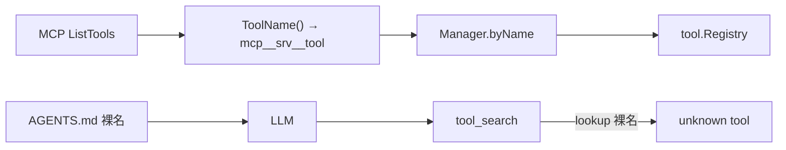
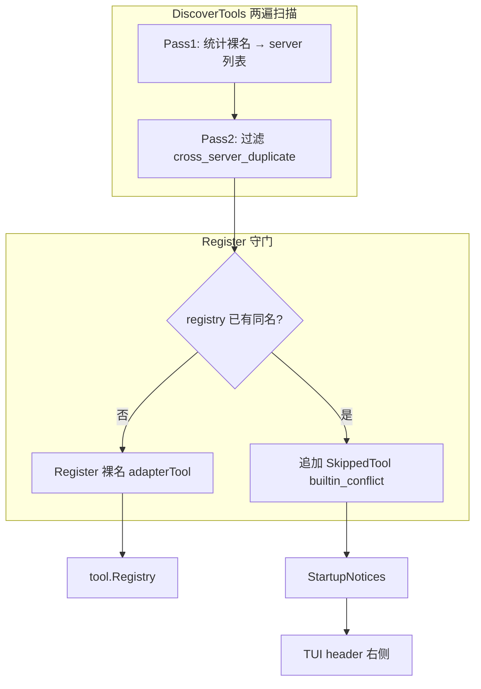

# v0.1.1 设计文档

> 版本：v0.1.1  
> 状态：已实现  
> 更新日期：2026-06-19  
> 需求：[REQUIREMENTS.md](REQUIREMENTS.md)

## 1. 设计目标

将 MCP 工具暴露名称从内部规范化前缀改为 **MCP 裸名**，并在冲突时 **跳过 + 通知**；将分散的启动期警告收敛到 TUI header 右侧 **StartupNotices** 区域。

## 2. 现状（v0.1.0）



问题：

1. `adapterTool.Name()` 返回 `mcp__{server}__{tool}`（[`internal/mcp/tool.go`](../../internal/mcp/tool.go)）
2. `DiscoverTools` 对重复规范化名 `return error`，启动失败（[`internal/mcp/manager.go`](../../internal/mcp/manager.go)）
3. `Registry.Register` 静默覆盖，无内建冲突保护（[`internal/tool/registry.go`](../../internal/tool/registry.go)）
4. `SensitiveLogWarn` 渲染在 footer 下方（[`internal/ui/tui/model/view/render.go`](../../internal/ui/tui/model/view/render.go)）

## 3. 目标架构（v0.1.1）



## 4. MCP 模块设计

### 4.1 数据结构

新增（建议 `internal/mcp/skip.go`）：

```go
type SkipReason string

const (
    SkipBuiltinConflict       SkipReason = "builtin_conflict"
    SkipCrossServerDuplicate  SkipReason = "cross_server_duplicate"
    SkipInServerDuplicate     SkipReason = "in_server_duplicate"
)

type SkippedTool struct {
    Server string
    Tool   string
    Reason SkipReason
}
```

`Manager` 新增字段：

```go
type Manager struct {
    // ... existing ...
    skipped []SkippedTool
}

func (m *Manager) SkippedTools() []SkippedTool
```

### 4.2 adapterTool 变更

文件：[`internal/mcp/tool.go`](../../internal/mcp/tool.go)

| 方法 | v0.1.0 | v0.1.1 |
|------|--------|--------|
| `Name()` | `normalized`（`mcp__srv__tool`） | `mcpTool`（裸名） |
| `CallTool` | 使用 `mcpTool` | 不变 |
| `Description()` | `[MCP srv] desc` | 不变 |

移除 `normalized` 字段或仅用于日志；`newAdapterTool` 不再调用 `ToolName()` 作为主键。

### 4.3 DiscoverTools 两遍算法

文件：[`internal/mcp/manager.go`](../../internal/mcp/manager.go)

**Pass 1 — 统计**（含单 server 内重复）

```
perServerCounts := map[server]map[name]int
for each server srv:
    for each tool t in srv.ListTools():
        counts[t.Name]++                    // 跨 server 全局计数
        perServerCounts[srv][t.Name]++      // 单 server 内计数
        sources[t.Name] append srv.Name
```

**Pass 2 — 构建 adapter 列表**

```
seenInServer := map[server]map[name]bool
for each server srv:
    for each tool t in srv.ListTools():
        name := t.Name
        if counts[name] > 1:
            append skipped(server=srv, tool=name, reason=cross_server_duplicate)
            continue
        if perServerCounts[srv][name] > 1:
            if seenInServer[srv][name]:
                append skipped(server=srv, tool=name, reason=in_server_duplicate)
                continue
            seenInServer[srv][name] = true
        ad := newAdapterTool(...)
        m.tools append ad
        m.byName[name] = ad   // 裸名为 key；跨 server 已通过 counts 过滤
```

**不再** 因 MCP 工具裸名重复而 `return error`（跨 server、单 server 内均改为跳过）。

**仍报错** 的情况：重复 MCP server 配置名、连接失败、`ListTools` 失败、command 缺失。

> **修复方向**：v0.1.0 对单 server 内 `ListTools` 重复名直接 `return error`（见 `TestManager_DiscoverTools_duplicateToolName`）。v0.1.1 改为第二条及以后记 `in_server_duplicate` 并跳过，**第一条**进入 `m.tools`（若后续无 builtin 冲突则注册）。若产品倾向 fail-fast，须在 REQUIREMENTS 中改回「仍报错」——当前需求采用跳过策略。

### 4.4 Register 二次守门

```go
func (m *Manager) Register(reg *tool.Registry) {
    for _, ad := range m.tools {
        if _, exists := reg.Get(ad.Name()); exists {
            m.recordSkip(ad.server.Name, ad.mcpTool, SkipBuiltinConflict)
            continue
        }
        reg.RegisterMCPTool(ad, ad.server.Name)
        m.registeredCount++
    }
}
```

内建工具在 `setup.BuildRegistry` 中先于 MCP 注册，故 `grep`、`read_file` 等已占用名称会触发 `builtin_conflict`。`builtin_conflict` **仅在此阶段**写入 `SkippedTools`。

### 4.5 内建保留名

文件：[`internal/tool/name.go`](../../internal/tool/name.go)

```go
func ReservedNames() map[string]struct{}
```

包含所有 `Name*` 常量（含尚未注册的 `web_search`）。**仅用于文档与测试辅助**。

> **风险与修复方向**：`web_search` 等名称在 `web.search_enabled: false` 时**并未**注册到 registry。若在 Discover Pass 2 用 `ReservedNames` 预跳过，会错误拒绝 MCP 的同名工具。
>
> **权威判断**仅以 `Register` 时 `reg.Get(name)` 为准；Discover 阶段**不得**调用 `ReservedNames` 过滤。

### 4.6 权限写工具检测

文件：[`internal/mcp/manager.go`](../../internal/mcp/manager.go) `IsWriteTool`

`permission.Engine.isWriteTool` **先**调用 `writeDetector`（即 `mcpMgr.IsWriteTool`），再匹配内建写工具 switch。v0.1.0 靠 `IsMCPTool`（`mcp__` 前缀）使内建工具绕过 MCP 检测；裸名改造后须避免对**未注册的 MCP 工具名**做全局启发式，否则会误判内建工具（例如 `write_file` 含 `write_` 子串）。

**修复方向** — `Manager.IsWriteTool` 仅对已发现的 MCP adapter 返回 true：

```go
func (m *Manager) IsWriteTool(name string) bool {
    m.mu.RLock()
    ad, ok := m.byName[name]
    m.mu.RUnlock()
    if !ok {
        return false // 非本 Manager 已加载的 MCP 工具（含内建、已跳过、未配置 MCP）
    }
    switch ad.level {
    case permission.LevelHigh, permission.LevelHighest:
        return true
    default:
        return isWriteMCPToolName(ad.mcpTool)
    }
}
```

- **禁止** `return isWriteMCPToolName(name)` 作为未命中 `byName` 时的回退。
- 内建 `write_file` / `apply_patch` / `shell` 继续由 `permission.Engine` 的 switch 处理。

文件：[`internal/mcp/classify.go`](../../internal/mcp/classify.go)

- 导出 `IsWriteMCPToolName`（或保留现有名）供 `Manager.IsWriteTool` 与单元测试使用。
- 删除或弃用依赖 `ParseToolName` 的 `IsWriteTool(normalized string)`，避免与 `Manager.IsWriteTool` 双轨逻辑；启发式**只**在 adapter 的 `mcpTool` 字段上调用一次。

文件：[`internal/permission/engine.go`](../../internal/permission/engine.go) `formatArgsSummary`

- `default` 分支中 `strings.HasPrefix(tool, "mcp__")` 改为 `registry.IsMCPTool(tool)`（调用方传入 registry，或 Engine 持有 `mcpLookup func(string) bool`）。
- 裸名 MCP 写工具在 ask 模式下须能展示 JSON 参数摘要（与 v0.1.0 `mcp__*` 行为一致）。

### 4.7 names.go 处置

文件：[`internal/mcp/names.go`](../../internal/mcp/names.go)

- `ToolName` / `ParseToolName` / `IsMCPTool`：**保留**供测试与历史引用，标记为 non-registry API
- 日志字段可继续记录 `server` + `mcpTool`，无需规范化字符串

### 4.8 Registry MCP 元数据（TUI 展示）

文件：[`internal/tool/registry.go`](../../internal/tool/registry.go)

```go
type Registry struct {
    tools   map[string]Tool
    mcpMeta map[string]string // bareName → serverName
}

func (r *Registry) RegisterMCPTool(t Tool, server string)
func (r *Registry) MCPServerForTool(name string) (string, bool)
func (r *Registry) IsMCPTool(name string) bool
```

文件：[`internal/tool/display.go`](../../internal/tool/display.go)

当前 `DisplaySummary(name, rawArgs, workspace)` **无 Registry 参数**，`isMCPToolName` 仅靠 `mcp__` 前缀；裸名 MCP 会退化为 JSON args 展示，无法满足 FR-3.2。

**修复方向**（择一，推荐 A）：

| 方案 | 做法 |
|------|------|
| **A（推荐）** | 新增 `DisplayContext`（含 `*Registry` 或 `MCPLookup func(string) (server string, ok bool)`）；`Runner` / TUI `history` 调用时传入 |
| B | `Registry` 包级 `SetDisplayLookup`（不推荐，难测） |
| C | 仅从 `Description()` 解析 `[MCP srv]`（脆弱，不采用） |

```go
// 示例：方案 A
func DisplaySummary(name string, rawArgs []byte, workspace string, disp DisplayContext) (argsLine, command string) {
    if server, ok := disp.MCPServerForTool(name); ok {
        return FormatMCPBareDisplay(server, name), ""
    }
    if isLegacyMCPToolName(name) { // 只读：resume 旧 session 历史块
        return FormatMCPDisplay(name), ""
    }
    // ...existing switch...
}
```

同步更新：[`internal/ui/tui/chattool/render.go`](../../internal/ui/tui/chattool/render.go) 中 `UsesHumanDisplay` 对裸名 MCP 返回 true（经 `disp.IsMCPTool`）。

### 4.9 ToolCount 语义

`DiscoverTools` 后 `m.tools` 可能含稍后于 `Register` 阶段因 `builtin_conflict` 跳过的 adapter；若 `ToolCount()` 返回 `len(m.tools)` 会高估。

**修复方向**：

- 新增 `RegisteredToolCount()`：仅统计 `Register` 成功项；启动日志 `mcp discover tools` 的 `registered_count` 用此值。
- 或 `Register` 成功后从 `m.tools` 移除已跳过项（二选一，测试须覆盖）。

## 5. App 层接线

文件：[`cmd/ds-code/app/tools.go`](../../cmd/ds-code/app/tools.go)、[`cmd/ds-code/app/runner.go`](../../cmd/ds-code/app/runner.go)

启动顺序（现有）：

```
ensureMCP → DiscoverTools（写入 cross_server / in_server 跳过）
buildTools → BuildRegistry → MCP.Register（写入 builtin_conflict 跳过）
```

> **风险与修复方向**：`builtin_conflict` 在 `Register` 才产生。在 `ensureMCP` 之后打 `SkippedTools` 日志会**漏记**内建冲突。

**修复方向** — 在 `buildTools` 返回后统一处理（`newRunner` 内或 `buildTools` 末尾）：

```go
func (a *App) logMCPSkipped() {
    if a.mcpMgr == nil {
        return
    }
    for _, s := range a.mcpMgr.SkippedTools() {
        logging.L().Warn("mcp tool skipped",
            zap.String("server", s.Server),
            zap.String("tool", s.Tool),
            zap.String("reason", string(s.Reason)),
        )
    }
}
```

调用点：`newRunner` 在 `buildTools` 成功后调用；TUI `RunTUI`（[`cmd/ds-code/app/tui.go`](../../cmd/ds-code/app/tui.go)）在 `newRunner` 之后读取 `SkippedTools` 组装 notices。

组装 `tui.Deps.StartupNotices`：

1. 若 `Cfg.AllowLogSensitiveData` → warn notice（[`internal/logging/warn.go`](../../internal/logging/warn.go) 文案）
2. 若 `mcpMgr.SkippedTools()` 非空 → warn notice（聚合文案）

## 6. TUI 设计

Header 采用 **双栏信息架构**：左侧固定为「身份区」，右侧为 **消息通知区（Notification Zone）**，专门承载启动期告警与摘要，不与主聊天区混排。

### 6.0 UX 设计原则

| 原则 | 说明 |
|------|------|
| **可读优先** | 通知文案 **自动换行**，按终端列宽（`lipgloss.Width`）在 rune 边界折行；**禁止**字节截断或单行省略号（避免中文 UTF-8 乱码） |
| **信息分层** | 每条 Notice 为独立「通知块」；块与块之间空一行；`warn` 首行带 `⚠ ` 前缀 |
| **纵向浏览** | 多条通知 **竖向堆叠**；超出可视行数时，通知区 **内部滚动**（非截断丢弃） |
| **非侵入** | 无通知时右侧留白，不占用额外行高；有通知时 header 随行数增高，chat viewport 自动让位 |
| **双通道兜底** | TUI 通知区 + project log（`mcp tool skipped`）+ 启动前 stderr（敏感日志）；详情以日志为准 |

### 6.1 Notice 模型

文件：[`internal/ui/tui/header/notice.go`](../../internal/ui/tui/header/notice.go)

```go
type Level int
const (
    NoticeInfo Level = iota  // 中性提示（预留）
    NoticeWarn               // 启动告警：敏感日志、MCP 跳过等
)

type Notice struct {
    Level Level
    Text  string  // 可含 \n；渲染时按段落换行 + 自动折行
}

func FormatMCPSkippedSummary(skipped []mcp.SkippedTool) string
```

- MCP 跳过摘要：**列出全部** `tool@server (原因)` 行，不在组装阶段截断条数；超出可视高度由通知区滚动承担。
- 启动期典型 Notice 顺序：① 敏感日志（若启用）→ ② MCP 跳过摘要（若有）。

### 6.2 Header 布局（宽屏 ≥ 72 列）

```
┌──────────────────────────────────────────────────────────────────┐
│ [Logo]  ds-code vX.Y.Z              │  ⚠ 警告：已启用            │
│         model · thinking            │    --allow-log-sensitive-  │
│         ~/projects/ds-code          │    data。调试日志可能…     │
│                                     │                            │
│                                     │  ⚠ MCP 跳过 2 个工具       │
│                                     │    grep@fs (内建冲突)      │
│                                     │    search@a (跨 server…)   │
│                                     │  通知 1–8 / 12            │
└──────────────────────────────────────────────────────────────────┘
  ← 身份区（左）                         → 消息通知区（右栏，区内左对齐换行）
```

| 区域 | 内容 | 行为 |
|------|------|------|
| **身份区** | Logo + 版本 + 模型/thinking/费用 + 项目路径 | 固定约 3 行，与 v0.1.0 一致 |
| **消息通知区** | `StartupNotices` 渲染结果 | 宽度 ≈ `termWidth/2`（最小 20 列）；**栏位靠右、区内左对齐**；自动换行；续行与首行正文对齐（`⚠ ` 后续行缩进） |

合成：`JoinHorizontal(Top, left, right)`，header 总高度 = `max(身份区行数, 通知区可见行数)`。

### 6.3 消息通知区：换行与滚动

文件：[`internal/ui/tui/header/wrap.go`](../../internal/ui/tui/header/wrap.go)、[`zone.go`](../../internal/ui/tui/header/zone.go)、[`scroll.go`](../../internal/ui/tui/header/scroll.go)

**换行（wrap）**

1. 将每条 `Notice.Text` 按 `\n` 拆为段落；
2. 每段按 **通知区列宽** 调用 `wrapCells`（UTF-8 / 东亚宽字符安全）；
3. `warn` 级别仅在块 **首行** 加 `⚠ `，首行可用宽度 = 列宽 − 前缀宽。

**滚动（scroll）**

| 常量 | 值 | 含义 |
|------|-----|------|
| `maxNoticeVisibleLines` | 8 | 通知区无滚动时的最大可见行数（含计数提示行） |
| `noticeScrollInterval` | 4s | 自动滚动步进间隔（model 层） |

- 换行后总行数 ≤ 8：全部展示，无滚动提示。
- 总行数 > 8：展示 `[scrollOffset : scrollOffset+8)` 窗口，底部一行灰色提示：`通知 1–8 / 12`。
- **自动滚动**：`NoticeScrollTickMsg` 每 4s 递增 `NoticeScrollOffset`，至末尾后归零循环；无需用户快捷键。
- 终端 resize 时 offset 归零并重新调度 tick。

```go
func Render(..., notices []Notice, scrollOffset int) string
func BuildNoticeLines(notices []Notice, zoneWidth int) []noticeLine
func MaxScrollOffset(notices []Notice, zoneWidth int) int
func NeedsAutoScroll(notices []Notice, termWidth int, narrow bool) bool
func AdvanceScrollOffset(notices []Notice, termWidth int, narrow bool, offset *int) bool
```

### 6.4 窄屏布局（宽 < 72 列）

通知区 **移至身份区下方、全宽展示**（区内左对齐换行）：

```
┌────────────────────────────┐
│ [Logo]  ds-code vX.Y.Z     │
│         model · thinking   │
│         ~/projects/…       │
│                            │
│ ⚠ 警告：已启用 …（换行）    │
│ ⚠ MCP 跳过 …               │
└────────────────────────────┘
```

通知区宽度 = `termWidth - 4`；换行与滚动规则与宽屏相同。

### 6.5 状态与缓存

| 文件 | 变更 |
|------|------|
| [`internal/ui/tui/deps/deps.go`](../../internal/ui/tui/deps/deps.go) | `StartupNotices []header.Notice` |
| [`internal/ui/tui/model/state/state.go`](../../internal/ui/tui/model/state/state.go) | `StartupNotices`；`NoticeScrollOffset` |
| [`internal/ui/tui/model/model.go`](../../internal/ui/tui/model/model.go) | 从 deps 复制 notices |
| [`internal/ui/tui/model/view/render.go`](../../internal/ui/tui/model/view/render.go) | `buildHeader` 传入 notices + scrollOffset |
| [`internal/ui/tui/model/update.go`](../../internal/ui/tui/model/update.go) | `NoticeScrollTickMsg` → 自动滚动 |
| [`internal/ui/tui/model/ticks.go`](../../internal/ui/tui/model/ticks.go) | `scheduleNoticeScroll` / 4s tick |
| [`internal/ui/tui/model/overlay/overlay.go`](../../internal/ui/tui/model/overlay/overlay.go) | resize 时 `NoticeScrollOffset = 0` |
| `HeaderCacheKey` | notices 指纹 + scrollOffset |

已移除：`SensitiveLogWarn` footer 红条；通知区 **单行字节截断**（`line[:maxW]`）。

### 6.6 stderr 双通道

保留 [`cmd/ds-code/app/warn_sensitive.go`](../../cmd/ds-code/app/warn_sensitive.go)：`MaybeWarnSensitiveLog` 在 TUI alt screen 前打印一行，scrollback 可查。

### 6.7 与 footer 的关系

- Footer 仍展示 `? for shortcuts`；**不**为通知区滚动添加快捷键说明。
- 本版本 **不** 在 footer 重复展示告警全文。

## 7. 关键文件清单

| 路径 | 变更类型 |
|------|----------|
| `internal/mcp/tool.go` | 修改 |
| `internal/mcp/manager.go` | 修改 |
| `internal/mcp/skip.go` | 新增 |
| `internal/mcp/classify.go` | 修改 |
| `internal/mcp/names.go` | 注释/弃用说明 |
| `internal/tool/name.go` | 新增 ReservedNames |
| `internal/tool/registry.go` | mcpMeta |
| `internal/tool/display.go` | 裸名 MCP 展示 + `DisplayContext` |
| `internal/agent/runner_loop.go` | 传入 `DisplayContext` |
| `internal/ui/tui/history/history.go` | 传入 `DisplayContext` |
| `internal/permission/engine.go` | `formatArgsSummary` 裸名 MCP |
| `cmd/ds-code/app/runner.go` | `logMCPSkipped` 调用点 |
| `cmd/ds-code/app/tui.go` | StartupNotices |
| `internal/ui/tui/header/header.go` | 双栏布局 + 通知区 |
| `internal/ui/tui/header/notice.go` | Notice 模型 |
| `internal/ui/tui/header/wrap.go` | UTF-8 安全换行 |
| `internal/ui/tui/header/zone.go` | 通知区渲染 |
| `internal/ui/tui/header/scroll.go` | 自动滚动 offset 计算 |
| `internal/tuitest/notice_test.go` | 集成测试：通知区自动滚动 |
| `internal/ui/tui/deps/deps.go` | StartupNotices |
| `internal/ui/tui/model/*` | 迁移 SensitiveLogWarn |
| `internal/ui/tui/chattool/render.go` | `UsesHumanDisplay` 裸名 MCP |

## 8. 测试策略

| 包 | 用例 |
|----|------|
| `internal/mcp` | 裸名注册；builtin 冲突跳过；cross-server 双方跳过；**in-server 重复跳过**；server 名重复仍失败 |
| `internal/mcp` | `IsWriteTool`：已注册 MCP 写工具 true；**内建 `grep`/`read_file` false** |
| `internal/tool` | display 裸名 + mcpMeta + `DisplayContext` |
| `internal/permission` | `formatArgsSummary` 裸名 MCP |
| `internal/ui/tui/header` | 换行 UTF-8 安全；通知区滚动；宽度 fuzz |
| `tool_search` | 裸名 lookup |

集成：配置真实 `code-review-graph`，TUI 中 `tool_search` + 裸名调用成功。

## 9. 迁移与回滚

- **升级**：无配置迁移；重启 ds-code 即可
- **回滚 v0.1.0**：LLM prompt/脚本中若写了 `mcp__*` 名称需改回；AGENTS.md 无需动
- **Resume 旧 session**：见 [REQUIREMENTS.md §6](REQUIREMENTS.md#历史-sessionresume)；新 MCP 调用须裸名，历史 `mcp__*` 仅展示
- **日志排查**：搜索 `mcp tool skipped` 与 `MCP ready`（须在 `buildTools` 之后出现完整跳过列表）

## 10. 已知风险与修复方向

评审 v0.1.0 实现与本文档对照时的必查项；与 [REQUIREMENTS.md §7](REQUIREMENTS.md#7-已知风险与修复方向) 同步。

### 10.1 `IsWriteTool` 裸名回退

| | |
|---|---|
| **风险** | 对任意工具名做 `isWriteMCPToolName` 回退时，`permission.Engine` 先调 `writeDetector`，可能把未来只读内建工具误判为写操作 |
| **修复** | §4.6：`byName` 未命中则 `return false`；启发式只作用于 `ad.mcpTool` |

### 10.2 TUI 展示层无 Registry

| | |
|---|---|
| **风险** | `DisplaySummary` / `UsesHumanDisplay` 无法识别裸名 MCP，聊天区失去 `MCP srv · tool` 样式 |
| **修复** | §4.8：引入 `DisplayContext`，在 `runner_loop` / `history` 传入 |

### 10.3 单 server `ListTools` 重名

| | |
|---|---|
| **风险** | v0.1.1 初稿未定义行为，实现可能与 v0.1.0 fail-fast 测试冲突 |
| **修复** | §4.3：`in_server_duplicate`，第一条保留、其余跳过 |

### 10.4 跳过日志时机

| | |
|---|---|
| **风险** | `ensureMCP` 后日志漏记 `builtin_conflict` |
| **修复** | §5：`buildTools` / `newRunner` 完成之后调用 `logMCPSkipped` |

### 10.5 `ToolCount` 高估

| | |
|---|---|
| **风险** | 跳过工具仍计入 `len(m.tools)`，启动日志误导 |
| **修复** | §4.9：`RegisteredToolCount` 或 Register 后修剪 |

### 10.6 `ReservedNames` 预检误伤

| | |
|---|---|
| **风险** | 未注册的内建名（`web_search`）导致 MCP 同名工具被提前跳过 |
| **修复** | §4.5：Discover 不用 `ReservedNames`；仅 `Register` + `reg.Get` |

### 10.7 历史 Session 工具名

| | |
|---|---|
| **风险** | Resume v0.1.0 session 时 API 上下文中 `mcp__*` 与当前 `tools` 列表不一致 |
| **修复** | 新调用裸名；`display.go` 保留 `mcp__` **只读**解析供历史展示；release note 建议新 session |

### 10.8 非 TUI 跳过可见性

| | |
|---|---|
| **风险** | `-p` 用户看不到 header notices |
| **修复** | NFR-5：依赖 project log `mcp tool skipped`；不扩 scope 到 stderr 横幅 |
