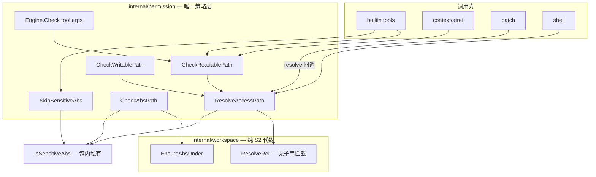
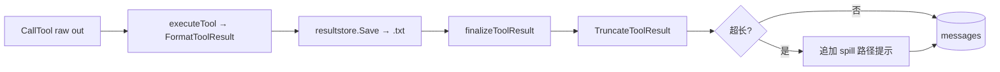
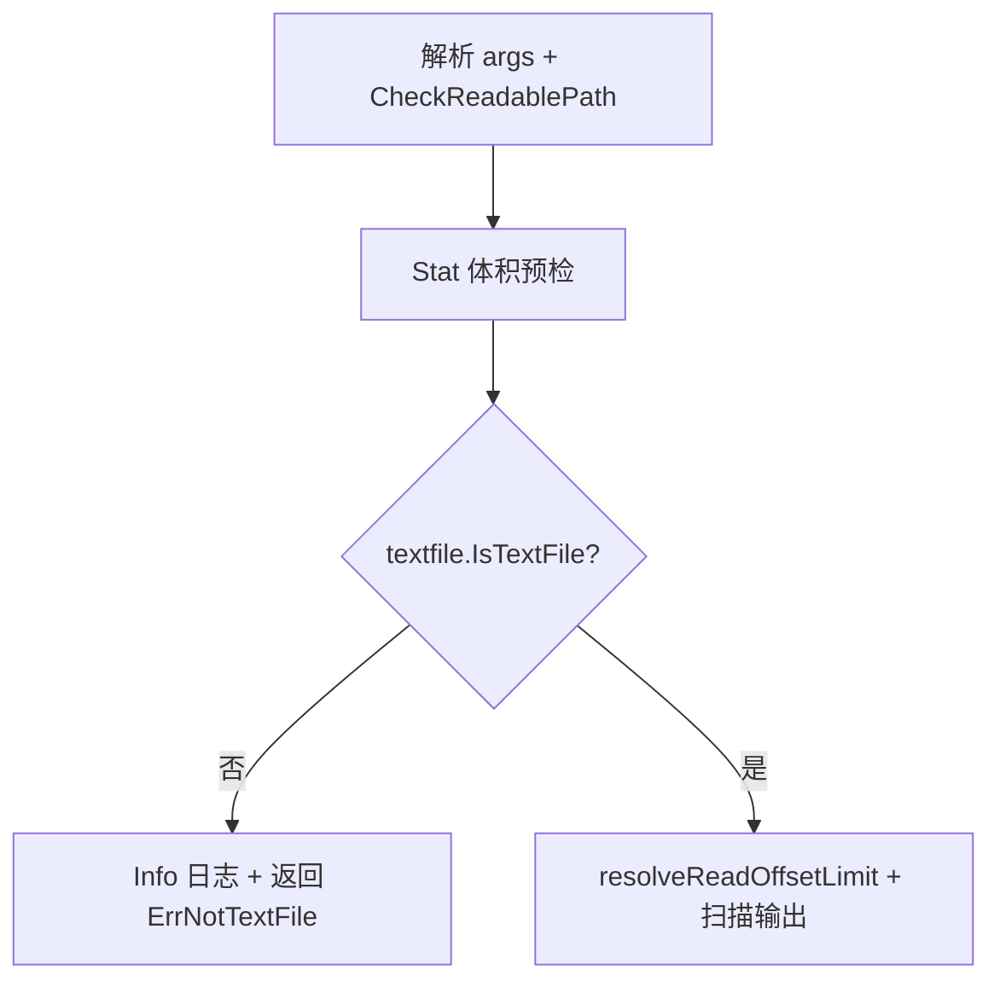
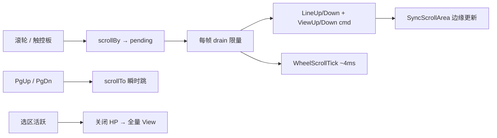

# v0.1.2 设计文档

> 版本：v0.1.2  
> 状态：已实现  
> 更新日期：2026-06-20  
> 需求：[REQUIREMENTS.md](REQUIREMENTS.md)

## 1. 设计目标

1. **单一入口**：`permission.Engine` 承担全部「路径 → 是否允许访问」决策（S2 工作区边界 + S3 敏感 denylist）。
2. **先解析后判定**：去掉对 `.` / `..` 的字符串级拦截；用 Go 标准库路径规范化 + symlink 求值 + `ensureUnder` 得到最终绝对路径后再做策略检查。
3. **最小行为变更**：仅放宽「解析后仍在工作区内」的 `..` 路径；逃逸与敏感文件拒绝语义与 [SECURITY.md](../v0.1.0/SECURITY.md) 一致。

## 2. 现状（v0.1.1）

### 2.1 路径相关模块分布

```mermaid
flowchart TB
  subgraph callers [调用方 — 分散]
    RF[read_file / glob / grep / list_dir]
    DIAG[diagnostics]
    PATCH[patch validate + apply]
    FC[filecandidate / globmatch]
    AT[@ atref]
    SH[shell_sensitive_paths]
  end

  subgraph workspace [internal/workspace — S2]
    RR[ResolveRel]
    EA[EnsureAbsUnder]
    VR[ValidateRel]
  end

  subgraph permission [internal/permission]
    ENG[Engine.CheckReadablePath / ResolvePath]
    SEN[IsSensitiveAbs — 包级导出]
    EAW[EnsureAbsUnderWorkspace]
  end

  RF --> ENG
  RF --> SEN
  DIAG --> ENG
  DIAG --> SEN
  PATCH --> VR
  PATCH --> EA
  FC --> EAW
  FC --> SEN
  AT --> SEN
  SH --> ENG
  SH -->|"strings.Contains(..)"| SH
  ENG --> RR
  EAW --> EA
  ENG --> SEN
```

### 2.2 核心问题：`..` 子串拦截

[`internal/workspace/path.go`](../../internal/workspace/path.go) 相对路径分支：

```go
if strings.Contains(rel, "..") {
    return "", fmt.Errorf("workspace: path traversal: %s", rel)
}
```

影响：

| 输入（`project_root=/proj`） | v0.1.1 | 解析后真实位置 | 期望 v0.1.2 |
|------------------------------|--------|----------------|-------------|
| `foo/../bar.go` | **拒绝**（含 `..`） | `/proj/bar.go` | 允许 |
| `../outside` | 拒绝 | `/outside` | 拒绝（越界） |
| `.` / `./src` | 允许 | 工作区内 | 允许 |
| `a..b.txt` | **误拒**（子串 `..`） | `/proj/a..b.txt` | 允许 |
| 绝对路径 `/proj/x` | Clean + ensureUnder | 工作区内 | 不变 |
| shell `origin/main..v0.1.1`（git range） | **误拒**（子串 `..`） | `/proj/origin/main..v0.1.1` | 允许 |
| shell `origin/main...v0.1.1`（git symmetric） | **误拒**（`...` 含 `..`） | `/proj/origin/main...v0.1.1` | 允许 |
| shell `./...`（go test 包模式） | **误拒** | `/proj/...` | 允许 |

[`shell_sensitive_paths.go`](../../internal/permission/shell_sensitive_paths.go) 在 `ResolvePath` 失败时重复子串逻辑：

```go
if filepath.IsAbs(rel) || strings.Contains(rel, "..") {
    return fmt.Errorf("%w: shell path not allowed: %s", ErrDenied, rel)
}
```

与 workspace 层不一致，且对 `foo/../.env` 等无法先规范化再判 S3。

### 2.3 v0.1.1 生产误拦样例（shell）

以下命令在 v0.1.1 中 **ds-code permission 层即拒绝**（错误 `shell path not allowed: <token>`），Agent 无法执行；v0.1.2 须在 permission 层放行（后续 git/go 是否成功不在本需求范围）：

| 命令 | 误拦 token | 误拦原因 |
|------|-----------|----------|
| `git diff origin/main...v0.1.1 --stat` | `origin/main...v0.1.1` | `...` 含子串 `..` |
| `git log origin/main..v0.1.1 --format=…` | `origin/main..v0.1.1` | `main..v0.1.1` 含子串 `..` |
| `go test ./... 2>&1` | `./...` | `...` 含子串 `..`；且 `looksLikePathCandidate` 命中 |

说明：`git diff main...v0.1.1` 在本地若无 `main` ref 会由 **git** 报 `unknown revision`——这与 permission 误拦是不同层次的问题；验收时须区分「permission 放行」与「命令业务成功」。

### 2.4 直接调用 `IsSensitiveAbs` 的模块

| 模块 | 用途 |
|------|------|
| `tool/builtin/grep` | `WalkDir` 跳过敏感目录 |
| `tool/builtin/list_dir` | 过滤敏感条目 |
| `tool/builtin/diagnostics` | LSP 路径过滤 |
| `tool/globmatch` | glob 遍历跳过 |
| `tool/builtin/filecandidate` | 候选文件过滤 |
| `context/atref` | `@` 文件引用过滤 |

这些应改为经 Engine 封装，避免 S3 规则变更时漏改。

## 3. 目标架构（v0.1.2）



**分层原则**

| 层 | 职责 | 对外可见 |
|----|------|----------|
| `workspace` | 工作区根求值、join/clean、symlink、`ensureUnder` | 仅 `permission` import |
| `permission` | S2+S3 组合、工具/shell/patch 统一 API | `Engine` 方法 |
| `tool` / `context` / `patch` | 业务；**不** import `workspace` 做权限 | — |

## 4. 路径解析算法（FR-2）

### 4.1 `workspace.ResolveRel` 修订

**删除**相对路径分支的 `strings.Contains(rel, "..")`。

**统一相对路径管线**（与绝对路径对齐的安全目标）：

```go
func ResolveRel(workspace, rel string) (string, error) {
    ws, err := evalWorkspaceRoot(workspace)
    // ...

    var abs string
    if filepath.IsAbs(rel) {
        abs = filepath.Clean(rel)
    } else {
        abs = filepath.Join(ws, rel)   // 保留 rel 中的 . / .. 段
        abs = filepath.Clean(abs)        // 规范化消除 . 与合法 ..
    }

    abs, err = resolvePath(ws, abs)      // EvalSymlinks / 父目录 symlink
    if err != nil {
        return "", err
    }
    if err := ensureUnder(ws, abs); err != nil {
        return "", err
    }
    return abs, nil
}
```

`ensureUnder` 保持不变：用 `filepath.Rel(ws, abs)` 且拒绝前缀 `..`。

### 4.2 安全不变量

| 不变量 | 保证方式 |
|--------|----------|
| 不能读工作区外文件 | `ensureUnder` after full resolution |
| symlink 指向工作区外 | `EvalSymlinks` + `ensureUnder`（现有测试保留） |
| 不能读 `.env` 等敏感路径 | 解析完成后 `IsSensitiveAbs(abs)` |
| `..` 链式逃逸 | `Clean` 后 `Rel` 仍以 `..` 开头则拒 |

### 4.3 行为示例

工作区 `/proj`，存在 `/proj/pkg/util.go`：

```
read_file path="pkg/../pkg/util.go"  → Resolve → /proj/pkg/util.go → OK
read_file path="../etc/passwd"       → Resolve → /etc/passwd → ensureUnder FAIL
read_file path=".env"                → Resolve → /proj/.env → S3 FAIL
read_file path="pkg/../../.env"      → Clean → /proj/.env（若存在）→ S3 FAIL
grep path="src/../src"               → OK（目录）
```

## 5. `permission.Engine` API 设计（FR-1）

### 5.1 核心类型

```go
// PathIntent 区分读/写/边界/枚举；枚举与 skip 配合，敏感路径 skip 而非报错。
type PathIntent int

const (
    PathRead PathIntent = iota // S2 + S3 拒绝敏感
    PathWrite                  // S2 + S3 拒绝敏感
    PathBoundary               // 仅 S2（glob 二次校验、patch 边界）
    PathEnumerate              // 仅 S2；S3 由 caller 调 SkipSensitiveAbs skip
)
```

### 5.2 方法一览

| 方法 | 用途 | S2 | S3 |
|------|------|----|----|
| `ResolveAccessPath(rel, intent)` | **canonical** 解析 + 策略 | ✓ | `PathRead`/`PathWrite` 拒绝敏感；`PathBoundary`/`PathEnumerate` 不查 S3 |
| `CheckReadablePath(rel)` | 读工具入口；**含** spill 放行（§12.6） | ✓ | 拒绝敏感（spill 例外） |
| `CheckWritablePath(rel)` | 写工具 / apply_patch resolve | ✓ | 拒绝敏感 |
| `CheckAbsPath(abs, intent)` | glob 结果、已有绝对路径 | ✓ | 同 intent |
| `SkipSensitiveAbs(abs)` | WalkDir `SkipDir`、MakeFileCandidate | — | 目录/文件是否跳过 |
| `ResolvePath(rel)` | 仅 S2，不查 S3 | ✓ | — |

**实现关系**

```go
func (e *Engine) CheckReadablePath(rel string) (string, error) {
    if abs, ok := e.resolveMCPSpillRead(rel); ok {
        return abs, nil
    }
    return e.ResolveAccessPath(rel, PathRead)
}

func (e *Engine) ResolveAccessPath(rel string, intent PathIntent) (string, error) {
    abs, err := wspkg.ResolveRel(e.Workspace, rel)
    if err != nil {
        return "", fmt.Errorf("%w: %v", ErrDenied, err)
    }
    if intent == PathRead || intent == PathWrite {
        if IsSensitiveAbs(abs) {
            return "", fmt.Errorf("%w: sensitive path %s", ErrDenied, rel)
        }
    }
    // PathBoundary / PathEnumerate: S2 only; caller uses SkipSensitiveAbs for S3 skip
    return abs, nil
}

func (e *Engine) SkipSensitiveAbs(abs string) bool {
    return IsSensitiveAbs(abs)
}
```

`CheckWritablePath` 与 `CheckReadablePath` 共享 S3；写操作在 `Engine.check` 中对 `write_file` / `apply_patch` 改用 `CheckWritablePath`（语义显式，实现可委托）。

### 5.3 `Engine` 组装字段（spill 与 worktree）

`permission.Engine` 在 v0.1.1 仅有 `Workspace`（worktree 隔离时指向 detached checkout）。v0.1.2 新增：

| 字段 | 来源 | 用途 |
|------|------|------|
| `ProjectRoot string` | `cfg.ProjectRoot`（**非** `perm.Workspace`） | spill 路径 `project_id`、 `resolveMCPSpillRead` 判定 |
| `SpillSessionID string` | Runner 每轮工具执行前设置 `sessionID` | spill **仅当前 session** 可读（FR-4.12） |

[`cmd/ds-code/app/runner.go`](../../cmd/ds-code/app/runner.go) 与 [`internal/agent/spawn/execute.go`](../../internal/agent/spawn/execute.go) 组装：

```go
perm := permission.NewEngine(mode, workspace, interactive)
perm.ProjectRoot = cfg.ProjectRoot // 始终主项目根，非 worktree 路径
```

**`ProjectRoot` 规则**（NFR-14）：凡 `spawn/execute.go` **新建** `*permission.Engine` 的分支（含 `readonly` worktree、`inherit`/`bubble` worktree），均须 `perm.ProjectRoot = cfg.ProjectRoot`。复用 `parentPerm` 指针时已在主 Runner 设置，无需重复。

**`SpillSessionID` 设置时机**（NFR-13）：在 `RunTurn` / `RunTurnSeeded` **入口**（进入 tool 循环前）设置 `perm.SpillSessionID = sessionID`，覆盖该轮所有 serial / concurrent batch。子代理使用 `subagentstore` 分配的 `sess.ID`。

worktree 子代理（`spawn/execute.go` 新建 Engine 时）示例：

```go
// readonly worktree
perm = permission.NewEngine("readonly", workspace, false)
perm.ProjectRoot = cfg.ProjectRoot

// inherit/bubble worktree
perm = permission.NewEngine(parentPerm.Mode, run.WorktreePath, parentPerm.Interactive)
perm.ProjectRoot = cfg.ProjectRoot
perm.Prompter = parentPerm.Prompter
```

**子代理 `Runner` spill 注入**（FR-4.8）：

```go
childRunner := &agent.Runner{
    // ...
    MCPResults: parentRunner.MCPResults, // 同一 *resultstore.Store
    Perm:       perm,
}
```

`ExecuteRun` 须从调用方接收 `parentRunner`（或显式 `*resultstore.Store`），不可让子代理 `MCPResults == nil`。

### 5.4 `IsSensitiveAbs` 可见性

- v0.1.2：**建议**将 `IsSensitiveAbs` 改为包内非导出 `isSensitiveAbs`，对外仅 `SkipSensitiveAbs` / `ResolveAccessPath`。
- 迁移期可保留导出并标 `Deprecated`，v0.1.3 删除。

### 5.5 `Engine.check` 工具参数

现有 `checkPath` → `CheckReadablePath` 逻辑保持；写工具路径检查统一走 `CheckWritablePath`（与读相同 S3，便于日后写放宽容差时分叉）。

### 5.6 与现有 API 的关系

v0.1.1 已在 `permission` 包暴露部分路径 helper。**不新增平行实现**，而是收敛到 `ResolveAccessPath` / `CheckAbsPath`：

| 现有 API（v0.1.1） | v0.1.2 处置 |
|--------------------|-------------|
| `ResolvePath` | **保留**；仅 S2，内部仍调 `workspace.ResolveRel` |
| `CheckReadablePath` | **保留**公开签名；实现改为 `ResolveAccessPath(rel, PathRead)` + spill 例外（§12.6） |
| `ResolveRelUnderWorkspace` | **Deprecated** → `ResolveAccessPath(rel, PathBoundary)` 或 `ResolvePath` |
| `EnsureAbsUnderWorkspace` | **Deprecated** → `CheckAbsPath(abs, PathBoundary)` |
| `ValidateAbsPathsUnderWorkspace` | **Deprecated** → 循环调 `CheckAbsPath(abs, PathBoundary)` |
| `ResolveAccessPath` | **新增** canonical S2+S3 入口 |
| `CheckAbsPath` | **新增** |
| `SkipSensitiveAbs` | **新增**；替代 tool 层直接调 `IsSensitiveAbs` |
| `CheckWritablePath` | **新增**；等价 `ResolveAccessPath(rel, PathWrite)` |

**glob / filecandidate 语义**（避免 `PathRead` 误用导致敏感路径整批失败）：

- `ValidateGlobMatches`：`CheckAbsPath(abs, PathBoundary)` — 仅 S2 越界返回 error
- `MakeFileCandidate` / WalkDir：`SkipSensitiveAbs` — 敏感条目 skip，不中断整次 glob/grep

## 6. 调用方迁移映射

| 文件 | 现状 | 目标 |
|------|------|------|
| `read_file/read_file.go` | `CheckReadablePath` | spill 例外（§12.6）；**增** `IsTextFile` 文本判定（§16） |
| `grep/grep.go` | `CheckReadablePath` + `IsSensitiveAbs` + `GitignoreMatcher` | `SkipSensitiveAbs` + `searchskip.Matcher`（§14） |
| `glob/glob.go` | `CheckReadablePath` + `GitignoreMatcher` | **删除** `Gitignore`；注入 `searchskip.Matcher` |
| `list_dir/list_dir.go` | `CheckReadablePath` + `IsSensitiveAbs` + `GitignoreMatcher` | `SkipSensitiveAbs` + `searchskip.Matcher` |
| `diagnostics/diagnostics.go` | 同上 | 同上 |
| `context/atref.go` | `IsSensitiveAbs` + `GitignoreMatcher`（`@dir/` walk） | **移除** gitignore/S3/`.git` 过滤（FR-6.9–6.10）；`AtExpander` 不再持有 `Gitignore` |
| `globmatch/globmatch.go` | `IsSensitiveAbs` + 硬编码 `.git` | `MatchFiles` 新增 `skipDir func(rel string) bool` 参数；**移除**包内 `IsSensitiveAbs`；Walk 时调 `skipDir`（由 caller 注入 `searchskip` + `SkipSensitiveAbs`，FR-1.8） |
| `filecandidate.go` | `EnsureAbsUnderWorkspace` + `IsSensitiveAbs` | `ValidateGlobMatches` → `CheckAbsPath(abs, PathBoundary)`；`MakeFileCandidate` → `SkipSensitiveAbs` |
| `patch/validate.go` | `wspkg.ValidateRel` | 接收 `func(string) error` 或 `*Engine`；内部调 `CheckWritablePath` / `ResolvePath` |
| `patch/parser.go` | `ValidatePath(workspace, path)` | 同上，去除 `workspace` import |
| `patch/apply/apply.go` | `wspkg.EnsureAbsUnder` in resolveChecked | 调用方注入的 `resolve` 已由 Engine 包装，**删除** apply 内重复 `EnsureAbsUnder` |
| `checkpoint/rewind.go` | `patch.ValidatePath(workspace, rel)` | 改调 Engine 注入的校验函数 |
| `apply_patch/apply_patch.go` | `t.Perm.ResolvePath` | `t.Perm.CheckWritablePath`（S3 已在 `Engine.check` 预检，resolve 语义显式） |
| `shell_sensitive_paths.go` | `ResolvePath` + `Contains(..)` | `ResolveAccessPath` + `errors.Is(…, ErrOutsideWorkspace)` 三分支（见 §6.2） |
| `tool/setup/setup.go` | `Deps.Gitignore` | `Deps.SearchSkip *searchskip.Matcher`；Plan/子代理 `RegisterReadOnly` 同步 |
| `agent/spawn/execute.go` | worktree 新建 `Engine` 无 `ProjectRoot`；子 Runner 无 `MCPResults` | **所有**新建 Engine 设 `ProjectRoot`；`childRunner.MCPResults = parent.MCPResults` |

### 6.1 patch 注入

[`cmd/ds-code/app`](../../cmd/ds-code/app) 或 runner 组装 patch apply 时：

```go
resolve := func(rel string) (string, error) {
    return perm.CheckWritablePath(rel)
}
apply.Apply(workspace, patchText, resolve, opts)
```

`patch.ValidatePath` 改为接收 `func(string) error` 或 `*permission.Engine`，避免 patch 包 import workspace。`patch/parser.go`、`checkpoint/rewind.go` 同步改用同一注入接口。

### 6.2 shell 路径候选

**原则**：去掉 `strings.Contains(rel, "..")` 后，须区分三类 `ResolveAccessPath` 失败，避免 v0.1.1 误拦修复引入 `cat ../outside` 放行回归（FR-1.7）。

| 失败类型 | 示例 | 处理 |
|----------|------|------|
| 越界 / 遍历 | `../outside`、`../../etc/passwd` | **拒绝** |
| 绝对路径区外 | `/etc/passwd` | **拒绝** |
| 非路径 / 不可解析 token | `2>/dev/null`（非候选）、git ref 已在区内解析成功 | 放行或 N/A |

**辅助函数**（`internal/workspace/errors.go`）：

```go
// ErrOutsideWorkspace is returned when a resolved path leaves the workspace jail.
var ErrOutsideWorkspace = errors.New("workspace: path outside workspace")

func isOutsideWorkspaceErr(err error) bool {
    return errors.Is(err, ErrOutsideWorkspace)
}
```

`ensureUnder` 失败时包装：`fmt.Errorf("%w: %s", ErrOutsideWorkspace, rel)`。shell 与路径 API **禁止**依赖错误字符串子串匹配（NFR-10）。

`checkPathCandidate` 修订后：

```go
func (e *Engine) checkPathCandidate(rel string) error {
    if !looksLikePathCandidate(rel) {
        return nil
    }
    base := filepath.Base(rel)
    if isSensitiveBasename(base) {
        return fmt.Errorf("%w: shell must not access sensitive path", ErrDenied)
    }
    abs, err := e.ResolveAccessPath(rel, PathRead)
    if err != nil {
        if filepath.IsAbs(rel) || isOutsideWorkspaceErr(err) {
            return fmt.Errorf("%w: shell path not allowed: %s", ErrDenied, rel)
        }
        // 不可解析且非越界的相对 token（罕见）保持放行
        return nil
    }
    // ResolveAccessPath(PathRead) 已在解析后做 S3 检查
    _ = abs
    return nil
}
```

删除 `strings.Contains(rel, "..")` 分支。

**三分支验证**（单测 `shell_sensitive_paths_test.go`）：

| token | ResolveAccessPath | checkPathCandidate |
|-------|-------------------|-------------------|
| `origin/main..v0.1.1` | OK（区内） | 放行 |
| `origin/main...v0.1.1` | OK（区内） | 放行 |
| `./...` | OK（区内） | 放行 |
| `../outside` | 越界 err | **拒绝** |
| `2>/dev/null` | 非候选 | 放行（现有测试保留） |
| `/etc/passwd` | 越界 err | **拒绝**（现有测试保留） |

## 7. 测试设计

### 7.1 `workspace/path_test.go` 新增

| 用例 | 输入 | 预期 |
|------|------|------|
| 合法 `..` 段 | `foo/../ok.txt` | OK |
| 逃逸 | `../outside.txt` | Error |
| 文件名含 `..` | `a..b.txt` | OK |
| 多点 `..` | `a/b/../../c` 越界 | Error |
| `.` 根 | `.` | OK → ws |
| symlink 逃逸 | 现有 `escape` link | Error（保留） |

### 7.2 `permission/engine_test.go` 与 `shell_sensitive_paths_test.go` 新增

| 用例 | 预期 |
|------|------|
| `CheckReadablePath("pkg/../.env")` | S3 拒绝 |
| `CheckReadablePath("pkg/../readme.md")` | OK |
| shell `cat pkg/../readme.md` | OK |
| shell `cat ../outside` | 拒绝 |
| shell `git diff origin/main...v0.1.1 --stat` | permission 放行 |
| shell `git log origin/main..v0.1.1` | permission 放行 |
| shell `go test ./...` | permission 放行 |
| `checkPathCandidate("origin/main..v0.1.1")` | nil |
| `checkPathCandidate("./...")` | nil |
| `checkPathCandidate("../outside")` | ErrDenied |

### 7.3 回归

- 现有 `TestEngine_resolvePath_blocksTraversal` 改为用 `../outside` 或解析后越界路径，**删除**对 `foo/../bar` 的误拒期望。
- `filecandidate_test`、`grep_test` 若有 `..` 相关用例同步更新。

## 8. 文档与审计清单更新

| 文档 | 变更 |
|------|------|
| [SECURITY.md](../v0.1.0/SECURITY.md) S2 | 「`..` 拦截」→「规范化 + ensureUnder」 |
| [SECURITY.md](../v0.1.0/SECURITY.md) **S3-S**（新增） | 用户显式 `@file` / `@dir/` 仅 S2、可越过 S3；Agent 工具 / shell / `read_file` 仍 S3 |
| [SECURITY.md](../v0.1.0/SECURITY.md) S11 | MCP spill 0600 + session 仍截断 + spill 仅当前 session 可读 + shell 不可读 spill |
| [CONFIG.md](../v0.1.0/CONFIG.md) | `mcp-result/`、`tool_result_max_chars`、`tools.search.skip_dirs`（草稿见 [SECURITY-SYNC.md](SECURITY-SYNC.md)） |
| [DESIGN.md](../v0.1.0/DESIGN.md) 权限节 | 补充 Engine 路径 API 一览 |
| [CHANGELOG.md](../../CHANGELOG.md) | v0.1.2 条目 |
| `internal/agent/README.md` | spill / `finalizeToolResult` 流程 |
| `internal/tool/builtin/README.md` | `SkipSensitiveAbs`；不读 `.gitignore`；`.git` + `skip_dirs` |

**SECURITY §S3-S 建议正文**（实现时写入 [SECURITY.md](../v0.1.0/SECURITY.md)）：

| ID | 落点 | 说明 |
|----|------|------|
| S3-S | `context/atref.go` | 用户提示词中显式 `@file` / `@dir/` 仅校验 S2（`ResolvePath`），**可**读取 `.env` 等 S3 路径并注入 user message；**不**应用 `IsSearchable` / grep 大小上限；Agent 枚举、`read_file`、`shell` 仍受 S3；compact 输入经 S12 行级启发式 redact，**不**对 `@` 块专用剥离；用户显式点名视为知情承担风险 |

（需求 2 另见 [§12.10](DESIGN.md#1210-文档更新)。）

## 9. 实现顺序建议

1. **Phase A**：修改 `workspace.ResolveRel` + 单测（纯 S2，无调用方变更即可验证）。
2. **Phase B**：`permission` 增加 `ResolveAccessPath` / `CheckWritablePath` / `SkipSensitiveAbs`；修订 `shell_sensitive_paths`。
3. **Phase C**：迁移 builtin tools、`filecandidate`、`atref`（**安全里程碑**：`@` S3 绕过须 code review + `TestAtExpander_*` 全绿后再合入）。
4. **Phase D**：patch validate/apply 改注入；删除 `wspkg` 在 patch 中的 import。
5. **Phase E**：`IsSensitiveAbs` 降可见性；lint 禁止 tool → workspace 直接权限 import（可选 CI grep）。
6. **Phase F**：MCP spill store + Runner `finalizeToolResult` + read_file 放行（需求 2）；`spawn/execute.go` 注入 `ProjectRoot` + `MCPResults`。
7. **Phase G**：MCP 参数 TUI / 日志（需求 3）。
8. **Phase H**：`searchskip`（`.git` + 用户 `skip_dirs`）替代 `GitignoreMatcher`；`globmatch.MatchFiles` 注入 `skipDir`（需求 4，FR-1.8、FR-6.14）。
9. **Phase I**：TUI 选区 + 剪贴板（需求 5）；`tui.copy_on_select` 配置；P2 项（双击/键盘扩展，FR-7.10–7.11）可分期。
10. **Phase J**：`read_file` 文本判定（需求 6，FR-8）；`textfile.IsTextFile` + Info 日志。
11. **Phase K**：TUI 平滑滚动（需求 7，FR-9）；`internal/ui/tui/scroll` + HP 渲染路径；与 Phase I 选区冲突处理（FR-9.6）。

## 10. 风险与缓解

| 风险 | 缓解 |
|------|------|
| 放宽 `..` 后模型更多用复杂路径 | 解析后仍 jail + S3；行为更符合 POSIX 预期 |
| shell 去掉子串 `..` 后 `../outside` 误放行 | FR-1.7 + `errors.Is(ErrOutsideWorkspace)` 三分支 + 单测 |
| `@` 绕过 S3 误读敏感文件 | 仅用户显式 `@`；Agent/shell 仍拒；SECURITY §S3-S 文档化 |
| spill 跨 session 泄露 | `SpillSessionID` 绑定当前 Runner session |
| 子代理 spill 父 Agent 可读 | FR-4.15：父 `SpillSessionID` ≠ 子 session；`task` 仅回传 summary |
| compact 后 spill 路径丢失 | 接受现状；近 N 轮保留 + 模型 compact 前 `read_file`；**无法**枚举 `mcp-result/`（§12.11） |
| hint 路径不可 `read_file` | `shortenSpillPathForHint` **禁止** `~` 与尾部截断到不可解析路径；超长时优先截短 hint 文案或 MCP 正文（§12.5） |
| `@dir/` 灌入二进制 | FR-6.11 有意放开 `IsSearchable`；靠 `at_dir_max_*` 预算；SECURITY §S3-S 文档化 |
| shell 读 spill 绝对路径 | FR-4.17：区外路径拒绝；hint 仅引导 `read_file` |
| TUI MCP 参数泄露密钥 | 与 shell 命令展示一致，有意可见；debug 完整 args 需 `--allow-log-sensitive-data` |
| 双重 `EnsureAbsUnder` 删除后 apply 仅靠注入 resolve | 集成测试 `apply_patch` 越界 patch 仍拒绝 |
| `globmatch` 仍直接调 `IsSensitiveAbs` | Phase H：`MatchFiles(root, pattern, limit, skipDir)`；caller 传入 `searchskip.SkipDir` 闭包（§14.4.1） |
| `a..b` 等曾误拒路径突然可访问 | 属 bugfix；记入 CHANGELOG |
| MCP 大 JSON 撑满上下文 | spill + 截断回注；模型用 `read_file` 读 spill |
| MCP spill 含敏感数据 | 文件 0600、目录 0700；仅在 project 数据目录；不自动 GC；经 `read_file` 回注后进入 LLM 上下文 |
| MCP 参数写入日志泄露敏感字段 | 默认仅 `args_preview` 200 字符；完整 `args` 需 `--allow-log-sensitive-data` |
| 移除 gitignore/框架 skip 后模型扫全库 | 工具描述提示收窄 `path`；`grep` `head_limit`、截断兜底；用户可配 `skip_dirs` |
| `isToolErrorBody` 误判成功响应 | 优先 `UnpackToolBody` 的 `isErr`；`error:` 前缀仅作 MCP `IsError` 补充；单测覆盖「正文以 error: 开头但成功」样例（§12.5） |
| `mcp-result` 与 `agents/` 双 spill 语义分裂 | v0.1.2 **仅**扩展 `read_file` 至 `mcp-result/`；`agents/*.output` 指针行为不变（FR-4.7）；后续可统一 project 数据目录只读 spill |
| 子代理 MCP 大结果父 Agent 无感 | 设计约束：父仅见 `task` trim summary；子须在 FinalContent 复述；文档化于 README 已知限制 |
| TUI 剪贴板写入敏感可见内容 | 与 shell 命令展示一致；威胁模型补充 TUI 剪贴板行（SECURITY-SYNC §1.1d） |
| 滚轮 drain 期间流式 sync 与视觉错位 | FR-9.7：drain 不 `syncChatView`；滚动活跃暂停 33ms flush；结束后补 flush |
| HP 渲染与选区高亮冲突 | FR-9.6：选区活跃时关闭 HP，全量 `View()` + `visibleHighlightedLines` |

## 11. 不在此设计内

- `context/skills.go`、`worktree/manager.go` 的命名校验保持独立（见 REQUIREMENTS FR-3）。
- MCP 工具自定义 path 参数名不在 `Engine.check` 通用字段中的，后续需求再扩展 `Check` 的 args 提取器。
- 外部 MCP server（如 code-review-graph）内部节点数 / 列表长度上限的修改（见 §12.4）。
- TUI 浮层内完整独立选区（FR-7.8 完整版；首期仅禁用聊天选区）。
- 统一 `read_file` 放行 `agents/*.output`（FR-4.7；另开需求）。

## 12. MCP 结果落盘与上下文截断（需求 2）

### 12.1 设计原则

- **LLM 上下文**：MCP 与内建工具一样，回注 session 的内容受 `context.tool_result_max_chars`（默认 100000）限制。
- **完整留存**：每次 MCP 调用**成功**后，**先**将完整持久化正文写入 spill 文件，**再**截断写入 `messages`（**含未超长**，FR-4.18：简化实现、便于事后 `read_file` 与调试）。
- **可恢复**：超长时 suffix 告知 spill 绝对路径，引导模型 **`read_file`** 读取全文（**非** `shell cat`）。

**术语**：`toolresult.FormatToolResult`（持久化 XML 包装）≠ `mcp/server.go` 内 `formatToolResult`（MCP SDK 响应拼接）。spill 存前者。

不再采用「MCP 豁免截断」或 `mcp_tool_result_max_chars` 方案。

### 12.2 现状（v0.1.1）


超长 MCP JSON 截断后**无副本**，模型与用户均无法恢复尾部。

### 12.3 目标数据流



### 12.4 路径与权限

固定布局（与 [`internal/datadir/paths.go`](../../internal/datadir/paths.go) 中 `shell-jobs`、`checkpoints` 同级）：

```
~/.ds-code/projects/<project_id>/mcp-result/<session_id>/<stem>.txt
```

| 段 | 来源 |
|----|------|
| `project_id` | `datadir.ProjectID(cfg.ProjectRoot)` = `hex(sha256(project_root))`；**始终**用 `cfg.ProjectRoot`，非 worktree 的 `perm.Workspace` |
| `session_id` | 当前 `session.Message.SessionID`（UUID，文件名安全，无需额外 sanitize） |
| `<stem>` | `spillCallFilename(llm.ToolCall.ID)`；空 id → 本次 `Save` 新生成 ULID |

**新增 datadir API**：

```go
// DefaultMCPResultDir returns ~/.ds-code/projects/<id>/mcp-result/.
func DefaultMCPResultDir(projectRoot string) string

// MCPResultFilePath returns the spill file for one MCP tool call.
// callID is the raw llm.ToolCall.ID; stem comes from spillCallFilename(callID).
func MCPResultFilePath(projectRoot, sessionID, callID string) (string, error)
```

**写入**（`internal/mcp/resultstore/store.go`，包名 `resultstore`）：

```go
package resultstore

// Store persists MCP tool spill files under ~/.ds-code/projects/<id>/mcp-result/.
type Store struct {
    ProjectRoot string // cfg.ProjectRoot, not perm.Workspace
}

// Save writes full formatted tool body; creates parent dirs 0700, file 0600.
func (s *Store) Save(sessionID, callID, body string) (absPath string, err error)
```

`spillCallFilename`（`internal/mcp/resultstore/filename.go`）：

```go
import "github.com/oklog/ulid/v2"

// spillCallFilename returns a filename-safe stem for mcp-result/<session>/<stem>.txt.
// Empty rawID gets a fresh ULID per call so concurrent empty-id tool_calls never collide.
func spillCallFilename(rawID string) string {
    id := strings.TrimSpace(rawID)
    if id == "" {
        return ulid.Make().String() // 26 chars, Crockford base32, filename-safe
    }
    replacer := strings.NewReplacer("/", "_", "\\", "_", "..", "_", "\x00", "")
    return replacer.Replace(id)
}
```

**说明**：

- session `messages.tool_call_id` 仍存 LLM 原始 `tc.ID`（可能为空）；spill **文件名**与 hint 绝对路径使用 `spillCallFilename` 结果，二者不必相同。
- 同轮多个空 id 的 MCP call 各写 `…/<ULID>.txt`，互不覆盖。
- 依赖：`go get github.com/oklog/ulid/v2`（Phase F）。

### 12.5 Runner 集成

[`internal/agent/tool_orchestration.go`](../../internal/agent/tool_orchestration.go)：`executeSingleTool` 在 `executeTool`（已 `FormatToolResult` 包装）之后调用 `finalizeToolResult`，再持久化。

```go
func (r *Runner) executeSingleTool(ctx context.Context, sessionID string, tc llm.ToolCall) string {
    body := r.executeTool(ctx, sessionID, tc)
    return r.finalizeToolResult(sessionID, tc, body)
}

func (r *Runner) finalizeToolResult(sessionID string, tc llm.ToolCall, formattedBody string) string {
    if r.Tools != nil && r.Tools.IsMCPTool(tc.Name) && formattedBody != "" && !isToolErrorBody(formattedBody) {
        if path, err := r.MCPResults.Save(sessionID, tc.ID, formattedBody); err == nil {
            max := r.Cfg.Context.ToolResultMaxChars // 默认 100000
            if len(formattedBody) > max {
                displayPath := shortenSpillPathForHint(path, max) // 见下方契约
                hint := MCPSavedResultHint(displayPath)
                budget := max - len(hint)
                if budget < 0 {
                    budget = 0
                }
                truncated := formattedBody[:budget]
                return truncated + hint // len(truncated)+len(hint) ≤ max
            }
            return formattedBody // 未超长：内容与文件一致，无 hint
        }
        logging.L().Warn("mcp result spill failed", zap.Error(err))
    }
    return ctxpkg.TruncateToolResult(formattedBody, r.Cfg)
}
```

**截断语义**（FR-4.14）：hint **计入** `tool_result_max_chars` 预算。

**`shortenSpillPathForHint` 契约**（`internal/toolresult/text.go` 或 `mcp/resultstore`）：

| 规则 | 说明 |
|------|------|
| 输入 | `Save` 返回的 spill **完整绝对路径** |
| 输出 | 必须满足 `resolveMCPSpillRead(displayPath)` 为 true（`read_file` 可成功） |
| **禁止** | `~` / `$HOME` 缩短（`read_file` 不展开 `~`）；尾部截断到不可 `Stat` 的路径 |
| 允许 | 缩短 hint **固定文案**（中/英模板）；或增大正文截断、牺牲 MCP 预览换完整路径 |
| 极端 | `budget=0` 时消息仅为 hint；hint 仍须含可解析绝对路径 |

```go
// shortenSpillPathForHint returns a path string safe for read_file and MCPSavedResultHint.
// If the full abs path cannot fit in maxHintRunes, shrink the hint template text — never truncate abs.
func shortenSpillPathForHint(absPath string, maxChars int) string
```

**同 `call_id` 覆盖**（FR-4.19）：非空 `tool_call_id` 再次 `Save` 时覆盖同路径文件；空 id 仍每次 ULID 新文件。

**取消 / 失败**（FR-4.16）：`executeTool` 因 context 取消返回前未进入 `finalizeToolResult` 成功路径则不写 spill；`isToolErrorBody` 为 true 不写 spill。

**写入失败**（FR-4.13）：`Save` 失败时不写 spill、不追加 hint，仅 `Warn` 日志 + 普通 `TruncateToolResult`。

**`isToolErrorBody`**（`internal/agent/tool_orchestration.go` 或 `toolresult` 包）：

```go
// isToolErrorBody reports whether formatted tool output is failure (no spill).
func isToolErrorBody(formatted string) bool {
    inner, isErr := toolresult.UnpackToolBody(formatted)
    if isErr {
        return true // FormatToolError / ToolErrorPrefix
    }
    return strings.HasPrefix(strings.TrimSpace(inner), "error:") // MCP IsError
}
```

**误判风险**：若 MCP **成功**响应正文以 `error:` 开头（如错误码说明、diff 上下文），会跳过 spill。实现时以 `UnpackToolBody` 的 `isErr` **优先**；`error:` 前缀仅作 MCP SDK `IsError` 的补充启发式；须单测覆盖边界样例。

`SavedResultHint`（[`internal/toolresult/project_data_hint.go`](../../internal/toolresult/project_data_hint.go)）：

```
\n... [完整结果已保存至 %s；请用 read_file 读取该绝对路径（shell 无法访问）]
```

`SavedResultHint(path string) string`；`MCPSavedResultHint` 与 agent spill 均委托同一实现；`path` 为 `shortenSpillPathForHint` 输出的**可 `read_file` 绝对路径**。

`Runner` 新增字段 `MCPResults *resultstore.Store`（[`cmd/ds-code/app`](../../cmd/ds-code/app) 组装时注入，`ProjectRoot: cfg.ProjectRoot`）。子代理 Runner（`ForSubagent: true`）通过 `spawn/execute.go` 继承**同一** `*resultstore.Store` 指针（FR-4.8）。

### 12.6 read_file 读取 spill（完整 MCP 结果）

**目标**：session 中 MCP tool 消息可能被截断；模型通过 `read_file` 读取磁盘 spill 获取**完整** MCP 输出，无需用户手动 `cat`。

**路径布局**：

```
~/.ds-code/projects/<project_id>/mcp-result/<session_id>/<stem>.txt
                              └─ <stem> = spillCallFilename(llm.ToolCall.ID)
```

**可读范围**（扩展 `CheckReadablePath`，见 FR-4.12）：

| 条件 | 说明 |
|------|------|
| 当前 project | `abs` 位于 `datadir.ProjectDataDir(e.ProjectRoot)/` 下 |
| 路径形式 | **须绝对路径**；`resolveProjectDataRead` 用 `filepath.Clean`，**不**展开 `~`；相对路径拒绝 |
| 文件类型 | **regular file**（任意后缀；含 `mcp-result/`、`agents/`、`sessions.db` 等） |
| 拒绝 | 目录路径、其他 project 数据目录、`~/.ds-code/config/` 等 |
| session | **不**绑定 `SpillSessionID`；同 project 任意 session 的 spill 均可读 |

spill 路径**不在** `project_root` 工作区内，故须此例外；**不**向 LLM 开放整个 home 目录。`readonly` / `ask` / `auto` 下读 project 数据目录 **均直接放行**（只读区外例外，NFR-22）。

**典型工作流**：

1. MCP / 子代理工具返回超大结果 → session tool 消息含 spill **绝对路径** + `SavedResultHint`
2. 模型调用 `read_file`，`path` 为 hint 中的路径（完整绝对路径，非 `~`）
3. `read_file` 返回 spill 文件全文 → 模型继续分析

**`shell` 不可读 spill**（FR-4.17）：project 数据目录绝对路径位于 `project_root` 外；`checkPathCandidate` 对区外绝对路径返回 `shell path not allowed`。

```go
func (e *Engine) CheckReadablePath(rel string) (string, error) {
    if abs, ok := e.resolveProjectDataRead(rel); ok {
        return abs, nil
    }
    return e.ResolveAccessPath(rel, PathRead)
}

// resolveProjectDataRead allows read_file on regular files under the current project data dir.
func (e *Engine) resolveProjectDataRead(rel string) (string, bool) { /* see spill_read.go */ }
```

**不可读场景**（须单测覆盖）：

| 输入 | 预期 |
|------|------|
| project 数据目录内 spill / agents / sessions.db 绝对路径 | 成功 |
| 相对路径 | 拒绝 |
| 其他 project 数据目录绝对路径 | 拒绝 |
| project 数据目录路径（目录本身） | 拒绝 |
| `@` 引用 spill 绝对路径 | S2 区外，`ResolvePath` 拒绝（须用 `read_file`） |

Runner 在 `RunTurn` / `RunTurnSeeded` 入口设置 `r.Perm.SpillSessionID = sessionID`（子代理 `sess.ID` 来自 `subagentstore`）。`RunEphemeral`（`/btw`）无 tools，**不**设置 spill 链路（FR-3.11）。

**说明**：本版本仅保证 **`read_file` 读单文件**；`list_dir` / `grep` **不**对 `mcp-result/` 开放（Agent 应使用 hint 中的具体 spill 绝对路径）。

### 12.7 MCP server 端截断

server 返回的 JSON 若已含 `Results truncated: showing 500 of 875`，该字符串即为「完整 MCP 响应」——spill 文件忠实保存；ds-code 无法在客户端恢复 server 未返回的 375 条。

### 12.8 子代理、worktree 与 compact

**子代理**（`task` / `ForSubagent`）：

| 项 | 行为 |
|----|------|
| spill 目录 | `mcp-result/<子代理 session_id>/`（`subagentstore.CreateSession` 的 UUID） |
| `SpillSessionID` | 子 Runner `RunTurn` 期间设为子 session id |
| 父 Agent `read_file` | **可**读同 project 任意 session 的 spill（`resolveProjectDataRead`） |
| 父 Agent 可见性 | `task` 返回 trim summary 或 `output_file` + `SavedResultHint`；**不含**子代理 tool 消息流 |
| 子代理自读 | 子代理回合内可用 `read_file` 读自己的 spill |
| 父 Agent 对子 MCP 数据 | **无**间接路径：父不知子 `session_id`（不在 `task` 返回中）；子须在 FinalContent 复述 MCP 分析结论 |

#### 12.8b 与既有 `agents/` 子代理摘要 spill 的关系

ds-code **在 v0.1.2 之前**已有子代理摘要 spill（[`spawn/output.go`](../../internal/agent/spawn/output.go)）：

```
~/.ds-code/projects/<project_id>/agents/<parentSessionID>/<parentToolCallID>.output
```

| 维度 | `mcp-result/`（v0.1.2 新增） | `agents/`（既有） |
|------|------------------------------|-------------------|
| 触发 | 每次**成功** MCP 工具调用 | 子代理 `summary` 超 `tools.agent.summary_max_chars` 或 1 MiB |
| session 键 | **Runner** `session_id`（子代理为子 session） | **父** `ParentSessionID` + `ParentToolCallID` |
| `read_file` | **放行**（`resolveProjectDataRead`：本 project 数据目录 regular file） |
| `shell cat` | 拒绝 |
| 父 Agent 返回值 | MCP：`SavedResultHint`（超长时）；agents：`output_file` JSON + `SavedResultHint` |

MCP spill 与 `agents/*.output` 物理目录不同，**permission 统一**经 `resolveProjectDataRead` 放行。

**worktree 子代理**：`perm.Workspace = worktreePath`；`Store.ProjectRoot` 与 `perm.ProjectRoot` 均为 `cfg.ProjectRoot`；spill 落在主项目 `project_id` 下（与 AC-4.4 一致）。

**compact 与 spill hint**（已知限制）：

- `CompactAPIContext` 将旧轮 tool 消息摘要进 `CompactSummary`；原 tool 消息中的 spill hint **不再**进入 API 上下文。
- 磁盘 `mcp-result/` 文件**不**删除；同 session 重启后 `SpillSessionID` 仍匹配，**若已知绝对路径**仍可 `read_file` 历史 spill。
- 本版本**不**在 compact 摘要中注入 spill 目录索引；**不**开放 `list_dir`/`grep` 枚举 `mcp-result/`——compact 后且无近轮 hint 时，模型**无法自行发现**磁盘上既有 spill，须 compact 前 `read_file`、依赖近 `keepRecentTurns` 轮 hint，或由用户/开发者查 `~/.ds-code/projects/<id>/mcp-result/<session_id>/`（`session_id` 见 `sessions.db` 或 TUI `/sessions`）。

### 12.9 测试设计

| 用例 | 预期 |
|------|------|
| MCP 150k + max=100k | spill ≈150k；session 正文+hint **合计** ≤100k |
| MCP 50k + max=100k | spill 50k；session 50k，**无** hint |
| spill `Save` 失败 | 无 hint；`Warn` 日志；session 普通截断 |
| 内建 grep 150k | 无 spill 文件；session 截断 |
| `spillCallFilename("call/foo")` | 文件名 `call_foo.txt` |
| `spillCallFilename("")` ×2 | 两次 `Save` 各得不同 `01H….txt`（ULID），无抢占 |
| spill 文件 mode | 0600 |
| `read_file` 本 session spill | 成功 |
| `read_file` 同 session 另一 `call_id` | 成功 |
| `read_file` **其他 session** spill（同 project） | **拒绝** |
| `read_file` 其他 project spill | 拒绝 |
| worktree 子代理 spill | 落在主 `cfg.ProjectRoot` 的 `project_id` 下 |
| MCP `isToolErrorBody` | 无 spill 文件 |
| context 取消 mid-flight | 无 spill；无 hint |
| `shell cat <spill abs>` | permission 拒绝 |
| 父 session `read_file` 子代理 spill | 拒绝 |
| hint 极长 path | `len(body) ≤ tool_result_max_chars`；hint 内路径 `read_file` 成功 |
| 同 `call_id` 两次 Save | 第二次覆盖文件；`read_file` 见最新正文 |
| hint 路径 `read_file` | `shortenSpillPathForHint` 输出路径与 spill 文件一致且可解析 |
| `tool_call_id="call/foo"` | spill 文件 `call_foo.txt`；hint 指向该绝对路径 |
| `read_file` 相对路径 spill | 拒绝 |
| `read_file` 非 `.txt` project 数据目录文件 | 拒绝 |
| `glob **/*` + `skip_dirs` | Walk 不进入 skip 目录（FR-6.14） |
| `grep path=.git` | 空/拒绝（FR-6.14） |
| compact 后无 hint | Agent `list_dir`/`grep` 无法发现 `mcp-result/` |
| `read_file` `agents/*.output` | **拒绝**（FR-4.7） |
| MCP 成功正文以 `error:` 开头 | **仍写** spill（`isToolErrorBody` 不误判） |
| `read_file` spill + `readonly` mode | 成功，无 ask |

### 12.10 文档更新

| 文档 | 变更 |
|------|------|
| [CONFIG.md](../v0.1.0/CONFIG.md) | MCP 共用 `tool_result_max_chars`；说明 `mcp-result/` 目录与不自动 GC |
| [SECURITY.md](../v0.1.0/SECURITY.md) S11 | MCP spill 0600；内建仍截断；仅当前 session 可读 |
| [CHANGELOG.md](../../CHANGELOG.md) | 需求 2 条目 |
| `internal/agent/README.md` | `finalizeToolResult` / spill 流程 |

## 13. MCP 调用参数输出（需求 3）

### 13.1 现状（v0.1.1）

**TUI**（[`internal/tool/display.go`](../../internal/tool/display.go)）对 MCP 裸名走 early return，**丢弃** `rawArgs`：

```go
if server, ok := disp.MCPServerForTool(name); ok {
    return FormatMCPBareDisplay(server, name), ""  // 仅 "MCP graph · semantic_search_nodes"
}
```

内建未知工具走 `formatArgsJSON`；MCP 反而看不到参数——与预期相反。

**日志**（[`internal/mcp/server.go`](../../internal/mcp/server.go)）：

```go
logMCPCall(s.Name, tool, len(args), len(out), ...)  // 仅 args_len
```

`Registry.Execute` 对内建工具同样只记 `args_chars`，但 MCP 经 `adapterTool` 直连 `Server.CallTool`，不经过该日志。

### 13.2 目标展示

| 通道 | v0.1.2 行为 | 示例 |
|------|-------------|------|
| TUI 主工具块 args 行 | `MCP {server} · {tool} {compact JSON}`（≤400 字符） | `MCP code-review-graph · get_impact_radius_tool {"max_depth":2}` |
| TUI 侧栏 `chattool.Line` | `HumanToolTitle` 展示 MCP 行；`truncate(args, 60)` | 侧栏只见前 60 字符 |
| 非交互 `-p` | 无 TUI 工具块 | — |
| debug `-vv` | `args_preview` ≤200 字符 | `args_preview="{\"query\":\"permission\"}"` |
| debug + 敏感日志 | 完整 `args` 字段 | `args="{\"query\":\"...\"}"` |
| legacy `mcp__*` | 同裸名，`FormatMCPCallDisplay` | FR-5.8 |

**敏感数据策略**（FR-5.9）：TUI 主工具块**有意**展示 MCP 参数（与 shell 命令行一致），**不**受 `--allow-log-sensitive-data` 门控；完整参数写入 debug 日志需显式开启敏感日志（NFR-7）。

LLM 侧 assistant 消息已含 `tool_calls[].function.arguments`，**不重复**写入 tool result。

### 13.3 TUI 实现

新增格式化函数：

```go
// FormatMCPCallDisplay formats MCP server, tool name, and compact arguments for TUI.
func FormatMCPCallDisplay(server, toolName string, rawArgs []byte) string {
    title := FormatMCPBareDisplay(server, toolName)
    if len(rawArgs) == 0 || bytes.Equal(bytes.TrimSpace(rawArgs), []byte("null")) {
        return title
    }
    compact := formatArgsJSON(rawArgs)
    if compact == "" || compact == "{}" {
        return title
    }
    return title + " " + compact
}
```

`DisplaySummary` default 分支：

```go
if server, ok := disp.MCPServerForTool(name); ok {
    return FormatMCPCallDisplay(server, name, rawArgs), ""
}
```

legacy `mcp__` 前缀同理：`FormatMCPCallDisplay(server, toolPart, rawArgs)`。

### 13.4 日志实现

`logMCPCall` 签名改为接收 `args json.RawMessage`：

```go
func logMCPCall(server, tool string, args json.RawMessage, resultChars int, isError bool, dur time.Duration, err error) {
    fields := []zap.Field{
        zap.String("server", server),
        zap.String("tool", tool),
        zap.Int("args_len", len(args)),
        zap.Int("result_chars", resultChars),
        // ...
    }
    if preview := mcpArgsPreview(args, 200); preview != "" {
        fields = append(fields, zap.String("args_preview", preview))
    }
    if logging.AllowSensitiveData() {
        fields = append(fields, logging.FieldString("args", string(args)))
    }
    logging.L().Debug("mcp call tool", fields...)
}

func mcpArgsPreview(args json.RawMessage, max int) string {
    if len(args) == 0 {
        return ""
    }
    return truncateOneLine(formatArgsJSON(args), max) // 复用 display 包或抽到 toolresult/mcp
}
```

`truncateOneLine` 可抽到 `internal/tool/display.go` 已导出或 `internal/mcp/log.go` 内复制最小逻辑。

### 13.5 测试设计

| 用例 | 预期 |
|------|------|
| `DisplaySummary("semantic_search_nodes", {"query":"x"}, reg)` | 行含 `query` 与 server 名 |
| `DisplaySummary` + `{}` | 仅标题，无 `{}` |
| `logMCPCall` + 敏感日志关 | 有 `args_preview`，无 `args` 字段 |
| `logMCPCall` + `SetAllowSensitiveData(true)` | 有完整 `args` |

更新 [`display_test.go`](../../internal/tool/display_test.go) `TestDisplay_MCPBareName` 期望字符串含参数。

### 13.6 文档更新

| 文档 | 变更 |
|------|------|
| [CHANGELOG.md](../../CHANGELOG.md) | 需求 3 条目 |
| `internal/mcp/README.md`（若有） | 补充日志字段说明 |

### 13.7 非交互模式

`-p` / 管道 stdin 无 TUI；MCP 参数仅经 `-vv` 的 `mcp call tool` debug 日志（`args_preview`）可观测。LLM `tool_calls[].arguments` 行为不变。

## 14. 搜索路径可见性（需求 4）

### 14.1 设计原则

| 原则 | 说明 |
|------|------|
| Agent 优先可见 | **不**读 `.gitignore`、**不** blanket 跳过隐藏目录 |
| 模型自行收窄 | **不**内置框架 skip；噪声由模型 `path`/`pattern` 控制 |
| 用户可选 skip | `tools.search.skip_dirs`（默认 `[]`），仅作用于 **Agent 枚举** |
| `.git` | Agent 枚举**始终** SkipDir（无可搜索内容） |
| 用户显式 `@dir/` | 不受 gitignore / `skip_dirs` / S3（§14.8） |
| 安全底线 | S3、二进制/超大文件（Agent 枚举） |

**v0.1.1 行为对照**（[`internal/tool/gitignore.go`](../../internal/tool/gitignore.go)）：

1. Walk 项目加载全部 `.gitignore` → **删除**
2. `Ignored(rel)` 匹配 gitignore 规则 → **删除**
3. `Ignored(rel)` 对任意 `.` 开头路径（除 `.ds-code`）返回 true → **删除**

### 14.2 影响范围

| 模块 | 变更 |
|------|------|
| `grep` / `glob` / `list_dir` / `diagnostics` | `Gitignore` → `SearchSkip *searchskip.Matcher` |
| `context/atref.go` | **`@dir/`**：移除 `Gitignore` 及 Walk 内 S3 等过滤（§14.8）；**不**注入 `SearchSkip` |
| `filecandidate.CollectGlobPattern` | caller 传入 `searchSkip.Ignored` |
| `cmd/ds-code/app/tools.go` | `LoadGitignore` → `searchskip.New(cfg)` |
| `internal/tool/setup/setup.go` | `Deps.Gitignore` → `Deps.SearchSkip` |
| `internal/tool/register/explore.go` | 注册探索工具时注入 `SearchSkip` |
| `internal/tool/gitignore.go` | **删除** |
| `read_file` | `CheckReadablePath` spill 例外（§12.6）；**增** `textfile.IsTextFile`（§16 / FR-8） |
| `write_file` / `apply_patch` | **无变更** |

### 14.3 目录 skip 规则（`searchskip.Matcher`）

| 来源 | 路径 | 适用 | 显式 path 例外 |
|------|------|------|----------------|
| **硬编码** | `.git` | Agent 枚举 WalkDir `SkipDir` | **无**（FR-6.14；git 对象非可搜索源码） |
| **用户配置** | `tools.search.skip_dirs` 各条目 | Agent 枚举；前缀匹配 | **有**（`path=node_modules/pkg` 仍允许） |
| **不内置** | `node_modules`、`target/` 等框架目录 | — | — |
| **不适用** | 上述全部 + gitignore | `@dir/` 用户显式引用 | — |

仍保留的非 skip 过滤：S3 `SkipSensitiveAbs`、`textfile.IsSearchable`、`grep` 文件大小上限、S2 边界。

**`diagnostics` 与 `skip_dirs`**：LSP 返回的诊断路径若落在 `skip_dirs` 条目下（如 `node_modules/foo.ts`），`diagnostics` 工具在聚合结果时**同样**经 `searchskip.Ignored` 过滤，与 `grep` walk 语义一致；模型显式 `path` 指向 skip 目录时仍可对子路径请求诊断（若 LSP 有报告）。**`.git` 下诊断始终过滤**，即使显式 `path=.git`。

### 14.4.1 `glob **/*` 与 `skip_dirs` Walk 对齐（FR-6.14）

v0.1.1 中 `glob`/`grep` 的 `**` 路径经 `globmatch.MatchFiles` 内部 Walk，**不**感知 `skip_dirs`，仅在 `CollectGlobPattern` 结果层过滤——会导致仍遍历 `node_modules` 等巨型目录。

v0.1.2 修订：

```go
// globmatch/globmatch.go
func MatchFiles(root, pattern string, limit int, skipDir func(relFromRoot string) bool) ([]string, error)

// filecandidate.go — CollectGlobPattern
skip := func(rel string) bool {
    if searchSkip != nil && searchSkip.SkipDir(rel) {
        return true
    }
    if perm.SkipSensitiveAbs(filepath.Join(root, rel)) { // 或 walk 时用 abs
        return true
    }
    return false
}
absPaths, err := globmatch.MatchFiles(root, pattern, 0, skip)
```

Walk 内对每个目录 entry 计算相对 `root` 的 `rel`，调 `skipDir(rel)` 为 true 时 `filepath.SkipDir`。结果层 `ignored()` 仍保留二次过滤（幂等）。

**`.git`**：`searchskip` 硬编码 `.git`，Walk 与显式 `path=.git` **均** SkipDir（与 `skip_dirs` 显式 path 例外不同，见 FR-6.14）。

### 14.4.2 `skip_dirs` 配置校验（FR-6.15）

`searchskip.New(cfg)` 加载时：

- `TrimSpace` 各条目；空串忽略
- 拒绝含 `..`、以 `/` 开头、Windows 盘符绝对路径（`filepath.IsAbs`）的条目 → `logging.Warn("invalid skip_dirs entry", …)` 并跳过
- 与硬编码 `.git` 重复条目幂等

### 14.4 `searchskip.Matcher` API

包路径 `internal/tool/searchskip`：

```go
// Matcher applies .git + user-configured skip_dirs for Agent enumeration only.
type Matcher struct {
    skipPrefixes []string // always includes ".git"; plus cfg.Tools.Search.SkipDirs
}

func New(cfg *config.Config) *Matcher

func (m *Matcher) Ignored(rel string) bool   // path segment prefix match
func (m *Matcher) SkipDir(relDir string) bool // for WalkDir SkipDir
```

**匹配语义**：`rel` 为相对**当前** `perm.Workspace` 根的 slash 路径（主会话即 `project_root`；worktree 子代理即 checkout 根）；若等于 `skip_dirs` 条目或以其加 `/` 开头则跳过。配置项 `TrimSpace` 后忽略空串；与硬编码 `.git` 重复条目幂等。

**边界**：

- 路径分隔符统一为 `/`（`filepath.ToSlash`）
- 符号链接目录：按 **walk 时的相对路径** 匹配，不解析 link target
- 用户显式 `path=skip_dir/sub` 时仍允许进入（见下）

**与 `path` 参数的关系**：`skip_dirs` 主要用于从较宽 `path`（如 `.`）Walk 时 `SkipDir`，避免误扫。当模型**显式**将 `path` 设为某 skip 条目或其子路径（如 `path=node_modules/pkg`）时，**仍允许**在该子树内搜索（模型意图明确）。**例外**：`.git` 始终 SkipDir，即使 `path=.git`（FR-6.14）。

### 14.5 配置

[`internal/config/types.go`](../../internal/config/types.go)：

```yaml
tools:
  search:
    skip_dirs: []   # 相对 perm.Workspace 根，如 ["node_modules", "target", "dist"]
```

[`configs/example.yaml`](../../configs/example.yaml) 注释示例（npm 项目可填 `node_modules`）。

### 14.6 模型责任与工具提示

系统提示 / 工具 `description` 补充（与 `skip_dirs` 互补）：

- 搜索前先用 `list_dir` / `glob` 摸清结构，**避免**盲目 `grep path=.`
- 常扫大目录可在项目 `.ds-code/config.yaml` 配置 `tools.search.skip_dirs`
- 结果过多时收窄 `pattern` 或子目录 `path`

### 14.7 与 `CollectGlobPattern` 集成

```go
ignored := func(rel string) bool { return searchSkip.Ignored(rel) }
skipDir := func(rel string) bool { return searchSkip.SkipDir(rel) }
candidates, err := builtin.CollectGlobPattern(ctx, t.Perm, root, pattern, filter, ignored, skipDir)
```

`CollectGlobPattern` 签名扩展：新增 `skipDir func(rel string) bool`，传给 `globmatch.MatchFiles`。`list_dir`、`diagnostics` walk 同理；遇 `SkipDir` 目录不进入。

### 14.8 测试设计

| 用例 | 预期 |
|------|------|
| `.gitignore` 含 `internal/foo/` | `grep` **可**搜到 |
| `glob **/*` path=`.` | **不**进入 `.git/` |
| `grep path=.git` | **拒绝/空**（始终 SkipDir，FR-6.14） |
| `skip_dirs: ["node_modules"]` | `glob **/*` Walk **不**进入 `node_modules/`（FR-6.14） |
| `skip_dirs: ["node_modules"]`，`grep path=node_modules` | **允许** |
| 无 `skip_dirs`，`glob **/*` | **可**匹配 `node_modules/` |
| `.github/workflows/ci.yml` | `grep` **可**搜到 |
| S3 `.env` | Agent 枚举仍 skip |
| `skip_dirs: ["node_modules"]`，LSP 报告 `node_modules/a.ts` | `diagnostics` **不**展示该条 |
| LSP 报告 `.git/HEAD` 或 `.git/` 下路径 | `diagnostics` **始终**过滤，含 `path=.git` |

### 14.9 文档更新

| 文档 | 变更 |
|------|------|
| `internal/tool/builtin/grep/grep.md` 等 | 不读 gitignore；`.git` + `skip_dirs` |
| [CONFIG.md](../v0.1.0/CONFIG.md) | `tools.search.skip_dirs` |
| [CHANGELOG.md](../../CHANGELOG.md) | 需求 4 |

### 14.10 `@dir/` / `@file` 用户显式引用（FR-6.9–6.10）

`@file` / `@dir/` 是用户在提示词中**显式点名**的路径，语义是「我要这些文件」，不是 Agent 主动探索。因此：

| 策略 | Agent 枚举（grep 等） | `@file` / `@dir/` |
|------|----------------------|-------------------|
| `.gitignore` | 不读 | **不应用** |
| `.git` SkipDir | **始终** | **不应用**（用户 `@.git/` 时可尝试） |
| `tools.search.skip_dirs` | **应用** | **不应用** |
| 隐藏目录 blanket | 不跳过 | **不应用** |
| S3 敏感 skip | 应用 | **不应用**（FR-6.10 / SECURITY §S3-S） |
| `textfile.IsSearchable` / grep 大小上限 | 应用 | **不应用**（FR-6.11） |
| S2 工作区边界 | 是 | **是**（`@../outside/` 仍拒） |
| 上下文预算 | — | **是**（`at_dir_max_*`、`at_reference_max_chars`） |

**完整 `atref` 迁移**（替换现有 `expandRef` / `expandDir` 中所有 `CheckReadablePath` / `IsSensitiveAbs` / `Gitignore` / `.git` SkipDir）：

```go
func (e *AtExpander) expandRef(ref string, perFileMax, remaining int) (string, int, error) {
    isDir := strings.HasSuffix(ref, "/")
    refPath := strings.TrimSuffix(ref, "/")

    abs, err := e.Perm.ResolvePath(refPath) // 仅 S2
    if err != nil {
        return "", 0, err
    }
    info, err := os.Stat(abs)
    if err != nil {
        return "", 0, err
    }
    if info.IsDir() {
        isDir = true
    }
    if isDir {
        return e.expandDir(ref, abs, perFileMax, remaining)
    }
    return e.expandFile(ref, abs, perFileMax, remaining)
}

func (e *AtExpander) expandDir(ref, abs string, perFileMax, remaining int) (string, int, error) {
    // WalkDir：不 Skip .git、不 Skip S3、不 Gitignore
    // 仅保留 maxDepth / maxFiles / remaining 预算
    err := filepath.WalkDir(abs, func(path string, d os.DirEntry, walkErr error) error {
        if walkErr != nil || d.IsDir() {
            return nil // 目录始终进入（除 maxDepth 控制）
        }
        relWalk, _ := filepath.Rel(abs, path)
        rel := filepath.ToSlash(filepath.Join(strings.TrimSuffix(ref, "/"), relWalk))
        files = append(files, rel)
        // maxFiles 截断...
        return nil
    })
    // 逐文件：ResolvePath(rel) + expandFile（不再 CheckReadablePath）
    for _, rel := range files {
        full, err := e.Perm.ResolvePath(rel)
        if err != nil { /* 写入 AtRefErrorLine */; continue }
        block, n, err := e.expandFile(rel, full, perFileMax, remaining-used)
        // ...
    }
}
```

`cmd/ds-code/app/runner.go` 组装 `AtExpander` 时删除 `Gitignore` 字段。

**与 shell / read_file 的差异**：用户 `@.env` 可将内容注入 user message；`read_file path=".env"` 与 `shell cat .env` 仍 S3 拒绝——用户显式点名视为知情承担风险（US-8）。

**`@` 语法限制**（FR-6.13）：`atRefPattern` 仅匹配 `@([a-zA-Z0-9_./\-]+)`。含空格、`@`、`+`、Unicode 等路径无法通过 `@` 点名，须改用 Agent 工具或调整路径命名。

**`@.git/` / 超大目录 / 二进制**：用户可 `@.git/`、`@node_modules/` 展开（受 `at_dir_max_files` / `at_dir_max_depth` / `at_reference_max_chars` 约束）；**不** skip S3、`.git`、`IsSearchable`。二进制或大文件可能进入 user message，仅靠预算截断——建议在用户文档中提示慎用。

### 14.11 `.ds-code/` 等项目元数据可见性（FR-6.12）

移除 v0.1.1「`.` 开头目录 blanket skip」后，`.ds-code/config.yaml`、`.github/workflows/` 等可被 Agent `grep path=.` 发现。项目级配置不含 API key（S1：仅环境变量），属**预期行为变更**；用户可用 `skip_dirs: [".ds-code"]` 排除。

## 15. TUI 应用内选中与剪贴板（需求 5）

> 需求：[REQUIREMENTS.md FR-7](REQUIREMENTS.md#fr-7-tui-应用内选中与剪贴板) · 验收：[ACCEPTANCE.md §7](ACCEPTANCE.md#7-tui-应用内选中与剪贴板fr-7)

### 15.1 问题与目标

ds-code TUI 启动时固定 `tea.WithAltScreen()` + `tea.WithMouseCellMotion()`（[`internal/ui/tui/run.go`](../../internal/ui/tui/run.go)），终端原生 scrollback 与拖拽复制不可用。本设计在**保留备用屏幕**前提下，在应用内维护选区状态并将 **plain text** 写入系统剪贴板，对齐 Claude Code fullscreen 的核心复制路径。

**不在此设计内**：classic 渲染器（去 AltScreen）、transcript 刷回 scrollback（FR-3.7–3.8）；浮层内完整选区实现（FR-7.8，P1，**首期可仅禁用聊天选区**）；**流式输出进行中**已建立选区可能随新渲染行错位或失效（不追未到达的 stream token，选区锚点不自动扩展）；双击/键盘扩展选区（FR-7.10–7.11，P2，可 Phase I 后分期）。

### 15.2 模块划分（建议）

```text
internal/ui/clipboard/     # Write(text string) error — 平台后端 + OSC 52 降级
internal/ui/tui/selection/ # 选区状态、hit-test、plain text 提取、高亮 overlay
internal/ui/tui/model/     # Update 接入 tea.MouseMsg；Render 叠加选区样式
internal/config/types.go   # TUI.CopyOnSelect bool `yaml:"copy_on_select"`
```

### 15.3 数据流


1. **Hit-test**：将鼠标 cell 坐标映射到 `chatVP`（及 `toolVP`）内容行/列；内容源为 `buildViewportContent` 产出的**逻辑 plain 行**（渲染前或并行维护 unstyled 副本，避免从 lipgloss 输出反解析）。
2. **选区**：记录 `(startLine, startCol, endLine, endCol)`；拖拽更新 end；渲染时在对应 cell 叠加 reverse/highlight 样式。
3. **复制**：`button release` 且 `copy_on_select==true` 时异步调用 `clipboard.Write`（NFR-16）；关闭时等 `Ctrl+Shift+C`。
4. **冲突**：`textinput` 焦点区、浮层打开时（FR-7.8）不启动聊天选区；`running` 时 Esc 仍走 `RequestCancelTurn`（FR-7.9）。

### 15.4 剪贴板后端

| 环境 | 优先 | 降级 |
|------|------|------|
| macOS | `pbcopy` | OSC 52 |
| Linux Wayland | `wl-copy` | OSC 52 |
| Linux X11 | `xclip -selection clipboard` / `xsel` | OSC 52 |
| Windows / WSL | PowerShell `Set-Clipboard` / `clip.exe` | OSC 52 |

失败时返回 error → TUI 提示，不 panic（FR-7.7、NFR-17）。

### 15.5 配置

```yaml
# configs/example.yaml / ~/.ds-code/config/config.yaml
tui:
  copy_on_select: true   # 默认 true（FR-7.12）
```

后续可在 `/config` 暴露切换；与 Claude「Copy on select」语义一致。

### 15.6 实现顺序建议

1. `internal/ui/clipboard` + 单测（mock exec / OSC 52）
2. 逻辑 plain 行缓存 + viewport hit-test
3. 鼠标拖拽选区 + 高亮渲染
4. copy on select + footer 反馈
5. 工具面板、浮层冲突、`copy_on_select` 配置（P1/P2 项可分期）

## 16. `read_file` 仅读文本（需求 6）

> 需求：[REQUIREMENTS.md FR-8](REQUIREMENTS.md#fr-8-read_file-仅读文本) · 验收：[ACCEPTANCE.md §8](ACCEPTANCE.md#8-read_file-仅读文本fr-8)

### 16.1 问题与目标

v0.1.1 `grep`/`glob`/`list_dir` 经 [`textfile.IsSearchable`](../../internal/tool/textfile/textfile.go) 跳过二进制，但 [`read_file`](../../internal/tool/builtin/read_file/read_file.go) 无同等校验。模型对 `.png`、`.pdf`、`.wasm` 等调用 `read_file` 时，`bufio.Scanner` 可能产出乱码行并消耗 token。

**目标**：**仅**允许读取判定为文本的文件；拒绝时返回明确 tool 错误并写 Info 日志。`read_file` 经独立 API `IsTextFile` 判定，与 Agent 枚举的 `IsSearchable` 解耦，便于今后分化策略。

### 16.2 `textfile.IsTextFile`

[`internal/tool/textfile/textfile.go`](../../internal/tool/textfile/textfile.go)：

```go
// IsSearchable — grep/glob/list_dir 枚举跳过（不变）。
func IsSearchable(path string) bool { /* ext blocklist + MIME sniff */ }

// IsTextFile — read_file 专用入口；v0.1.2 委托 IsSearchable。
func IsTextFile(path string) bool {
    return IsSearchable(path)
}
```

| API | 调用方 | v0.1.2 行为 |
|-----|--------|-------------|
| `IsSearchable` | `grep`、`glob`、`list_dir`、`filecandidate` | 扩展名 blocklist + 前 3072 字节 sniff |
| `IsTextFile` | `read_file` | **委托** `IsSearchable`；后续可单独收紧/放宽而不影响枚举 |

### 16.3 执行顺序（`Execute` 内）



插入点：现有 `os.Stat` 与 `resolveReadOffsetLimit` **之间**（FR-8.1）。权限（S2/S3/spill）与体积预检逻辑**不变**。

### 16.4 实现 sketch

[`internal/tool/builtin/read_file/read_file.go`](../../internal/tool/builtin/read_file/read_file.go)：

```go
import (
    "github.com/wzhejunqiu/ds-code/internal/logging"
    "github.com/wzhejunqiu/ds-code/internal/tool/textfile"
    "go.uber.org/zap"
)

// text.go
const ErrNotTextFile = "read_file: 无法读取非文本文件: %s"

// Execute 内，Stat 体积预检通过后：
if !textfile.IsTextFile(abs) {
    logging.L().Info("read_file skipped non-text file",
        zap.String("path", in.Path),
        zap.String("abs", abs),
    )
    return "", fmt.Errorf(ErrNotTextFile, in.Path)
}
```

**说明**：

- v0.1.2 **不**改 `IsSearchable` 实现；分化时只改 `IsTextFile` 体。
- 空文件：`IsTextFile` 在 `n==0` 时返回 `true`（FR-8.5）。
- MCP spill：ds-code 写入 UTF-8 `.txt`，通过判定；路径已在 FR-4.12 放行后再做文本检查。
- **`@file`/`@dir/`**：不经 `ReadFileTool.Execute`，本设计**不**改变 `@` 链路（FR-8.7）。

### 16.5 与 Agent 枚举的关系

| 工具 | 非文本处理 | 判定 API |
|------|------------|----------|
| `grep` / `glob` / `list_dir` | Walk/枚举阶段 skip | `IsSearchable` |
| `read_file` | 显式 `path` 时 **拒绝**（tool error） | `IsTextFile` |
| `@file` / `@dir/` | **不**应用文本判定（FR-6.11） | — |

模型若通过 `glob` 发现 `logo.png` 后仍调用 `read_file`，将收到可读错误而非乱码内容——引导其改用合适工具或放弃读取。

### 16.6 测试设计

| 用例 | 预期 |
|------|------|
| `IsTextFile` 与 `IsSearchable` | 同路径结果一致（v0.1.2 委托） |
| `read_file` `main.go` | 成功 |
| `read_file` 最小 PNG（magic `\x89PNG`） | 错误含「无法读取非文本文件」；无文件行输出 |
| `read_file` 空文件 | 成功 |
| `read_file` MCP spill `.txt` | 成功 |
| 非文本拒绝 | Info 日志含 `path`、`abs` |
| `@file` 二进制 | **不变**（不经 read_file） |

### 16.7 文档更新

| 文档 | 变更 |
|------|------|
| `internal/tool/builtin/read_file/read_file.md` | 增「非文本拒绝」节；错误语义 |
| `DescReadFile`（`text.go`） | 可选一句「无法读取二进制/媒体文件」 |

## 17. TUI 平滑滚动（需求 7）

> 需求：[REQUIREMENTS.md FR-9](REQUIREMENTS.md#fr-9-tui-平滑滚动) · 验收：[ACCEPTANCE.md §8](ACCEPTANCE.md#8-tui-平滑滚动fr-9)

### 17.1 问题与目标

v0.1.2 Phase I 引入鼠标选区后，所有 `tea.MouseMsg` 由 `handleMouse` 处理。若滚轮直接调用 `viewport.Update` 或使用过大 `MouseWheelDelta`（历史实现 `chatH/3`），长 transcript 会出现**一跳多屏、无中间帧**的卡顿感。

**目标**：参考 Claude Code 终端多页滚动三层架构，在 Bubble Tea 栈内实现等价行为：

1. **输入层**：滚轮 `scrollBy` 累加 pending；翻页 `scrollTo` 瞬时跳转并清空 pending。
2. **Drain 层**：pending 队列分帧按比例/adaptive 释放，高频 tick（~4ms）形成连续动画。
3. **渲染层**：`viewport.HighPerformanceRendering` + `tea.SyncScrollArea` 减少跨页全屏重绘。

**不在此设计内**：React 虚拟列表（`chat.RenderCache` 已按 block 缓存，内容拼接仅在 `syncChatView` 时执行）；DECSTBM 终端指令直发（由 Bubble Tea HP 路径封装）；`Ctrl+o` transcript 刷回 scrollback（FR-3.7）。

### 17.2 模块划分

```text
internal/ui/tui/scroll/
  controller.go   # ScrollBy / ScrollTo / JumpBy；chat/tool pending
  drain.go        # drainProportional / drainAdaptive（纯函数）
  wheel.go        # computeWheelStep；burst 窗口；DS_CODE_SCROLL_SPEED
  profile.go      # ProfileNative / ProfileIntegrated（TERM_PROGRAM、VSCODE_INJECTED）
  activity.go     # markScrollActive；与 sync.go chatSync flush 联动

internal/ui/tui/model/
  selection_update.go  # handleMouseWheel → ScrollBy
  update.go            # WheelScrollTickMsg；翻页键 → JumpBy + 清 pending
  model.go             # scroll.Controller 状态；chatVP/toolVP HP 开关
  sync.go              # 滚动活跃时跳过 scheduleSyncChatView flush
```

### 17.3 数据流



### 17.4 两种滚动语义

| API | 行为 | 用于 |
|-----|------|------|
| `ScrollBy(target, dy)` | `pending += dy`，不改 `YOffset` | 滚轮、触控板 |
| `ScrollTo(vp, y)` | 写 `YOffset`，`pending = 0`，`Active = false` | 翻页、跳转 |
| `JumpBy(vp, target, delta)` | `ScrollTo(current + pending + delta)` | PgUp/PgDn、HalfPage |

翻页键在 `updateInput` 中于 `chatVP.Update` **之前**拦截：调用 `JumpBy` 并 `return`，避免 viewport 内置滚轮逻辑与 pending 冲突。

### 17.5 Drain 算法

**常量**（对齐 Claude Code `render-node-to-output` 量级）：

| 常量 | 值 | 说明 |
|------|-----|------|
| `SCROLL_MIN_PER_FRAME` | 4 | 原生终端每帧最少释放行数 |
| `SCROLL_INSTANT_THRESHOLD` | 5 | 集成终端：pending ≤5 一帧释放 |
| `SCROLL_STEP_MED` / `HIGH` | 2 / 3 | 集成终端中大 pending 步长 |
| `SCROLL_MAX_PENDING` | 30 | 超出 snap 截断 |
| `wheelPendingMax` | 48 | 输入累加上限 |
| `wheelScrollTickEvery` | 4ms | drain 帧间隔 |

**`drainProportional(pending, viewportH)`**（原生）：

```go
step := max(SCROLL_MIN_PER_FRAME, abs(pending)*3/4)
step = min(step, viewportH-1, abs(pending))
```

**`drainAdaptive(pending, viewportH)`**（集成终端）：

- `abs(pending) ≤ 5` → 一次释放全部
- `abs(pending) > 30` → snap 至 30 后按 2–3 行/帧
- 否则 → 2 或 3 行/帧

### 17.6 渲染优化（HighPerformanceRendering）

[`bubbles/viewport`](https://github.com/charmbracelet/bubbles) 在 `HighPerformanceRendering=true` 时：

- `View()` 返回占位换行，实际内容由 `tea.SyncScrollArea` / `ScrollUp` / `ScrollDown` cmd 推送。
- `handleWheelScrollTick` 在 `LineUp`/`LineDown` 后返回 `viewport.ViewUp`/`ViewDown` cmd。

**选区冲突**（FR-9.6）：`selDragging || selRange.Active()` 时设 `chatVP.HighPerformanceRendering = false`，走现有 [`visibleHighlightedLines`](../../internal/ui/tui/model/view/render.go) 全量路径；选区清除后恢复 HP 并触发一次全量 sync。

**禁止**：drain 帧调用 `syncChatView` / `buildViewportContent`（仅 `YOffset` 变化）。

### 17.7 滚轮输入曲线

`computeWheelStep(msg, profile, speed)`：

| Profile | 策略 |
|---------|------|
| Native | 离散滚轮 3 行/notch；触控板 40ms burst 窗口内 ramp |
| Integrated | 指数衰减 + `wheelFrac` 小数余量；同 batch 至少 1 行/event |

环境变量 `DS_CODE_SCROLL_SPEED`（默认 `1.0`）缩放基准步长。

### 17.8 与 FR-7 的交互

| 场景 | 行为 |
|------|------|
| 浮层打开（FR-7.8） | 忽略滚轮与选区 |
| `running==true`（FR-7.9） | 滚轮可上翻历史；Esc 仍取消回合 |
| 选区 + 滚轮 | 滚轮仍可滚动；选区锚点不自动扩展；HP 关闭时全量渲染 |
| 工具面板（FR-7.2） | `toolVP` 独立 pending/drain |

### 17.9 实现顺序建议

1. `internal/ui/tui/scroll` 包 + `drain_test.go`（纯函数单测）
2. `handleMouseWheel` → `ScrollBy`；`handleWheelScrollTick` → drain + `LineUp`/`LineDown`
3. 翻页键拦截 → `JumpBy` + 清 pending
4. 启用 `HighPerformanceRendering` + `ViewUp`/`ViewDown` cmd
5. 选区活跃 HP 回退 + `sync.go` 滚动节流
6. `DS_CODE_SCROLL_SPEED` + 终端 profile 检测（P1）
