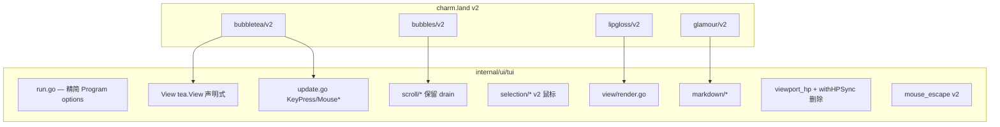

# v0.1.3 设计文档

> 版本：v0.1.3  
> 状态：规划中  
> 更新日期：2026-06-20  
> 审核：2026-06-20（五轮）  
> 需求：[REQUIREMENTS.md](REQUIREMENTS.md)

## 1. 设计目标

1. **一次性 v2**：从 v1.2.4 直跳 `charm.land/*/v2`，不做 v1.3 中转。
2. **语义等价、实现可换**：用户可见行为与 v0.1.2 对齐；v1 的 HP/`SyncScrollArea` 技巧由 v2 Cursed Renderer 替代。
3. **补延期项 + 收敛 permission API**。
4. **优先用 v2 原生能力**：剪贴板、声明式 View、键盘增强（后续可选）。

## 2. v2 依赖矩阵

### 2.1 目标版本

```
charm.land/bubbletea/v2   v2.0.7+    # 2026-06 最新 v2 补丁
charm.land/bubbles/v2     v2.1.0+
charm.land/lipgloss/v2    v2.0.4+
charm.land/glamour/v2     v2.0.1+
github.com/charmbracelet/x/ansi  v0.11.7+
github.com/charmbracelet/x/term  v0.2.2
```

间接依赖（随 tidy）：`colorprofile`、`ultraviolet`、`x/cellbuf`、`x/termios` 等。

### 2.2 `go get` 顺序

```bash
go get charm.land/bubbletea/v2@latest
go get charm.land/bubbles/v2@latest
go get charm.land/lipgloss/v2@latest
go get charm.land/glamour/v2@latest
go mod tidy
```

**勿**使用 `github.com/charmbracelet/bubbles/v2` 作为 require path（module 声明为 `charm.land/bubbles/v2`）。

### 2.3 v1 → v2 API 对照（ds-code 必改）

| v1（v0.1.2） | v2（v0.1.3） | ds-code 落点 |
|--------------|--------------|--------------|
| `import tea "github.com/charmbracelet/bubbletea"` | `import tea "charm.land/bubbletea/v2"` | 全 TUI 包 |
| `View() string` | `View() tea.View` | `safe_model.go`、`model/view/render.go` |
| `tea.NewProgram(m, tea.WithAltScreen(), tea.WithMouseCellMotion())` | `tea.NewProgram(m)`；View 内 `AltScreen`/`MouseMode` | [`run.go`](../../internal/ui/tui/run.go) |
| `case tea.KeyMsg:` | `case tea.KeyPressMsg:`（或 `tea.KeyMsg` 兼容别名） | `update.go`、`input/*` |
| `key.Type == tea.KeyEnter` | `msg.String() == "enter"` | 全局键位表 |
| `key.String() == " "` | `"space"` | 空格绑定 |
| `case tea.MouseMsg:` | `MouseClickMsg` / `MouseWheelMsg` / … | `selection_update.go`、`wheel_scroll.go` |
| `msg.X`, `msg.Y`（struct 字段） | `msg.Mouse().X`, `msg.Mouse().Y` | `mapMousePoint`、`handleMouseWheel` |
| `tea.MouseEvent(msg).IsWheel()` | `MouseWheelMsg` 类型分支 | `handleMouse` |
| `tea.MouseButtonLeft` / `MouseActionPress` | `tea.MouseLeft` / `MouseClickMsg` | `selection_update.go` |
| `KeyMsg` + `Paste`/`Runes` 粘贴 | `tea.PasteMsg`（`Content`）；默认 bracketed paste 启用 | `update.go` default → `updateInput` |
| `key.Type == KeyEnter && !key.Alt` | `String()=="enter" && !msg.Mod.Contains(tea.ModAlt)` | `updateInput` 多行输入（FR-1.10ad） |
| `msg.Type` / `msg.Runes` / `msg.Alt` | `msg.Code` / `msg.Text` / `msg.Mod` | `mouse_escape.go`、`updateInput` Enter 判定 |
| `case tea.KeyMsg:`（struct） | 优先 `case tea.KeyPressMsg:`；`KeyMsg` 为 interface 时须排除 `KeyReleaseMsg` | `update.go`（FR-1.10aa） |
| `MouseActionMotion` + `MouseButtonLeft` | `MouseMotionMsg` + `tea.MouseLeft` | `selection_update.go` 拖拽（FR-1.10y） |
| `len(passthrough.Runes) > 0` | `passthrough.Text != ""` | `update.go` mouse_escape 透传 |
| `tea.SyncScrollArea` / `viewport.ViewUp` | **移除**；Cursed Renderer  diff | [`viewport_hp.go`](../../internal/ui/tui/model/viewport_hp.go) |
| `viewport.HighPerformanceRendering` | **评估删除**；v2 默认优化渲染 | 同上 |
| `tea.WindowSize()` | `tea.RequestWindowSize` | `Init()` |
| `pbcopy` / 自研 OSC52 | `tea.SetClipboard` 优先 | [`internal/ui/clipboard`](../../internal/ui/clipboard/) |

权威清单：[UPGRADE_GUIDE_V2.md](https://github.com/charmbracelet/bubbletea/blob/main/UPGRADE_GUIDE_V2.md)

### 2.4 保留直依与 tidy 检查

| 模块 | v0.1.2 | v0.1.3 注意 |
|------|--------|-------------|
| `github.com/muesli/termenv` | 直依（`markdown/styles.go`） | 与 `lipgloss/v2` `ColorProfile()` 对齐；tidy 后确认版本 |
| `github.com/atotto/clipboard` | 间接 | v2 `tea.SetClipboard` 优先后可能移除；不强制 |
| v1 `muesli/ansi`、`cancelreader` | bubbletea v1 间接 | tidy 后 **应消失**；若残留须排查 |

**tidy 验收**：`go list -m -json all` 中无 `github.com/charmbracelet/bubbletea` v1 模块路径。

## 3. TUI 架构变更

### 3.1 声明式 View（核心）

v0.1.2：

```go
func (m *Model) View() string {
    return view.Render(&m.State, &m.chatVP, &m.toolVP, &m.input, m.selOverlay)
}

// run.go
tea.NewProgram(m, tea.WithAltScreen(), tea.WithMouseCellMotion(), ...)
```

v0.1.3 目标：

```go
func (m *Model) View() tea.View {
    v := tea.NewView("")
    v.AltScreen = true
    v.MouseMode = tea.MouseModeCellMotion
    v.SetContent(view.Render(&m.State, ...)) // 或迁移至 v.Content 字段
    if m.showCursor {
        v.Cursor = tea.NewCursor(m.cursorX, m.cursorY)
    }
    return v
}

// run.go — 选项大幅减少
tea.NewProgram(m, tea.WithoutCatchPanics())
```

`Model.Init()` / `safeModel.Init()` 须追加 `tea.RequestWindowSize`（v2 移除 `tea.WindowSize()` Cmd）。

> **v2 语义（FR-1.10z）**：`RequestWindowSize` 在 v2 中**直接返回 `WindowSizeMsg`**，不再是可放入 `tea.Batch` 的 `Cmd`。当前 v0.1.2 `Init()` 为：
>
> ```go
> return tea.Batch(m.listenPrompt(), session.LoadInitialHistory(...), m.scheduleNoticeScroll())
> ```
>
> 迁 v2 时可选策略（实现时择一并在单测锁定）：
>
> 1. **Init 追加自定义 Cmd**：`func() tea.Msg { return tea.RequestWindowSize }`（若 v2 允许 Cmd 闭包返回 WindowSizeMsg）；或
> 2. **首帧 Update**：若 `m.Width == 0`，在 `Update` 内处理首次 `WindowSizeMsg` 前显示 `Loading…`（`view.Render` 已有此分支）；tuitest harness 可继续手动设 `m.State.Width/Height`。
>
> 与 v1 相同处：`WindowSizeMsg` 注入后 `overlay.OnWindowSize` 逻辑不变；单测/tuitest 仍可直接 `Update(tea.WindowSizeMsg{…})` 或 `tea.WithWindowSize(w,h)`（ACCEPTANCE §6.2）。

`run.go` 保留 `tea.WithoutCatchPanics()`（v2 仍支持；迁后编译确认）。

**safeModel 双层 View（FR-1.10k）**：v0.1.2 `safeModel.View() string` 直接返回 `inner.View() string`。迁 v2 后 inner 返回 `tea.View`，wrapper 须：

```go
func (s *safeModel) View() tea.View {
    // panic recover → fallbackView() tea.View（AltScreen=true）
    return s.inner.View() // 或合并 ErrLine overlay
}
```

**禁止**在 wrapper 层丢弃 `AltScreen`/`MouseMode`/`Cursor`（否则 panic fallback 或 error 态终端行为不一致）。

`view.Render` 仍可返回 **plain 字符串**供 `SetContent`；lipgloss 样式链改 import `charm.land/lipgloss/v2`。

### 3.2 键位 API 全量迁移（FR-1.10h）

v0.1.2 大量代码仍用 v1 `tea.KeyType` 与 `bubbles/key.Matches`，**不能**只改 `update.go` 一处 `case`。

| v1 模式 | v2 目标 | 典型落点 |
|---------|---------|----------|
| `case tea.KeyMsg:` | `case tea.KeyPressMsg:` | `update.go` |
| `msg.Type == tea.KeyEnter` | `msg.String() == "enter"` | `update.go`、`cancel_test.go` |
| `msg.Type == tea.KeyEsc` | `"esc"` | `overlay/key.go`、`cancel_test.go` |
| `msg.Type == tea.KeyCtrlC` | `"ctrl+c"` | `overlay/exit.go` |
| `msg.Type == tea.KeyRunes` + `Runes` | `KeyPressMsg` 字符事件或 `msg.String()` | `input/mouse_escape.go`、补全输入 |
| `key.Matches(msg, km.PageDown)` | bubbles v2 `key.Matches` 或 `msg.String()=="pgdown"` | `wheel_scroll.go` |
| `func HandleKey(msg tea.KeyMsg)` | 签名改 `tea.KeyPressMsg` | `overlay/key.go`、`component/picker.go`、`subagent/nav.go`、`input/input.go`、`tcase/*` |

**单测**：所有 `tea.KeyMsg{Type: tea.Key*}` 构造器改为 v2 字符串键或 `KeyPressMsg` 工厂（若 bubbles v2 提供）。

### 3.2.1 粘贴（FR-1.10o）

v0.1.2 依赖 bubbles `textinput` 在 `Update` 中处理粘贴；v2 粘贴为独立消息：

```go
case tea.PasteMsg:
    // 须在到达 textinput 前识别，或确保 textinput v2 已处理
    return m.updateInput(msg)
```

`update.go` 的 `default` 分支当前将所有未知 `tea.Msg` 转发 `updateInput`——迁后须确认 `PasteMsg` 不被 `handleViewportScrollKey` 的 `KeyMsg` 断言误拦截。

v2 通过 `View.DisableBracketedPasteMode` 控制 bracketed paste（默认 **启用**）。ds-code 依赖 bracketed paste 获得 `PasteMsg`；**勿**在 `View()` 中默认禁用，除非有明确降级策略。

### 3.3 iTerm2 SGR 鼠标泄漏（FR-1.10j）

[`mouse_escape.go`](../../internal/ui/tui/model/input/mouse_escape.go) 在 v1 下从 `KeyRunes` 分片恢复 `tea.MouseMsg`，修复 iTerm2 快速滚轮时输入框出现 `[<64;…M` 乱码（v0.1.2 bugfix）。

**v2 迁移策略**：

1. 迁后先在 iTerm2 验证 v2 是否已原生解析 SGR；若已修复，可缩小 `mouse_escape` 为 no-op 或仅保留前缀缓冲。
2. 若仍泄漏：将 `extractLeakedSGREvents` 输出改为 `MouseWheelMsg` / `MouseClickMsg`（不再构造 v1 struct `MouseMsg`/`MouseEvent`）。
3. `AccumulateLeakedMouseKeys` 入参由 `tea.KeyMsg` 改为 `tea.KeyPressMsg`；`passthrough` 用 `msg.Text` 重建（**非** `Runes`）；`update.go` 中 `len(passthrough.Runes)` 须同步改。
4. 返回类型：`RecoverLeakedMouseKeys` / `AccumulateLeakedMouseKeys` 第一返回值改为 `[]tea.Msg`（或分类型 slice），`update.go` 循环 `handleMouse` 改 v2 分派（FR-1.10u）。
5. `parseLeakedSGRButton` 不再返回 `tea.MouseEvent`；直接构造 v2 鼠标消息。
6. `update.go` 键分支须先走 mouse_escape 再 `updateKey`。

### 3.4 滚动：保留 pending/drain，移除 HP 层

v0.1.2 三层滚动（[v0.1.2/DESIGN §17](../v0.1.2/DESIGN.md#17-tui-平滑滚动需求-7)）：

1. **输入层** `scrollBy` pending — **保留**（[`internal/ui/tui/scroll`](../../internal/ui/tui/scroll/)）
2. **Drain 层** proportional/adaptive — **保留**
3. **渲染层** HP + `SyncScrollArea` — **删除或空心化**

v2 Cursed Renderer 负责高效 diff；`viewport_hp.go` 中 `ViewUp`/`ViewDown`/`Sync` cmd 链 **不再适用**。

**迁移策略**：

| 组件 | 处置 |
|------|------|
| `scroll/controller.go` | **保留** pending/drain 逻辑 |
| `wheel_scroll.go` | 改接 `MouseWheelMsg`；`viewportPageDelta` 改 `KeyPressMsg`；drain **不再**调 `viewportScrollCmdFromLines`/`viewportSyncCmdFor`；`LineUp`/`LineDown` 仅驱动 YOffset + `scheduleSyncChatView`（FR-1.10t） |
| `wheel_scroll.go` `jumpViewport` | 保留 pending 合并 + `SetYOffset`；删 `viewportSyncCmdFor`；虚拟列表下 clamp 至 `totalLines-height`（FR-3.7.8） |
| `scroll/wheel.go` | `ComputeWheelStep(msg MouseWheelMsg)`；方向取自 `msg.Y`（**非** `MouseButtonWheel*`） |
| `viewport_hp.go` | **删除** |
| `withHPSync` / `applyViewportHP` / `syncChatViewportHP` / `viewportSyncCmd*` | **删除**；`update.go` 16 处 + `ticks.go` 1 处（含 `handleNoticeScrollTick`）改为 `scheduleSyncChatView` 或 no-op（FR-1.10m） |
| `viewportHPEnabled()` | **拆逻辑**：HP 相关删除；浮层/`Prompt`/选区禁入保留为 `chatInteractionEnabled()`（FR-1.10s） |
| `toolVP.HighPerformanceRendering` | **删除**（随 HP 移除；工具面板 Cursed Renderer 足够） |
| `sync.go` flush 节流 | **保留** FR-9.7 语义（drain 期间不 rebuild content） |

**选区与渲染（替代 FR-9.5–9.6 HP）**：

| 状态 | v0.1.2 | v0.1.3 |
|------|--------|--------|
| 无选区 | HP + `viewport.Sync` | Cursed Renderer 默认 diff |
| `selDragging` | 关闭 HP，全量 `View()` | 可见窗口 refresh + 选区 overlay（FR-3.7.6）；**禁止**全 transcript styled 拼接 |
| 复制后高亮保留 | HP 保持开启 | 正常滚轮；Cursed Renderer 处理 |

**不变量**（对用户）：

- 滚轮平滑、PgUp/PgDn 瞬时、滚轮中 PgUp 清 pending
- `DS_CODE_SCROLL_SPEED`、`scroll.DetectProfile()` **行为不变**（FR-2.9、FR-2.11）

#### 3.4.1 `viewportHPEnabled()` 拆分（FR-1.10s）

v0.1.2 该函数同时控制：

| 条件 | 作用 |
|------|------|
| `selDragging` | 关 HP → 全量渲染选区 |
| `Overlay != None` / `Prompt != nil` | 关 HP；`handleMouse`/`handleMouseWheel` 亦直接 return |
| 否则 | 开 HP |

删 HP 后须保留后两行语义为 `chatInteractionEnabled()`（名称可不同），供 `selection_update` / `wheel_scroll` / 浮层冲突使用；**不得**与 `HighPerformanceRendering` 同删。

#### 3.4.2 `syncChatViewportHP` 调用点（删链验收）

| 文件 | 约略场景 |
|------|----------|
| `update.go` | `WindowSizeMsg`（`withHPSync`）、`SlashOutput`/`SessionResumed`/`HistoryLoaded`/`Tool*`/`Subagent*`/`TurnStarted`/`TurnDone`/`chatSyncFlush`/`OverlayClose`、部分 `updateKey` 返回 |
| `ticks.go` | `handleNoticeScrollTick` → `withHPSync(scheduleNoticeScroll)` |

迁 v2 后上述路径仅保留业务 `Cmd`（如 `scheduleSyncChatView`），**不**再 batch viewport.Sync。

### 3.5 `View()` 去副作用（FR-1.10q）

v0.1.2 `Model.View()` 在渲染路径执行可变逻辑：

```go
func (m *Model) View() string {
    m.applyViewportHP()           // 改 viewport HP 标志
    // ...
    if len(m.plainLines) == 0 {   // 惰性重建 plainLines
        m.plainLines = view.ChatPlainContent(...)
    }
    return view.Render(...)
}
```

v2 声明式 `tea.View` 要求 `View()` **无副作用**（框架可能多次调用）。迁移策略：

| 逻辑 | v0.1.3 落点 |
|------|-------------|
| `applyViewportHP()` | **删除**（随 HP 移除） |
| `plainLines` 惰性填充 | 移入 `syncChatView` / `updatePlainLines`（已在 `selection_update` 部分路径调用） |
| `safe_model.View()` | 包装 `inner.View()` 为 `tea.View`；panic 时 `fallbackView() tea.View` |

### 3.6 鼠标选区

[`selection_update.go`](../../internal/ui/tui/model/selection_update.go) 由统一 `tea.MouseMsg` 改为分类型处理：

```go
switch msg := msg.(type) {
case tea.MouseClickMsg:
    if msg.Button == tea.MouseLeft { /* press / double-click */ }
case tea.MouseReleaseMsg:
    if msg.Button == tea.MouseLeft { /* copy on select */ }
case tea.MouseMotionMsg:
    if m.selDragging && msg.Button == tea.MouseLeft { /* extend selRange */ }
case tea.MouseWheelMsg:
    return m.handleMouseWheel(msg) // Y 方向；坐标 msg.Mouse().Y
}
```

双击/三击（FR-3.3）在 `MouseClickMsg` 路径用时间戳检测。

[`mapMousePoint`](../../internal/ui/tui/model/selection_update.go) 须改为 `mouse := msg.Mouse(); mouse.X, mouse.Y`（v2 `MouseMsg` 为 interface）。

### 3.7 剪贴板（FR-1.9 / FR-1.10v）

```go
// 优先（在 Update 返回链中，非 goroutine 内直接写 stdout）
return tea.SetClipboard(plainText)

// 降级：保留 internal/ui/clipboard 的 pbcopy/xclip/wl-copy
```

v0.1.2 `asyncCopy` 在 `tea.Cmd` 闭包内 goroutine 调 `clipboard.Write`（同步写 OSC52/平台命令）。迁 v2 时：

| 路径 | v0.1.2 | v0.1.3 目标 |
|------|--------|-------------|
| copy-on-select | `asyncCopy` → `copyResultMsg` | 优先 `tea.Batch(tea.SetClipboard(text), …)`；失败 fallback `clipboard.Write` + toast |
| 手动 `Ctrl+Shift+C` | 同上 | 同上 |
| SSH | 自研 OSC52 | v2 原生 OSC52 优先 |

SSH 场景优先 v2 OSC52；失败时 fallback + toast（与 v0.1.2 一致）。

**注意**：`tea.SetClipboard` 为 `tea.Cmd`，须在 `Update` 返回链中执行，不能仅在 `selection_update` 同步路径直接调（与 v1 `clipboard.Write` 同步写对比）。

### 3.8 bubbles v2 组件

| 组件 | import | 检查点 |
|------|--------|--------|
| viewport | `charm.land/bubbles/v2/viewport` | `YOffset`、`SetContent`、`LineUp`/`LineDown` |
| textinput | `charm.land/bubbles/v2/textinput` | 粘贴 `PasteMsg`、焦点；**评估** v2 光标是否改 `tea.View.Cursor`（FR-1.10w） |
| list | `charm.land/bubbles/v2/list` | `/tcase` picker（若用 bubbles list） |
| key | `charm.land/bubbles/v2/key` | `wheel_scroll.go` `viewportPageDelta` |

`component.Picker` 为自研列表，**不**依赖 bubbles `list`；仅 `tea.KeyPressMsg` 签名迁移。

### 3.9 glamour / lipgloss v2

- [`markdown/styles.go`](../../internal/ui/tui/markdown/styles.go)：`glamour.NewTermRenderer` + 子包 → `charm.land/glamour/v2/...`；`mdProfile` 缓存键须与 `lipgloss.ColorProfile()` v2 返回值类型对齐（可能由 `termenv.Profile` 变为 colorprofile 类型；**不可**假设 `==` 仍合法，FR-1.10i）
- [`chat/styles.go`](../../internal/ui/tui/chat/styles.go)、[`component/styles.go`](../../internal/ui/tui/component/styles.go)、[`internal/ui/theme/colors.go`](../../internal/ui/theme/colors.go)、[`internal/logging/warn.go`](../../internal/logging/warn.go)、[`header/*`](../../internal/ui/tui/header/)：lipgloss v2
- **回归**：`markdown/render_test.go`、`tuitest` 场景 `md-rich`

### 3.10 异步事件通道（FR-1.10x）

v0.1.2 Agent 回合与权限 prompt 由 goroutine 经外部通道注入 Bubble Tea：

```
submitLine / runTurnAsync / TUIPrompter
        │
        ├─► deps.Events chan tea.Msg  ──►  run.go: p.Send(msg)  ──►  model.Update
        │
        └─► deps.PromptCh  ──►  listenPrompt() Cmd  ──►  PromptRequestMsg
```

| 消息来源 | 典型 `tea.Msg` | 通道 |
|----------|----------------|------|
| Agent stream | `tuimsg.StreamContentMsg`、`TurnDoneMsg`、… | `Events` |
| Permission | `tuimsg.PromptRequestMsg` | **`PromptCh`**（非 Events） |
| Slash / 输入 | `tuimsg.SlashOutputMsg`（经 Cmd 闭包） | Cmd / Update 内 |

**迁移要点**：

- v2 `*tea.Program.Send` 须仍接受自定义 `tea.Msg`（业务 msg 类型不变）。
- **`PromptCh` + `listenPrompt()`** 不经过 `Events` goroutine；bubble 子代理权限 ask 依赖此路径（FR-1.10ac）。
- [`internal/tuitest/harness_test.go`](../../internal/tuitest/harness_test.go) **不**创建 `Program`：goroutine 中 `m.Update(msg)` 消费 `events`——迁 v2 后注入的 `WindowSizeMsg`/`KeyPressMsg` 构造器须同步改；harness 可继续手动设 `m.State.Width/Height`，**不必**经 `safeModel`/`tea.View`（除非单测显式测 View）。
- `input.SubmitLine` → `turn.RunAsync` 仍写 `deps.Events`；与 FR-1.10aa（键鼠类型）正交。

### 3.11 退出与 AltScreen 清理（FR-3.4.3）

v0.1.2 双击 Ctrl+C/Ctrl+D 经 [`overlay/exit.go`](../../internal/ui/tui/model/overlay/exit.go) `QuitAfterWait`：

```go
tea.Sequence(
    func() tea.Msg { s.WaitTurnsOnExit(); return nil },
    tea.Quit,
)
```

v2 无 `ExitAltScreen` Cmd；退出时框架根据末帧 `View.AltScreen` 清理备用屏幕。迁后须验证：**双击退出后终端无 alt screen 残留**（AC-2.3、FR-3.4.3）。`tea.Quit` 与 `tea.Sequence` 在 v2 仍可用。

## 4. 影响面地图



### 高 touch 文件（约 50+）

| 优先级 | 路径 |
|--------|------|
| P0 | `run.go`, `safe_model.go`, `model/update.go`, `model/view/render.go` |
| P0 | `selection_update.go`, `wheel_scroll.go`, `viewport_hp.go` |
| P0 | `model/input/*`, `markdown/*`, `**/styles.go` |
| P1 | `overlay/*`, `header/*`, `chattool/*`, `**/ *_test.go` |
| P1 | `internal/tuitest/**` |

### 高 touch 文件（66 个 `.go` 含 charm import）

| 优先级 | 路径 | 备注 |
|--------|------|------|
| P0 | `run.go`, `safe_model.go`, `model/update.go`, `model/view/render.go`, `model/model.go` | View/Init/Update 骨架；Events/Send（§3.10） |
| P0 | `selection_update.go`, `wheel_scroll.go`, `scroll/wheel.go`, `viewport_hp.go`（删） | 键鼠 + 滚动 |
| P0 | `model/input/*`（含 `mouse_escape.go`） | SGR 泄漏 + textinput |
| P0 | `markdown/*`, `**/styles.go`, `internal/ui/theme/colors.go`, `internal/logging/warn.go` | 样式栈 |
| P1 | `overlay/*`, `header/*`, `chattool/*`, `component/picker.go`, `model/subagent/*` | 键位回调 |
| P1 | `deps/deps.go`, `style/style.go`, `layout/layout.go`, `chattool/styles.go` | lipgloss / `Events` 类型 |
| P1 | `model/turn/update.go`, `session/update.go`, `subagent/update.go`, `overlay/overlay.go` | 自定义 `tea.Msg` 分派 |
| P1 | `internal/tuitest/**`（4 文件） | harness 仍用 `tea.Msg`；可选用 `tea.WithWindowSize` / `tea.WithColorProfile` |
| P1 | build tag 分裂（6 文件，FR-1.10r） | 见下表 |
| P1 | 全部 `*_test.go`（约 20+） | `KeyMsg`/`MouseMsg` 构造器 |

#### build tag 分裂文件（FR-1.10r）

| 文件 | tag | 备注 |
|------|-----|------|
| `model/input/input_release.go` | `!debug` | `HandleSubmit` 等 |
| `model/input/input_debug.go` | `debug` | debug 输入钩子 |
| `model/input/submit_hook_release.go` | `!tuitest` | |
| `model/input/submit_hook_tuitest.go` | `tuitest` | |
| `model/tcase/picker_release.go` | `!tuitest` | |
| `model/tcase/picker_tuitest.go` | `tuitest` | |

`make test` 与 `make test-tui` 须分别覆盖 release / tuitest 分裂路径。

## 5. FR-3 / FR-4 设计

### 5.1 子代理 `@`（FR-3.1）

[`spawn/execute.go`](../../internal/agent/spawn/execute.go) 子 `ctxSvc` 当前无 `AtExpander`（v0.1.2 FR-3.10 刻意不展开）。v0.1.3 在组装 `ctxpkg.Service` 时注入：

```go
ctxSvc := &ctxpkg.Service{
    // ...
    AtExpander: &ctxpkg.AtExpander{Cfg: cfg, Perm: perm},
}
```

`perm` 为子代理 `Engine`（worktree 时 workspace 已 rebind）；`AtExpander` 须 respect 子代理权限边界。验收：`task` 子代理 prompt 含 `@file` 时上下文含文件内容；worktree 子代理 `@` 路径相对于子 workspace。

### 5.2 浮层选区（FR-3.2）

**首期（P1 最低）**：`selection_update.go` 在 `Overlay != None` 或 `Prompt != nil` 时忽略聊天/工具选区（v0.1.2 已实现 `viewportHPEnabled` 类似逻辑）。

**完整版（可选）**：浮层文本走 `plainLines` 子集，复用 `selection` 包在 overlay 矩形内 hit-test。

### 5.3 选区增强（FR-3.3，P1–P2）

- 双击：`MouseClickMsg` + 时间窗 < 400ms + 同坐标 → 扩选词界（`selection` 包或 x/ansi 字宽）
- 键盘：`Shift+arrow` 在 `updateKey` 扩展 `selRange`；触顶/底时调 `jumpViewport`

### 5.4 `IsSensitiveAbs`（FR-4）

- 导出函数改名为 `isSensitiveAbs`；`SkipSensitiveAbs` / `checkReadablePath` / [`path_api.go`](../../internal/permission/path_api.go) 内部调用同步
- `permission/sensitive_test.go` 改为表驱动测 `SkipSensitiveAbs` 或通过 `Engine` 间接测
- **禁止**包外 `import` 后调用 `IsSensitiveAbs`（`go doc` + grep 验收）

键鼠 handler 实现 FR-3 时统一使用 FR-1.10c/d/h 的 v2 消息类型。

### 5.5 聊天区虚拟列表（FR-3.7，原 v0.1.2 FR-9.12）

v0.1.2 数据流（全量拼接）：

```text
[]chatBlock ──RenderCached (block cache)──► 全量 styled 字符串
        ──join header──► buildViewportContent ──► chatVP.SetContent(全文)
        ──StripANSI──► plainLines（选区）
```

v0.1.3 目标（窗口化渲染）：

```text
[]chatBlock ──RenderCached──► block 行切片（缓存不变）
        ──LineCatalog──► 总行数 totalLines、块→行偏移
        ──plain catalog──► plainLines[]（全量 plain，无 styled）
        ──VisibleWindow(yOffset, height)──► 仅 styled 可见行 ──► chatVP.SetContent
```

#### 模块划分

| 组件 | 职责 |
|------|------|
| `chat.RenderCache` | **保留** block 级 styled 行缓存 |
| `chat.LineCatalog`（新，名可不同） | header + blocks 的行数索引；width/toolDetails 变化时 invalidate |
| `view.buildViewportContent` | 拆为：`RebuildCatalog` + `RenderVisibleChat(yOffset, height)` |
| `view.SyncChat` | `SetContent` 仅可见窗口；`chatVP` 仍用 `YOffset` 表全局滚动位置 |
| `model.plainLines` | 由 catalog 派生全量 plain（FR-3.7.4）；`updatePlainLines` 不再触发全量 styled 拼接 |
| `visibleHighlightedLines` | **保留**；输入为 plain 全量 + yOffset/height 切片 |

#### 与滚动 / 选区 / 流式的关系

| 场景 | 行为 |
|------|------|
| 滚轮 drain（仅 YOffset 变） | **不重算** block cache；仅 `RenderVisibleChat` 换窗口 |
| 流式 tail block 更新 | invalidate 尾 block + catalog；可见窗口 rebuild |
| `scheduleSyncChatView` flush | 与 FR-9.7 一致；flush 时 rebuild catalog（若脏）+ 可见窗口 |
| `selDragging` | 可见窗口 styled 含选区 overlay（FR-3.7.6）；plain 索引仍全局 |
| 工具面板 `toolVP` | **首期**可保持全量 `SetContent`（行数通常较短）；聊天区优先虚拟化 |

#### YOffset 与 bubbles viewport

bubbles `viewport` 的 `YOffset` 仍表示「内容顶部被滚上去的行数」。虚拟列表下 `SetContent` 传入的是 **窗口字符串**，需二选一（实现时择一并单测锁定）：

1. **内容坐标映射**：`SetContent` 仍为可见切片，自定义 `totalLines` 供 scroll controller 使用；viewport 高度 = 窗口行数，`YOffset` 由 model 维护（可能需评估 bubbles v2 viewport API）；或
2. **占位前缀**：窗口前填充 `(YOffset)` 行空行/不可见占位 — **不推荐**（破坏 Cursed diff）。

**推荐方向 1**：在 `scroll.Controller` / `Model` 层维护 `totalLines`，`wheel_scroll` / PgUp/PgDn 对 `YOffset` clamp `[0, totalLines-height]`；`SyncChat` 只渲染 `[YOffset, YOffset+height)` 的 styled 行写入 viewport（viewport 内部 YOffset 可固定 0 或同步，以实现为准）。

#### YOffset 关键路径（FR-3.7.8）

| 路径 | v0.1.2 行为 | v0.1.3 注意 |
|------|-------------|-------------|
| `SyncChat` | `atBottom` → `GotoBottom()`；否则 `SetYOffset(yoff)` | 虚拟列表下 `GotoBottom` = `YOffset = totalLines - height` |
| `jumpViewport` | `SetYOffset(yoff+pending+delta)` + HP Sync | 删 Sync；clamp；drain 结束 `scheduleSyncChatView` 刷新可见窗口 |
| `handleWheelScrollTick` drain | `LineUp`/`LineDown` + HP cmd | 仅 YOffset 变化 + 可见窗口 rebuild |
| resize | `overlay.OnWindowSize` → `syncAllViews` | 额外 invalidate `LineCatalog`（FR-3.7.9） |

#### 验收基准

- 合成 500+ 行 fixture：`BenchmarkSyncChatView` 或 `TestLineCatalog_windowCost` — 总行数 ×2 时 rebuild 耗时增幅 **<20%**（FR-3.7.7）
- AC-3.1–3.3 选区/滚轮手动项 **不退化**

## 6. 实现顺序


**Phase A–F 为 P0**；G 含 FR-3 P1 + **FR-3.7**（建议在 D/E 删 HP 并回归通过后实施）。

## 7. 风险与缓解

| 风险 | 缓解 |
|------|------|
| v2 API 文档滞后 | 对照 Upgrade Guide + bubbles v2 源码 |
| 去掉 HP 后滚轮卡顿 | Cursed Renderer + pending/drain；**FR-3.7 虚拟列表** 避免全量 SetContent |
| 虚拟列表 YOffset 语义漂移 | FR-3.7.3/3.7.8 单测锁定 totalLines / 滚轮 / PgUp / `jumpViewport` / `GotoBottom`；对照 v0.1.2 AC §8 |
| resize 后行目录 stale | FR-3.7.9：`WindowSizeMsg` 触发 catalog + cache invalidate |
| Permission 双通道 regression | `PromptCh` smoke + bubble 子代理 ask（FR-1.10ac） |
| Alt+Enter 误提交 | FR-1.10ad 单测：`ModAlt` + enter 不触发 SubmitLine |
| 键位回归（空格/Enter/Esc/Ctrl+C） | 集中键位表单测；`/help` 手动扫；`safe_model_test`；排除 `KeyReleaseMsg`（FR-1.10aa） |
| Agent 异步 Send 失效 | `make test-tui` + 手动 permission prompt smoke（FR-1.10x） |
| 粘贴大段文本 | `PasteMsg` + textinput 回归 |
| View 多次调用 | 无副作用；选区/滚轮不因重复 `View()` 抖动 |
| MouseWheelMsg 坐标系变化 | port `wheel_scroll_test` + `scroll/wheel.go` |
| mouse_escape 与 v2 冲突 | iTerm2 手动 #41；必要时保留泄漏恢复（FR-1.10u） |
| wheel_scroll 仍依赖 viewport_hp 辅助函数 | 删 HP 前须先改 drain/jump 路径（FR-1.10t） |
| HP 测试断言残留 | `wheel_scroll_test`/`selection_test`/`viewport_hp_test` 改写或删除 |
| glamour 视觉漂移 | `md-rich` + `markdown/render_test.go` |
| CI 意外拉回 v1 | DESIGN §10 守卫脚本 |
| 删除 HP 后选区高亮错位 | `selDragging` 强制全量 `SetContent` |
| `tea.SetClipboard` 异步 | 复制 toast 时机与 v0.1.2 对齐 |

## 8. 不在此设计内

- v1.3.x 兼容或 feature flag 双栈
- Kitty 键盘增强全量绑定（v2 支持，后续版本）
- Transcript scrollback 完整实现（FR-3.5 P2）
- MCP spill GC、`@` compact 专用脱敏、`View.OnMouse`（仍不在 v0.1.3）

## 9. 文档更新

| 文档 | 变更 |
|------|------|
| [CHANGELOG.md](../../CHANGELOG.md) | v0.1.3 Breaking：Bubble Tea v2、import 路径 |
| [README.md](../../README.md) | TUI 栈说明（若提及 Charm 版本） |
| [CLAUDE.md](../../CLAUDE.md) | TUI 栈改为 charm.land v2 |
| [docs/README.md](../README.md) | v0.1.3 说明 |
| [internal/ui/tui/README.md](../../internal/ui/tui/README.md) | 消息流改为 `KeyPressMsg`/`Mouse*Msg`/`tea.View`；虚拟列表数据流（FR-3.7） |
| [docs/v0.1.0/CONFIG.md](../v0.1.0/CONFIG.md) | 若剪贴板行为变更，补充 `tui.copy_on_select` 与 OSC52 说明 |
| [docs/v0.1.0/SECURITY-SYNC.md](../v0.1.0/SECURITY-SYNC.md) | 若 `tea.SetClipboard` 改变 TUI 复制后端优先级 |

## 10. v1 回退守卫（NFR-4）

建议在 `Makefile` 增加 `verify-charm-v2`（可由 `verify-release` 依赖）：

```makefile
verify-charm-v2:
	@! rg 'github.com/charmbracelet/(bubbletea|bubbles|lipgloss|glamour)' \
		--glob '*.go' --glob 'go.mod' . | grep -v '^#' \
		|| (echo "v1 charm import detected"; exit 1)
	@rg -q 'charm.land/bubbletea/v2' go.mod || (echo "missing charm.land/bubbletea/v2"; exit 1)
	@rg -q 'charm.land/bubbles/v2' go.mod || (echo "missing charm.land/bubbles/v2"; exit 1)
	@rg -q 'charm.land/lipgloss/v2' go.mod || (echo "missing charm.land/lipgloss/v2"; exit 1)
	@rg -q 'charm.land/glamour/v2' go.mod || (echo "missing charm.land/glamour/v2"; exit 1)
```

可选：CI `test` job 末尾调用 `make verify-charm-v2`；`verify-release` / release workflow 依赖同一 target（NFR-9）。  
**说明**：当前 [`.github/workflows/ci.yml`](../../.github/workflows/ci.yml) 与 [`.github/workflows/release.yml`](../../.github/workflows/release.yml) **均不**执行 `make test-tui`；发布门槛仍依赖本地 / release 脚本（NFR-8）。
