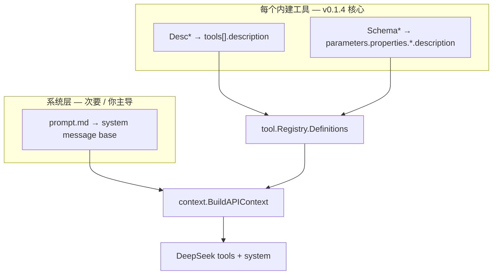
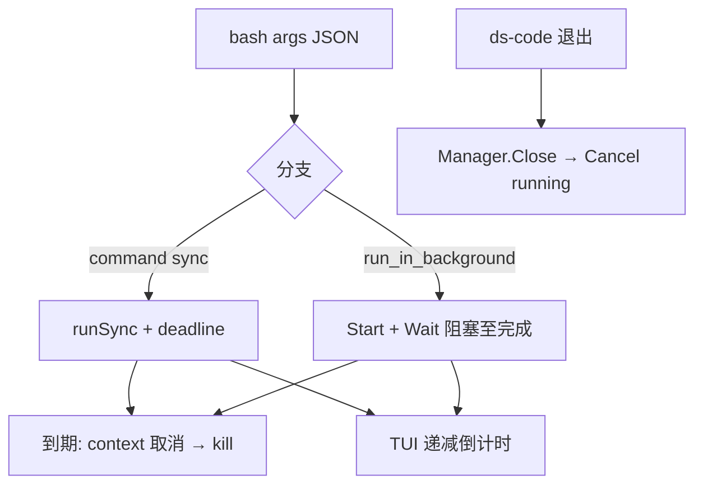

# v0.1.4 设计文档

> 版本：v0.1.4  
> 状态：规划中  
> 更新日期：2026-06-21  
> 需求：[REQUIREMENTS.md](REQUIREMENTS.md)

## 1. 设计目标

1. **逐工具改写 LLM 提示词**，台账见 [TOOL_PROMPTS.md](TOOL_PROMPTS.md)。
2. **文案所有权在你**：技术设计解决「放哪、怎么注入、怎么测」，不预设正文内容。
3. **`bash` 改名与交叉引用**一次做对，避免 FR-1 定稿后再改一轮。

## 2. 提示词在 API 中的位置



模型主要从 **`tools[].description`** 学习单工具用法；系统提示词负责全局规范。两层重复时由你决定保留在哪一层（REQUIREMENTS FR-3.4）。

## 3. 工具 prompt 标准模式

> **必遵**：与 [REQUIREMENTS FR-0](REQUIREMENTS.md#fr-0-工具-prompt-标准模式必遵) 一致。`bash` 为首个落地样例。

### 3.1 与 system prompt 对齐

| 层 | 路径 | 渲染入口 |
|----|------|----------|
| System | `internal/prompt/prompt.md` | `DefaultSystemBase()` |
| 工具 | `internal/tool/builtin/<tool>/usage.prompt` | `RenderDesc()` |

二者均：`//go:embed` + `text/template` + `tool.Name*` 注入。

### 3.2 参考实现（bash / shell 包）

```text
internal/tool/builtin/shell/
├── usage.prompt    # 编辑 Description 正文
├── text.go         # embed、descVars、RenderDesc()、Schema*
├── shell.go        # Description() → RenderDesc()
└── text_test.go    # 无 {{. 残留；wire 名已注入
```

```go
// shell.go
func (t *ShellTool) Description() string { return RenderDesc() }

// text.go — 片段
//go:embed usage.prompt
var descTemplate string

func RenderDesc() string {
    return renderDesc(defaultDescVars()) // Bash/ReadFile/… ← tool.Name*
}
```

`usage.prompt` 片段：

```markdown
- 读取文件：{{.ReadFile}}（禁止 cat/head/tail）
- 检索文件内容：{{.Grep}}（禁止 grep/rg）
```

### 3.3 各工具标准布局

```text
internal/tool/builtin/
├── text.go                 # 共享 Schema*（无 usage.prompt）
├── read_file/
│   ├── usage.prompt        # Description 正文
│   ├── text.go             # RenderDesc + SchemaOffset 等
│   ├── read_file.go
│   └── text_test.go
├── grep/
│   ├── usage.prompt
│   └── …
└── shell/                  # bash — 参考实现
    └── …
```

**迁移**：现有 `const Desc*`、`fmt.Sprintf(Desc*, …)` 在改写时迁入 `usage.prompt` 并改为模板占位符。

### 3.4 Schema 与 Err/Result 仍留 text.go

| 类型 | 位置 | 说明 |
|------|------|------|
| `tools[].description` | `usage.prompt` → `RenderDesc()` | 长文、可含 Markdown |
| `parameters.*.description` | `text.go` 的 `Schema*` | 短字段说明；可后续再 embed 独立文件（**非 v0.1.4 范围**） |
| `Err*` / `Result*` | `text.go` | 不发给 LLM |

### 3.5 tool_search 归一

将 `tool_search.go` 内联 Description 迁至 `tool_search/usage.prompt` + `RenderDesc()`，结构同 FR-0。

### 3.6 测试

每个工具建议 `text_test.go`：

```go
func TestRenderDesc_injectsBuiltinToolNames(t *testing.T) { … }
func TestXxxTool_Description_matchesRenderDesc(t *testing.T) { … }
```

断言：无 `{{.` 残留；所需 `tool.Name*` 已出现。

## 4. `bash` 改名（配套）

| 层 | 名称 |
|----|------|
| LLM / registry | `bash` |
| Go 包 | `shell` |
| YAML | `tools.shell` |

权限、TUI、审计比较处用 `tool.NameShell.Matches(s)`。详见 v0.1.4 初版 DESIGN §5（逻辑不变）。

## 5. 系统提示词载体（次要）

与工具层 **同一模式**：[`internal/prompt/prompt.md`](../../internal/prompt/prompt.md) + [`text.go`](../../internal/prompt/text.go) 的 `DefaultSystemBase()`。

## 6. 测试策略

| 类型 | 做法 |
|------|------|
| 工具名注入 | `read_file` description 含 `bash`；`NameShell == toolname.Bash` |
| 快照测试 | **仅对你确认的稳定文案** 加 `Contains` 断言；改写阶段避免脆测试绑死草稿 |
| 行为回归 | `make test` 全绿；不改 Schema 字段名/类型 |

## 7. 文档

| 文件 | 用途 |
|------|------|
| [TOOL_PROMPTS.md](TOOL_PROMPTS.md) | 逐工具状态、基线快照、待确认问题 |
| [ACCEPTANCE.md](ACCEPTANCE.md) | 发布前逐工具勾选 |
| `internal/tool/builtin/*.md` | 实现说明，滞后同步可接受 |

## 8. 实现顺序

1. 与你确认：优先工具 + Desc 长短风格 + 是否在每工具重复「禁 bash 绕行」。
2. `bash` 改名链（可与第 1 步并行）。
3. 按 TOOL_PROMPTS 排期逐工具：草稿 → 你确认 → **`usage.prompt` + `text.go`（FR-0）**。
4. 共享 `builtin/text.go` 审定。
5. 可选：系统 `prompt.md` 你审定后合入。
6. CHANGELOG + ACCEPTANCE 收尾。

## 9. bash 工具行为设计（FR-5）

### 9.1 参数

| 字段 | 说明 |
|------|------|
| `run_in_background` | 替代 `background`；默认 false；OS 后台启动，**工具调用阻塞至完成**；同轮可并行 |
| `timeout_ms` | sync 与 bg 均适用；cap 600000；与 `tools.shell.timeout` 二选一（per-call 优先） |
| ~~`job_id` / `cancel`~~ | 从 LLM schema 移除 |
| ~~`list_jobs`~~ | 从 LLM schema 移除 |

### 9.2 超时与生命周期

```text
ResolveShellTimeout(cfg, timeout_ms)
  → runSync / runBackground: context.WithTimeout + kill on expiry
  → TUI: ShellTimeoutDeadline(now, cfg, rawArgs) → ToolTimeoutDeadline
  → Close (exit): Cancel all running jobs in this session
  → Open: async reconcileStaleJobs (fix stale disk meta; no cross-session attach)
```

### 9.3 TUI 倒计时

| 组件 | 职责 |
|------|------|
| `chat.Block.ToolTimeoutDeadline` | ToolStart 写入；Finish 清零 |
| `NeedsBashTimeoutTick` | 扩展 ThinkingTick 刷新 |
| `FormatTimeoutCountdown` | 标题末尾 `M:SS` 或 `Ns` |


