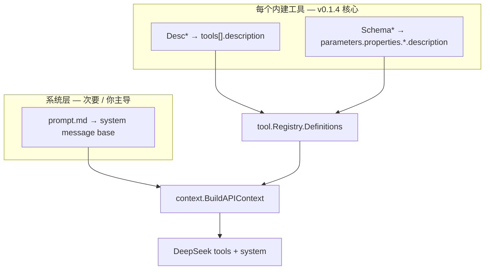

# v0.1.4 设计文档

> 版本：v0.1.4  
> 状态：规划中  
> 更新日期：2026-06-21  
> 需求：[REQUIREMENTS.md](REQUIREMENTS.md)

## 1. 设计目标

1. **逐工具改写 LLM 提示词**，台账见 [TOOL_PROMPTS.md](TOOL_PROMPTS.md)。
2. **文案所有权在你**：技术设计解决「放哪、怎么注入、怎么测」，不预设正文内容。
3. **`bash` 改名与交叉引用**一次做对，避免 FR-1 定稿后再改一轮。

## 2. 提示词在 API 中的位置



模型主要从 **`tools[].description`** 学习单工具用法；系统提示词负责全局规范。两层重复时由你决定保留在哪一层（REQUIREMENTS FR-3.4）。

## 3. 代码组织（不变）

```text
internal/tool/builtin/text.go           # 共享 SchemaPath*、SchemaPatchBody 等
internal/tool/builtin/<tool>/text.go      # Desc*、工具专有 Schema*、Result*、Err*
internal/tool/builtin/<tool>/<tool>.go    # Description() { return Desc* } 或 Sprintf
```

### 3.1 交叉引用注入

当 Desc 需要提到其它工具名时，优先：

```go
// read_file/read_file.go
return fmt.Sprintf(DescReadFile, tool.NameShell.String())

// 或在 text.go 用多个 %s，由 .go 传入 tool.NameGrep.String() 等
```

避免在已定稿的 `DescGrep` 字符串里写死 `bash`，除非你为可读性明确要求。

### 3.2 tool_search 归一

将 `tool_search.go` 内联：

```go
return "按名称查找工具的完整定义（仅用于延迟加载的工具）"
```

迁至 `tool_search/text.go` 的 `DescToolSearch` + `SchemaToolName`，与其它工具一致。

## 4. `bash` 改名（配套）

| 层 | 名称 |
|----|------|
| LLM / registry | `bash` |
| Go 包 | `shell` |
| YAML | `tools.shell` |

权限、TUI、审计比较处用 `tool.NameShell.Matches(s)`。详见 v0.1.4 初版 DESIGN §5（逻辑不变）。

## 5. 系统提示词载体（次要）

- `//go:embed prompt.md` + `text/template` 仅当你审定正文后合入。
- 模板变量与 FR-1 工具 wire 名共用 `tool.Name*`。
- **未审定前**：可不把「完整 system 章节齐全」作为 v0.1.4 发布门槛。

## 6. 测试策略

| 类型 | 做法 |
|------|------|
| 工具名注入 | `read_file` description 含 `bash`；`NameShell == toolname.Bash` |
| 快照测试 | **仅对你确认的稳定文案** 加 `Contains` 断言；改写阶段避免脆测试绑死草稿 |
| 行为回归 | `make test` 全绿；不改 Schema 字段名/类型 |

## 7. 文档

| 文件 | 用途 |
|------|------|
| [TOOL_PROMPTS.md](TOOL_PROMPTS.md) | 逐工具状态、基线快照、待确认问题 |
| [ACCEPTANCE.md](ACCEPTANCE.md) | 发布前逐工具勾选 |
| `internal/tool/builtin/*.md` | 实现说明，滞后同步可接受 |

## 8. 实现顺序

1. 与你确认：优先工具 + Desc 长短风格 + 是否在每工具重复「禁 bash 绕行」。
2. `bash` 改名链（可与第 1 步并行）。
3. 按 TOOL_PROMPTS 排期逐工具：草稿 → 你确认 → `text.go`。
4. 共享 `builtin/text.go` 审定。
5. 可选：`prompt.md` 你审定后合入。
6. CHANGELOG + ACCEPTANCE 收尾。
