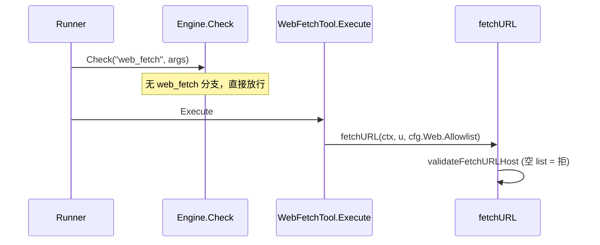
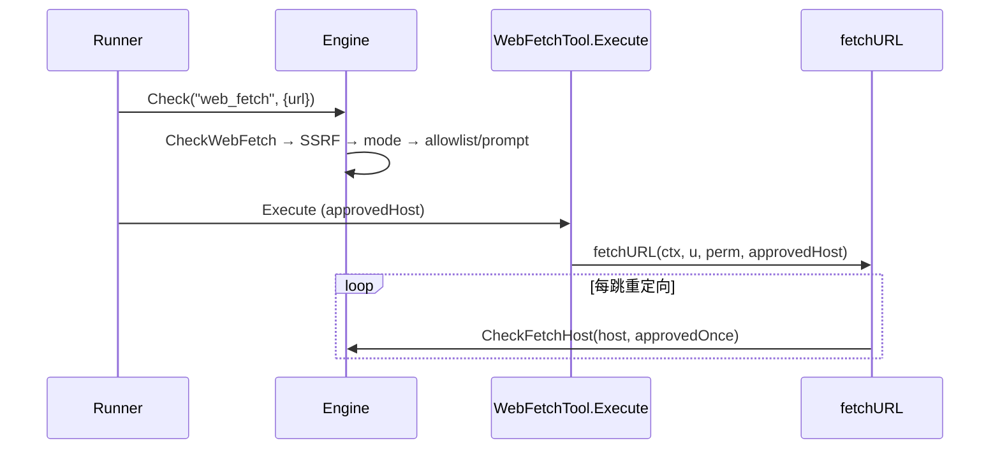
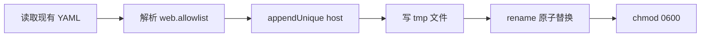
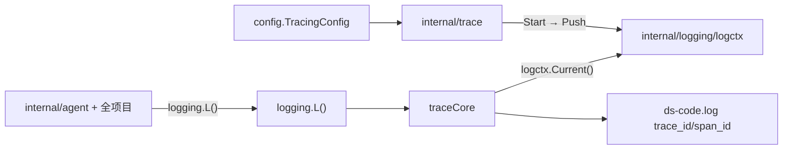
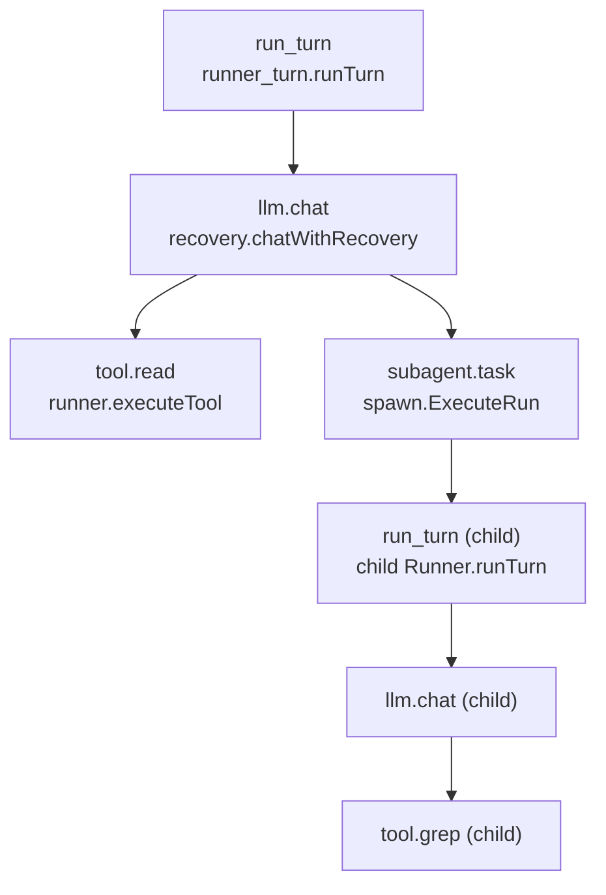
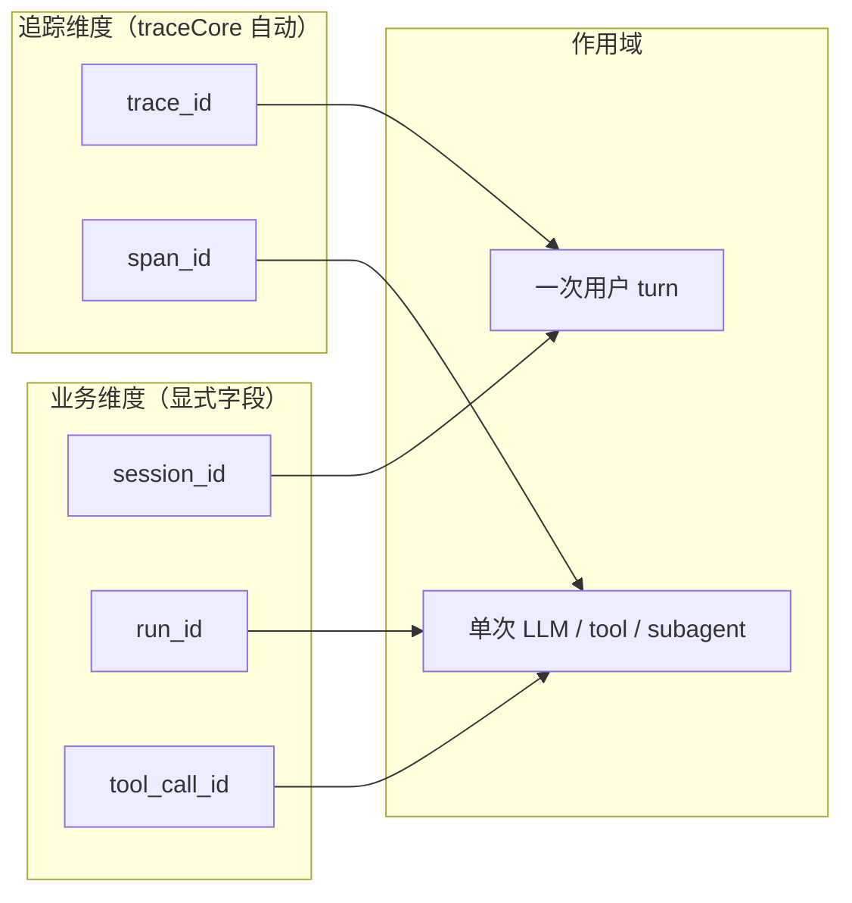
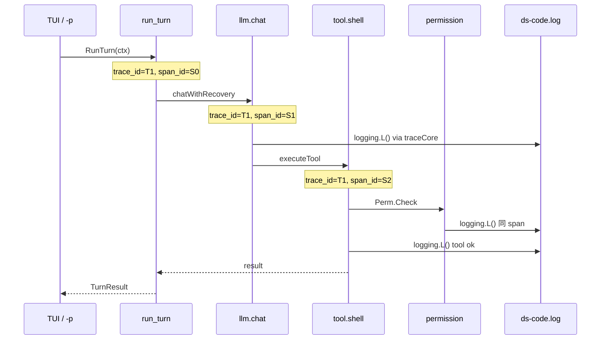

# v0.1.5 设计文档

> 版本：v0.1.5  
> 状态：规划中  
> 更新日期：2026-06-30  
> 需求：[REQUIREMENTS.md](REQUIREMENTS.md)

## 1. 设计目标

1. **单一职责**：web 主机访问策略集中在 `permission.Engine`，与路径 S3 denylist、write/shell ask 并列。
2. **语义修正**：allowlist 从「白名单门禁（空=全拒）」改为「预设集合 + 交互追加」。
3. **API 分离**：`WebFetchPrompter` 三选一独立于 `Prompter` 二选一，避免类型污染。
4. **最小侵入**：`web_fetch` 工具仅持有 `Perm` 引用；runner 已在 `Check` 阶段拦截，fetch 层做逐跳 SSRF + approved 校验。
5. **可观测性分层**：业务关联（`session_id`、`run_id`）与分布式追踪（`trace_id`、`span_id`）并存；追踪基于 OpenTelemetry，默认关闭、按需开启。

## 2. 现状与迁移面

### 2.1 当前调用链（v0.1.4）



### 2.2 目标调用链（v0.1.5）



### 2.3 迁移文件清单

| 操作 | 路径 |
|------|------|
| 新增 | `internal/permission/web.go` |
| 新增 | `internal/permission/web_prompt.go` |
| 新增 | `internal/permission/web_test.go` |
| 新增 | `internal/config/web_allowlist.go` |
| 新增 | `internal/config/web_allowlist_test.go` |
| 修改 | `internal/permission/engine.go` |
| 修改 | `internal/permission/log.go` |
| 修改 | `internal/tool/builtin/web_fetch/web_fetch.go` |
| 修改 | `internal/tool/builtin/web_fetch/fetch.go` |
| 修改 | `internal/tool/setup/setup.go` |
| 删除 | `internal/tool/builtin/web_fetch/web_fetch_policy.go` |
| 修改 | `cmd/ds-code/app/runner.go` |
| 修改 | `cmd/ds-code/app/tui.go` |
| 修改 | `internal/agent/spawn/execute.go` |
| 修改 | `internal/ui/tui/...`（overlay + msg） |
| 新增 | `internal/trace/setup.go`、`span.go`、`*_test.go` |
| 新增 | `internal/logging/logctx.go`（goroutine 上下文栈） |
| 新增 | `internal/logging/trace_core.go`（`traceCore` 包装 `zapcore.Core`） |
| 新增 | `internal/logging/context.go`（`FromContext`，可选） |
| 修改 | `internal/config/flags.go`、`load.go`、`validate.go`、`types.go` |
| 修改 | `configs/example.yaml`（`tracing` 段） |
| 修改 | `internal/logging/logging.go`（`Setup` 串联 trace 初始化） |
| 修改 | `internal/agent/runner_turn.go`、`runner_loop.go`、`runner.go`、`recovery.go` |
| 修改 | `internal/agent/spawn/execute.go`、`ephemeral.go` |
| 修改 | `cmd/ds-code/main.go`（`setupLogging` 旁挂载 trace cleanup） |
| 修改 | `go.mod`（OTel 依赖） |

## 3. `permission/web.go`

### 3.1 自 `web_fetch_policy.go` 迁入

| 函数 | 可见性 | 说明 |
|------|--------|------|
| `CheckFetchSSRF(host string) error` | 导出 | loopback、私有 IP、metadata、DNS 失败 |
| `hostAllowed(host, allowlist []string) bool` | 包内 | `*.domain` 通配；**无**空 list 全拒 |
| `checkFetchAllowlist(host string) bool` | `Engine` 方法 | 读 `e.WebAllowlist` |
| `CheckFetchHost(host, approvedOnce bool) error` | `Engine` 方法 | SSRF + mode；`approvedOnce` 跳过 allowlist |
| `CheckWebFetch(rawURL string) error` | `Engine` 方法 | 工具级入口 |

### 3.2 `CheckWebFetch` 伪代码

```go
func (e *Engine) CheckWebFetch(rawURL string) error {
    host := parseHost(rawURL)
    if err := CheckFetchSSRF(host); err != nil {
        return err
    }
    if e.Mode == "auto" {
        return nil
    }
    // readonly / ask — 行为相同
    if e.checkFetchAllowlist(host) {
        return nil
    }
    if e.WebFetchPrompter == nil {
        if !e.Interactive {
            return ErrNeedTTY
        }
        return ErrDenied // 或等价
    }
    choice, err := e.WebFetchPrompter(host, rawURL)
    if err != nil {
        return err
    }
    switch choice {
    case WebFetchAllowOnce:
        return nil // runner 记录 approvedHost 传入 Execute
    case WebFetchAllowAlways:
        norm := normalizeHost(host)
        e.WebAllowlist = appendUnique(e.WebAllowlist, norm)
        return config.AppendWebAllowlist(e.ProjectRoot, norm)
    default:
        return ErrRejected
    }
}
```

### 3.3 `CheckFetchHost`（逐跳）

fetch 重定向循环内调用；`approvedOnce == true` 时该 host 已通过用户「允许一次」审批，跳过 allowlist/prompt，仍执行 SSRF。

```go
func (e *Engine) CheckFetchHost(host string, approvedOnce bool) error {
    if err := CheckFetchSSRF(host); err != nil {
        return err
    }
    if approvedOnce {
        return nil
    }
    if e.Mode == "auto" {
        return nil
    }
    if e.checkFetchAllowlist(host) {
        return nil
    }
    // 同 host 重定向不应二次 prompt — 由 Execute 传入 approvedOnce
    return fmt.Errorf("host %q not approved for redirect", host)
}
```

> **注意**：跨域重定向仍走现有 `CrossHostRedirect` 返回路径，由模型重新 `web_fetch`；同 host 内重定向用 `approvedOnce`。

## 4. 三选一 Prompter API

### 4.1 类型定义（`web_prompt.go`）

```go
type WebFetchChoice int

const (
    WebFetchDeny WebFetchChoice = iota
    WebFetchAllowOnce
    WebFetchAllowAlways
)

type WebFetchPrompter func(host, url string) (WebFetchChoice, error)
```

### 4.2 `Engine` 新字段

```go
type Engine struct {
    // ... 现有字段 ...
    WebAllowlist     []string
    WebFetchPrompter WebFetchPrompter
}
```

### 4.3 TUI 集成

与现有 permission 双通道模式对齐（参见 v0.1.3 DESIGN §3.10）：

| 通道 | 用途 | 类型 |
|------|------|------|
| `PromptCh` + `listenPrompt` | write/shell 二选一 | `permission.PromptRequest` |
| `WebFetchPromptCh`（新） | web_fetch 三选一 | `permission.WebFetchPromptRequest` |

```go
type WebFetchPromptRequest struct {
    Host  string
    URL   string
    Reply chan WebFetchChoice
}

func TUIWebFetchPrompter(reqCh chan<- WebFetchPromptRequest) WebFetchPrompter {
    return func(host, url string) (WebFetchChoice, error) {
        reply := make(chan WebFetchChoice, 1)
        reqCh <- WebFetchPromptRequest{Host: host, URL: url, Reply: reply}
        return <-reply, nil
    }
}
```

TUI overlay 文案示例：`访问 example.com 不在 allowlist`

| 按键 | 选择 |
|------|------|
| `1` / `a` | `WebFetchAllowOnce` |
| `2` / `s` | `WebFetchAllowAlways` |
| `3` / `d` | `WebFetchDeny` |

非 TUI：`StdinWebFetchPrompter(w io.Writer)` 打印选项读 stdin。

## 5. `config.AppendWebAllowlist`

### 5.1 目标路径

```
<projectRoot>/.ds-code/config.yaml
```

使用 [`internal/config/project.go`](../../internal/config/project.go) 既有项目 config 解析逻辑。

### 5.2 写入流程



- 文件不存在：创建 `.ds-code/` 目录 + 最小骨架（仅 `web.allowlist` 段亦可）。
- 合并策略：保留已有项；新 host 追加到列表末尾；去重（规范化后比较）。
- **不** touch `~/.ds-code/config/config.yaml`。

### 5.3 启动加载

[`cmd/ds-code/app/runner.go`](../../cmd/ds-code/app/runner.go)：

```go
perm.WebAllowlist = append([]string(nil), a.Cfg.Web.Allowlist...)
```

`config.Load` 已合并用户级 + 项目级 YAML；运行时 `AllowAlways` 追加的项在**当前进程**立即可用，落盘后**下次启动**持久。

## 6. `engine.Check` 集成

在 [`engine.go`](../../internal/permission/engine.go) `check()` 增加：

```go
if tool == "web_fetch" {
    url, _ := args["url"].(string)
    if url == "" {
        return nil // schema 层校验
    }
    return e.CheckWebFetch(url)
}
```

不走 `summarizeArgs` / 现有 `Prompter`；deny 日志经 `classifyDeny` 区分 `web_fetch` / `allowlist`。

## 7. `web_fetch` 工具改造

### 7.1 结构体

```go
type WebFetchTool struct {
    Cfg    *config.Config
    Perm   *permission.Engine
    Strict bool
    LLM    llm.Client
    Cache  *LRUCache
}

func (t *WebFetchTool) WithPerm(p *permission.Engine) *WebFetchTool {
    t.Perm = p
    return t
}
```

### 7.2 `fetchURL` 签名

```go
func fetchURL(ctx context.Context, start *url.URL, perm *permission.Engine, approvedHost string) (*FetchOutcome, error)
```

循环内：

```go
host := current.Hostname()
approved := host == approvedHost
if err := perm.CheckFetchHost(host, approved); err != nil {
    return nil, err
}
```

### 7.3 `approvedHost` 传递

`Runner` 在 `CheckWebFetch` 返回 `AllowOnce` 时记录 host，传入 `Execute`。实现方式二选一（推荐 A）：

| 方案 | 说明 |
|------|------|
| **A. context value** | `context.WithValue` 存 `approvedWebHost`；`Execute` 读取 |
| B. Execute 再调 Check | 重复逻辑，不推荐 |

`AllowAlways` 在 `CheckWebFetch` 内已完成内存 + 磁盘更新，`approvedHost` 可为该 host（同 `AllowOnce` 效果）。

### 7.4 删除 `web_fetch_policy.go`

SSRF / `hostAllowed` 迁至 `permission`；`validateFetchURLHost` 由 `CheckFetchHost` 取代。`web_fetch.go` 内 `validateResolvedFetchHost`（Dial 层）可保留或改为调用 `CheckFetchSSRF`。

## 8. 启动与子代理

### 8.1 runner.go

```go
perm.WebAllowlist = append([]string(nil), a.Cfg.Web.Allowlist...)
if interactive && a.Cfg.Permission.Mode == "ask" {
    perm.Prompter = permission.StdinPrompter(os.Stderr)
    perm.WebFetchPrompter = permission.StdinWebFetchPrompter(os.Stderr)
}
// TUI 路径在 tui.go 覆盖两者
```

### 8.2 spawn/execute.go

bubble/inherit 且 worktree 时 `NewEngine` 须复制：

```go
perm.WebAllowlist = append([]string(nil), parentPerm.WebAllowlist...)
perm.WebFetchPrompter = parentPerm.WebFetchPrompter
```

非 worktree 直接 `perm = parentPerm`（共享同一 `Engine` 指针时 allowlist 追加自动可见）。

## 9. 错误与日志

| 错误 | 场景 |
|------|------|
| `ErrNeedTTY` | 非交互 + 未命中 allowlist |
| `ErrRejected` | 用户选拒绝 |
| `ErrDenied` | SSRF 阻断 |
| config 写入失败 | `AllowAlways` 时返回错误（内存已更新是否回滚：建议先写盘成功再更新内存，或失败时不更新内存） |

**推荐顺序**（`AllowAlways`）：规范化 → 写盘成功 → 更新 `e.WebAllowlist`。

## 10. 测试策略

| 包 | 重点 |
|----|------|
| `permission` | SSRF 矩阵；allowlist 通配；三模式；mock `WebFetchPrompter`；`ErrNeedTTY` |
| `config` | 追加、去重、新建文件、原子写 |
| `web_fetch` | mock `Engine` + 重定向 approvedOnce |
| `ui/tui` | `HandleWebFetchPromptKey` 三键 |

```bash
go test -race -count=1 ./internal/permission/... ./internal/config/... ./internal/tool/builtin/web_fetch/... ./internal/ui/tui/...
make test
```

## 11. 配置文档更新

[`configs/example.yaml`](../../configs/example.yaml) `web` 段注释改为：

```yaml
# allowlist: 预设可访问主机；空列表表示无预设（readonly/ask 下访问新主机将询问）
# 交互中选择「始终允许」会追加到本项目 .ds-code/config.yaml
allowlist: []
```

## 12. 实现顺序

1. `permission/web.go` + `web_prompt.go` + 单测（不依赖 TUI）
2. `config.AppendWebAllowlist` + 单测
3. `engine.Check(web_fetch)` + runner `WebAllowlist` 注入
4. `web_fetch` 重构 + 删除 policy + 工具测试
5. TUI overlay + `tui.go` wiring
6. spawn 复制字段
7. CHANGELOG、example.yaml、ACCEPTANCE
8. **（阶段 G）** `internal/trace` + `logctx`/`traceCore` + span 埋点 + 全项目 `L()` 注入单测

---

## 13. OpenTelemetry 日志关联（FR-8）

> 需求：[REQUIREMENTS.md §FR-8](REQUIREMENTS.md#fr-8-opentelemetry-日志关联方案-b)

### 13.1 设计原则

| 原则 | 说明 |
|------|------|
| **默认关闭** | `tracing.enabled: false` 且未传 `--trace` 时不创建 span、日志无 trace 字段（NFR-5） |
| **双入口** | CLI 与 YAML 均可开启；桌面端后续可直接注入 `config.Config` 无需 CLI |
| **全局 L() 注入** | 所有 `logging.L()` 在 active span 内自动带 `trace_id`/`span_id`；**不**要求改各包调用点 |
| **不替换 zap 调用方式** | 保留 `logging.L()` API；通过 Core 包装 + `logctx` 实现 |
| **context 传播** | span 存于 `context.Context`（OTel 标准）；子代理/并发 tool 继承父 trace |
| **业务字段保留** | `session_id`、`run_id`、`tool` 等继续显式传入，不与 trace 混用 |
| **失败降级** | `TracerProvider` 初始化失败 → noop + `Warn`，不阻塞 CLI 启动（NFR-6） |
| **日志优先** | v0.1.5 目标是 **日志串联**；span 导出到外部 collector 为可选（P2） |

### 13.2 包职责划分



| 包 | 职责 |
|----|------|
| `internal/trace` | `Setup`；`Start`（创建 span + `logctx.Push`） |
| `internal/logging/logctx` | goroutine 本地 context 栈：`Push`/`Pop`/`Current`/`Bind` |
| `internal/logging/trace_core` | 包装 `zapcore.Core`，`Write` 时从 `logctx.Current()` 注入 trace 字段 |
| `internal/logging` | `L()` 不变；`Setup` 在 tracing 启用时装配 `traceCore` |
| `internal/config` | `TracingConfig` YAML + CLI 覆盖 |
| `internal/agent` 等 | **继续** `logging.L()`，无需改 import 或调用签名 |

### 13.3 依赖

```go
go.opentelemetry.io/otel
go.opentelemetry.io/otel/sdk
go.opentelemetry.io/otel/trace
go.opentelemetry.io/otel/sdk/trace          // TracerProvider、BatchSpanProcessor
go.opentelemetry.io/otel/exporters/stdout/stdouttrace  // exporter=stdout
go.opentelemetry.io/otel/exporters/otlp/otlptrace/otlptracehttp  // exporter=otlp（P2，可选）
```

### 13.4 配置入口（CLI + YAML）

tracing 支持 **YAML config** 与 **CLI flag** 两路开启，优先级与现有配置一致，便于 CLI 临时调试，也为**桌面端嵌入**（直接构造 `config.Config`、无 cobra flag）留好后手。

#### 13.4.1 YAML schema

[`internal/config/types.go`](../../internal/config/types.go)：

```go
type TracingConfig struct {
    Enabled      bool   `mapstructure:"enabled"`        // 默认 false
    Exporter     string `mapstructure:"exporter"`        // "" | "stdout" | "otlp"
    OTLPEndpoint string `mapstructure:"otlp_endpoint"`  // exporter=otlp 时
}

// Config 增加：Tracing TracingConfig `mapstructure:"tracing"`
```

[`configs/example.yaml`](../../configs/example.yaml)：

```yaml
tracing:
  # enabled: 开启后在日志中输出 trace_id / span_id，并在 agent 链路创建 span
  # exporter: 可选 stdout（调试）或 otlp（需 collector）；默认不导出
  enabled: false
  exporter: ""
  # otlp_endpoint: http://localhost:4318
```

合并：`config.Load` 按 **用户级 `~/.ds-code/config/config.yaml` → 项目级 `.ds-code/config.yaml`** 合并（与 `web.allowlist` 等一致）。

#### 13.4.2 CLI flag

[`internal/config/load.go`](../../internal/config/load.go) `BindFlags`：

```go
fs.Bool("trace", false, "Enable OpenTelemetry spans and trace_id/span_id in logs")
fs.String("trace-exporter", "", "Span exporter when tracing on: stdout|otlp")
fs.String("trace-otlp-endpoint", "", "OTLP HTTP endpoint when --trace-exporter=otlp")
```

[`internal/config/flags.go`](../../internal/config/flags.go) 覆盖逻辑（**仅 `flag.Changed` 时覆盖 YAML**）：

```go
// ApplyCLIDerived — 与 -v 同级，始终读取 bool 值
traceOn, _ := fs.GetBool("trace")
if f := fs.Lookup("trace"); f != nil && f.Changed {
    cfg.Tracing.Enabled = traceOn
}
// applyChangedFlags — exporter / endpoint 同理
if f := fs.Lookup("trace-exporter"); f != nil && f.Changed {
    cfg.Tracing.Exporter = f.Value.String()
}
```

| 来源 | 典型场景 |
|------|----------|
| 用户/项目 YAML | 桌面端默认配置、团队统一开启 trace |
| `--trace` | 单次 CLI 调试，覆盖 YAML |
| `config.Config` 直填 | 桌面端嵌入进程，不经过 cobra |

#### 13.4.3 有效配置解析

```go
// effectiveTracingEnabled：任一入口为 true 即启用
enabled := cfg.Tracing.Enabled
```

| 优先级（高 → 低） | 字段 |
|-------------------|------|
| CLI `--trace`（`Changed`） | `Tracing.Enabled` |
| 项目 `.ds-code/config.yaml` | `tracing.*` |
| 用户 `~/.ds-code/config/config.yaml` | `tracing.*` |
| 内置默认 | `enabled: false` |

CLI 示例：

```bash
ds-code -p "fix the bug" --trace
ds-code --trace --trace-exporter=stdout
# YAML 已 enabled: true 时，无需 --trace
ds-code --trace-exporter=otlp --trace-otlp-endpoint=http://localhost:4318
```

**v0.1.5 刻意不做**：环境变量、`TRACING_ENABLED` 等（后续按需）。

校验（`validate.go`）：`exporter=otlp` 且 `otlp_endpoint` 为空 → 启动错误；非法 exporter → 启动错误。

#### 13.4.4 桌面端预留

后续桌面应用嵌入 ds-code 时，推荐路径：

```go
cfg, _ := config.Load(config.Options{ProjectRoot: workspace})
cfg.Tracing.Enabled = true   // 或由用户设置页写入 ~/.ds-code/config/config.yaml
cfg.Tracing.Exporter = "otlp"
cfg.Tracing.OTLPEndpoint = desktopCollectorURL
trace.Setup(cfg.Tracing)
```

- **不依赖** cobra flag；与 CLI 共用同一 `TracingConfig` / `trace.Setup`。
- 桌面端设置 UI 可读写用户级 YAML 的 `tracing` 段，与 CLI 行为一致。
- v0.1.5 仅保证 schema 与合并逻辑就绪；桌面 UI 不在本版范围。

### 13.5 初始化与生命周期

[`cmd/ds-code/main.go`](../../cmd/ds-code/main.go) 在 `setupLogging` 之后（或合并为 `setupObservability`）：

```go
func setupObservability(cfg *config.Config) (closeLog, closeTrace func()) {
    closeLog, _ = logging.Setup(logging.Options{...})
    closeTrace = trace.Setup(cfg.Tracing) // 失败时返回 noop cleanup + Warn
    return closeLog, closeTrace
}
```

`internal/trace/setup.go`：

```go
func Setup(cfg config.TracingConfig) (cleanup func()) {
    if !cfg.Enabled {
        otel.SetTracerProvider(noop.NewTracerProvider())
        return func() {}
    }
    exp, err := newExporter(cfg) // stdout | otlp | nil（仅日志、不导出）
    if err != nil {
        logging.L().Warn("tracing exporter init failed, using noop", zap.Error(err))
        otel.SetTracerProvider(noop.NewTracerProvider())
        return func() {}
    }
    tp := sdktrace.NewTracerProvider(
        sdktrace.WithBatcher(exp), // exp 为 nil 时用 WithSyncer(noop) 或跳过 processor
        sdktrace.WithResource(resource.NewWithAttributes(
            semconv.SchemaURL,
            semconv.ServiceName("ds-code"),
        )),
    )
    otel.SetTracerProvider(tp)
    return func() { _ = tp.Shutdown(context.Background()) }
}
```

| 条件 | 行为 |
|------|------|
| `enabled: false` 且未传 `--trace` | noop TracerProvider；`trace.Start` 快速返回原 ctx |
| YAML `enabled: true` 或 `--trace` | 真实 TracerProvider；日志含 trace 字段 |
| exporter 未设 | **无** span 导出器；span 驻内存；`traceCore` 从 `logctx` 读 ID |
| `exporter: stdout` / `--trace-exporter=stdout` | 额外将 span 打印到 stderr |
| `exporter: otlp` + endpoint | 批量导出到 collector |

> **仅日志关联**：YAML `tracing.enabled: true` 或 `ds-code --trace` 即可；无需 exporter。

### 13.6 Span API（`internal/trace/span.go`）

统一入口，隐藏 OTel 细节；**disabled 时零分配**：

```go
var tracer = otel.Tracer("github.com/wzhejunqiu/ds-code")

func Enabled() bool { return enabled.Load() }

// Start 创建子 span；disabled 时返回 (ctx, noopEnd)。
func Start(ctx context.Context, name string, attrs ...attribute.KeyValue) (context.Context, func()) {
    if !Enabled() {
        return ctx, func() {}
    }
    ctx, span := tracer.Start(ctx, name, trace.WithAttributes(attrs...))
    pop := logctx.Push(ctx)
    return ctx, func() {
        span.End()
        pop()
    }
}
```

常用 attribute 键（包内常量）：

| 键 | 用于 |
|----|------|
| `ds.session_id` | turn / tool |
| `ds.tool.name` | tool span |
| `ds.tool.call_id` | tool span |
| `ds.sub_round` | llm.chat |
| `ds.llm.model` | llm.chat |
| `ds.subagent.run_id` | subagent span |
| `ds.subagent.type` | subagent span（explore / shell / …） |

遵循 OTel 语义约定时用 `attribute.String("ds.session_id", sessionID)`；v0.1.5 不强制 semconv 全量迁移。

### 13.7 全局日志注入（`logctx` + `traceCore`）

目标：**项目内所有 `logging.L()` 调用**（agent、permission、mcp、context、llm、TUI 等，约 40+ 文件）在 active span 内自动输出 `trace_id`、`span_id`，**零调用点迁移**。

#### 13.7.1 goroutine 上下文栈（`internal/logging/logctx.go`）

`context.Context` 不跨 goroutine 自动传播；`logctx` 在**每个 goroutine** 维护独立栈，与 `trace.Start` 同步：

```go
// Push 将 ctx 压栈，返回 pop 函数（与 defer 配对）
func Push(ctx context.Context) (pop func())

// Current 返回栈顶 ctx；无则 nil
func Current() context.Context

// Bind 用于新建 goroutine 入口：defer logctx.Bind(ctx)()
func Bind(ctx context.Context) (pop func())
```

实现：以 `runtime` goroutine id 为键的栈（或 `sync.Map` + `goid`）；栈深度支持嵌套 span（`run_turn` → `llm.chat` → `tool.read`）。**disabled 时 Push/Bind 为 noop**。

#### 13.7.2 traceCore（`internal/logging/trace_core.go`）

`logging.Setup` 在 `trace.Enabled()` 时用 `traceCore` 包装文件 sink Core：

```go
type traceCore struct {
    zapcore.Core
}

func (c *traceCore) Write(ent zapcore.Entry, fields []zapcore.Field) error {
    if ctx := logctx.Current(); ctx != nil {
        if sc := trace.SpanFromContext(ctx).SpanContext(); sc.IsValid() {
            fields = append(fields,
                zap.String("trace_id", sc.TraceID().String()),
                zap.String("span_id", sc.SpanID().String()),
            )
        }
    }
    return c.Core.Write(ent, fields)
}

func (c *traceCore) With(fields []zapcore.Field) zapcore.Core {
    return &traceCore{Core: c.Core.With(fields)}
}
```

`tracing` 未启用时不包装 Core，`L()` 行为与 v0.1.4 完全一致。

#### 13.7.3 调用方零改动

| 包 | 调用方式 | v0.1.5 |
|----|----------|--------|
| `internal/permission` | `logging.L().Info(...)` | **不改**；`executeTool` span 内自动带 trace |
| `internal/mcp` | `logging.L().Warn(...)` | **不改** |
| `internal/context` | `logging.L().Debug(...)` | **不改** |
| `internal/agent` | `logging.L().Info(...)` | **不改** |
| 启动 / 无 span | `logging.L()` | 无 trace 字段（栈为空） |

#### 13.7.4 新建 goroutine 绑定（必须）

以下路径须在 goroutine 入口 `defer logctx.Bind(ctx)()`：

| 位置 | 原因 |
|------|------|
| `runConcurrentBatch` | 并发 tool 各自 ctx + span |
| `spawn` 异步后台 | 脱离父 goroutine |
| TUI `async.go` turn 执行 | Bubble Tea 异步消息处理 |

父 goroutine 已 `trace.Start` 的子调用（同步 `Perm.Check`、`Tools.Execute`）**无需**传 ctx 给 logger。

#### 13.7.5 `FromContext`（可选，P2）

```go
func FromContext(ctx context.Context) *zap.Logger {
    // 显式 ctx 优先于 logctx 栈顶；用于栈与参数 ctx 不一致的极少数场景
}
```

**不**作为全项目迁移手段；主路径是 `L()` + `traceCore`。

示例日志（`permission` 在 `tool.read` span 内 deny，代码未改）：

```
INFO  tool denied  trace_id=4bf92f... span_id=00f067aa... session_id=abc tool=read ...
```

### 13.8 Span 层级与埋点位置



| Span 名 | 埋点函数 | 父 context | 结束时机 | 关键 attributes |
|---------|----------|------------|----------|-----------------|
| `run_turn` | `runTurn` 入口 | 调用方传入（TUI turn / `-p` / subagent） | `defer` 于 `runTurn` 返回 | `ds.session_id` |
| `llm.chat` | `chatWithRecovery` 入口 | 当前 `run_turn` ctx | `defer` 于 Chat 返回（含 compact 重试） | `ds.session_id`, `ds.sub_round`, `ds.llm.model` |
| `tool.<name>` | `executeTool` 入口 | `runToolCalls` 传入的 ctx | `defer` 于工具执行完毕 | `ds.session_id`, `ds.tool.name`, `ds.tool.call_id` |
| `subagent.<type>` | `ExecuteRun` 入口 | 父 `executeTool` ctx | `defer` 于子 run 结束 | `ds.subagent.run_id`, `ds.subagent.type` |
| `btw` | `RunEphemeral` 入口（可选） | 父 turn ctx 或新建 | ephemeral 结束 | `ds.session_id` |

#### 13.8.1 `run_turn`（根 span）

[`runner_turn.go`](../../internal/agent/runner_turn.go) `runTurn` 开头，在 `WithActiveTurn` 之后：

```go
ctx, endTurn := trace.Start(ctx, "run_turn", attribute.String("ds.session_id", sessionID))
defer endTurn()
logging.L().Info("user turn start", zap.String("session_id", sessionID), ...)
```

- **用户消息 turn**：新建 trace（W3C random trace ID）。
- **子代理 `RunTurnSeeded`**：在父 `subagent.*` span ctx 下创建**子** `run_turn` span，**共享** `trace_id`。
- **`-p` 非交互**：进程级第一次 `runTurn` 即 trace root。

#### 13.8.2 `llm.chat`

[`recovery.go`](../../internal/agent/recovery.go) `chatWithRecovery`：

```go
func (r *Runner) chatWithRecovery(ctx context.Context, sessionID string, req llm.Request, state *LoopState) (*llm.Response, error) {
    ctx, end := trace.Start(ctx, "llm.chat",
        attribute.String("ds.session_id", sessionID),
        attribute.Int("ds.sub_round", state.Round+1),
        attribute.String("ds.llm.model", req.Model),
    )
    defer end()
    // 现有 compact / retry 逻辑不变；同一 span 覆盖重试
    ...
}
```

compact 触发的重试保持在同一 `llm.chat` span 内（表示一次逻辑 LLM 请求）。

#### 13.8.3 `tool.<name>`

[`runner.go`](../../internal/agent/runner.go) `executeTool`：

```go
ctx, end := trace.Start(ctx, "tool."+tc.Name,
    attribute.String("ds.session_id", sessionID),
    attribute.String("ds.tool.name", tc.Name),
    attribute.String("ds.tool.call_id", tc.ID),
)
defer end()
```

并发 batch（[`runner_loop.go`](../../internal/agent/runner_loop.go) `runConcurrentBatch`）：

```go
go func() {
    defer logctx.Bind(ctx)()
    // executeTool → logging.L() 自动带该 tool span 的 trace_id/span_id
}()
```

#### 13.8.4 `subagent.<type>`

[`spawn/execute.go`](../../internal/agent/spawn/execute.go) `ExecuteRun` 入口：

```go
ctx, end := trace.Start(ctx, "subagent."+def.Type.String(),
    attribute.String("ds.subagent.run_id", run.ID),
    attribute.String("ds.subagent.type", def.Type.String()),
)
defer end()
```

子 `Runner.RunTurn` / `RunTurnSeeded` 接收此 ctx → 子 `run_turn` span 挂在 `subagent.*` 下。

#### 13.8.5 不在范围 / 后续

| 路径 | v0.1.5 处理 |
|------|-------------|
| DeepSeek HTTP 请求 | **不**注入 `traceparent` header（需求 out of scope） |
| MCP 子进程 | 不传播 trace |
| `permission` deny 日志 | `logging.L()` 在 `executeTool` span 内自动带 trace |
| compact / collapse | 不单独建 span |
| TUI 按键 / 渲染 | 不埋点 |

### 13.9 与现有 ID 的关系



| 字段 | 粒度 | 来源 |
|------|------|------|
| `session_id` | 会话级，跨多轮 turn | SQLite session |
| `trace_id` | **单次** `run_turn`（含其下所有 sub-round、tool、子代理） | OTel `TraceID` |
| `run_id` | 单次 subagent spawn | `subagentstore.Run.ID` |
| `span_id` | 单个 span（llm.chat、tool.read、…） | OTel `SpanID` |

**不**用 `trace_id` 替代 `session_id`；排查时先按 `session_id` 缩小会话，再按 `trace_id` 过滤单次 turn。

### 13.10 调用链时序（启用 tracing）



### 13.11 测试策略

| 包 | 用例 |
|----|------|
| `internal/logging` | `logctx` Push/Pop/Bind；`traceCore` 有/无 span；disabled 时无字段 |
| `internal/trace` | `Start` 联动 `logctx`；父子 trace_id 相同 |
| `internal/agent` | turn 内 `permission`/`mcp` 仅 `L()` 的日志含 `trace_id`（跨包回归） |

```go
func TestPermissionDeny_logGetsTraceID(t *testing.T) {
    cleanup := trace.Setup(config.TracingConfig{Enabled: true})
    defer cleanup()
    core, observed := observer.New(zap.InfoLevel)
    restore := logging.ReplaceForTest(zap.New(core)) // 测试 core 亦须包 traceCore
    defer restore()

    _, end := trace.Start(context.Background(), "tool.read")
    defer end()
    logging.L().Info("tool denied", zap.String("tool", "read"))

    m := observed.All()[0].ContextMap()
    require.NotEmpty(t, m["trace_id"])
    require.NotEmpty(t, m["span_id"])
}
```

```bash
go test -race -count=1 ./internal/logging/... ./internal/trace/... ./internal/agent/... -run 'Trace|Logctx|TraceCore'
```

### 13.12 实现顺序（阶段 G）

1. `TracingConfig` YAML + CLI + `example.yaml` + 校验
2. `internal/logging/logctx.go` + `trace_core.go` + 单测
3. `internal/trace`：`Setup`、`Start`（联动 logctx）+ 单测
4. `logging.Setup` 装配 `traceCore`；`main` 挂载 `trace.Setup`
5. span 埋点：`runTurn` → `chatWithRecovery` → `executeTool` → `ExecuteRun`
6. goroutine `logctx.Bind`：`runConcurrentBatch`、spawn 异步、TUI async
7. 跨包验收测试（permission/mcp 仅 `L()`）；CHANGELOG；AC-8

### 13.13 风险与缓解

| 风险 | 缓解 |
|------|------|
| 默认开启影响性能 | `enabled` 默认 `false`；须 YAML 或 `--trace` 显式开启 |
| 并发 tool span 父节点模糊 | v0.1.5 接受 tool 与 `llm.chat` 同为 `run_turn` 子节点；`span_id` 区分 |
| 新 goroutine 漏 Bind | 单测覆盖 `runConcurrentBatch`；code review 清单 |
| `traceCore` 性能 | tracing 关闭时不包装 Core；`Write` 内仅读栈顶指针 |
| exporter 误配 | `otlp` 无 endpoint 时启动失败 |
