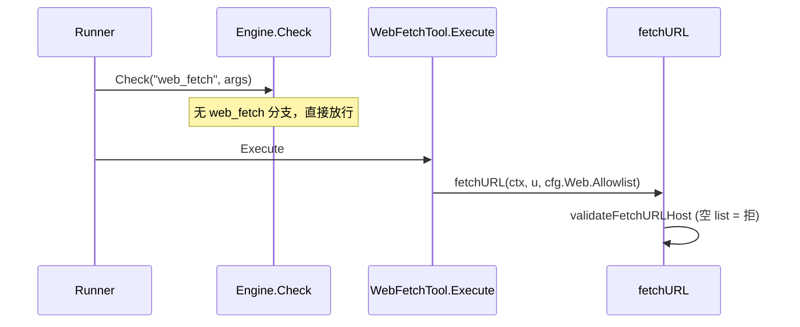
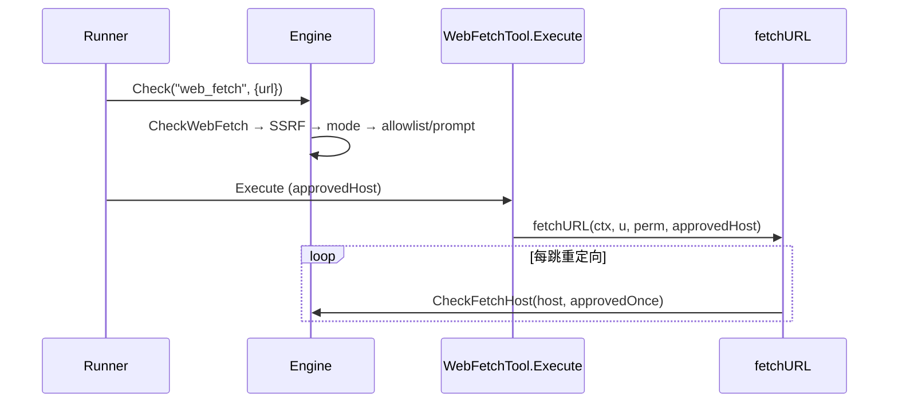
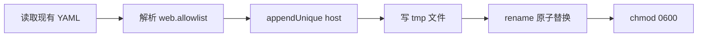

# v0.1.5 设计文档

> 版本：v0.1.5  
> 状态：规划中  
> 更新日期：2026-06-30  
> 需求：[REQUIREMENTS.md](REQUIREMENTS.md)

## 1. 设计目标

1. **单一职责**：web 主机访问策略集中在 `permission.Engine`，与路径 S3 denylist、write/shell ask 并列。
2. **语义修正**：allowlist 从「白名单门禁（空=全拒）」改为「预设集合 + 交互追加」。
3. **API 分离**：`WebFetchPrompter` 三选一独立于 `Prompter` 二选一，避免类型污染。
4. **最小侵入**：`web_fetch` 工具仅持有 `Perm` 引用；runner 已在 `Check` 阶段拦截，fetch 层做逐跳 SSRF + approved 校验。

## 2. 现状与迁移面

### 2.1 当前调用链（v0.1.4）



### 2.2 目标调用链（v0.1.5）



### 2.3 迁移文件清单

| 操作 | 路径 |
|------|------|
| 新增 | `internal/permission/web.go` |
| 新增 | `internal/permission/web_prompt.go` |
| 新增 | `internal/permission/web_test.go` |
| 新增 | `internal/config/web_allowlist.go` |
| 新增 | `internal/config/web_allowlist_test.go` |
| 修改 | `internal/permission/engine.go` |
| 修改 | `internal/permission/log.go` |
| 修改 | `internal/tool/builtin/web_fetch/web_fetch.go` |
| 修改 | `internal/tool/builtin/web_fetch/fetch.go` |
| 修改 | `internal/tool/setup/setup.go` |
| 删除 | `internal/tool/builtin/web_fetch/web_fetch_policy.go` |
| 修改 | `cmd/ds-code/app/runner.go` |
| 修改 | `cmd/ds-code/app/tui.go` |
| 修改 | `internal/agent/spawn/execute.go` |
| 修改 | `internal/ui/tui/...`（overlay + msg） |

## 3. `permission/web.go`

### 3.1 自 `web_fetch_policy.go` 迁入

| 函数 | 可见性 | 说明 |
|------|--------|------|
| `CheckFetchSSRF(host string) error` | 导出 | loopback、私有 IP、metadata、DNS 失败 |
| `hostAllowed(host, allowlist []string) bool` | 包内 | `*.domain` 通配；**无**空 list 全拒 |
| `checkFetchAllowlist(host string) bool` | `Engine` 方法 | 读 `e.WebAllowlist` |
| `CheckFetchHost(host, approvedOnce bool) error` | `Engine` 方法 | SSRF + mode；`approvedOnce` 跳过 allowlist |
| `CheckWebFetch(rawURL string) error` | `Engine` 方法 | 工具级入口 |

### 3.2 `CheckWebFetch` 伪代码

```go
func (e *Engine) CheckWebFetch(rawURL string) error {
    host := parseHost(rawURL)
    if err := CheckFetchSSRF(host); err != nil {
        return err
    }
    if e.Mode == "auto" {
        return nil
    }
    // readonly / ask — 行为相同
    if e.checkFetchAllowlist(host) {
        return nil
    }
    if e.WebFetchPrompter == nil {
        if !e.Interactive {
            return ErrNeedTTY
        }
        return ErrDenied // 或等价
    }
    choice, err := e.WebFetchPrompter(host, rawURL)
    if err != nil {
        return err
    }
    switch choice {
    case WebFetchAllowOnce:
        return nil // runner 记录 approvedHost 传入 Execute
    case WebFetchAllowAlways:
        norm := normalizeHost(host)
        e.WebAllowlist = appendUnique(e.WebAllowlist, norm)
        return config.AppendWebAllowlist(e.ProjectRoot, norm)
    default:
        return ErrRejected
    }
}
```

### 3.3 `CheckFetchHost`（逐跳）

fetch 重定向循环内调用；`approvedOnce == true` 时该 host 已通过用户「允许一次」审批，跳过 allowlist/prompt，仍执行 SSRF。

```go
func (e *Engine) CheckFetchHost(host string, approvedOnce bool) error {
    if err := CheckFetchSSRF(host); err != nil {
        return err
    }
    if approvedOnce {
        return nil
    }
    if e.Mode == "auto" {
        return nil
    }
    if e.checkFetchAllowlist(host) {
        return nil
    }
    // 同 host 重定向不应二次 prompt — 由 Execute 传入 approvedOnce
    return fmt.Errorf("host %q not approved for redirect", host)
}
```

> **注意**：跨域重定向仍走现有 `CrossHostRedirect` 返回路径，由模型重新 `web_fetch`；同 host 内重定向用 `approvedOnce`。

## 4. 三选一 Prompter API

### 4.1 类型定义（`web_prompt.go`）

```go
type WebFetchChoice int

const (
    WebFetchDeny WebFetchChoice = iota
    WebFetchAllowOnce
    WebFetchAllowAlways
)

type WebFetchPrompter func(host, url string) (WebFetchChoice, error)
```

### 4.2 `Engine` 新字段

```go
type Engine struct {
    // ... 现有字段 ...
    WebAllowlist     []string
    WebFetchPrompter WebFetchPrompter
}
```

### 4.3 TUI 集成

与现有 permission 双通道模式对齐（参见 v0.1.3 DESIGN §3.10）：

| 通道 | 用途 | 类型 |
|------|------|------|
| `PromptCh` + `listenPrompt` | write/shell 二选一 | `permission.PromptRequest` |
| `WebFetchPromptCh`（新） | web_fetch 三选一 | `permission.WebFetchPromptRequest` |

```go
type WebFetchPromptRequest struct {
    Host  string
    URL   string
    Reply chan WebFetchChoice
}

func TUIWebFetchPrompter(reqCh chan<- WebFetchPromptRequest) WebFetchPrompter {
    return func(host, url string) (WebFetchChoice, error) {
        reply := make(chan WebFetchChoice, 1)
        reqCh <- WebFetchPromptRequest{Host: host, URL: url, Reply: reply}
        return <-reply, nil
    }
}
```

TUI overlay 文案示例：`访问 example.com 不在 allowlist`

| 按键 | 选择 |
|------|------|
| `1` / `a` | `WebFetchAllowOnce` |
| `2` / `s` | `WebFetchAllowAlways` |
| `3` / `d` | `WebFetchDeny` |

非 TUI：`StdinWebFetchPrompter(w io.Writer)` 打印选项读 stdin。

## 5. `config.AppendWebAllowlist`

### 5.1 目标路径

```
<projectRoot>/.ds-code/config.yaml
```

使用 [`internal/config/project.go`](../../internal/config/project.go) 既有项目 config 解析逻辑。

### 5.2 写入流程



- 文件不存在：创建 `.ds-code/` 目录 + 最小骨架（仅 `web.allowlist` 段亦可）。
- 合并策略：保留已有项；新 host 追加到列表末尾；去重（规范化后比较）。
- **不** touch `~/.ds-code/config/config.yaml`。

### 5.3 启动加载

[`cmd/ds-code/app/runner.go`](../../cmd/ds-code/app/runner.go)：

```go
perm.WebAllowlist = append([]string(nil), a.Cfg.Web.Allowlist...)
```

`config.Load` 已合并用户级 + 项目级 YAML；运行时 `AllowAlways` 追加的项在**当前进程**立即可用，落盘后**下次启动**持久。

## 6. `engine.Check` 集成

在 [`engine.go`](../../internal/permission/engine.go) `check()` 增加：

```go
if tool == "web_fetch" {
    url, _ := args["url"].(string)
    if url == "" {
        return nil // schema 层校验
    }
    return e.CheckWebFetch(url)
}
```

不走 `summarizeArgs` / 现有 `Prompter`；deny 日志经 `classifyDeny` 区分 `web_fetch` / `allowlist`。

## 7. `web_fetch` 工具改造

### 7.1 结构体

```go
type WebFetchTool struct {
    Cfg    *config.Config
    Perm   *permission.Engine
    Strict bool
    LLM    llm.Client
    Cache  *LRUCache
}

func (t *WebFetchTool) WithPerm(p *permission.Engine) *WebFetchTool {
    t.Perm = p
    return t
}
```

### 7.2 `fetchURL` 签名

```go
func fetchURL(ctx context.Context, start *url.URL, perm *permission.Engine, approvedHost string) (*FetchOutcome, error)
```

循环内：

```go
host := current.Hostname()
approved := host == approvedHost
if err := perm.CheckFetchHost(host, approved); err != nil {
    return nil, err
}
```

### 7.3 `approvedHost` 传递

`Runner` 在 `CheckWebFetch` 返回 `AllowOnce` 时记录 host，传入 `Execute`。实现方式二选一（推荐 A）：

| 方案 | 说明 |
|------|------|
| **A. context value** | `context.WithValue` 存 `approvedWebHost`；`Execute` 读取 |
| B. Execute 再调 Check | 重复逻辑，不推荐 |

`AllowAlways` 在 `CheckWebFetch` 内已完成内存 + 磁盘更新，`approvedHost` 可为该 host（同 `AllowOnce` 效果）。

### 7.4 删除 `web_fetch_policy.go`

SSRF / `hostAllowed` 迁至 `permission`；`validateFetchURLHost` 由 `CheckFetchHost` 取代。`web_fetch.go` 内 `validateResolvedFetchHost`（Dial 层）可保留或改为调用 `CheckFetchSSRF`。

## 8. 启动与子代理

### 8.1 runner.go

```go
perm.WebAllowlist = append([]string(nil), a.Cfg.Web.Allowlist...)
if interactive && a.Cfg.Permission.Mode == "ask" {
    perm.Prompter = permission.StdinPrompter(os.Stderr)
    perm.WebFetchPrompter = permission.StdinWebFetchPrompter(os.Stderr)
}
// TUI 路径在 tui.go 覆盖两者
```

### 8.2 spawn/execute.go

bubble/inherit 且 worktree 时 `NewEngine` 须复制：

```go
perm.WebAllowlist = append([]string(nil), parentPerm.WebAllowlist...)
perm.WebFetchPrompter = parentPerm.WebFetchPrompter
```

非 worktree 直接 `perm = parentPerm`（共享同一 `Engine` 指针时 allowlist 追加自动可见）。

## 9. 错误与日志

| 错误 | 场景 |
|------|------|
| `ErrNeedTTY` | 非交互 + 未命中 allowlist |
| `ErrRejected` | 用户选拒绝 |
| `ErrDenied` | SSRF 阻断 |
| config 写入失败 | `AllowAlways` 时返回错误（内存已更新是否回滚：建议先写盘成功再更新内存，或失败时不更新内存） |

**推荐顺序**（`AllowAlways`）：规范化 → 写盘成功 → 更新 `e.WebAllowlist`。

## 10. 测试策略

| 包 | 重点 |
|----|------|
| `permission` | SSRF 矩阵；allowlist 通配；三模式；mock `WebFetchPrompter`；`ErrNeedTTY` |
| `config` | 追加、去重、新建文件、原子写 |
| `web_fetch` | mock `Engine` + 重定向 approvedOnce |
| `ui/tui` | `HandleWebFetchPromptKey` 三键 |

```bash
go test -race -count=1 ./internal/permission/... ./internal/config/... ./internal/tool/builtin/web_fetch/... ./internal/ui/tui/...
make test
```

## 11. 配置文档更新

[`configs/example.yaml`](../../configs/example.yaml) `web` 段注释改为：

```yaml
# allowlist: 预设可访问主机；空列表表示无预设（readonly/ask 下访问新主机将询问）
# 交互中选择「始终允许」会追加到本项目 .ds-code/config.yaml
allowlist: []
```

## 12. 实现顺序

1. `permission/web.go` + `web_prompt.go` + 单测（不依赖 TUI）
2. `config.AppendWebAllowlist` + 单测
3. `engine.Check(web_fetch)` + runner `WebAllowlist` 注入
4. `web_fetch` 重构 + 删除 policy + 工具测试
5. TUI overlay + `tui.go` wiring
6. spawn 复制字段
7. CHANGELOG、example.yaml、ACCEPTANCE
