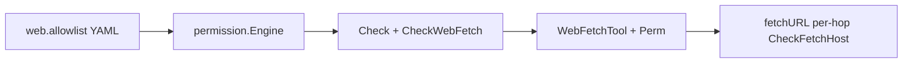

# ds-code v0.1.5 版本文档

> 版本：v0.1.5  
> 状态：规划中  
> 基线版本：v0.1.4  
> 更新日期：2026-06-30

## 概述

v0.1.5 聚焦 **`web_fetch` 主机访问策略迁入 `internal/permission`**，并修正 allowlist 语义：

1. **`web.allowlist` = 预设可访问主机集合**（项目/用户 YAML）；命中则 readonly/ask 下静默放行（仍过 SSRF）。
2. **未列入主机** → readonly/ask 下弹出**三选一**审批（允许一次 / 始终允许 / 拒绝）；「始终允许」写入项目 `.ds-code/config.yaml`。
3. **`auto` 模式**不参考 allowlist，仅 SSRF 硬规则放行。
4. **消除 allowlist 参数传递**：`WebFetchTool` 注入 `*permission.Engine`，逐跳校验统一走 `CheckFetchHost`。

本版本 **不改变** `web.fetch_enabled`、LRU cache、`normalizeURL`、跨域重定向语义；write/shell 的二选一 `Prompter` 不变。

## 文档索引

| 文档 | 说明 |
|------|------|
| [REQUIREMENTS.md](REQUIREMENTS.md) | 功能与非功能需求、用户故事、行为变更对照 |
| [DESIGN.md](DESIGN.md) | permission/web、三选一 Prompter、config 持久化、TUI overlay |
| [ACCEPTANCE.md](ACCEPTANCE.md) | 验收标准、手动验证步骤、测试清单 |

## 背景与动机

### 现状问题（v0.1.4）

| 问题 | 说明 |
|------|------|
| `Engine.Check` 未处理 `web_fetch` | [`internal/agent/runner.go`](../../internal/agent/runner.go) 调用 `Perm.Check`，但 [`engine.go`](../../internal/permission/engine.go) 无 `web_fetch` 分支 |
| allowlist 散落在工具层 | [`web_fetch_policy.go`](../../internal/tool/builtin/web_fetch/web_fetch_policy.go) 以 `[]string` 经 [`fetch.go`](../../internal/tool/builtin/web_fetch/fetch.go) 层层传递 |
| 空 allowlist = 全部拒绝 | 与「预设集合 + 交互追加」产品语义不符 |
| 仅二选一 Prompter | 现有 `Prompter` 为 y/n，无法表达「始终允许」 |

### 目标架构

## 变更摘要

| 场景 | v0.1.4（现状） | v0.1.5（目标） |
|------|----------------|----------------|
| 空 allowlist + readonly/ask | 全部拒绝 | 全部**弹窗询问** |
| 空 allowlist + auto | 全部拒绝 | SSRF 通过即放行 |
| 未列入主机 + readonly/ask | 直接拒绝 | **三选一** prompt |
| 始终允许 | 无 | 写入项目 `.ds-code/config.yaml` |
| allowlist 传递 | `fetchURL(ctx, u, allowlist)` | `Engine.CheckFetchHost` |

## 实现任务（对照计划）

| ID | 模块 | 说明 |
|----|------|------|
| T1 | `permission/web.go` | SSRF + allowlist 匹配；`CheckWebFetch` 按 Mode 分支 |
| T2 | `permission/web_prompt.go` | `WebFetchChoice` / `WebFetchPrompter` 三选一 API |
| T3 | `config/web_allowlist.go` | `AppendWebAllowlist` 原子写项目 config |
| T4 | TUI overlay | 三选一浮层 + `StdinWebFetchPrompter` 降级 |
| T5 | `engine.Check` | `web_fetch` 分支；runner/spawn 注入 |
| T6 | `web_fetch` 重构 | 注入 `Perm`；删除 `web_fetch_policy.go` |
| T7 | 测试 | permission / config / web_fetch / TUI 覆盖 |

## 已知限制

| 限制 | 说明 |
|------|------|
| 用户级 config | 「始终允许」仅写**项目** `.ds-code/config.yaml`，不改 `~/.ds-code/config/config.yaml` |
| 非交互 | `ds-code -p`、无 TTY 且主机不在 allowlist → `ErrNeedTTY` |
| 跨域重定向 | 仍返回 `REDIRECT:` 提示，由模型重新发起 `web_fetch`（语义不变） |
| MCP / 其它工具 | 本版不改 MCP 工具权限；`web_search` 不在范围 |

## 依赖与前置

- 基线：v0.1.4 已发布或合入 main
- 实现顺序见 [DESIGN.md §8](DESIGN.md#8-实现顺序)

## 关联文档

- 上一版本：[../v0.1.4/README.md](../v0.1.4/README.md)
- 安全基线：[../v0.1.0/SECURITY.md](../v0.1.0/SECURITY.md)
- 配置示例：[../../configs/example.yaml](../../configs/example.yaml) `web.allowlist`
