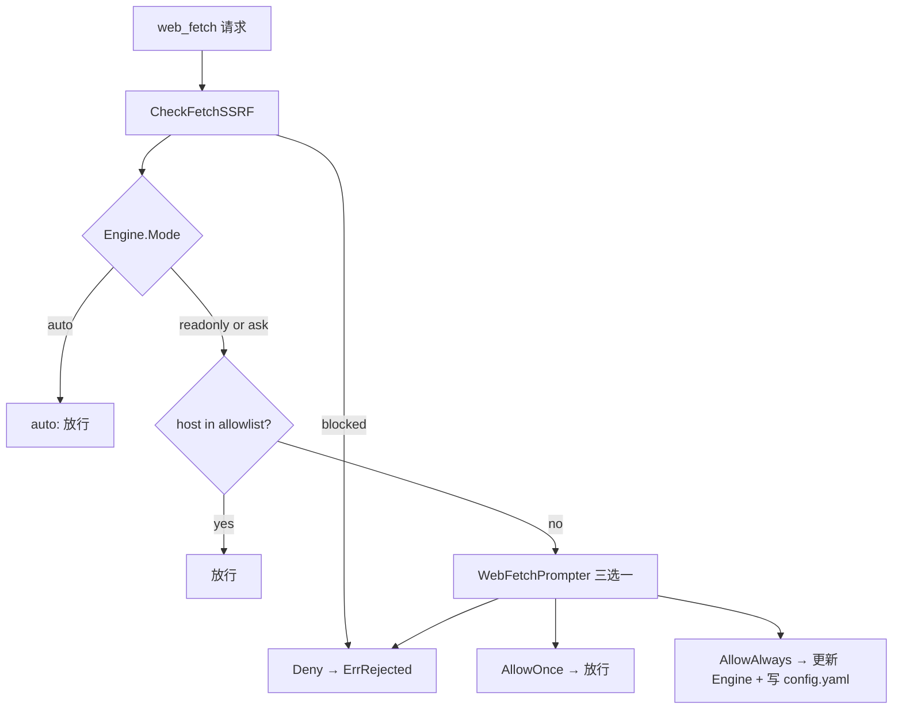
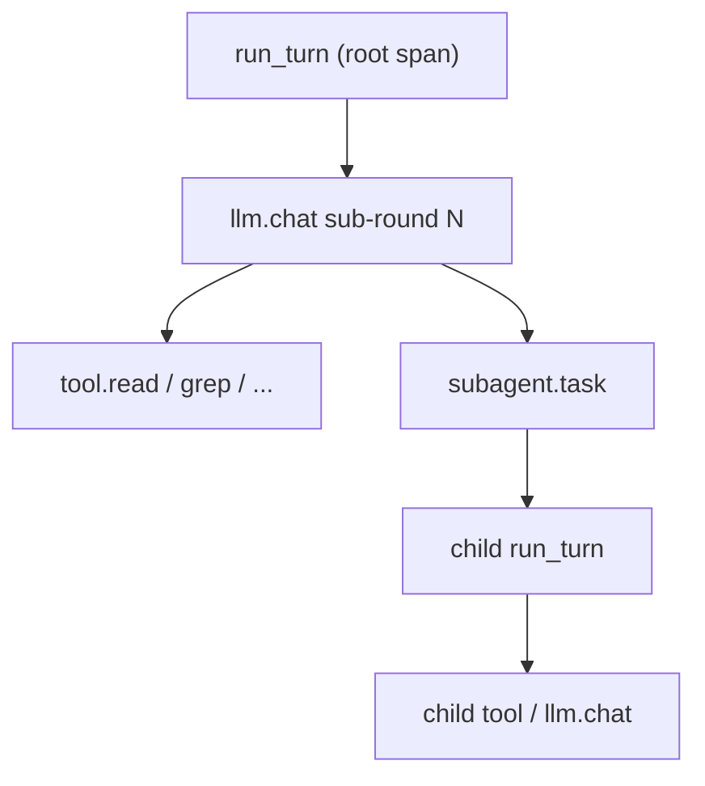

# v0.1.5 需求文档

> 版本：v0.1.5
> 状态：已实现
> 更新日期：2026-07-01
> 基线：v0.1.4

## 1. 目标

1. **将 web 主机策略迁入 `internal/permission`（P0）**：SSRF 硬规则、allowlist 匹配、按 `permission.mode` 分支；`Engine.Check("web_fetch", args)` 成为工具级入口。
2. **修正 allowlist 语义（P0）**：`web.allowlist` 表示**预设可访问主机集合**；空列表 = 无预设（非「全部拒绝」）。
3. **三选一交互审批（P0）**：readonly/ask 下未列入主机须弹出「允许一次 / 始终允许 / 拒绝」；与 write/shell 的二选一 `Prompter` **分离**。
4. **「始终允许」持久化（P0）**：用户选择后追加 hostname 到运行时 `Engine.WebAllowlist`，并原子写入项目 `.ds-code/config.yaml`。
5. **消除 allowlist 参数传递（P1）**：`WebFetchTool` 注入 `*permission.Engine`；删除 `web_fetch_policy.go`。
6. **日志引入 trace_id / span_id（P1）**：基于 **OpenTelemetry** + **`traceCore`/`logctx`**，使项目内**所有** `logging.L()` 在 active span 内自动关联 trace；可通过 CLI 或 config YAML 开启。

**非目标**：`web.fetch_enabled` / cache / `normalizeURL` / 跨域重定向语义变更；`web_search`；MCP 工具权限；用户级 config 写入；S2/S3 路径 denylist 变更；OTel 导出到外部 APM 的默认开启（本版仅本地日志关联，导出器可配置但默认关闭）。

## 2. 用户故事

### US-1：预设主机静默放行

**作为** 在 readonly/ask 模式下使用 ds-code 的开发者，
**我希望** 已在 `web.allowlist` 中配置的主机访问 `web_fetch` 时不再弹窗，
**以便** 常用文档/API 站点可顺畅抓取。

**验收**：FR-1.3；AC-2.1。

### US-2：未知主机可控审批

**作为** 注重安全的用户，
**我希望** 访问未列入 allowlist 的主机时可以选择「仅本次」「始终允许」或「拒绝」，
**以便** 在便利与安全之间自主权衡。

**验收**：FR-2；AC-3。

### US-3：始终允许写入项目配置

**作为** 维护者，
**我希望** 选择「始终允许」后 hostname 自动追加到项目 `.ds-code/config.yaml`，
**以便** 下次启动无需重复审批。

**验收**：FR-3；AC-4。

### US-4：auto 模式不受 allowlist 限制

**作为** 使用 `--permission-mode auto` 的用户，
**我希望** `web_fetch` 仅受 SSRF 规则约束，
**以便** 自动化场景不被 allowlist 阻塞。

**验收**：FR-1.5；AC-2.2。

### US-5：子代理继承父级 web 策略

**作为** 使用 `agent` 子代理的用户，
**我希望** bubble/inherit 子代理共享父级的 `WebAllowlist` 与 `WebFetchPrompter`，
**以便** 子代理 `web_fetch` 行为与主会话一致。

**验收**：FR-5；AC-5。

### US-6：日志可串联 trace / span

**作为** 排查 agent 行为或性能问题的开发者，
**我希望** 日志行自动包含 `trace_id` 与 `span_id`，且同一用户 turn 内子操作共享同一 `trace_id`，
**以便** 在 `ds-code.log` 中按 trace 过滤、关联 LLM 调用、工具执行与子代理。

**验收**：FR-8；AC-8。

## 3. 功能需求

### FR-0 allowlist 语义（修正）

| ID     | 描述                                                                                                  | 优先级 |
| ------ | ----------------------------------------------------------------------------------------------------- | ------ |
| FR-0.1 | `web.allowlist` = **预设可访问主机集合**（支持精确匹配与 `*.domain` 通配）                            | P0     |
| FR-0.2 | **删除**「空 allowlist = 全部拒绝」逻辑                                                               | P0     |
| FR-0.3 | 空 allowlist + readonly/ask → 所有公网主机走三选一 prompt                                             | P0     |
| FR-0.4 | 空 allowlist + auto → SSRF 通过即放行                                                                 | P0     |
| FR-0.5 | allowlist 命中后 readonly/ask **静默放行**（仍执行 SSRF 检查）                                        | P0     |
| FR-0.6 | YAML 键名 `web.allowlist` **不变**；[`configs/example.yaml`](../../configs/example.yaml) 注释更新语义 | P1     |

### FR-1 permission 层 web 策略

| ID     | 描述                                                                                                                 | 优先级 |
| ------ | -------------------------------------------------------------------------------------------------------------------- | ------ |
| FR-1.1 | 新增 [`internal/permission/web.go`](../../internal/permission/web.go)：自 `web_fetch_policy.go` 迁入 SSRF / 主机匹配 | P0     |
| FR-1.2 | `CheckFetchSSRF(host string) error` — 所有模式均执行                                                                 | P0     |
| FR-1.3 | `(e *Engine) checkFetchAllowlist(host string) bool` — 只读判断，不 prompt                                            | P0     |
| FR-1.4 | `(e *Engine) CheckFetchHost(host string, approvedOnce bool) error` — 逐跳校验（含重定向）                            | P0     |
| FR-1.5 | `(e *Engine) CheckWebFetch(rawURL string) error` — 解析 host → SSRF → mode 分支 → prompt                             | P0     |
| FR-1.6 | `engine.Check("web_fetch", args)` 从 `args["url"]` 调用 `CheckWebFetch`                                              | P0     |
| FR-1.7 | `classifyDeny` 增加 `allowlist` / `web_fetch` 分支（[`log.go`](../../internal/permission/log.go)）                   | P2     |

#### 权限模型

| `permission.mode` | allowlist 行为                                                           |
| ----------------- | ------------------------------------------------------------------------ |
| `auto`            | **不参考** allowlist；仅 SSRF                                            |
| `readonly`        | allowlist 命中 → 放行；未命中 → 三选一                                   |
| `ask`             | 与 `readonly` **完全相同**（web_fetch 不走 write/shell 二选一 Prompter） |



### FR-2 三选一 Prompter

| ID     | 描述                                                                                | 优先级 |
| ------ | ----------------------------------------------------------------------------------- | ------ |
| FR-2.1 | 新增 [`internal/permission/web_prompt.go`](../../internal/permission/web_prompt.go) | P0     |
| FR-2.2 | `WebFetchChoice`：`Deny` / `AllowOnce` / `AllowAlways`                              | P0     |
| FR-2.3 | `WebFetchPrompter func(host, url string) (WebFetchChoice, error)`                   | P0     |
| FR-2.4 | `Engine` 新增 `WebAllowlist []string`、`WebFetchPrompter WebFetchPrompter`          | P0     |
| FR-2.5 | `AllowOnce`：仅本次 `web_fetch` 调用（含同次请求内同 host 重定向逐跳）放行          | P0     |
| FR-2.6 | `AllowAlways`：规范化 hostname → 内存 `appendUnique` → `config.AppendWebAllowlist`  | P0     |
| FR-2.7 | `Deny` → `ErrRejected`                                                              | P0     |
| FR-2.8 | 非交互（无 TTY / `ds-code -p`）且未命中 allowlist → `ErrNeedTTY`                    | P0     |
| FR-2.9 | 现有 `Prompter`（write/shell 二选一）**不变**                                       | P0     |

### FR-3 config 持久化

| ID     | 描述                                                                                                     | 优先级 |
| ------ | -------------------------------------------------------------------------------------------------------- | ------ |
| FR-3.1 | 新增 [`internal/config/web_allowlist.go`](../../internal/config/web_allowlist.go)                        | P0     |
| FR-3.2 | `AppendWebAllowlist(projectRoot, host string) error`                                                     | P0     |
| FR-3.3 | 目标文件：项目 [`.ds-code/config.yaml`](../../internal/config/project.go)（不存在则创建目录 + 最小骨架） | P0     |
| FR-3.4 | 读取现有 YAML → 合并 `web.allowlist`（去重、保留已有项）→ 原子写回（`0600`）                             | P0     |
| FR-3.5 | **不**修改用户级 `~/.ds-code/config/config.yaml`                                                         | P0     |
| FR-3.6 | 下次进程 `Load` 自然合并进 `Engine.WebAllowlist`                                                         | P0     |

### FR-4 TUI 与非 TUI Prompter

| ID     | 描述                                                                                                        | 优先级 |
| ------ | ----------------------------------------------------------------------------------------------------------- | ------ |
| FR-4.1 | TUI：`WebFetchPromptRequest`（`Host`、`URL`、`Reply chan WebFetchChoice`）                                  | P0     |
| FR-4.2 | TUI overlay：文案含 host；`1`/`a` 单次、`2`/`s` 始终、`3`/`d` 拒绝                                          | P0     |
| FR-4.3 | [`cmd/ds-code/app/tui.go`](../../cmd/ds-code/app/tui.go)：`perm.WebFetchPrompter = TUIWebFetchPrompter(ch)` | P0     |
| FR-4.4 | 非 TUI：`StdinWebFetchPrompter(stderr)` 打印三选项读 stdin                                                  | P0     |
| FR-4.5 | 与现有 `TUIPrompter` / `listenPrompt` **并行**，不混用 `PromptRequest`                                      | P0     |

### FR-5 启动注入与子代理

| ID     | 描述                                                                                                             | 优先级 |
| ------ | ---------------------------------------------------------------------------------------------------------------- | ------ |
| FR-5.1 | [`cmd/ds-code/app/runner.go`](../../cmd/ds-code/app/runner.go)：`perm.WebAllowlist = cfg.Web.Allowlist`          | P0     |
| FR-5.2 | runner 挂载 `WebFetchPrompter`（TUI 或 Stdin）                                                                   | P0     |
| FR-5.3 | [`spawn/execute.go`](../../internal/agent/spawn/execute.go)：子 `Engine` 复制 `WebAllowlist`、`WebFetchPrompter` | P0     |
| FR-5.4 | worktree 子代理 `NewEngine` 时保留父级 `WebFetchPrompter`                                                        | P0     |

### FR-6 web_fetch 工具重构

| ID     | 描述                                                                                        | 优先级 |
| ------ | ------------------------------------------------------------------------------------------- | ------ |
| FR-6.1 | `WebFetchTool` 增加 `Perm *permission.Engine` + `WithPerm`                                  | P0     |
| FR-6.2 | [`setup.go`](../../internal/tool/setup/setup.go) 注册时传入 `Perm: d.Perm`                  | P0     |
| FR-6.3 | `fetchURL` 去掉 `allowlist []string` 参数；每跳 `perm.CheckFetchHost(host, approvedOnce)`   | P0     |
| FR-6.4 | 首次 URL 审批在 `Engine.Check` 完成；Execute 传入已批准 host                                | P0     |
| FR-6.5 | **删除** [`web_fetch_policy.go`](../../internal/tool/builtin/web_fetch/web_fetch_policy.go) | P0     |
| FR-6.6 | 错误文案 `ErrHostNotAllowlist` 语义对齐新模型（或改为 permission 拒绝类文案）               | P1     |

### FR-7 测试与文档

| ID     | 描述                                                                          | 优先级 |
| ------ | ----------------------------------------------------------------------------- | ------ |
| FR-7.1 | `permission/web_test.go`：SSRF、allowlist、三模式、mock prompter              | P0     |
| FR-7.2 | `config/web_allowlist_test.go`：追加、去重、文件不存在时创建                  | P0     |
| FR-7.3 | `web_fetch` 集成测试：带 `WebAllowlist` + mock `WebFetchPrompter` 的 `Engine` | P0     |
| FR-7.4 | TUI：`HandleWebFetchPromptKey` 三键覆盖                                       | P1     |
| FR-7.5 | `CHANGELOG.md` 记录 allowlist 语义 **breaking**                               | P0     |
| FR-7.6 | `configs/example.yaml` 注释更新                                               | P1     |

### FR-8 OpenTelemetry 日志关联（方案 B）

| ID      | 描述                                                                                                                                                                                                                                      | 优先级 |
| ------- | ----------------------------------------------------------------------------------------------------------------------------------------------------------------------------------------------------------------------------------------- | ------ |
| FR-8.1  | 引入 `go.opentelemetry.io/otel` 及 `otel/sdk`、`otel/trace`；不替换现有 `zap` 全局 logger 架构                                                                                                                                            | P1     |
| FR-8.2  | 进程启动时初始化 `TracerProvider`（默认 **noop** 或仅内存；不强制外连 collector）                                                                                                                                                         | P1     |
| FR-8.3  | **`logging.L()` 全局自动注入**：通过 `traceCore` + goroutine 上下文栈（`logctx`），**所有**现有 `logging.L()` 调用在 active span 内自动带上 `trace_id`、`span_id`；**不要求**逐文件改调用点                                               | P0     |
| FR-8.3b | `logging.FromContext(ctx)`（可选）：显式 ctx 与 goroutine 栈不一致时使用；非必须迁移路径                                                                                                                                                  | P2     |
| FR-8.4  | 用户 turn 根 span：`runTurn` 入口创建（`run_turn`），`defer span.End()`；贯穿该 turn 全链路                                                                                                                                               | P1     |
| FR-8.5  | 子 span 边界：每轮 LLM `Chat`（`llm.chat`）、每次 `executeTool`（`tool.<name>`）、`spawn.ExecuteRun`（`subagent.<type>`）                                                                                                                 | P1     |
| FR-8.6  | 子代理继承父 `context` 的 trace 上下文；`trace_id` 不变，各子操作生成新 `span_id`                                                                                                                                                         | P1     |
| FR-8.7  | 现有业务字段（`session_id`、`run_id`、`tool` 等）**保留**；trace 字段为补充维度                                                                                                                                                           | P1     |
| FR-8.8  | `logging.Setup` 在 tracing 启用时装配 `traceCore`（包装 `zapcore.Core`），从 `logctx.Current()` 读取 `SpanContext`；与现有 `ConsoleEncoder` 兼容                                                                                          | P1     |
| FR-8.8b | `trace.Start` 进入时 `logctx.Push(ctx)`、退出时 `Pop`；新建 goroutine 须在入口 `defer logctx.Bind(ctx)()`                                                                                                                                 | P0     |
| FR-8.9  | **双入口**：① CLI `--trace` / `--trace-exporter` / `--trace-otlp-endpoint`；② YAML `tracing.enabled` / `tracing.exporter` / `tracing.otlp_endpoint`（用户级 + 项目级合并）。**优先级**：显式 CLI flag > 项目 YAML > 用户 YAML。默认均关闭 | P1     |
| FR-8.10 | 单测：`logctx` 栈、`traceCore` 注入；agent turn 内 **permission / MCP / context** 等仅调用 `logging.L()` 的包也断言含 `trace_id`                                                                                                          | P1     |

#### Span 层级（目标）



| 层级      | 建议 span 名      | trace_id | span_id |
| --------- | ----------------- | -------- | ------- |
| 用户 turn | `run_turn`        | 新建     | root    |
| LLM 调用  | `llm.chat`        | 继承     | 新建    |
| 工具执行  | `tool.<name>`     | 继承     | 新建    |
| 子 agent  | `subagent.<type>` | 继承     | 新建    |

**`trace_id` / `span_id` 更新时机**（注入机制、何时变、一次 turn 时序示例）：见 [DESIGN.md §13.9.1](DESIGN.md#1391-trace_id--span_id-更新时机)。

#### 依赖（预期）

```
go.opentelemetry.io/otel
go.opentelemetry.io/otel/sdk
go.opentelemetry.io/otel/trace
go.opentelemetry.io/contrib/bridges/otelzap  # 或等价桥接
```

## 4. 行为变更对照（相对 v0.1.4）

| 场景                        | v0.1.4   | v0.1.5                 |
| --------------------------- | -------- | ---------------------- |
| 空 allowlist + readonly/ask | 全部拒绝 | 全部弹窗询问           |
| 空 allowlist + auto         | 全部拒绝 | SSRF 通过即放行        |
| 未列入主机 + readonly/ask   | 直接拒绝 | 三选一 prompt          |
| 始终允许                    | 无       | 写入项目 `config.yaml` |
| `Engine.Check(web_fetch)`   | 未处理   | 完整校验链             |

## 5. 非功能需求

| ID    | 描述                                                                                       |
| ----- | ------------------------------------------------------------------------------------------ |
| NFR-1 | `make test` / `make lint` / `make vet` 全绿                                                |
| NFR-2 | config 写入须原子（tmp + rename）；权限 `0600`                                             |
| NFR-3 | hostname 规范化：小写、去端口                                                              |
| NFR-4 | 不引入 `web_fetch` 对 `config.Config` 的直接 allowlist 依赖（统一走 `Engine`）             |
| NFR-5 | `tracing.enabled: false` 且未传 `--trace`（默认）时零开销：不创建 span、不改变现有日志字段 |
| NFR-6 | OTel 初始化失败时降级为 noop，不阻塞 CLI 启动                                              |

## 6. 范围边界

**In scope**

- `internal/permission/web.go`、`web_prompt.go`、`*_test.go`
- `internal/config/web_allowlist.go`
- `internal/tool/builtin/web_fetch/`（除 policy 删除外的重构）
- `internal/ui/tui/`（web_fetch overlay）
- `cmd/ds-code/app/runner.go`、`tui.go`
- `internal/agent/spawn/execute.go`
- `configs/example.yaml`、`CHANGELOG.md`
- `docs/v0.1.5/**`
- `internal/logging/`（`logctx`、`traceCore`、`FromContext`）
- `internal/agent/runner_turn.go`、`runner_loop.go`、`runner.go`（span 埋点）
- `internal/agent/spawn/execute.go`（子 agent span）
- `internal/llm/deepseek/client/`（可选 LLM 子 span）
- `internal/config/flags.go`、`load.go`、`validate.go`、`types.go`（tracing YAML + CLI）
- `configs/example.yaml`（`tracing` 段）
- `go.mod`（OTel 依赖）

**Out of scope**

- `web.search_enabled` / `web_search` 工具
- MCP 工具网络访问策略
- 用户级 `~/.ds-code/config` allowlist 写入
- write/shell `Prompter` 改为三选一
- 跨域重定向改为自动跟随多域
- OTel 默认连接 Jaeger / Tempo / Datadog（仅预留 `--trace-exporter`）
- 将 `session_id` 替换为 `trace_id`（二者并存）
- HTTP 请求 W3C `traceparent` 注入 DeepSeek API（后续版本）
- 桌面端 UI 本身（v0.1.5 仅预留 config schema；嵌入调用走同一 `config.Config`）

## 7. 实现优先级

| 阶段  | 内容                                                                | gate          |
| ----- | ------------------------------------------------------------------- | ------------- |
| **A** | `permission/web.go` + `web_prompt.go` + 单测                        | FR-1、FR-2 绿 |
| **B** | `config.AppendWebAllowlist` + 单测                                  | FR-3 绿       |
| **C** | `engine.Check(web_fetch)` + runner/spawn 注入                       | FR-5          |
| **D** | `web_fetch` 重构 + 删除 policy                                      | FR-6          |
| **E** | TUI overlay + Stdin 降级                                            | FR-4          |
| **F** | CHANGELOG、example.yaml、ACCEPTANCE 勾选                            | FR-7          |
| **G** | OTel + `logctx`/`traceCore` + span 埋点 + 全项目 `L()` 自动注入验收 | FR-8          |
