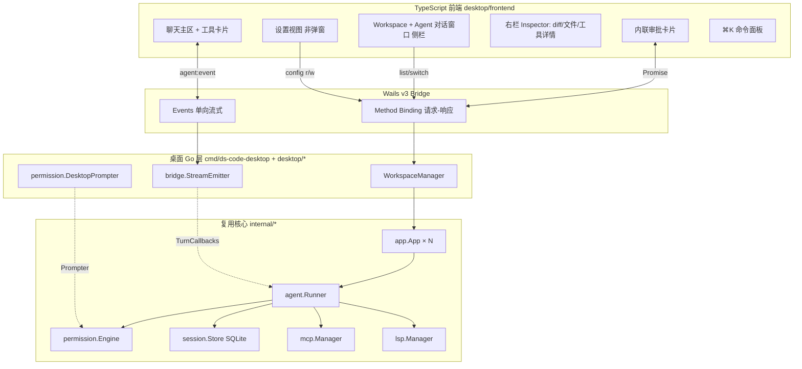
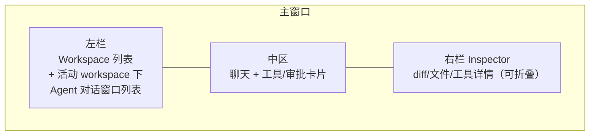
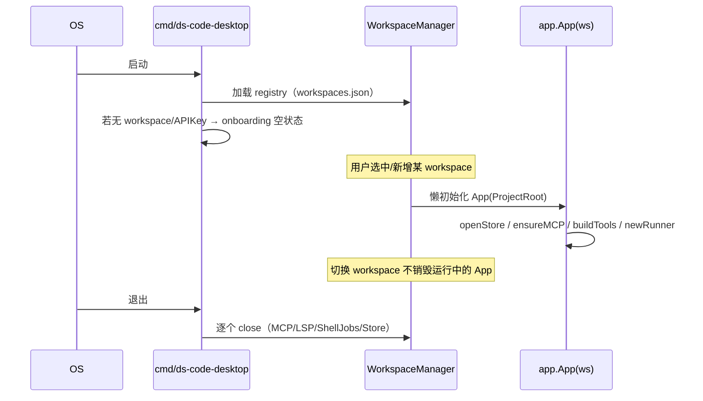
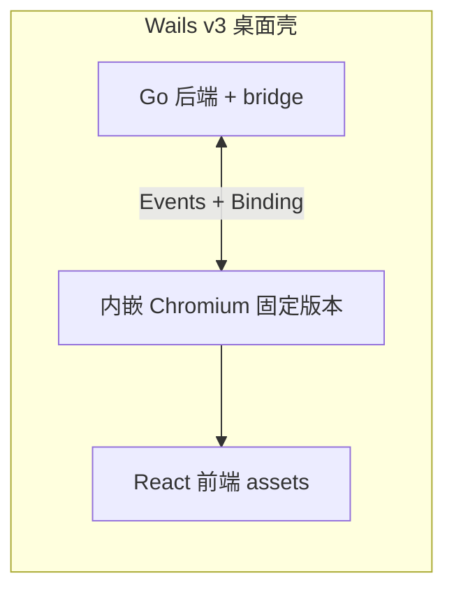
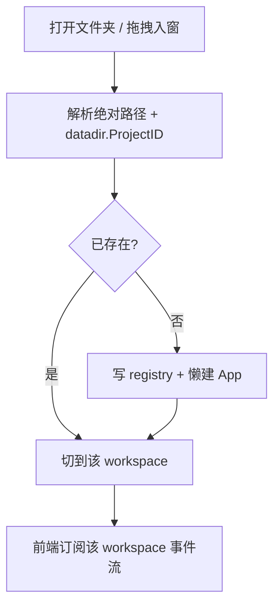
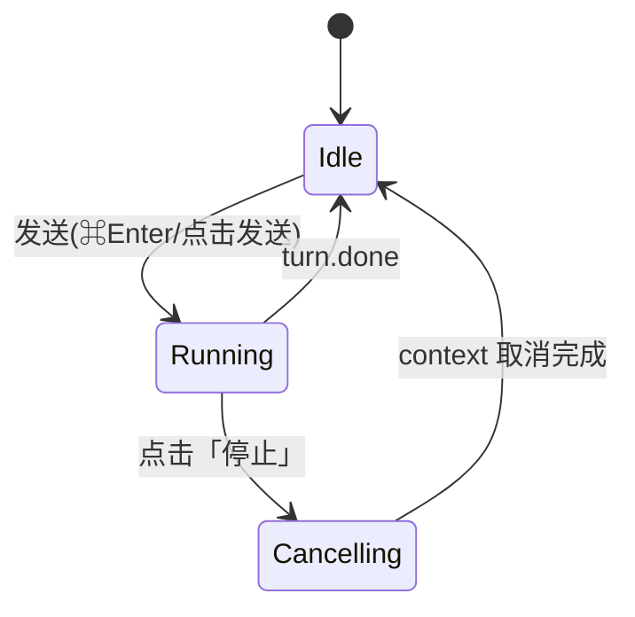
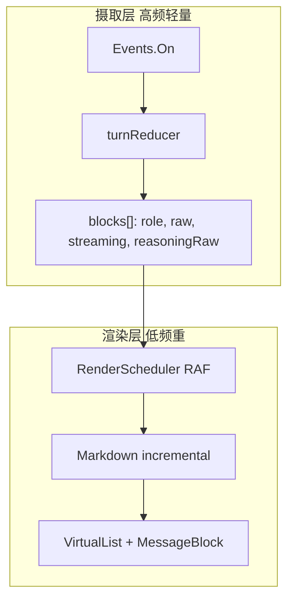

# v0.2.0 设计文档

> 版本：v0.2.0
> 状态：设计中（Design）
> 更新日期：2026-07-04
> 需求：[REQUIREMENTS.md](REQUIREMENTS.md)
> 目标形态：macOS 桌面应用（Go + Wails v3 + TypeScript）

## 1. 设计目标与原则

1. **复用优先**：桌面版是 ds-code 的「第二种 UI」，后端 `internal/*` 与 `cmd/ds-code/app` 组装逻辑最大化复用，只新增适配层。
2. **macOS 原生感**：遵循 Apple HIG——原生窗口/菜单栏/快捷键、系统深浅色、克制的动效、系统集成（通知、Dock、拖拽）。
3. **动线不照搬 TUI**：以可见控件与指针交互为主、键盘为辅；取消 turn 用可见按钮，不用 ESC；不复刻模式化按键序列。
4. **modal-free 优先**：权限、设置、命令、onboarding 内联到主界面；仅系统级不可避免场景用原生系统面板。
5. **Workspace 为一等公民**：workspace 关联 project；其下可挂**多个 Agent 对话窗口**（对应 TUI session）；单窗口管理多个 workspace。
6. **数据与 CLI/TUI 隔离**：`ProjectID` 算法不变；桌面数据落在 `~/.ds-code/desktop/projects/`，靠目录前缀与 CLI/TUI 区隔，不共享运行时数据。
7. **契约不变**：`agent.TurnCallbacks`、`permission.Engine`（`Prompter`/`WebFetchPrompter`）、`session.Store`、SQLite schema **语义保持**（路径不同）。

## 2. 总体架构



### 2.1 分层职责

| 层                       | 位置                       | 职责                                                                 |
| ------------------------ | -------------------------- | ------------------------------------------------------------------- |
| 桌面入口                 | `cmd/ds-code-desktop`      | Wails v3 app 初始化、菜单栏、窗口、生命周期、绑定注册                |
| Workspace 管理           | `desktop/workspace`        | 多 `app.App` 生命周期、注册表持久化、活动切换                        |
| 流式桥接                 | `desktop/bridge`           | `TurnCallbacks` → `StreamEmitter` → Wails Events（Envelope v1）      |
| 权限适配                 | `desktop/permission`       | `DesktopPrompter` / `DesktopWebFetchPrompter`（事件 + Promise）      |
| 前端 UI                  | `desktop/frontend`         | 三栏界面、聊天/工具/审批/检查器/设置/命令面板、状态与渲染            |
| 复用核心                 | `internal/*`               | Agent 循环、context、tool、permission、session、mcp、lsp（不改语义） |
| 组装参考                 | `cmd/ds-code/app`          | 依赖注入逻辑复用（`newRunner`、`buildTools` 等）                     |

### 2.2 目录结构（建议）

```
cmd/
  ds-code/                 # 现有 CLI/TUI（保留）
  ds-code-desktop/         # 新 Wails v3 入口
    main.go                # wails app、菜单、窗口、bindings 注册
    menu.go                # macOS 菜单栏
    lifecycle.go           # 启动/退出/多 workspace 清理
desktop/
  datadir/                 # 桌面数据路径（复用 datadir.ProjectID；父目录 desktop/ 区隔）
    paths.go               # ~/.ds-code/desktop/projects/<project-id>/...
    open_default.go        # sessions.db 等走 ~/.ds-code/desktop/projects/<project-id>/
  workspace/               # WorkspaceManager + 注册表
    manager.go
    registry.go            # ~/.ds-code/desktop/workspaces.json 读写
    session_facade.go      # 会话列表/创建/resume 的 binding 封装
  bridge/
    stream_emitter.go      # buffer/batch/emit
    callbacks.go           # TurnCallbacks → StreamEmitter
    events.go              # Envelope v1 类型（与 TS 同构）
  permission/
    desktop_prompter.go    # write/shell 二选一（事件 + Promise）
    desktop_webfetch.go    # web_fetch 三选一
  frontend/                # React + Vite + TypeScript
    src/
      app/                 # 三栏布局、路由（chat/settings）
      protocol/            # agent-events.ts（与 Go envelope 同构）
      ingest/              # Events.On → reducer（摄取层）
      render/              # RenderScheduler、Markdown、虚拟列表
      components/          # 侧栏、消息块、工具卡片、审批卡片、Inspector、命令面板
      state/               # workspace/session/turn store
internal/
  ui/port/                 # （建议）StreamBuffer/事件语义抽象，TUI 与 desktop 共享
```

## 3. 进程与窗口模型（Wails v3）

### 3.1 单窗口 + workspace 侧栏

采用**单窗口**（默认）承载所有 workspace，左栏切换，符合 US-1「一个窗口管理多个项目」。理由：

- 与 macOS 「工作台型」App（如 Linear/Slack/VS Code）一致，切换成本低；
- 多个后台运行中的 workspace 可并存，切换不打断；
- Wails v3 的多窗口能力**保留**给「把某 workspace 拆出独立窗口」的后期增强（FR-1 已知限制）。



### 3.2 窗口/菜单/快捷键

| 元素     | 设计                                                                                          |
| -------- | -------------------------------------------------------------------------------------------- |
| Titlebar | macOS unified/透明标题栏，显示活动 workspace 名称；左侧红绿灯留白                             |
| 菜单栏   | App / File / Edit / View / Workspace / Window / Help（原生 `menu.go`）                        |
| 快捷键   | ⌘N 新建 Agent 对话窗口、⌘O 打开项目、⌘, 设置、⌘K 命令面板、⌘\\ 折叠侧栏、⌘⌥\\ 折叠 Inspector、⌘Enter 发送 |
| 取消     | **不绑定** ⌘. / ESC 到取消 turn（见 §7.3）；ESC 仅关闭浮层                                    |
| 深浅色   | 跟随系统 `NSAppearance`；前端读 `prefers-color-scheme`                                        |

### 3.3 生命周期



### 3.4 内嵌浏览器内核

Wails v3 默认在 macOS 上使用**系统 WKWebView**，其行为随 macOS 版本变化，不利于 Markdown/Monaco 渲染一致性与跨版本 QA。本版采用**内嵌固定版本浏览器内核**策略：

| 维度       | 设计                                                                                         |
| ---------- | -------------------------------------------------------------------------------------------- |
| 目标       | 捆绑固定版本 **Chromium** 作为渲染引擎，不依赖系统 WKWebView 版本                               |
| 动机       | 规避不同 macOS 版本 WebView 差异；为后续跨平台预留一致渲染基线；流式/Markdown/Monaco 行为可预期 |
| 与 Wails   | M0 PoC 验证 Wails v3 接入内嵌 Chromium 的路径（自定义 WebView 后端 / CEF 绑定 / 官方扩展点） |
| 备选       | 若 Wails 原生不支持，评估 CEF + Go 绑定保留 Wails 事件桥，或 Wails v3 文档推荐的 embedded 方案 |
| 体积       | 内嵌 Chromium 显著增大安装包；目标 **< 200MB** universal（NFR-8），接受大于纯 WKWebView 方案 |
| 安全       | 仅加载 `wails://` / 本地打包 assets；不加载任意远程 URL；助手 HTML 模式（M4+）仍走 DOMPurify   |



**M0 门禁**：内嵌内核下流式聊天 ≥ 55fps、单 turn 跨边界 < 200 次调用；若未达标再调 batch/渲染参数，**不回退**系统 WKWebView 作为默认方案。

## 4. 与后端契约的对接

### 4.1 一个 workspace = 一个 app.App

现有 `app.App` 已按单 `ProjectRoot` 组织（`Cfg.ProjectRoot`、`openStore`、`ensureMCP`、`newRunner`）。桌面无需改 `App`，而是**持有多个 App 实例**：

```go
// desktop/workspace/manager.go（示意，非最终 API）
type Workspace struct {
    ID          string        // = datadir.ProjectID(root)（与 CLI 相同算法）
    Name        string        // 展示名（默认 filepath.Base(root)）
    Root        string        // ProjectRoot
    app         *app.App      // 懒初始化
    runner      *agent.Runner
    ctxSvc      *ctxpkg.Service
    store       session.Store
    activeTurn  context.CancelFunc // 当前 turn 取消句柄
}

type Manager struct {
    mu       sync.Mutex
    order    []string
    byID     map[string]*Workspace
    active   string
    registry *Registry
}
```

- **懒初始化**：`Manager.Ensure(id)` 首次调用时构造 `app.New(cfg)` 并 `newRunner()`；`cfg` 由「用户级 config + 该 workspace 的项目级 `.ds-code/`」合并；`cfg.ProjectID` 沿用 `datadir.ProjectID(root)`；仅 Store/Checkpoint 等的**落盘目录**改走 `desktop/datadir`（见 §5.4）。
- **切换**：仅切换 `active` 与前端订阅目标，不 close 其他 workspace（NFR-3）。
- **关闭**：退出或移除时逐个 `App.Close`（复用 `closeMCP/closeLSP/closeStore/closeShellJobs`）。

### 4.2 TurnCallbacks 是唯一事件源

桌面在发起一轮 `RunTurn` 时构造一个绑定当前 workspace + session 的 `TurnCallbacks`，其 hook 写入该 workspace 的 `StreamEmitter`（§8）。子代理复用 `SubagentToolCallbacks` 与 `streamId`，无需改 agent 核心。

## 5. Workspace 管理

### 5.1 注册表持久化

新增用户级注册表（与 CLI 的 `~/.ds-code/projects/` **隔离**）：

```
~/.ds-code/desktop/workspaces.json
```

```json
{
  "v": 1,
  "active": "a3f1...",
  "workspaces": [
    { "id": "a3f1...", "root": "/Users/me/proj-a", "name": "proj-a", "addedAt": 1719800000, "lastOpenedAt": 1719900000 }
  ],
  "window": { "width": 1280, "height": 840, "leftWidth": 260, "rightWidth": 420, "leftCollapsed": false, "rightCollapsed": true }
}
```

| 约束            | 说明                                                                             |
| --------------- | -------------------------------------------------------------------------------- |
| `id`            | `datadir.ProjectID(root)`（**与 CLI 同算法**）；隔离靠数据目录前缀（见 §5.4）        |
| 原子写          | tmp + rename，权限 `0600`（与项目 config 写入策略一致）                           |
| 去重            | 同 `root` 只保留一条（FR-1.11）                                                   |
| 移除            | 仅删注册表条目，**不动** `~/.ds-code/desktop/projects/<id>/` 与磁盘项目（FR-1.6） |
| 校验            | 加载时校验目录存在/可读；失效条目标灰并允许「重新定位」或移除                     |

### 5.2 添加 / 切换 / 移除流程



### 5.3 Agent 对话窗口门面（对应 session）

`desktop/workspace/session_facade.go` 将 **Agent 对话窗口**操作暴露为 binding：`ListChats(wsID)`、`CreateChat(wsID, opts)`、`ResumeChat(wsID, sessionID)`、`RenameChat`。底层调用该 workspace 的 `session.Store`（`CreateSession` 等 API 不变），数据路径见 §5.4。

左栏 UI：**workspace 为父节点，其下展开多个 Agent 对话窗口**（树形或分组列表）；选中某对话窗口即 `ResumeChat`，中区加载该 session 历史。

### 5.4 桌面数据目录与 ProjectID（与 CLI 隔离）

CLI/TUI 与桌面**共用磁盘上的项目源码**与 **`<project>/.ds-code/config.yaml`**（项目级 MCP、web allowlist 等），但**运行时持久化数据隔离**：

| 数据类型        | CLI/TUI 路径                                      | 桌面路径                                                    |
| --------------- | ------------------------------------------------- | ----------------------------------------------------------- |
| project-id 算法 | `hex(SHA256(ProjectRoot))`                        | **相同**（`datadir.ProjectID`，不新增算法）                 |
| sessions.db     | `~/.ds-code/projects/<project-id>/sessions.db`    | `~/.ds-code/desktop/projects/<project-id>/sessions.db`     |
| checkpoints     | `~/.ds-code/projects/<project-id>/checkpoints/`   | `~/.ds-code/desktop/projects/<project-id>/checkpoints/`    |
| audit.jsonl     | `~/.ds-code/projects/<project-id>/audit.jsonl`    | `~/.ds-code/desktop/projects/<project-id>/audit.jsonl`     |
| shell-jobs      | `~/.ds-code/projects/<project-id>/shell-jobs/`    | `~/.ds-code/desktop/projects/<project-id>/shell-jobs/`     |
| logs            | `~/.ds-code/projects/<project-id>/logs/`          | `~/.ds-code/desktop/projects/<project-id>/logs/`           |

**唯一区隔点**：父目录多一层 `desktop/`。`project-id` 相同，算法、schema 均一致，仅落盘根目录不同。

```go
// desktop/datadir/paths.go（示意）
// ProjectID 直接复用 internal/datadir.ProjectID —— 不新增算法。

// DesktopProjectDataDir 返回 ~/.ds-code/desktop/projects/<project-id>/
func DesktopProjectDataDir(projectRoot string) (string, error) {
    home, err := datadir.UserDataHome() // ~/.ds-code
    if err != nil {
        return "", err
    }
    return filepath.Join(home, "desktop", "projects", datadir.ProjectID(projectRoot)), nil
}

// DefaultDBPath 返回 ~/.ds-code/desktop/projects/<project-id>/sessions.db
func DefaultDBPath(projectRoot string) (string, error) {
    dir, err := DesktopProjectDataDir(projectRoot)
    if err != nil {
        return "", err
    }
    return filepath.Join(dir, "sessions.db"), nil
}
```

实现要点：
- 新增 `desktop/datadir`，**复用** `internal/datadir.ProjectID`，**不修改** CLI 路径函数（`datadir.DefaultDBPath` 等保持指向 `projects/`）。
- 桌面 `openStore` 调用 `sessionsqlite.Open(desktopdatadir.DefaultDBPath(root))`，替代 CLI 的 `OpenDefault`。
- `app.App` 的 checkpoint/shell-jobs/audit/logs 路径改走 `desktop/datadir` 变体（`Manager` 包装层覆盖，或 `App` 接受 `DataDir` 根目录选项——实现期取最小侵入）。
- **同一 `ProjectRoot` 在 CLI 与桌面各有一套独立 session 历史**；互不可见、互不可 resume（FR-1.9、NFR-6）。

## 6. UI 布局与导航（三栏）

> 本节线框图为**低保真布局示意**（ASCII），标注结构、层级与关键控件位置，不代表最终视觉（间距、圆角、字体、色彩以实现期 shadcn/ui + Tailwind 主题为准）。

### 6.1 三栏结构

| 栏      | 内容                                                                                  | 折叠           |
| ------- | ------------------------------------------------------------------------------------- | -------------- |
| 左      | 上：**Workspace 列表**；下：活动 workspace 下的 **Agent 对话窗口**列表（树形/分组） | ⌘\\，持久化     |
| 中      | 聊天时间线 + 底部输入区 + 顶部 workspace/对话窗口标题与模式控件                   | 不可折叠       |
| 右      | Inspector：diff / 文件预览 / 工具详情；默认折叠，按需展开                               | ⌘⌥\\，持久化    |

### 6.1.1 主界面线框（Inspector 收起，日常态）

```text
┌────────────────────────────────────────────────────────────────────────────────────┐
│ ● ● ●   proj-a ▸ 修复登录超时                                        [⌘K]  [ ⚙ ]      │  ← 原生 titlebar（unified）
├───────────────────────┬──────────────────────────────────────────────┬─────────────┤
│ WORKSPACES        [+] │  proj-a ▸ 修复登录超时          [Agent ▾][ask ▾]│             │
│ ▸ ● proj-a          2 │────────────────────────────────────────────────│   ◧ 展开    │
│ ▸ ○ proj-b          1 │                                                │  Inspector  │
│ ▸ ○ infra-scripts     │  🧑 用户                                        │   (⌘⌥\)     │
│                       │  帮我排查登录接口偶发超时                        │             │
│  ── 对话窗口 ───────  │                                                │             │
│  proj-a               │  🤖 助手                                        │             │
│   ● 修复登录超时  ▶   │  我先看下 handler 与超时配置。                   │             │
│   ○ 重构 auth 中间件  │  ┌──────────────────────────────────────────┐  │             │
│   ○ 写单元测试        │  │ ▸ read  internal/auth/login.go  L1–80  ✓ │  │             │
│                       │  └──────────────────────────────────────────┘  │             │
│                       │  ┌──────────────────────────────────────────┐  │             │
│                       │  │ ▸ grep  "context deadline"   12 hits    ✓ │  │             │
│                       │  └──────────────────────────────────────────┘  │             │
│                       │  超时来自 client 默认 5s……（流式渲染中 ▍）      │             │
│                       │                                                │             │
│                       │────────────────────────────────────────────────│             │
│                       │ ┌────────────────────────────────────────────┐ │             │
│                       │ │ 输入消息…  @文件  /命令              [ ■停止 ]│ │             │
│                       │ └────────────────────────────────────────────┘ │             │
├───────────────────────┴──────────────────────────────────────────────┴─────────────┤
│ deepseek-v4 · ask · ▮▮▯ 12.3k/128k tokens · proj-a 运行中…                            │  ← 状态栏
└────────────────────────────────────────────────────────────────────────────────────┘
   ↑ 左栏 (⌘\)              ↑ 中区聊天主区（不可折叠）                     ↑ 右栏折叠态
```

### 6.1.2 主界面线框（Inspector 展开看 diff）

```text
┌────────────────────────────────────────────────────────────────────────────────────┐
│ ● ● ●   proj-a ▸ 修复登录超时                                        [⌘K]  [ ⚙ ]      │
├───────────────────┬────────────────────────────────┬─────────────────────────────────┤
│ WORKSPACES    [+] │ proj-a ▸ 修复登录超时           │ INSPECTOR   [diff│文件│详情]  ✕  │
│ ▸ ● proj-a      2 │────────────────────────────────│─────────────────────────────────│
│ ▸ ○ proj-b      1 │ 🤖 助手                         │ internal/auth/login.go          │
│                   │ 将默认超时提升到 30s。          │ ┌──────────────┬──────────────┐ │
│ ── 对话窗口 ───── │ ┌────────────────────────────┐ │ │ - Timeout: 5 │ + Timeout:30 │ │
│ proj-a            │ │ ▸ apply_patch  login.go  ✓ │ │ │   *time.Sec  │   *time.Sec  │ │
│  ● 修复登录超时 ▶ │ │   +3 -1  点击查看 diff  ▸  │ │ │   …          │   …          │ │
│  ○ 重构 auth 中间 │ └────────────────────────────┘ │ └──────────────┴──────────────┘ │
│                   │ 已修改，建议补一条超时用例。    │ [并排 ▾]        只读预览        │
│                   │────────────────────────────────│                                 │
│                   │ ┌────────────────────────────┐ │                                 │
│                   │ │ 输入消息…            [ ▷发送]│ │                                 │
│                   │ └────────────────────────────┘ │                                 │
├───────────────────┴────────────────────────────────┴─────────────────────────────────┤
│ deepseek-v4 · ask · ▮▮▯ 13.1k/128k tokens · proj-a 空闲                                │
└────────────────────────────────────────────────────────────────────────────────────┘
```

### 6.1.3 左栏：Workspace ▸ Agent 对话窗口层级

```text
┌───────────────────────────┐
│ WORKSPACES           [ + ] │  + = 打开文件夹 / 拖拽入窗
├───────────────────────────┤
│ ▾ ● proj-a            2 ▶  │  ● 活动 workspace，右侧数字=对话窗口数，▶ 有运行中
│     ● 修复登录超时    ▶    │   ← 当前 Agent 对话窗口（高亮），▶ = 运行中
│     ○ 重构 auth 中间件     │
│     ○ 写单元测试      ⏸    │   ⏸ = 等待审批
│   [ + 新建对话 (⌘N) ]      │
│                           │
│ ▸ ○ proj-b            1    │  ▸ 折叠的 workspace
│ ▸ ○ infra-scripts     0    │
├───────────────────────────┤
│ 右键 workspace：重命名 /   │
│ 重新定位 / 移除(不删数据)  │
└───────────────────────────┘
```

### 6.1.4 内联审批卡片（对话流内，无弹窗）

```text
  🤖 助手
  需要修改配置文件以应用新的超时设置。

  ┌────────────────────────────────────────────────┐
  │ ⚠ 权限请求 · apply_patch                         │
  │ 写入  internal/auth/config.go                    │
  │ +12 -3   ▸ 展开改动                              │
  │                                                  │
  │            [ 允许一次 ]  [ 拒绝 ]                 │   ← write/shell：二选一
  └────────────────────────────────────────────────┘

  ┌────────────────────────────────────────────────┐
  │ 🌐 权限请求 · web_fetch                          │
  │ 访问主机  api.github.com                         │
  │ https://api.github.com/repos/…                   │
  │                                                  │
  │   [ 允许一次 ]  [ 始终允许 ]  [ 拒绝 ]           │   ← web_fetch：三选一
  └────────────────────────────────────────────────┘
        │
        └─ 点击后卡片就地转为结果记录：「✓ 已允许 · api.github.com」
```

### 6.1.5 输入区：发送 / 停止 两态

```text
 空闲态（Idle）                          运行态（Running）
 ┌──────────────────────────────┐      ┌──────────────────────────────┐
 │ 输入消息…  @文件 /命令        │      │ 生成中…（可继续输入排队）     │
 │                     [ ▷ 发送 ]│      │                     [ ■ 停止 ]│
 └──────────────────────────────┘      └──────────────────────────────┘
   ⌘Enter 发送                            点击「停止」→ context.Cancel
                                          （不绑定 ESC / ⌘.，见 §7.3）
```

### 6.1.6 命令面板（⌘K，spotlight 浮层）

```text
        ┌──────────────────────────────────────────────┐
        │ ⌘K  › compact_                                 │
        ├──────────────────────────────────────────────┤
        │ /compact       压缩当前对话上下文              │
        │ /clear         清空可见上下文（保留历史）      │
        │ /context       查看上下文 token 明细           │
        │ ─────────────────────────────────────────────│
        │ ⚙ 打开设置                                     │
        │ ⇄ 切换 workspace ▸ proj-b                      │
        │ + 新建 Agent 对话窗口                          │
        └──────────────────────────────────────────────┘
          ESC 关闭；↑↓ 选择；Return 执行（结果内联到对话流）
```

### 6.1.7 设置视图（独立路由，非弹窗）

```text
┌────────────────────────────────────────────────────────────────────┐
│ ● ● ●   设置                                                   ✕ 返回 │
├──────────────────┬─────────────────────────────────────────────────┤
│ 通用             │  API Key                                         │
│ ▸ API Key/模型   │  状态：✓ 已配置（来自 DS_CODE_DEEPSEEK_API_KEY） │
│ 权限             │  ⓘ 桌面沿用 CLI 方式：请通过环境变量设置，        │
│ 外观             │     不写入 YAML。                                 │
│ MCP              │                                                  │
│ LSP              │  模型     [ deepseek-v4        ▾ ]               │
│ 追踪 (tracing)   │  推理强度 [ medium            ▾ ]               │
│ 关于             │                                                  │
│                  │  权限模式 ( ) readonly  (•) ask  ( ) auto        │
└──────────────────┴─────────────────────────────────────────────────┘
```

### 6.1.8 空状态 / Onboarding（首启，无 workspace）

```text
┌────────────────────────────────────────────────────────────────────┐
│ ● ● ●   ds-code                                                      │
├────────────────────────────────────────────────────────────────────┤
│                                                                      │
│                         👋  欢迎使用 ds-code                          │
│                                                                      │
│              ①  设置 API Key                                         │
│                 检测到环境变量 DS_CODE_DEEPSEEK_API_KEY：✓ 已就绪    │
│                                                                      │
│              ②  选择权限模式     ( ) readonly (•) ask ( ) auto       │
│                                                                      │
│              ③  ┌────────────────────────────────────────┐          │
│                 │   📂 打开项目文件夹    （或拖拽到此处）  │          │
│                 └────────────────────────────────────────┘          │
│                                                                      │
└────────────────────────────────────────────────────────────────────┘
```

### 6.2 中区时间线元素顺序

对话流是一个有序列表，元素类型：`user`、`assistant-segment`、`reasoning`（折叠）、`tool-card`、`approval-card`、`subagent-card`、`system-notice`。按事件 `seq` 顺序插入，虚拟列表渲染（FR-4.4）。

### 6.3 导航动线（对比 TUI）

| 操作           | TUI                        | 桌面                                          |
| -------------- | -------------------------- | --------------------------------------------- |
| 切项目         | 退出重开 / 多终端          | 左栏点选 workspace                            |
| 切对话窗口     | slash / 启动参数           | 左栏点选 Agent 对话窗口 / ⌘K / ⌘N 新建          |
| 取消 turn      | ESC                        | 输入区「停止」按钮                            |
| 审批           | overlay 按键               | 对话流内联审批卡片按钮                        |
| 命令           | 输入框                     | ⌘K 命令面板 + `/` 补全                        |
| 看 diff        | 文本                       | 点工具卡片 → 右栏 Monaco                      |

### 6.4 深色模式（跟随系统）

深浅色跟随系统 `NSAppearance`；前端读 `prefers-color-scheme`，shadcn/ui + Tailwind `dark:` 变体切换。布局与控件位置**与浅色完全一致**，仅色板反转（背景近黑 `#1e1e1e` 区间、边框低对比、强调色保持）。

```text
┌────────────────────────────────────────────────────────────────────────────────────┐
│▓●▓●▓●▓ proj-a ▸ 修复登录超时                                        [⌘K]  [ ⚙ ]      │  ▓ = 深色 titlebar
├───────────────────────┬──────────────────────────────────────────────┬─────────────┤
│▓WORKSPACES        [+]▓ │▓proj-a ▸ 修复登录超时          [Agent ▾][ask ▾]│             │
│▓▸ ● proj-a          2▓ │────────────────────────────────────────────────│   ◧ 展开    │
│▓▸ ○ proj-b          1▓ │                                                │  Inspector  │
│▓                     ▓ │  🧑 用户                                        │             │
│▓ ── 对话窗口 ─────── ▓ │  帮我排查登录接口偶发超时                        │             │
│▓  ● 修复登录超时  ▶  ▓ │                                                │             │
│▓  ○ 重构 auth 中间件 ▓ │  🤖 助手                                        │             │
│▓                     ▓ │  ┌──────────────────────────────────────────┐  │             │
│▓                     ▓ │  │ ▸ read  internal/auth/login.go  L1–80  ✓ │  │             │
│▓                     ▓ │  └──────────────────────────────────────────┘  │             │
│▓                     ▓ │  超时来自 client 默认 5s……（流式渲染中 ▍）      │             │
│▓                     ▓ │────────────────────────────────────────────────│             │
│▓                     ▓ │ ┌────────────────────────────────────────────┐ │             │
│▓                     ▓ │ │ 输入消息…  @文件  /命令              [ ■停止 ]│ │             │
│▓                     ▓ │ └────────────────────────────────────────────┘ │             │
├───────────────────────┴──────────────────────────────────────────────┴─────────────┤
│▓deepseek-v4 · ask · ▮▮▯ 12.3k/128k tokens · proj-a 运行中…                           ▓│
└────────────────────────────────────────────────────────────────────────────────────┘
```

| 令牌            | 浅色                | 深色                |
| --------------- | ------------------- | ------------------- |
| 背景/面板       | 白 / 浅灰           | `#1e1e1e` / `#252526` |
| 边框/分隔       | 浅灰                | 低对比深灰          |
| 主文本          | 近黑                | 近白                |
| 强调（活动项）  | 品牌色              | **同色**（保证可辨） |
| 代码块 / Monaco | light 主题          | 跟随系统 dark 主题  |

### 6.5 子代理面板（task 工具，streamId 分轨）

同步子代理 → 主对话流内嵌可展开卡片；后台子代理 → 右栏「子代理」tab 独立轨，完成发系统通知（FR-10）。

**同步子代理（主流内嵌卡片）**

```text
  🤖 助手
  这个改动较大，我派一个子代理去梳理调用方。

  ┌─ 🧩 子代理 · explore「梳理 login 调用方」 ────────── 运行中 ▶  ▾ ─┐
  │  ▸ grep  "login("            8 hits                    ✓        │
  │  ▸ read  internal/api/gateway.go   L1–40               ✓        │
  │  ▸ grep  "auth.Login"        3 hits                  运行中…     │
  │  ── 摘要（完成后填充）─────────────────────────────────────    │
  └────────────────────────────────────────────────────────────────┘
        │ 折叠后仅显示一行：🧩 explore「梳理…」 ✓ 3 工具 · 摘要 ▸
```

**后台子代理（右栏 tab + 通知）**

```text
┌───────────────────┬────────────────────────────┬─────────────────────────────────┐
│ …左栏…            │ …中区主对话…               │ INSPECTOR  [详情│🧩 子代理(2)]  ✕ │
│                   │ 🤖 已在后台启动 2 个子代理  │─────────────────────────────────│
│                   │ 完成后会通知你。            │ ▸ ● impl「迁移 v2 client」 ▶     │
│                   │                            │     ▸ apply_patch client.go  ✓  │
│                   │                            │     ▸ bash go build ./…    运行中│
│                   │                            │ ▸ ○ test「补超时用例」   ✓ 完成 │
│                   │                            │     摘要：新增 2 用例，全绿 ▸    │
│                   │                            │─────────────────────────────────│
│                   │                            │ 🔔 完成即系统通知 → 点击聚焦轨   │
└───────────────────┴────────────────────────────┴─────────────────────────────────┘
```

> `streamId = subagent:<id>` 路由到对应轨；主轨 `main` 不受影响（§8.3、FR-17.5）。

### 6.6 checkpoint / rewind 时间线（M3，FR-12）

每次写操作前的 checkpoint（`internal/checkpoint`）在右栏「历史」tab 呈现为时间线；选中某点 → 展示受影响文件与 diff → 内联确认 rewind（**非弹窗**）。

```text
┌───────────────────┬────────────────────────────┬─────────────────────────────────┐
│ …左栏…            │ …中区主对话…               │ INSPECTOR  [详情│diff│⭯ 历史]  ✕ │
│                   │                            │─────────────────────────────────│
│                   │ 🤖 已应用 3 处改动。        │ REWIND 时间线（新→旧）           │
│                   │                            │                                 │
│                   │                            │ ┌─ 现在（未保存的工作区）        │
│                   │                            │ ○ #4  apply_patch config.go     │
│                   │                            │ │      2 分钟前 · +12 -3         │
│                   │                            │ ○ #3  bash  go fmt ./…          │
│                   │                            │ │      5 分钟前                  │
│                   │                            │ ●─#2  apply_patch login.go ◀选中│
│                   │                            │ │      刚才选中此点              │
│                   │                            │ ○ #1  apply_patch handler.go    │
│                   │                            │                                 │
│                   │                            │ 受影响：login.go, config.go(2)  │
│                   │                            │ ▸ 查看将回滚的 diff             │
│                   │                            │ ┌─────────────────────────────┐ │
│                   │                            │ │ ⚠ Rewind 到 #2 将丢弃 #3/#4 │ │
│                   │                            │ │     [ 回滚到此处 ] [ 取消 ] │ │
│                   │                            │ └─────────────────────────────┘ │
└───────────────────┴────────────────────────────┴─────────────────────────────────┘
```

rewind 确认后：还原对应 `FileState`，在对话流插入一条 `system-notice`「已回滚到 #2」，时间线刷新（FR-12.2/12.3）。

## 7. 无弹窗（modal-free）策略实现

### 7.1 内联审批卡片（替代权限弹窗）

- 后端 `DesktopPrompter`（§9）在需要审批时**不阻塞式弹窗**，而是发一条 `permission.request` 事件，前端在对话时间线**当前位置**插入一张审批卡片；
- 用户点击卡片上的按钮（允许 / 始终允许 / 拒绝）→ 前端调用 binding 回传 → Go 侧 unblock；
- 该 turn 在等待期间保持 running 且阻塞在 `Prompter` 调用（与 TUI channel 阻塞语义等价），会话徽标显示「等待审批」（FR-6.5）。

### 7.2 设置为独立视图（替代设置弹窗）

设置是前端路由 `#/settings` 的独立视图（覆盖中/右区或整页），左栏保留导航；⌘, 打开、ESC 或返回退出。读写走 `config` binding，原子写 YAML；API Key **不写入 YAML**，沿用 `config.LoadAPIKey()`（§14）。

### 7.3 停止按钮（替代 ESC 取消）



- 发送按钮在 running 态**原地变为「停止」**（图标 + tooltip）；
- 取消经 binding → `Manager` 调用该 workspace 当前 turn 的 `context.CancelFunc` → 复用 agent 现有取消链（子轮次/工具/子代理间中止，触发 `HookStop`）；
- **不**将 ESC/⌘. 绑定为取消（FR-7.3/7.5）；ESC 仅关闭命令面板/浮层等局部 UI。

### 7.4 命令面板（替代命令弹窗）

⌘K 唤起轻量命令面板（非模态遮罩式弹窗，而是聚焦输入的 spotlight 风格浮层，ESC 关闭），聚合：slash 命令（`slashcmd`）、workspace/会话切换、设置入口。命令执行结果内联到对话流或状态栏（FR-11.3）。

> 允许保留的「系统级」面板：原生文件夹选择器（打开项目）、系统通知、系统保存对话框——这些是 OS 提供、不可内联，符合 macOS 习惯。

## 8. 流式桥接（bridge 层）

> 本节继承并落实历史文档 [DESKTOP.md §10](../DESKTOP.md) 的技术结论：**不在 Wails 边界逐 token 同步调用；Go 侧合并、TS 侧节流；流式轻渲染、段末重渲染。**

### 8.1 传输方式

| 方式                        | 适用                | 用途                                            |
| --------------------------- | ------------------- | ----------------------------------------------- |
| `Events.Emit` / `Events.On` | 单向、高频、可丢帧  | **流式 content/reasoning delta + 边界事件**     |
| Method binding（Promise）   | 请求-响应、低频     | 发消息、取消 turn、权限回复、会话/workspace 列表 |

### 8.2 StreamEmitter（Go 侧双层 batch 第一层）

```go
// desktop/bridge/stream_emitter.go（约束示意）
type StreamEmitter struct {
    turnID   string
    streamID string        // "main" | "subagent:<id>"
    seq      uint64
    buf      streamBuffer  // content + reasoning 分轨（对齐 TUI streamBuffer）
    flushHz  time.Duration // 默认 16ms（16–32ms 可调）
    maxChunk int           // 单帧上限，默认 8192 字符
}
```

| 触发                                        | 动作                                                              |
| ------------------------------------------- | ---------------------------------------------------------------- |
| `OnContentDelta` / `OnReasoningDelta`       | 追加 buffer；距上次 emit ≥ flushHz 或 buffer ≥ maxChunk → 非阻塞 emit |
| `OnToolStart` / `OnAssistantSegmentEnd`     | `flush()` 后 emit critical 事件                                   |
| `OnToolEnd` / `OnTurnDone` / permission     | 直接 critical emit（带重试，对齐 TUI `agentEventMaxRetries`）     |
| emit 通道满（非 critical）                  | 丢弃本帧，保留 buffer 剩余；记 `emit_dropped_total`               |
| turn 结束                                   | 最终 `flush()`，无残留                                            |

**禁止**：每个 `OnContentDelta` 直接 `Events.Emit`。

### 8.3 事件协议（Envelope v1）

```typescript
// desktop/frontend/src/protocol/agent-events.ts
type AgentEventKind =
  | 'turn.started' | 'content.delta' | 'reasoning.delta'
  | 'tool.start' | 'tool.end' | 'assistant.segment_end'
  | 'planning.start' | 'planning.end'
  | 'subagent.start' | 'subagent.end' | 'subagent.tool.start' | 'subagent.tool.end'
  | 'permission.request' | 'permission.resolved'
  | 'usage.update' | 'turn.done';

interface AgentEventEnvelope<V extends number = 1> {
  v: V;
  seq: number;          // 单 turn 内单调递增，检测丢帧
  turnId: string;
  workspaceId: string;  // 桌面新增：多 workspace 路由
  streamId: string;     // "main" | "subagent:<uuid>"
  kind: AgentEventKind;
  ts: number;
  critical: boolean;
  payload: unknown;     // 按 kind 细化
}
```

约定：
- `seq` 缺口在非 critical 流可忽略；critical 必须连续；`turn.done` 前可做 gap 检测并从 SQLite 拉最终态兜底（NFR-10）。
- `workspaceId` 使前端可按活动 workspace 过滤（后台 workspace 事件仍摄取但不渲染到中区）。
- Go struct 与 TS 类型同名保持一致（`wails generate` 或手写对齐）。
- **权限事件走 Events 通知 + binding 回传**：`permission.request`（critical，触发审批卡片）+ `resolvePermission(reqId, choice)` binding。

### 8.4 TS 侧两层状态（第二层 batch）



- 摄取层只做 reducer（追加字符串 / 更新 tool、approval 状态），不解析 Markdown；
- `RenderScheduler` 在 `requestAnimationFrame` 内重绘脏块（等价 TUI 33ms tick）；用户上滚时暂停跟底；
- 流式阶段 `white-space: pre-wrap` + 仅高亮已闭合代码块；`assistant.segment_end` 后对该块全量 Markdown 渲染并入 cache。

### 8.5 默认参数

| 参数            | 默认           | 备注                       |
| --------------- | -------------- | -------------------------- |
| Go flushHz      | 16ms           | 60fps 对齐；低配 32ms      |
| Go maxChunk     | 8192 字符      | 防单帧过大阻塞 WebView     |
| Go critical 重试 | 200 × 5ms      | 对齐 TUI                   |
| TS RAF          | 1 帧           | 不额外 throttle            |
| 段末 Markdown   | segment_end 触发 | 对齐 TUI FinalizeLastAssistant |

## 9. 权限适配（DesktopPrompter）

### 9.1 write/shell 二选一

```go
// desktop/permission/desktop_prompter.go（示意）
func DesktopPrompter(emit EventFn, wait WaitFn) permission.Prompter {
    return func(tool, summary string) (bool, error) {
        reqID := newID()
        emit("permission.request", PermReq{ID: reqID, Kind: "write_shell", Tool: tool, Summary: summary})
        choice, err := wait(reqID) // 阻塞，等前端 resolvePermission
        if err != nil { return false, err }
        return choice == "allow", nil
    }
}
```

- 与 TUI `TUIPrompter`（channel 阻塞）同构：Go 阻塞在 `wait(reqID)`，前端审批卡片按钮回传解阻塞。
- `wait` 内部用 `map[reqID]chan Choice`，`resolvePermission(reqID, choice)` binding 投递。

### 9.2 web_fetch 三选一

复用 `permission.WebFetchChoice`（`Deny`/`AllowOnce`/`AllowAlways`）与 `WebFetchPrompter`：

```go
func DesktopWebFetchPrompter(emit EventFn, wait WaitFn) permission.WebFetchPrompter {
    return func(host, rawURL string) (permission.WebFetchChoice, error) {
        reqID := newID()
        emit("permission.request", PermReq{ID: reqID, Kind: "web_fetch", Host: host, URL: rawURL})
        return waitWebChoice(reqID)
    }
}
```

- `AllowAlways` 仍走 v0.1.5 逻辑：追加运行时 `Engine.WebAllowlist` + 写项目 `.ds-code/config.yaml`（FR-6.4）。
- S3 denylist / SSRF 硬规则不经 UI，始终生效（FR-6.6、NFR-9）。

### 9.3 注入点

在 `Manager.newRunnerForWorkspace` 组装时（参考 `app.newRunner`）：
```
perm.Prompter         = DesktopPrompter(emit, wait)          // ask 模式
perm.WebFetchPrompter = DesktopWebFetchPrompter(emit, wait)  // web_fetch
perm.WebAllowlist     = cfg.Web.Allowlist
```
子代理 spawn 复制 `WebAllowlist` / prompter（沿用 v0.1.5 FR-5）。

## 10. 会话 / 工具 / diff 渲染

| 元素        | 渲染                                                                                     |
| ----------- | ---------------------------------------------------------------------------------------- |
| assistant   | 段末全量 Markdown（marked/shiki 类）+ cache；流式期 pre-wrap                             |
| reasoning   | 折叠区，流式追加，首个 content delta 后按规则收起                                        |
| tool card   | 头（名/摘要/状态/耗时）+ 体（可折叠输出）；`apply_patch` → 右栏 diff                     |
| approval    | 审批卡片（工具/摘要 + 按钮）；resolved 后转为结果记录                                    |
| diff        | 右栏 Monaco，来源为 `apply_patch` 的补丁 / checkpoint FileState（并排/内联切换）         |
| 文件预览    | 右栏 Monaco 只读，来自 `read` 工具结果                                                   |

## 11. Plan 模式 / 子代理 / checkpoint / MCP·LSP

| 领域         | 设计要点                                                                                     |
| ------------ | ------------------------------------------------------------------------------------------- |
| Plan/权限模式 | 会话顶部段控件切换（Agent/Plan，readonly/ask/auto），复用 `runmode` + 重建工具集；非弹窗     |
| 子代理       | `streamId=subagent:<id>` 分轨；同步 → 主流内嵌卡片，后台 → 侧栏 tab + 完成通知               |
| checkpoint   | 时间线视图（`internal/checkpoint`）；rewind 内联确认 + 受影响文件 diff                       |
| MCP/LSP      | 设置内状态视图（连接/失败/跳过原因、诊断计数）；配置编辑原子写 config；PATH 缺失内联指引      |

## 12. 前端技术栈

**已定稿**：**React + Vite + TypeScript**；**工具链**：**Bun**（包管理 + 脚本运行时）+ Vite（dev/build）。

> Bun/Node.js 仅用于 `desktop/frontend` 的开发与构建，**不参与**桌面运行时。最终 `.app` 内嵌 Vite 产出的静态 assets，由 Wails + 内嵌 Chromium 加载。

| 层级       | 选型                                                                 |
| ---------- | -------------------------------------------------------------------- |
| 框架       | React 19 + TypeScript                                                |
| 构建       | **Vite**（dev server + production build；**不**用 Bun 原生 bundler 替代） |
| 工具链     | **Bun ≥ 1.3**（`bun install` / `bun run dev\|build\|test`）；Node.js ≥ 26 作 CI/贡献者 fallback |
| UI 组件    | shadcn/ui + Tailwind CSS                                             |
| 图标       | lucide-react（SF Symbols 风格可选）                                    |
| Markdown   | marked 或 markdown-it + shiki（代码高亮）                            |
| 虚拟列表   | `@tanstack/react-virtual`                                            |
| diff 预览  | `@monaco-editor/react`                                               |
| 状态       | Zustand 或 React context + reducer（摄取层与渲染层分离，§8.4）       |
| 测试       | Vitest + Testing Library                                             |
| 消毒(M4+)  | DOMPurify（HTML 输出模式）                                           |

目录：`desktop/frontend/`（Wails 默认 `frontend` 子项目结构）。

### 12.1 Wails 集成

Wails v3 Taskfile 通过 `PACKAGE_MANAGER` 环境变量选择包管理器（支持 **bun** / pnpm / yarn / npm）。`vite.config` 须读 `WAILS_VITE_PORT`，以便 `wails3 dev` 连接 Vite dev server：

```ts
// desktop/frontend/vite.config.ts（示意）
export default defineConfig({
  plugins: [react(), wails()],
  server: {
    port: Number(process.env.WAILS_VITE_PORT) || 9245,
    strictPort: true,
  },
});
```

```yaml
# build/Taskfile.yml（示意）
vars:
  PACKAGE_MANAGER: bun   # 默认 bun；CI 可覆盖为 npm
```

日常开发：`wails3 dev` → Taskfile 调用 `bun run dev`；生产打包：`wails3 build` → `bun run build` → 输出至 `frontend/dist/` 供 Go embed。

### 12.2 shadcn/ui 初始化注意

| 项 | 要求 |
| -- | ---- |
| Bun 版本 | **≥ 1.3**（含 shadcn CLI、`node:test` 兼容改进；1.3 起 TypeScript 默认 `"module": "Preserve"`，须在 tsconfig 显式对齐 Vite） |
| 初始化命令 | `bunx --bun shadcn@latest init`（避免 `-d` 在部分版本下 Tailwind 校验失败） |
| 路径别名 | `tsconfig.json` / `tsconfig.app.json` / `tsconfig.node.json` 均须配置 `@/*` → `./src/*`，否则 CLI 可能装错目录 |

### 12.3 M0 工具链门禁

M0 PoC 须验证以下项；未通过时可暂退 npm/pnpm，但 **M1 前须回归 Bun 为默认**。

| 项 | 标准 |
| -- | ---- |
| dev 模式 | `PACKAGE_MANAGER=bun wails3 dev` 可启动，HMR 正常 |
| shadcn 组件 | `bunx --bun shadcn@latest add button` 后组件可渲染 |
| 生产构建 | `wails3 build` 产出含前端 assets 的 `.app` |
| 单测 | `bun run test`（Vitest reducer 快照）可跑 |

### 12.4 版本兼容性（Bun ≥ 1.3 / Node ≥ 26）

| 依赖 | 官方要求 | 结论 |
| ---- | -------- | ---- |
| Vite 8 | Node 20.19+ 或 22.12+ | Node 26 ✅ |
| Vitest（最新） | Node 22.12+ / 24 / **≥ 26** | Node 26 在 engines 白名单内 ✅ |
| Wails v3 `@wailsio/runtime` | 多 Node 版本 parity（PR #3821） | Node 26 ✅ |
| Bun 1.3 + Vite | 推荐「Bun 管包 + Vite 构建」组合 | ✅；M0 验证 HMR / build |
| shadcn/ui CLI | Bun ≥ 1.2 修复 msw postinstall | Bun 1.3 ✅ |
| `@monaco-editor/react` | 浏览器端渲染；Vitest 单测需 alias/mock（与 Node 版本无关） | M2 实现期配置，非版本阻塞 |

Node 26 当前为 **Current**（2026-10 转 LTS）；作为开发/CI fallback 可接受。桌面 `.app` 运行时**不依赖** Node/Bun。

### 12.5 M0 脚手架模板

M0 初始化 `desktop/frontend/` 时，以下文件为**最低基线**（版本号以实现期 registry 最新为准；`engines` 须锁定）。

#### `package.json`

```json
{
  "name": "ds-code-desktop-frontend",
  "private": true,
  "type": "module",
  "packageManager": "bun@1.3.14",
  "engines": {
    "bun": ">=1.3.0",
    "node": ">=26.0.0"
  },
  "scripts": {
    "dev": "vite",
    "build": "tsc -b && vite build",
    "preview": "vite preview",
    "test": "vitest run",
    "test:watch": "vitest"
  }
}
```

> `packageManager` 字段随 Bun 小版本更新；CI 可用 [Corepack](https://nodejs.org/api/corepack.html) 或 `oven-sh/setup-bun@v2` 对齐。fallback 走 npm/pnpm 时，`engines.node` 仍生效。

#### `tsconfig.app.json`（Vite + shadcn 路径别名）

```json
{
  "compilerOptions": {
    "target": "ES2022",
    "lib": ["ES2022", "DOM", "DOM.Iterable"],
    "module": "ESNext",
    "moduleResolution": "bundler",
    "jsx": "react-jsx",
    "strict": true,
    "noEmit": true,
    "skipLibCheck": true,
    "baseUrl": ".",
    "paths": {
      "@/*": ["./src/*"]
    }
  },
  "include": ["src"]
}
```

`tsconfig.json` / `tsconfig.node.json` 须同步 `@/*` 别名（shadcn CLI 会读多份 tsconfig）。

#### `vitest.config.ts`

```ts
import path from "node:path";
import { defineConfig } from "vitest/config";
import react from "@vitejs/plugin-react";

export default defineConfig({
  plugins: [react()],
  resolve: {
    alias: { "@": path.resolve(__dirname, "./src") },
  },
  test: {
    environment: "jsdom",
    // M2 Inspector 引入 Monaco 后再按需开启：
    // deps: { inline: ["monaco-editor"] },
  },
});
```

#### M0 初始化命令

```bash
# 1. 自项目根：Wails v3 脚手架（或手动创建 desktop/frontend/）
wails3 init -n ds-code-desktop   # 已有 Go 入口则跳过

# 2. 前端依赖
cd desktop/frontend
bun install

# 3. shadcn/ui + Tailwind（交互式选主题；避免 -d）
bunx --bun shadcn@latest init

# 4. 验证工具链（对应 AC-13）
PACKAGE_MANAGER=bun wails3 dev          # HMR
bunx --bun shadcn@latest add button       # 组件
wails3 build                              # 生产包
bun run test                              # Vitest
```

#### CI 版本检查（可选）

```yaml
# .github/workflows/desktop-frontend.yml（示意）
- uses: oven-sh/setup-bun@v2
  with:
    bun-version: "1.3.14"
- run: bun --version && node --version   # node 仅 fallback 路径需要
- run: bun install --frozen-lockfile
- run: bun run test
- run: bun run build
```

## 13. 系统集成（macOS）

| 能力     | 实现（Wails v3 runtime）                                                        |
| -------- | ------------------------------------------------------------------------------ |
| 菜单栏   | 原生 `menu.go`，标准 App/File/Edit/View/Workspace/Window/Help + 快捷键          |
| 通知     | 后台 agent 完成 / 等待审批 → 系统通知，点击聚焦对应会话/tab（可在设置关闭）      |
| Dock     | badge 显示运行中/待审批计数                                                     |
| 拖拽     | 文件夹拖入 = 添加 workspace；文件拖入输入框 = `@` 引用                          |
| 托盘     | 可选常驻：快速新建会话、查看运行中任务                                          |
| 深浅色   | 跟随系统 appearance                                                             |

## 14. 安全

| 面                | 设计                                                                                                   |
| ----------------- | ----------------------------------------------------------------------------------------------------- |
| API Key           | **沿用 CLI**：仅 `DS_CODE_DEEPSEEK_API_KEY` / `DEEPSEEK_API_KEY`（`config.LoadAPIKey`）；**禁止** YAML `llm.api_key`；设置页展示是否已配置 + 文档指引，不落盘密钥 |
| 权限硬规则        | S3 路径 denylist、SSRF 在桌面下同样始终生效（不经 UI 绕过）                                             |
| WebView 内容      | 助手默认 Markdown（安全面小）；HTML 模式（M4+）必须 DOMPurify 白名单 + Shadow DOM + CSP，独立安全 PoC   |
| 工具结果          | 工具卡片独立渲染，不执行其中脚本；用户/工具内容按纯文本/Markdown 处理                                   |
| 子进程            | Hardened Runtime 下受控 spawn；PATH 白名单解析；不继承敏感环境到 MCP/LSP                                |
| 更新              | 自动更新走签名校验（Sparkle EdDSA 或等价）                                                             |

## 15. 分发与打包

| 项           | 设计                                                                                       |
| ------------ | ----------------------------------------------------------------------------------------- |
| 产物         | `.app` 打包进 `.dmg`；universal（arm64 + x86_64）                                          |
| 签名         | Developer ID Application 签名 + Hardened Runtime + entitlements（允许子进程/网络）          |
| 公证         | `notarytool` 公证 + `stapler` staple                                                       |
| 子进程 PATH  | 启动时探测常见 PATH（`/opt/homebrew/bin`、`/usr/local/bin`、用户 shell PATH），必要时提示  |
| onboarding   | 首启检测 API Key/依赖，空状态引导（§7.2、FR-15）                                           |
| 更新         | Sparkle（appcast + EdDSA 签名）或等价，M3                                                   |
| 体积         | 内嵌 Chromium + universal 二进制；目标 **< 200MB** 安装包                                  |

## 16. 测试策略

| 层         | 手段                                                                                       |
| ---------- | ----------------------------------------------------------------------------------------- |
| Go 核心    | 现有 `agent`/`context`/`permission` 单测不变（NFR-5）                                       |
| bridge     | 单测：给定 delta 序列断言 emit 次数/batch 大小/flush 边界；golden JSON（一次完整 turn 序列）|
| workspace  | 单测：注册表读写、去重、`id == datadir.ProjectID(root)`、多 App 生命周期                       |
| datadir    | 单测：桌面路径落在 `~/.ds-code/desktop/projects/<project-id>/`、与 CLI 路径不同父目录、`Open` 写入验证 |
| permission | 单测：`DesktopPrompter`/`WebFetchPrompter` 事件-Promise 往返、拒绝/始终允许分支             |
| TS reducer | Vitest：事件序列 → `blocks[]` 快照                                                          |
| TS 渲染    | 段末前后 DOM 快照；长文本虚拟列表 FPS；审批卡片交互                                         |
| 集成       | PoC 指标：流式 ≥ 55fps；单 turn 跨边界 < 200 次调用                                         |
| 共享 golden | 若抽 `internal/ui/port`，TUI 集成测试与 desktop bridge 共享同一 event golden                |

## 17. 关键设计决策记录

| 决策                     | 结论（本版拍板）                                                          |
| ------------------------ | ------------------------------------------------------------------------ |
| 平台                     | 仅 macOS ≥ 12；universal 二进制                                           |
| Wails 版本               | **v3**（多窗口/托盘/菜单更完整）                                          |
| 窗口模型                 | **单窗口 + 左栏 workspace 切换**；多窗口拆分为后期增强                    |
| 布局                     | **三栏**（左导航 / 中聊天 / 右 Inspector，可折叠）                        |
| 取消 turn                | **可见「停止」按钮**；不用 ESC/快捷键（⌘. 仅后期可选补充）                |
| 权限 UI                  | **对话流内联审批卡片**；无打断式弹窗                                      |
| 设置                     | **独立视图**，非弹窗                                                      |
| 命令                     | **⌘K 命令面板 + `/` 补全**                                               |
| 渲染引擎                 | **内嵌固定版本 Chromium**；不默认依赖系统 WKWebView（§3.4）               |
| 前端框架                 | **React + Vite + TypeScript** + shadcn/ui + Tailwind                      |
| 前端工具链               | **Bun ≥ 1.3**（默认包管理/脚本）+ Vite（dev/build）；Node.js ≥ 26 fallback |
| workspace = project      | 一个 workspace 一个 `app.App`；其下多个 Agent 对话窗口（= session）         |
| 数据隔离                 | `ProjectID` **算法不变**；桌面落 `~/.ds-code/desktop/projects/<project-id>/`，与 CLI 靠目录前缀区隔、**不共享**运行时数据 |
| 与 DESKTOP.md 关系       | v0.2.0 取代其路线；DESKTOP.md 标 deprecated，技术结论已吸收进本设计       |
| API Key                  | 环境变量 only（与 CLI `LoadAPIKey` 一致）；禁止 YAML                        |
| HTML 输出                | 默认 Markdown；HTML 为 M4+ 可选，需独立安全 PoC                          |

## 18. 实现顺序（建议）

对应 [REQUIREMENTS §7](REQUIREMENTS.md#7-分期实施路线) 的 M0–M4：

1. **M0**：`cmd/ds-code-desktop` 骨架 + **内嵌 Chromium PoC** + **Bun + Vite 工具链 PoC**（§12.3）+ `desktop/bridge` StreamEmitter + `desktop/datadir` + 单 workspace 跑通流式 + 审批 + 停止。
2. **M1**：`WorkspaceManager` + 注册表 + React 三栏 UI + Agent 对话窗口 + 工具卡片 + 内联审批 + 设置视图 + onboarding + 基础打包。
3. **M2**：Inspector（Monaco diff）+ Plan + 子代理分轨 + 命令面板 + 系统集成 + 签名公证 + `internal/ui/port` 抽取。
4. **M3**：checkpoint/rewind + MCP/LSP 管理 + billing + 托盘 + 会话搜索 + 自动更新。
5. **M4**：助手 HTML 输出模式（安全 PoC 门禁通过后）。
