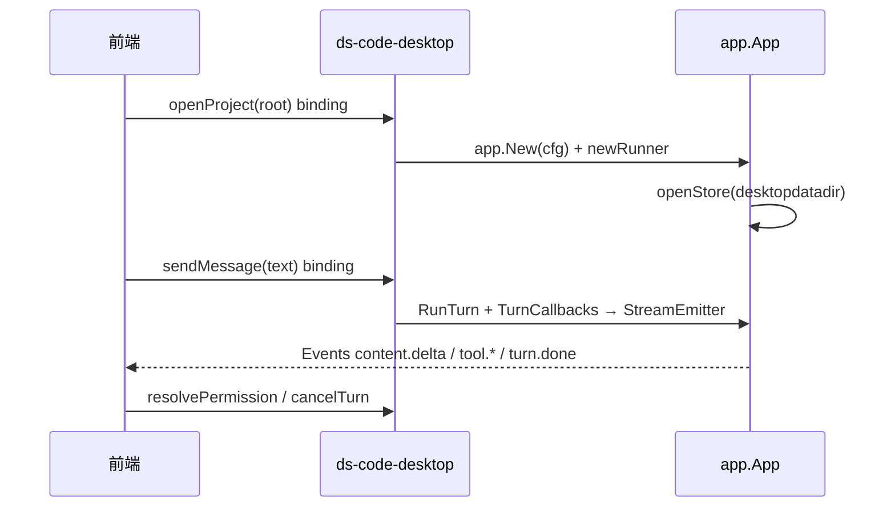

# v0.2.0 phase0 设计文档

> 版本：v0.2.0
> 阶段：phase0（M0 PoC）
> 状态：待实现
> 总纲：[spec/DESIGN](../spec/DESIGN.md)
> 更新日期：2026-07-07

## 1. 本阶段定位

phase0 验证总纲中以下技术决策的可行性，UI 可为**最小单栏聊天**，不实现三栏与 workspace 管理。

完整架构、协议、目录结构见总纲；本节仅列**本阶段必须落地的模块**。

## 2. 本阶段模块

```
cmd/ds-code-desktop/     # 最小 main：单窗口、绑定注册
desktop/
  datadir/               # DesktopProjectDataDir、DefaultDBPath
  bridge/                # StreamEmitter、callbacks、events（Envelope v1）
  permission/            # DesktopPrompter（write/shell only）
  frontend/              # React 最小聊天页
```

**暂不实现**：`desktop/workspace/`（phase1）

## 3. 实现焦点

### 3.1 内嵌 Chromium PoC

见总纲 [§3.4](../spec/DESIGN.md#34-内嵌浏览器内核)。

- M0 门禁：流式 ≥ 55fps；单 turn < 200 次跨边界调用
- **不回退**系统 WKWebView 为默认方案

### 3.2 数据路径

见总纲 [§5.4](../spec/DESIGN.md#54-桌面数据目录与-projectid与-cli-隔离)。

- `desktop/datadir.DefaultDBPath(root)` → `~/.ds-code/desktop/projects/<id>/sessions.db`
- 桌面 `openStore` 走 desktop 变体，CLI 路径不变

### 3.3 Bridge / Envelope v1

见总纲 [§8](../spec/DESIGN.md#8-流式桥接bridge层)。

- `StreamEmitter`：16ms flush、8192 maxChunk、critical 重试
- 本阶段 `workspaceId` 可固定为 `"default"`（多 workspace 路由 phase1 补齐）

### 3.4 最小 UI

- 单栏：消息列表 + 输入区 + 发送/停止两态
- 审批：对话流内联卡片（write/shell）
- 无侧栏、无 Inspector、无设置路由

### 3.5 工具链

见总纲 [§12](../spec/DESIGN.md#12-前端技术栈)、[§12.5](../spec/DESIGN.md#125-m0-脚手架模板)。

- `PACKAGE_MANAGER=bun wails3 dev` HMR
- `wails3 build` 产出 `.app`（无需公证）

## 4. 单 workspace 启动流程



## 5. 测试

见总纲 [§16](../spec/DESIGN.md#16-测试策略) 子集：

| 层 | 本阶段 |
| -- | ---- |
| bridge | emit 次数/batch/golden JSON |
| datadir | 路径落在 `desktop/projects/` |
| permission | Prompter 事件-Promise 往返 |
| TS reducer | Vitest 快照 |
| 集成 | PoC fps / 调用次数 |

## 6. 交付后解锁

phase1 在此基础上添加 `WorkspaceManager`、三栏 UI、完整 P0 功能，**不重构** bridge 协议与 datadir 契约。
