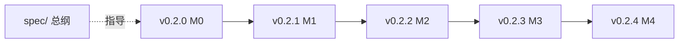

# v0.2.x 实现路线图

> 总纲：[spec/README.md](README.md)　需求：[REQUIREMENTS.md](REQUIREMENTS.md)　设计：[DESIGN.md](DESIGN.md)
> 更新日期：2026-07-07

## 文档结构

```
docs/v0.2.0/
  README.md / REQUIREMENTS.md / DESIGN.md / ACCEPTANCE.md   ← v0.2.0 实现（M0 PoC）
  spec/
    README.md / REQUIREMENTS.md / DESIGN.md / ACCEPTANCE.md / ROADMAP.md   ← 完整总纲
docs/v0.2.1/ … v0.2.4/                                     ← 后续实现迭代
```

- **spec/**：完整产品设计总纲（原文保留，供全系列引用）
- **v0.2.0 根目录**：第一个可交付实现版本（M0），非「仅文档」
- **v0.2.1–v0.2.4**：后续增量；FR/AC 引用 spec/ 编号

## 拆分原则

1. **纵向依赖**：后一版建立在上一版代码与验收之上
2. **横向独立**：同版内模块尽量可并行
3. **可交付**：每版有明确 gate
4. **追溯**：子版本 FR/AC 引用 spec/ 总纲编号

## 版本映射

| 版本 | 里程碑 | 主题 | Gate |
| ---- | ------ | ---- | ---- |
| [v0.2.0 根](../) | M0 | 技术验证 PoC | 单 workspace：流式 + 审批 + 停止 |
| [v0.2.1](../../v0.2.1/) | M1 | 桌面 MVP | 多 workspace + 三栏 + P0 + 基础打包 |
| [v0.2.2](../../v0.2.2/) | M2 | 对齐增强 | Inspector + Plan + 子代理 + 公证 |
| [v0.2.3](../../v0.2.3/) | M3 | 深化 | checkpoint + MCP/LSP + 托盘 + 更新 |
| [v0.2.4](../../v0.2.4/) | M4 | HTML（可选） | 安全 PoC 通过后启用 |



## 各版范围速览

### v0.2.0 — M0（`docs/v0.2.0/` 根）

- Wails v3 + 内嵌 Chromium PoC + Bun/Vite 工具链
- `desktop/bridge`、`desktop/datadir`、`desktop/permission`
- 单 workspace 最小聊天 UI

### v0.2.1 — M1

- `WorkspaceManager` + 三栏 React UI + 完整 P0

### v0.2.2 — M2

- Inspector Monaco diff + Plan + 子代理 + ⌘K + 签名公证

### v0.2.3 — M3

- checkpoint/rewind + MCP/LSP UI + 托盘 + Sparkle

### v0.2.4 — M4（可选）

- HTML 输出 + DOMPurify 安全栈

## 与 CLI 版本号

桌面 `v0.2.x` 与 CLI `v0.1.x` 可并行；共享 `internal/*`。发布 `.app` 建议 app 版本与文档 `0.2.x` 对齐。
